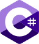

<p align="center">
  
</p>

<p align="center">
  <strong>Write once. Compile to every language.
  <br>A programming language for problem solvers.</strong>
</p>

<p align="center">
  <a href="https://temperlang.dev/"><b>User Documentation</b></a> •
  <a href="https://temperlang.dev/tour/">Quick Tour</a> •
  <a href="https://temperlang.dev/tutorial/">Tutorial</a> •
  <a href="https://temperlang.dev/reference/">Reference</a> •
  <a href="https://play.temperlang.dev/"><b>Playground</b></a> •
  <a href="https://discord.gg/QQKgZMukVB"><b>Discord</b></a>
</p>

---

*Temper* lets a developer or small team solve a problem once, for every programming language community.

It's a programming language designed for one purpose: to translate well to all the other languages.

It's for writing libraries, and supporting other programming language communities with idiomatic, semantically equivalent libraries.

Temper currently supports[\*](#not-endorsed-or-affiliated):

<table>
  <tr valign="bottom">
    <td align="center">
      <a href="https://learn.microsoft.com/en-us/dotnet/csharp/"><br>C#</a>
    </td>
    <td align="center">
      <a href="https://openjdk.org/"><br>Java</a>
    </td>
    <td align="center">
      <a href="https://openjsf.org/"></a>
      <a href="https://www.typescriptlang.org/"></a><br>
      <a href="https://openjsf.org/">JS</a> /
      <a href="https://www.typescriptlang.org/">TS</a>
    </td>
  </tr>
  <tr valign="bottom">
    <td align="center">
      <a href="https://lua.org/"><br>Lua</a>
    </td>
    <td align="center">
      <a href="https://www.python.org/"><br>Python</a>
    </td>
    <td align="center">
      <a href="https://rust-lang.org/"><br>Rust</a>
    </td>
  </tr>
</table>

Coming soon:

[][C++] & more.

See also our [target language list] for version numbers and translation notes.

[C#]: https://learn.microsoft.com/en-us/dotnet/csharp/
[C++]: https://isocpp.org/
[Java]: https://openjdk.org/
[JS]: https://openjsf.org/
[TS]: https://www.typescriptlang.org/
[Lua]: https://lua.org/
[Python]: https://www.python.org/
[Rust]: https://rust-lang.org/
[target language list]: https://temperlang.dev/reference/target-languages/

## Community, Getting Help

- **Discord** — [Join the Temper Language Discord](https://discord.gg/QQKgZMukVB)
- **Stack Overflow** — Ask questions with the [`temper`](https://stackoverflow.com/questions/tagged/temper) tag
- **Issues** — [Report bugs or request features](https://github.com/temperlang/temper/issues)

## Contributing

If you'd like to contribute, we'd love to have you.
See our [contributing guidelines](CONTRIBUTING.md) guide.

## Building from Source

Temper's toolchain is written in Kotlin, a JVM language with enough
meta-language goodies for compiler writing, and we use *gradle* for
build automation.

(Temper integrates deeply with other toolchains, and has a lot of
tests, so you need some other language's toolchains available to run
the entire test suite. We have plans to containerize our test running
to simplify this, but in the meantime, here are some things it helps
to have installed locally on a dev machine.)

Prerequisites:

- JDK 17 or later
- [Gradle](https://docs.gradle.org/current/userguide/installation.html)

```sh
git clone https://github.com/temperlang/temper.git
cd temper
./gradlew cli:build
```

The Temper CLI will be available in `cli/build/install/temper/bin/`.

### Getting Started

1. Clone this repository

1. Create a new directory:

   ```sh
   # Or try: temper init -o hello
   mkdir hello
   cd hello
   ```

1. Create a file `hello.temper`:

   ```temper
   export let greet(name: String): String {
     "Hello, ${name}!"
   }
   ```

1. Build for all default backends (i.e., target languages):

   ```sh
   # Look under temper.out/
   temper build
   ```

1. Use the generated library in your project.

For a complete walkthrough, see the [Temper language documenation](https://temperlang.dev/),
especially the [Quick Tour](https://temperlang.dev/tour/).

## Licensing and Legalese

[COPYRIGHT](COPYRIGHT) has the details.

tldr: code is dual licensed as [Apache 2](LICENSE-APACHE) or
[MIT](LICENSE-MIT); documentation as Creative Commons.

### Not endorsed or affiliated

We use other programming language projects' logos and/or names with
permission, but do not imply or assert any official relationship with
or endorsement by those projects' contributors or sponsors.  (We, the
Temper project contributors, refer to those projects because we love
them, as we love all programming languages, their contributors, and
user communities.)
