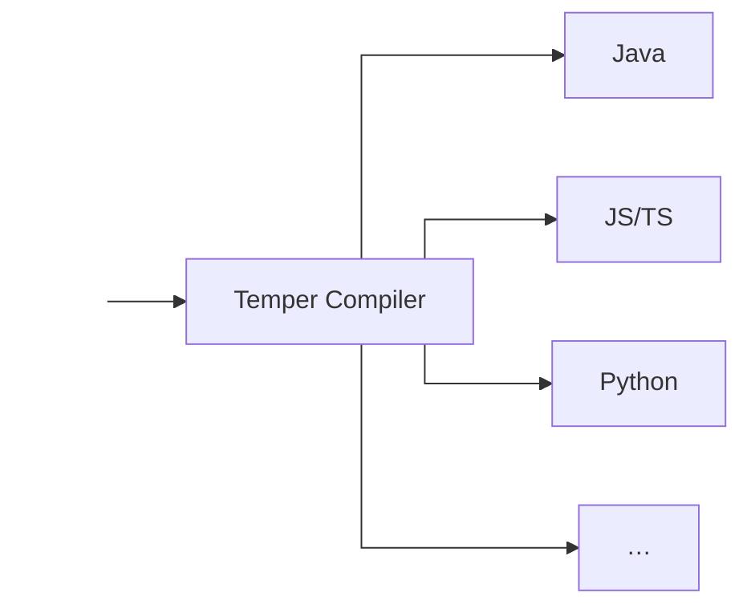
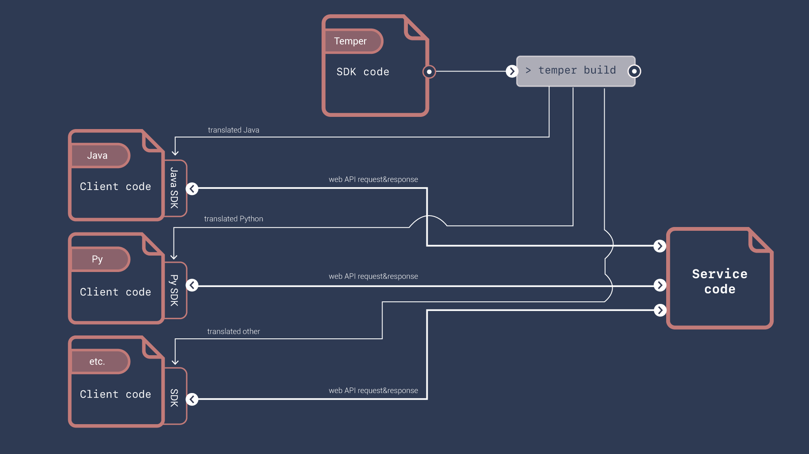
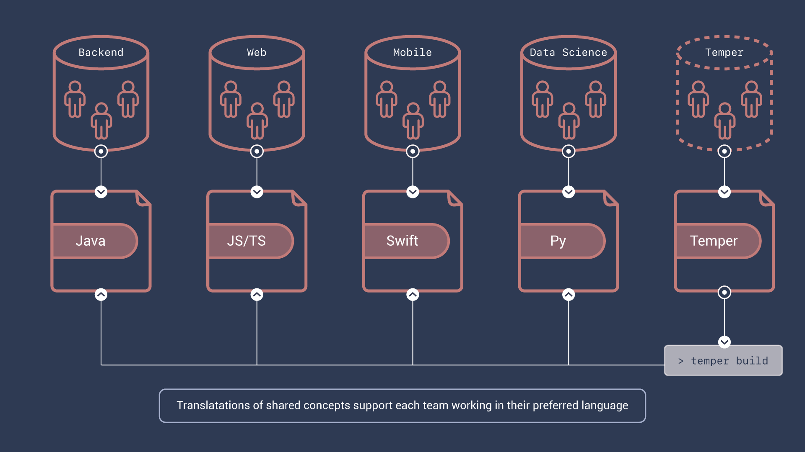

<center markdown="1">


# The Temper programming language

<!-- These quick links should mirror the ones at the bottom -->

<div class="temper-quick-links" markdown="1">
[Quick Tour](./tour.md) \| [Tutorial](./tutorial/index.md) \| [Reference](./reference/index.md) \| [Blog](./blog/index.md)
</div>

</center>

<section class="landing-page-stripe" id="sec-1" markdown="1"><center markdown="1">

The *Temper* programming language cross-translates to other
programming languages.

<div style="display:inline-block; max-width: 20em; vertical-align: middle; text-align: left" markdown="1" class="transparent-code-root">

```temper
// Temper
export let half(x: Int): Int {
  x / 2
}
```

</div>

<div style="display:inline-block; vertical-align: middle" markdown="1">



</div>

</center></section>

<section class="landing-page-stripe" id="sec-2" markdown="1"><center markdown="1">

From a single specification, above, you get libraries that can be
shared with many programming language communities.

</center>

=== "Input Temper"

    ```temper
    // Temper source from above figure
    export let half(x: Int): Int {
      x / 2
    }
    ```

===+ "Output C\#"

    ```cs
    namespace Example.Numerics
    {
        public static class NumericsGlobal
        {
            public static int Half(int x__4)
            {
                return x__4 / 2;
            }
        }
    }
    ```

=== "Java"

    ```java
    package com.example.numerics;
    public final class NumericsGlobal {
        private NumericsGlobal() {
        }
        public static int half(int x__1) {
            return x__1 / 2;
        }
    }
    ```

=== "JS / TS"

    ```js
    const {
      trunc: trunc__1
    } = globalThis.Math;
    /**
     * @param {number} x_0
     * @returns {number}
     */
    export function half(x_0) {
      return trunc__1(x_0 / 2);
    };
    ```

=== "Lua"

    ```lua
    local temper = require('temper-core');
    local half, exports;
    half = function(x__1)
      return temper.idiv(x__1, 2.0);
    end
    ;
    exports = { };
    exports.half = half;
    do
      return exports;
    end
    ```

=== "Python"

    ```python
    def half(x__1: 'int') -> 'int':
      return x__1 // 2
    ```

=== "etc."

    Temper is designed, from the ground up, to translate well, so many more coming.

</section>

<section class="landing-page-stripe" id="sec-3" markdown="1"><center markdown="1">

Those libraries can include rich type definitions.

</center>

=== "Input Temper"

    ```temper
    let { Date } = import("std/temporal");

    /** Some minimal info about a person. */
    export class Person(
      public name: String,
      public dateOfBirth: Date,
    ) {
      public ageAt(date: Date): Int {
        Date.yearsBetween(date, dateOfBirth)
      }
      /** The count of whole years between their DOB and today in UTC. */
      public get age(): Int { ageAt(Date.today()) }
    }
    ```

=== "Output C\#"

    ```cs
    using S = System;
    using T = TemperLang.Std.Temporal;
    namespace Example.Person
    {
        public class Person
        {
            readonly string name__14;
            readonly S::DateTime dateOfBirth__15;
            public int AgeAt(S::DateTime date__17)
            {
                return T::TemporalSupport.YearsBetween(date__17, this.dateOfBirth__15);
            }
            public int Age
            {
                get
                {
                    S::DateTime t___58 = T::TemporalSupport.Today();
                    return this.AgeAt(t___58);
                }
            }
            public Person(string name__22, S::DateTime dateOfBirth__23)
            {
                this.name__14 = name__22;
                this.dateOfBirth__15 = dateOfBirth__23;
            }
            public string Name
            {
                get
                {
                    return this.name__14;
                }
            }
            public S::DateTime DateOfBirth
            {
                get
                {
                    return this.dateOfBirth__15;
                }
            }
        }
    }
    ```

=== "Java"

    ```java
    package com.example.person;

    import java.time.LocalDate;
    import java.time.temporal.ChronoUnit.YEARS;
    import java.time.ZoneId;
    import static java.time.ZoneOffset.UTC;

    public final class Person {
        public final String name;
        public final LocalDate dateOfBirth;
        public int ageAt(LocalDate date__11) {
            return YEARS.between(date__11, this.dateOfBirth);
        }
        public int getAge() {
            LocalDate t_48 = LocalDate.now(ZoneId.ofOffset("UTC", UTC));
            return this.ageAt(t_48);
        }
        public Person(String name__16, LocalDate dateOfBirth__17) {
            this.name = name__16;
            this.dateOfBirth = dateOfBirth__17;
        }
        public String getName() {
            return this.name;
        }
        public LocalDate getDateOfBirth() {
            return this.dateOfBirth;
        }
    }
    ```

=== "JS/TS"

    ```js
    import {
      dateYearsBetween as dateYearsBetween_0,
      dateToday as dateToday_1
    } from "@temperlang/core";

    export class Person {
      /** @type {string} */
      #name_2;
      /** @type {globalThis.Date} */
      #dateOfBirth_3;
      /**
       * @param {globalThis.Date} date_5
       * @returns {number}
       */
      ageAt(date_5) {
        return dateYearsBetween_0(date_5, this.#dateOfBirth_3);
      }
      /** @returns {number} */
      get age() {
        let t_7 = dateToday_1();
        return this.ageAt(t_7);
      }
      /**
       * @param {string} name_8
       * @param {globalThis.Date} dateOfBirth_9
       */
      constructor(name_8, dateOfBirth_9) {
        this.#name_2 = name_8;
        this.#dateOfBirth_3 = dateOfBirth_9;
        return;
      }
      /** @returns {string} */
      get name() {
        return this.#name_2;
      }
      /** @returns {globalThis.Date} */
      get dateOfBirth() {
        return this.#dateOfBirth_3;
      }
    };
    ```

=== "Lua"

    ```lua
    local temper = require('temper-core');
    local Person, exports;
    Person = temper.type('Person');
    Person.methods.ageAt = function(this__0, date__11)
      return temper.date_yearsbetween(date__11, this__0.dateOfBirth__9);
    end
    ;
    Person.get.age = function(this__1)
      local t_0;
      t_0 = temper.date_today();
      do
        return this__1:ageAt(t_0);
      end
    end
    ;
    Person.constructor = function(this__3, name__16, dateOfBirth__17)
      this__3.name__8 = name__16;
      this__3.dateOfBirth__9 = dateOfBirth__17;
      do
        return nil;
      end
    end
    ;
    Person.get.name = function(this__20)
      return this__20.name__8;
    end
    ;
    Person.get.dateOfBirth = function(this__24)
      return this__24.dateOfBirth__9;
    end
    ;
    exports = { };
    exports.Person = Person;
    do
      return exports;
    end
    ```

=== "Python"

    ```py
    from builtins import str as str0, int as int2
    from datetime import date as date1
    from temper_core import years_between as years_between_53, \
                            date_today as date_today_54

    class Person:
      'Some minimal info about a person.'
      name__8: 'str0'
      dateOfBirth__9: 'date1'
      age__2: 'int2'

      __slots__ = ('name__8', 'dateOfBirth__9', 'age__2')

      def age_at(this__0, date__11: 'date1') -> 'int2':
        return years_between_53(date__11, this__0.dateOfBirth__9)

      @property
      def age(this__1) -> 'int2':
        'The count of whole years between their DOB and today in UTC.'
        t_48: 'date1' = date_today_54()
        return this__1.age_at(t_48)

      def constructor__15(this__3, name__16: 'str0',
                          dateOfBirth__17: 'date1') -> 'None':
        this__3.name__8 = name__16
        this__3.dateOfBirth__9 = dateOfBirth__17

      def __init__(this__3, name__16: 'str0',
                   dateOfBirth__17: 'date1') -> None:
        this__3.constructor__15(name__16, dateOfBirth__17)

      @property
      def name(this__20) -> 'str0':
        return this__20.name__8

      @property
      def date_of_birth(this__24) -> 'date1':
        return this__24.dateOfBirth__9
    ```

</section>

<section class="landing-page-stripe" id="sec-4" markdown="1"><center markdown="1">

Sharing type definitions extends type guardrails across network gaps
leading to more-reliable code, and simplifies data on the wire.

</center>

![Diagram consisting of several elements: A file marked "Temper" with code "class Person \{ ... public get age\(\): Int \{ ... \} \}" pointing into a box "> temper build" that fans out to two boxes labeled "Server" and "Client".  The Server box is a file marked "Java" and contains code "response.send\(new Person\(name, dateOfBirth\)\)".  The Client box is a file marked "JS/TS" and contains "let person: Person = Person.fromJSON\(resp\); f\(person.age\)".  Moving from Server to Client is a JSON file with content "\{ "name": "Firsty McLasty", "dateOfBirth": "2000-01-01" \}".  There are two speech bubbles with arrows too.  The first says "age not shipped but available via computation" and points to the JSON and points to "f\(person.age\)" in the Client code.  The second says "Type shared in request + response" and points to "new Person" in the Server code and "let person: Person" in the Client clode.](./images/type-guard-rails.png)

</section>

<section class="landing-page-stripe" id="sec-5" markdown="1"><center markdown="1">

Temper meets other languages where they are.

Temper functions and types translate to regular functions and
types&mdash;no awkward native or foreign function interface.

<div class="suppress-empty-paras transparent-code-root" markdown="1">
<div markdown="1" style="display: inline-block; width: 26em; text-align: left; vertical-align: top">

```temper
// Temper

/**
 * The diff function compares two inputs,
 * and computes a [Patch]: the changes
 * from [left] required to derive [right].
 */
export let diff<T …>(
  left: List<T>,
  right: List<T>,
  /** Are two items the same? */
  eq: fn (T, T): Boolean =
      fn (a: T, b: T): Boolean { a == b }
): Patch<T> {…}
```

</div>

<div markdown="1" style="display: inline-block; width: 26em; text-align: left; vertical-align: top">

```sh
$ node
Welcome to Node.js v18.9.1.
Type ".help" for more information.
> let diffLib = await import(
      "./temper.out/diff-lib/js/myers-diff.js");
undefined
> diffLib.diff
[Function: diff]
> ^D

$ python3
Python 3.10.6 (main, Aug 30 2022, 05:12:36) [Clang 13.1.6 (clang-1316.0.21.2.5)] on darwin
Type "help", "copyright", "credits" or "license" for more information.
>>> from difflib.myers_diff import diff
>>> type(diff)
<class 'function'>
>>> ^D
```

<!-- TODO: are these import paths still accurate? -->

</div></div>


</center></section>

<section class="landing-page-stripe" id="sec-6" markdown="1"><center markdown="1">

Temper enables deep supply-chain integration.  Translating both production **and** test code helps ensure the quality of the libray and the translation.

</center>

![Diagram showing three groups of code on the left (Temper, Java, and Python) flowing to a CI/CD dashboard on the right.  From the Temper code, arrows flow into "> temper build" and then "> temper test" and through to the dashboard.  From the bottom of "> temper build" come two arrows labeled "translated Java" and "translated python."  The translated java flows with the Java code into "> junit" and then to the dashboard.  Similarly, the translated python joins with the Python code to flow into "> pyunit" and from there to the dashboard.](./images/ssp-integration.png)

</section>

<section class="landing-page-stripe" id="sec-7" markdown="1">

Most engineering organizations use multiple languages: Python for data science, others for mobile apps, JavaScript on the web, and a different language on the server.

Temper helps break down silos by letting a small team maintain core type definitions and logic to all the other silos.

<!-- TODO(mvs): buttons and indicator of which slide is showing -->

<div markdown="1" id="use-case-carousel" style="margin: 0 3em">
<div markdown="1">

### Software Development Toolkits \(SDKs\)

SDKs ease connecting to a service.
Client code gets responses as rich, well-typed values.

Letting the service maintainer run a bit of code before the request is
sent and right after the response is received, gives great flexibility
when deprecating and evolving application programming interfaces (APIs).

<br />



</div>

<div markdown="1">

### Common Infrastructure Teams

A team using Temper can make many other teams more productive by
solving common problems once regardless of language siloes.

<br />



</div>

<div markdown="1">

### Artificial Intellgence/Machine Learning (AI/ML) Integration

Many AI/ML projects fail to provide value due to difficulty
integrating them with traditionally engineered systems.

Sharing type definitions and related computations, including
presentation logic, helps quickly integrate AI/ML deployments.

<br />


</div>

<div markdown="1">

### Code Migration

Migrating old or acquired code is easier if you can extract key
definitions and business logic into Temper, and actively maintain it
while using it, via translation, in both the old and new systems.

<br />


</div>

<div markdown="1">

### Language Agnostic Solutions

Some problems aren't about any programming language. For example,
turning untrusted HTML into trustworthy HTML is about HTML, not
whether the transformation happens on a server or a client. Written
in Temper, one solution can serve many language communities.

<br />


</div>

<div markdown="1">

### Lightweight Standards

*Lightweight standards* documents help engineers and non-engineers
collaborate on solving a problem efficiently.

① Requirements in prose explain the why.<br>
② Code in Temper provides an implementation to all engineering stakeholders.<br>
③ Requirements can be checked by in-line test code.

The document stays relevant to engineers because they get libraries
they can use.  Non-engineering stakeholders have a single engineering
point of contact when requirements need to change, so many more
business policy changes happen without high-effort change management.


</div></div></section>

<!-- These quick links should mirror the ones at the top -->

<center markdown="1">

<div class="temper-quick-links" markdown="1">
[Quick Tour](./tour.md) \| [Tutorial](./tutorial/index.md) \| [Reference](./reference/index.md)
</div>

</center>
