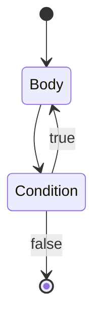
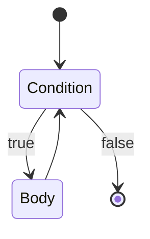

# Builtin Functions and Constants

You can use builtins in your Temper code without `import`ing anything.

Some definitions are marked *Infix*, *Prefix*, or *Postfix*.  These
are operators: they are used like mathematical symbols:

- Infix `+` appears between arguments: `:::js a + b`
- Prefix `-` appears before its sole argument: `:::js -b`
- Postfix `++` appears afters its argument: `:::js i++`

Other functions are called with parentheses: `:::js f(x)`.
See also [Call Syntax](syntax.md#syntax-Call).

(The full set of operator definitions is [*Operator.kt*](https://github.com/temperlang/temper/blob/main/lexer/src/commonMain/kotlin/lang/temper/lexer/Operator.kt)
which also determines when you need parentheses.  Temper's operator
precedence matches JavaScript's & TypeScript's as close as possible
so doing what you would in those languages is a good guide.)

<!-- snippet: builtins -->

<a name="builtins" class="snippet-anchor-name"></a>

## Constants

<!-- snippet: builtin/console -->

<a name="builtin&#45;console" class="snippet-anchor-name"></a>

### `console`
The global default `Console` instance. It is designed to integrate with
standard backend logging services. Frontend processing replaces references to
the global console with a call to `getConsole` for the current module.

<!-- /snippet: builtin/console -->

<!-- snippet: builtin/false -->

<a name="builtin&#45;false" class="snippet-anchor-name"></a>

### *false*
The value `false` of type [*Boolean*](types.md#type-Boolean).

<!-- /snippet: builtin/false -->

<!-- snippet: builtin/Infinity -->

<a name="builtin&#45;Infinity" class="snippet-anchor-name"></a>

### *Infinity*
The [*Float64*](types.md#type-Float64) value for &infin;.

<!-- /snippet: builtin/Infinity -->

<!-- snippet: builtin/NaN -->

<a name="builtin&#45;NaN" class="snippet-anchor-name"></a>

### *NaN*
The [*Float64*](types.md#type-Float64) value for
[unrepresentable "Not a Number"](https://en.wikipedia.org/wiki/NaN) values.

<!-- /snippet: builtin/NaN -->

<!-- snippet: builtin/null -->

<a name="builtin&#45;null" class="snippet-anchor-name"></a>

### *null*
The singleton value `null` which is admitted by any [Postfix `?`](#builtin-%3F) type.

`null` may be used to represent an absent value, for example:

- an unspecified, optional input
- an output that is not usable but not due to an error, for example, when mapping a list of values,
  but excluding some corresponding elements from the output list
- a temporary, not computed *yet*, intermediate value

`null` is distinguishable, in translated Temper code, from any other value.
For example, in the context of the *Int32?* type, *0* is not equal to `null`.

Backends may translate `null` and the concept of nullable types in various ways:

- Target languages that have an equivalent (`null`, `nil`, `undefined`, or `None`)
  type/value pair may use that where it does not (as in C#) complicate translation of generics.
- Target languages that prefer *Option* types may translate nullable types to those
  and translate the `null` singleton to the *None* variant.

In either case, for dynamic language users and for users of typed languages that do not have
null-safety checking, please document when and why `null` is allowed in exported interfaces.
Temper has null-safety checking, so can mark APIs that accept/produce `null` equivalent values,
but the more clarity around `null` the better.

<!-- /snippet: builtin/null -->

<!-- snippet: builtin/true -->

<a name="builtin&#45;true" class="snippet-anchor-name"></a>

### *true*
The value `true` of type [*Boolean*](types.md#type-Boolean).

<!-- /snippet: builtin/true -->

<!-- snippet: builtin/void -->

<a name="builtin&#45;void" class="snippet-anchor-name"></a>

### *void*
The value `void` is the sole value in type [*Void*](types.md#type-Void).

**WARNING**: To interface better across idiomatic void behavior in backends,
current plans are to make `Void` disjoint from `AnyValue` such that no
`void` value is usable. See also [issue#38](https://github.com/temperlang/temper/issues/38).

<!-- /snippet: builtin/void -->

## Special functions

<!-- snippet: builtin/async : # `async` builtin -->

<a name="builtin&#45;async" class="snippet-anchor-name"></a>

### `async { ... }`

The *async* builtin function takes a safe generator block and
runs it out of band.

TODO: example

<!-- /snippet: builtin/async -->

<!-- snippet: builtin/await : # `await` builtin -->

<a name="builtin&#45;await" class="snippet-anchor-name"></a>

### `await(promise)`
TODO: document me

<!-- /snippet: builtin/await -->

<!-- snippet: builtin/cat -->

<a name="builtin&#45;cat" class="snippet-anchor-name"></a>

### `cat`
Short for "con**cat**enate", combines multiple strings into one string.

<!-- snippet: temper-code/build-user-docs/build/snippet/builtin/cat/snippet.md/0 -->

```temper
""       == cat()             &&
"foo"    == cat("foo")        &&
"foobar" == cat("foo", "bar")
// ✅
```

<!-- /snippet: temper-code/build-user-docs/build/snippet/builtin/cat/snippet.md/0 -->

[`+`](#builtin-%2B) does not concatenate strings; it's reserved for math.

`cat` is an implementation detail.  Prefer [String interpolation](types.md#syntax-string-interpolation)
to compose strings.

<!-- snippet: temper-code/build-user-docs/build/snippet/builtin/cat/snippet.md/1 -->

```temper
let a = "foo";
let b = "bar";

"foo-bar" == "${ a }-${ b }"
// ✅
```

<!-- /snippet: temper-code/build-user-docs/build/snippet/builtin/cat/snippet.md/1 -->

<!-- /snippet: builtin/cat -->

<!-- snippet: builtin/new -->

<a name="builtin&#45;new" class="snippet-anchor-name"></a>

### `new`
The `new` operator allows constructing new instances of types.

<!-- /snippet: builtin/new -->

<!-- snippet: builtin/yield : # `yield()` builtin -->

<a name="builtin&#45;yield" class="snippet-anchor-name"></a>

### `yield()`
Called from the body of a generator function, to pause the body
and cause [`Generator.next`](types.md#type-Generator-method-next) to return.

The [block lambda](../snippet/syntax/BlockLambda/snippet.svg) below has an
`extends GeneratorFn`.

A generator function may use the no-argument version of `yield`
in which case its wrapper generator's [`Generator.next`](types.md#type-Generator-method-next)
returns the [*Empty*](types.md#type-Empty) value.

If the generator function wishes to convey a value to its scheduler,
it may use `yield(x)` where `x` is the value returned by
[`Generator.next`](types.md#type-Generator-method-next).

Note: `yield` is syntactically like `return` and `throw` in that
parentheses around its argument are optional.

<!-- snippet: temper-code/build-user-docs/build/snippet/builtin/yield/snippet.md/0 -->

```temper
// Two co-operating functions each have print
// calls which interleave because the generator
// function uses yield() to return control to
// its caller temporarily.

//!outputs "S: Before first call"
//!outputs "C: In coroutine, before yield"
//!outputs "S: Between calls"
//!outputs "C: Coroutine resumed"
//!outputs "S: After calls"

// scheduleTwice manually schedules execution of the generator/coroutine.
let scheduleTwice(generatorFactory: fn (): SafeGenerator<Empty>): Void {
  let generator: SafeGenerator<Empty> = generatorFactory();
  console.log("S: Before first call");
  generator.next();
  console.log("S: Between calls");
  generator.next();
  console.log("S: After calls");
}

// The block lambda declares a coroutine constructor
// which yields between two print statements causing
// them to interleave with the statement above.
scheduleTwice { (): GeneratorResult<Empty> extends GeneratorFn =>
  console.log("C: In coroutine, before yield");
  yield; // Return control to the caller
  console.log("C: Coroutine resumed");
}
// ✅
```

<!-- /snippet: temper-code/build-user-docs/build/snippet/builtin/yield/snippet.md/0 -->

Above, the generator function has type `(): Empty extends GeneratorFn`
which specifies what the block lambda does.  But generator functions
are received by their receiver function as a factory for generator instances:
For example, `scheduleTwice` receives a `(fn (): Generator<Empty, Nothing>) & GeneratorFn`.

<!-- /snippet: builtin/yield -->

<!-- snippet: builtin/= -->

<a name="builtin&#45;&#61;" class="snippet-anchor-name"></a>

### assignment (`=`) builtin
The assignment operator allows assigning to local variables, and properties of objects.

<!-- snippet: temper-code/build-user-docs/build/snippet/builtin/=/snippet.md/0 -->

```temper
var s = "before";
console.log(s); //!outputs "before"
s = "after"; // <-- assignment
console.log(s); //!outputs "after"
// ✅
```

<!-- /snippet: temper-code/build-user-docs/build/snippet/builtin/=/snippet.md/0 -->

The result of assignment is the result of the right-hand, assigned expression.

<!-- snippet: temper-code/build-user-docs/build/snippet/builtin/=/snippet.md/1 -->

```temper
let a;
let b;

// The result of the nested `b = 42` is `42`
a = b = 42;

a == 42
// ✅
```

<!-- /snippet: temper-code/build-user-docs/build/snippet/builtin/=/snippet.md/1 -->

Assignment to a property with a setter is really a method call, under the hood.

<!-- snippet: temper-code/build-user-docs/build/snippet/builtin/=/snippet.md/2 -->

```temper
class C {
  public set p(newValue: String) {
    console.log("Assigned ${newValue}.");
  }
}
(new C()).p = "a value" //!outputs "Assigned a value."
// ✅ "a value"
```

<!-- /snippet: temper-code/build-user-docs/build/snippet/builtin/=/snippet.md/2 -->

<!-- /snippet: builtin/= -->

## Functions

<!-- snippet: builtin/as -->

<a name="builtin&#45;as" class="snippet-anchor-name"></a>

### `as`
The `as` operator allows safe type-casting.

`x as Type` means:

- If `x`'s [type tag](types.md#type-tag) is [compatible](types.md#type-compatibility)
  with `Type` then the result is `x`,
- otherwise [`bubble()`](#builtin-bubble).

<!-- snippet: temper-code/build-user-docs/build/snippet/builtin/as/snippet.md/0 -->

```temper
sealed interface I {
  let s: String;
}
class A(public s: String) extends I {}
class B(public s: String) extends I {}

for (let x: I of [new A("an A"), new B("a B")]) {
  console.log((x as A).s orelse "cast failed");
}
//!outputs "an A"
//!outputs "cast failed"
// ✅
```

<!-- /snippet: temper-code/build-user-docs/build/snippet/builtin/as/snippet.md/0 -->

Note that `as` renames rather than casts in deconstructing
assignment context such as in
`let { exportedName as localName } = import("...");`.

<!-- /snippet: builtin/as -->

<!-- snippet: builtin/bubble -->

<a name="builtin&#45;bubble" class="snippet-anchor-name"></a>

### `bubble()`
A function that immediately bubbles.  Typically, this will result in execution
of the right argument to the closest containing [`orelse`](#builtin-orelse).

<!-- snippet: failure -->

<a name="failure" class="snippet-anchor-name"></a>

#### Failure
Expressions either evaluate to a value or fail to produce a usable result.
See also:

- [*Bubble*](#builtin-Bubble) which provides type system support for tracking failure.
- [`orelse`](#builtin-orelse) which allows recovering from failure.

<!-- /snippet: failure -->

<!-- /snippet: builtin/bubble -->

<!-- snippet: builtin/char -->

<a name="builtin&#45;char" class="snippet-anchor-name"></a>

### `char`
A string tag that requires a single code-point string and returns that
code-point as an [*Int32*](types.md#type-Int32).

<!-- snippet: temper-code/build-user-docs/build/snippet/builtin/char/snippet.md/0 -->

```temper
char'a' == 97
// ✅
```

<!-- /snippet: temper-code/build-user-docs/build/snippet/builtin/char/snippet.md/0 -->

<!-- /snippet: builtin/char -->

<!-- snippet: builtin/getConsole -->

<a name="builtin&#45;getConsole" class="snippet-anchor-name"></a>

### `getConsole`
Access or make a console for the given name. If name is unspecified, use the
idiomatic backend library or module name for logging purposes. The default of
empty string is merely a placeholder.

<!-- /snippet: builtin/getConsole -->

<!-- snippet: builtin/ignore -->

<a name="builtin&#45;ignore" class="snippet-anchor-name"></a>

### `ignore`
Ignore any value.

<!-- /snippet: builtin/ignore -->

<!-- snippet: builtin/is -->

<a name="builtin&#45;is" class="snippet-anchor-name"></a>

### `is`
The `is` operator allows type-checking.

`x is Type` evaluates to true when `x`'s [type tag](types.md#type-tag)
is [compatible](types.md#type-compatibility) with `Type`.

<!-- snippet: temper-code/build-user-docs/build/snippet/builtin/is/snippet.md/0 -->

```temper
class Foo {}
class Bar {}

let isAFoo(x: AnyValue): Boolean {
  x is Foo
}

console.log(isAFoo(new Foo()).toString());  //!outputs "true"
console.log(isAFoo(new Bar()).toString());  //!outputs "false"
// ✅
```

<!-- /snippet: temper-code/build-user-docs/build/snippet/builtin/is/snippet.md/0 -->

<!-- /snippet: builtin/is -->

<!-- snippet: builtin/panic -->

<a name="builtin&#45;panic" class="snippet-anchor-name"></a>

### `panic()`
A function that immediately panics, which is unrecoverable inside Temper.
It might be recoverable in backend code.

<!-- /snippet: builtin/panic -->

<!-- snippet: builtin/throws -->

<a name="builtin&#45;throws" class="snippet-anchor-name"></a>

### Type operator `throws`

The infix `throws` operator can be used on a return type to indicate that a function
can fail in one of several ways.


A call that throws may be used within [`orelse`](#builtin-orelse).

<!-- snippet: temper-code/build-user-docs/build/snippet/builtin/throws/snippet.md/0 -->

```temper
let parseZero(s: String): Int throws Bubble {
  if (s != "0") { bubble() }
  return 0
}

//!outputs  "parseZero(\"0\")            = 0"
console.log("parseZero(\"0\")            = ${ parseZero("0") }");
//!outputs  "parseZero(\"hi\") orelse -1 = -1"
console.log("parseZero(\"hi\") orelse -1 = ${ parseZero("hi") orelse -1 }");
// ✅
```

<!-- /snippet: temper-code/build-user-docs/build/snippet/builtin/throws/snippet.md/0 -->

<!-- /snippet: builtin/throws -->

<!-- snippet: builtin/! -->

<a name="builtin&#45;&#33;" class="snippet-anchor-name"></a>

### `!`
The prefix `!` operator performs [*Boolean*](types.md#type-Boolean) inverse.

`!`[*false*](#builtin-false) is [*true*](#builtin-true) and vice versa.

<!-- /snippet: builtin/! -->

<!-- snippet: builtin/!= -->

<a name="builtin&#45;&#33;&#61;" class="snippet-anchor-name"></a>

### `!=`
`a != b` is the [*Boolean*](types.md#type-Boolean) inverse of [`==`](#builtin-==)

<!-- /snippet: builtin/!= -->

<!-- snippet: builtin/%25 : operator `%` -->

<a name="builtin&#45;&#37;25" class="snippet-anchor-name"></a>

### Remainder `%`
Given two [*Int32*](types.md#type-Int32)s it produces an *Int*
and given two [*Float64*](types.md#type-Float64)s it produces a *Float64*.

<!-- snippet: temper-code/build-user-docs/build/snippet/builtin/%25/snippet.md/0 -->

```temper
13   % 3   == 1    &&
13.0 % 3.0 == 1.0
// ✅
```

<!-- /snippet: temper-code/build-user-docs/build/snippet/builtin/%25/snippet.md/0 -->

Division by Zero [bubbles](types.md#type-Bubble)

<!-- snippet: temper-code/build-user-docs/build/snippet/builtin/%25/snippet.md/1 -->

```temper
(1 % 0) orelse console.log("mod by zero");
//!outputs "mod by zero"
// ✅
```

<!-- /snippet: temper-code/build-user-docs/build/snippet/builtin/%25/snippet.md/1 -->

<!-- snippet: temper-code/build-user-docs/build/snippet/builtin/%25/snippet.md/2 -->

```temper
(1.0 % 0.0) orelse console.log("mod by zero");
//!outputs "mod by zero"
// ✅
```

<!-- /snippet: temper-code/build-user-docs/build/snippet/builtin/%25/snippet.md/2 -->

<!-- /snippet: builtin/%25 -->

<!-- snippet: builtin/& : `&` -->

<a name="builtin&#45;&amp;" class="snippet-anchor-name"></a>

### Operator `&`
The `&` operator can be applied in two ways:

- To [*Int32*](types.md#type-Int32)s it acts as a [bitwise operator](#bitwise-and).
- To types it produces an [intersection type](#type-intersection-fn)

<!-- snippet: bitwise-and -->

<a name="bitwise&#45;and" class="snippet-anchor-name"></a>

#### *Int* `&`

Takes two [*Int32*](types.md#type-Int32)s and returns the *Int* that has any bit set
that is set in both input.

<!-- snippet: temper-code/build-user-docs/build/snippet/bitwise-and/snippet.md/0 -->

```temper
// Using binary number syntax
(0b0010101 &
 0b1011011) ==
 0b0010001
// ✅
```

<!-- /snippet: temper-code/build-user-docs/build/snippet/bitwise-and/snippet.md/0 -->

<!-- /snippet: bitwise-and -->

<!-- snippet: type/intersection-fn : type `&` -->

<a name="type&#45;intersection&#45;fn" class="snippet-anchor-name"></a>

#### Intersection type bound `&`

When the `&` operator is applied to types instead of numbers, it constructs
an intersection type bound.

An intersection type bound specifies that the bounded type is a sub-type of each of its members.
So a value of a type that `extends I & J` declares a type can be assigned to a type `I` **and** can be assigned a declaration with type `J`.
See also [snippet/type/relationships](types.md#type-relationships).

<!-- snippet: temper-code/build-user-docs/build/snippet/type/intersection-fn/snippet.md/0 -->

```temper
interface A {
  a(): Void {}
}
interface B {
  b(): Void {}
}

class C extends A & B {}

let c: C = new C();
let a: A = c;
let b: B = c;

let f<T extends A & B>(t: T): Void {
  let a: A = t;
  let b: B = t;
  a.a();
  b.b();
}
f<C>(c);
// ✅ null
```

<!-- /snippet: temper-code/build-user-docs/build/snippet/type/intersection-fn/snippet.md/0 -->

<!-- /snippet: type/intersection-fn -->

<!-- /snippet: builtin/& -->

<!-- snippet: builtin/%2A : operator `*` -->

<a name="builtin&#45;&#42;" class="snippet-anchor-name"></a>

### Multiplication `*`
Infix `*` allows multiplying numbers.

Given two [*Int32*](types.md#type-Int32)s it produces an *Int* and given two [*Float64*](types.md#type-Float64)s it
produces a *Float64*.

<!-- snippet: temper-code/build-user-docs/build/snippet/builtin/$2a/snippet.md/0 -->

```temper
3   * 4   == 12   &&
3.0 * 4.0 == 12.0
// ✅
```

<!-- /snippet: temper-code/build-user-docs/build/snippet/builtin/$2a/snippet.md/0 -->

<!-- /snippet: builtin/* -->

<!-- snippet: builtin/%2A%2A : operator `**` -->

<a name="builtin&#45;&#42;&#42;" class="snippet-anchor-name"></a>

### Exponentiation `**`
Infix `**` allows raising one number to the power of another.

Given two [*Float64*](types.md#type-Float64)s it produces a *Float64*.

<!-- snippet: temper-code/build-user-docs/build/snippet/builtin/$2a$2a/snippet.md/0 -->

```temper
3.0 **  2.0 == 9.0 &&
4.0 ** -0.5 == 0.5
// ✅
```

<!-- /snippet: temper-code/build-user-docs/build/snippet/builtin/$2a$2a/snippet.md/0 -->

<!-- /snippet: builtin/** -->

<!-- snippet: builtin/+ -->

<a name="builtin&#45;&#37;2B" class="snippet-anchor-name"></a>

### `+`
The builtin `+` operator has four variants:
- *Infix* with two [*Int32*](types.md#type-Int32)s: signed addition
- *Prefix* with one [*Int32*](types.md#type-Int32): numeric identity
- *Infix* with two [*Float64*](types.md#type-Float64)s: signed addition
- *Prefix* with one [*Float64*](types.md#type-Float64): numeric identity

<!-- snippet: temper-code/build-user-docs/build/snippet/builtin/%2B/snippet.md/0 -->

```temper
1   + 2   == 3   &&
1.0 + 2.0 == 3.0 &&
+1        == 1   &&
+1.0      == 1.0
// ✅
```

<!-- /snippet: temper-code/build-user-docs/build/snippet/builtin/%2B/snippet.md/0 -->

As explained above, you cannot mix [*Int32*](types.md#type-Int32) and
[*Float64*](types.md#type-Float64) inputs:

<!-- snippet: temper-code/build-user-docs/build/snippet/builtin/%2B/snippet.md/1 -->

```temper
1 + 1.0
// ❌ Actual arguments do not match signature: (Int32, Int32) -> Int32 expected [Int32, Int32], but got [Int32, Float64]!
```

<!-- /snippet: temper-code/build-user-docs/build/snippet/builtin/%2B/snippet.md/1 -->

`+` does not work on [*String*](types.md#type-String)s.  Use [`cat`](#builtin-cat) instead.

<!-- snippet: temper-code/build-user-docs/build/snippet/builtin/%2B/snippet.md/2 -->

```temper
"foo" + "bar"
// ❌ Actual arguments do not match signature: (Int32, Int32) -> Int32 expected [Int32, Int32], but got [String, String]!
```

<!-- /snippet: temper-code/build-user-docs/build/snippet/builtin/%2B/snippet.md/2 -->

<!-- /snippet: builtin/%2B -->

<!-- snippet: builtin/- -->

<a name="builtin&#45;&#45;" class="snippet-anchor-name"></a>

### `-`
The builtin `-` operator has four variants like [`+`](#builtin-%2B).

<!-- snippet: temper-code/build-user-docs/build/snippet/builtin/-/snippet.md/0 -->

```temper
3   - 1   == 2   &&
3.0 - 1.0 == 2.0 &&
-3        <  0   &&
-3.0      <  0.0
// ✅
```

<!-- /snippet: temper-code/build-user-docs/build/snippet/builtin/-/snippet.md/0 -->

As with `+`, you cannot mix [*Int32*](types.md#type-Int32) and [*Float64*](types.md#type-Float64) inputs:

<!-- snippet: temper-code/build-user-docs/build/snippet/builtin/-/snippet.md/1 -->

```temper
1 + 1.0
// ❌ Actual arguments do not match signature: (Int32, Int32) -> Int32 expected [Int32, Int32], but got [Int32, Float64]!
```

<!-- /snippet: temper-code/build-user-docs/build/snippet/builtin/-/snippet.md/1 -->

The `-` operator is left-associative:

<!-- snippet: temper-code/build-user-docs/build/snippet/builtin/-/snippet.md/2 -->

```temper
1 - 1 - 1 == (1 - 1) - 1 &&
1 - 1 - 1 == -1
// ✅
```

<!-- /snippet: temper-code/build-user-docs/build/snippet/builtin/-/snippet.md/2 -->

Since there is a [`--` operator](#builtin---) operator, `--x` is not a negation of a negation.

<!-- snippet: temper-code/build-user-docs/build/snippet/builtin/-/snippet.md/3 -->

```temper
var x = 1;
+x == -(-x) &&  // double negation is identity
--x == 0        // but two adjacent `-` means pre-decrement
// ✅
```

<!-- /snippet: temper-code/build-user-docs/build/snippet/builtin/-/snippet.md/3 -->

<!-- /snippet: builtin/- -->

<!-- snippet: builtin/%2F : operator `/` -->

<a name="builtin&#45;&#37;2F" class="snippet-anchor-name"></a>

### Division `/`
Infix `/` allows dividing numbers.

Given two [*Int32*](types.md#type-Int32)s it produces an *Int* and given two [*Float64*](types.md#type-Float64)s it
produces a *Float64*.

<!-- snippet: temper-code/build-user-docs/build/snippet/builtin/$2f/snippet.md/0 -->

```temper
12   / 3   == 4    &&
12.0 / 3.0 == 4.0
// ✅
```

<!-- /snippet: temper-code/build-user-docs/build/snippet/builtin/$2f/snippet.md/0 -->

Integer division [rounds towards zero].

<!-- snippet: temper-code/build-user-docs/build/snippet/builtin/$2f/snippet.md/1 -->

```temper
 7   / 2   ==  3   &&
-7   / 2   == -3   &&
 7.0 / 2.0 ==  3.5 &&
-7.0 / 2.0 == -3.5
// ✅
```

<!-- /snippet: temper-code/build-user-docs/build/snippet/builtin/$2f/snippet.md/1 -->

Division by zero has [*Bubble*](types.md#type-Bubble).

<!-- snippet: temper-code/build-user-docs/build/snippet/builtin/$2f/snippet.md/2 -->

```temper
(1 / 0) orelse console.log("div by zero");
//!outputs "div by zero"
// ✅
```

<!-- /snippet: temper-code/build-user-docs/build/snippet/builtin/$2f/snippet.md/2 -->

Float64 division by zero is a *Bubble* too.

<!-- snippet: temper-code/build-user-docs/build/snippet/builtin/$2f/snippet.md/3 -->

```temper
console.log("${ (0.0 /  0.0).toString() orelse "Bubble" }"); //!outputs "Bubble"
console.log("${ (1.0 /  0.0).toString() orelse "Bubble" }"); //!outputs "Bubble"
console.log("${ (1.0 / -0.0).toString() orelse "Bubble" }"); //!outputs "Bubble"
// ✅
```

<!-- /snippet: temper-code/build-user-docs/build/snippet/builtin/$2f/snippet.md/3 -->

[IEEE-754]: https://en.wikipedia.org/wiki/IEEE_754
[rounds towards zero]: https://en.wikipedia.org/wiki/Rounding#Rounding_toward_zero

<!-- /snippet: builtin/%2F -->

<!-- snippet: builtin/< -->

<a name="builtin&#45;&lt;" class="snippet-anchor-name"></a>

### `<`
`a < b` is [*true*](#builtin-true) when *a* orders before *b*, and is a compile-time error
if the two are not mutually comparable.

See the [General comparison algorithm](#general-comparison-algo) for details of how they are compiled and
especially the [General Comparison Caveats](#general-comparison-caveats).

<!-- /snippet: builtin/< -->

<!-- snippet: builtin/<= -->

<a name="builtin&#45;&lt;&#61;" class="snippet-anchor-name"></a>

### `<=`
`a <= b` is [*true*](#builtin-true) when *a* orders with or before *b*, and is a compile-time
error if the two are not mutually comparable.

See the [General comparison algorithm](#general-comparison-algo) for details of how they are compiled and
especially the [General Comparison Caveats](#general-comparison-caveats).

<!-- /snippet: builtin/<= -->

<!-- snippet: builtin/<=> -->

<a name="builtin&#45;&lt;&#61;&gt;" class="snippet-anchor-name"></a>

### `<=>`
`a <=> b` results in an [Int](types.md#type-Int32) based on whether *a* orders before, after, or
with *b*, and is a compile-time error if the two are not mutually comparable.

- `a <=> b` is `-1` if *a* orders **before** *b*
- `a <=> b` is `0` if *a* orders **with** *b*
- `a <=> b` is `1` if *a* orders **after** *b*

<!-- snippet: temper-code/build-user-docs/build/snippet/builtin/$3c=$3e/snippet.md/0 -->

```temper
(   42 <=>   123) == -1 &&  //    42 orders before   123
(  1.0 <=>   1.0) == 0  &&  //   1.0 orders with     1.0
("foo" <=> "bar") == 1      // "foo" orders after  "bar"
// ✅
```

<!-- /snippet: temper-code/build-user-docs/build/snippet/builtin/$3c=$3e/snippet.md/0 -->

<!-- snippet: general-comparison/algo -->

<a name="general&#45;comparison&#45;algo" class="snippet-anchor-name"></a>

#### General comparison algorithm
The general comparison algorithm is designed to allow for easy structural comparison of
data values that work the same regardless of target language.

[*Int32*](types.md#type-Int32)s are compared based on their position on the number line.
No surprises here.

<!-- snippet: temper-code/build-user-docs/build/snippet/general-comparison/algo/snippet.md/0 -->

```temper
-1 < 0 && 0 < 1 && 1 < 2
// ✅
```

<!-- /snippet: temper-code/build-user-docs/build/snippet/general-comparison/algo/snippet.md/0 -->

[*Float64*](types.md#type-Float64)s are also compared numerically.

<!-- snippet: temper-code/build-user-docs/build/snippet/general-comparison/algo/snippet.md/1 -->

```temper
-1.0 < 0.0 && 0.0 < 1.0 && 1.0 < 2.0
// ✅
```

<!-- /snippet: temper-code/build-user-docs/build/snippet/general-comparison/algo/snippet.md/1 -->

But the default comparison operators are meant to support structural comparison of records
so see also [caveats](#general-comparison-caveats) for how *Float64* ordering differs
from other languages.

[*String*](types.md#type-String)s are compared lexicographically based on their code-points.

<!-- snippet: temper-code/build-user-docs/build/snippet/general-comparison/algo/snippet.md/2 -->

```temper
"foo" > "bar"
// ✅
```

<!-- /snippet: temper-code/build-user-docs/build/snippet/general-comparison/algo/snippet.md/2 -->

See also [caveats](#general-comparison-caveats) for *String* related ordering.

##### Custom comparison for classes

[issue#37](https://github.com/temperlang/temper/issues/37): custom comparison for classes.

<!-- /snippet: general-comparison/algo -->

<!-- snippet: general-comparison/caveats -->

<a name="general&#45;comparison&#45;caveats" class="snippet-anchor-name"></a>

#### General Comparison Caveats

##### String Ordering Caveats
[*String*](types.md#type-String) ordering based on code-points means that [supplementary code-points]
(code-points greater than U+10000) sort higher than all [basic plane] code-points,

<!-- snippet: temper-code/build-user-docs/build/snippet/general-comparison/caveats/snippet.md/0 -->

```temper
"\u{10000}" > "\u{FFFF}" // Hex code-point escapes
// ✅
```

<!-- /snippet: temper-code/build-user-docs/build/snippet/general-comparison/caveats/snippet.md/0 -->

Developers used to lexicographic [UTF-16] might be surprised since UTF-16 ordering
treats each supplementary code-point as two [surrogate]s in the range \[0xD800, 0xDFFF\].
The first string above would be "\uD800\uDC00" if Temper string literals supported
surrogate pairs. In some languages, that might compare as less than "\u{FFFF}", but
Temper views all strings in terms of full code-points, or more precisely, in terms of
Unicode [scalar value]s, which exclude surrogate codes.

##### Float64 Ordering Caveats

<!-- snippet: float64-comparison-details -->

<a name="float64&#45;comparison&#45;details" class="snippet-anchor-name"></a>

[*Float64*](types.md#type-Float64)s are compared on a modified number line where
`-0.0` precedes `+0.0` and all `NaN` values sort above +&infin;.
This differs from the [IEEE-754 comparison predicate] which treats `NaN` as incomparable.

<!-- snippet: temper-code/build-user-docs/build/snippet/float64-comparison-details/snippet.md/0 -->

```temper
-Infinity < -1.0     &&
     -1.0 <  0.0     &&
     -0.0 < +0.0     &&  // Positive and negative zero order separately
      0.0 <  1.0     &&
      1.0 < Infinity &&
 Infinity < NaN          // NaN is ordered high
// ✅
```

<!-- /snippet: temper-code/build-user-docs/build/snippet/float64-comparison-details/snippet.md/0 -->

[IEEE-754 comparison predicate]: https://grouper.ieee.org/groups/msc/ANSI_IEEE-Std-754-2019/background/predicates.txt

<!-- /snippet: float64-comparison-details -->

[basic plane]: https://unicode.org/glossary/#basic_multilingual_plane
[scalar value]: https://unicode.org/glossary/#unicode_scalar_value
[supplementary code-points]: https://unicode.org/glossary/#supplementary_code_point
[surrogate]: https://unicode.org/glossary/#surrogate_code_point
[UTF-16]: https://unicode.org/glossary/#UTF_16

<!-- /snippet: general-comparison/caveats -->

<!-- /snippet: builtin/<=> -->

<!-- snippet: builtin/== -->

<a name="builtin&#45;&#61;&#61;" class="snippet-anchor-name"></a>

### `==`
`a == b` is the default equivalence operation.

Two values are equivalent if they have the same type-tag and the same content.

[issue#36](https://github.com/temperlang/temper/issues/36): custom equivalence and default equivalence for record classes

<!-- /snippet: builtin/== -->

<!-- snippet: builtin/> -->

<a name="builtin&#45;&gt;" class="snippet-anchor-name"></a>

### `>`
`a > b` is [*true*](#builtin-true) when *a* orders after *b*, and is a compile-time
error if the two are not mutually comparable.

See the [General comparison algorithm](#general-comparison-algo) for details of how they are compiled and
especially the [General Comparison Caveats](#general-comparison-caveats).

<!-- /snippet: builtin/> -->

<!-- snippet: builtin/>= -->

<a name="builtin&#45;&gt;&#61;" class="snippet-anchor-name"></a>

### `>=`
`a >= b` is [*true*](#builtin-true) when *a* orders after or with *b*, and is a compile-time
error if the two are not mutually comparable.

See the [General comparison algorithm](#general-comparison-algo) for details of how they are compiled and
especially the [General Comparison Caveats](#general-comparison-caveats).

<!-- /snippet: builtin/>= -->

<!-- snippet: builtin/%3F -->

<a name="builtin&#45;&#37;3F" class="snippet-anchor-name"></a>

### Postfix `?`

A question mark (`?`) after a type indicates that the type accepts the value [*null*](#builtin-null).

<!-- snippet: temper-code/build-user-docs/build/snippet/builtin/$3f/snippet.md/0 -->

```temper
var firstEven: Int = null; // ILLEGAL
let ints = [1, 2, 3, 4];
for (let i of ints) {
  if (0 == (i % 2)) {
    firstEven = i;
    break;
  }
}

console.log(firstEven?.toString() ?? "so odd");
// ⏸️
```

<!-- /snippet: temper-code/build-user-docs/build/snippet/builtin/$3f/snippet.md/0 -->

But with a postfix question mark, that works.

<!-- snippet: temper-code/build-user-docs/build/snippet/builtin/$3f/snippet.md/1 -->

```temper
//                ⬇️
var firstEven: Int? = null; // OK
let ints = [1, 2, 3, 4];
for (let i of ints) {
  if (0 == (i % 2)) {
    firstEven = i;
    break;
  }
}

console.log(firstEven?.toString() ?? "so odd"); //!outputs "2"
// ✅
```

<!-- /snippet: temper-code/build-user-docs/build/snippet/builtin/$3f/snippet.md/1 -->

<!-- /snippet: builtin/%3F -->

<!-- snippet: builtin/| : `|` -->

<a name="builtin&#45;&#124;" class="snippet-anchor-name"></a>

### Operator `|`
The `|` operator performs bitwise union.

It takes two [*Int32*](types.md#type-Int32)s and returns the *Int32* that has any bit set
that is set in either input.

<!-- snippet: temper-code/build-user-docs/build/snippet/builtin/$7c/snippet.md/0 -->

```temper
// Using binary number syntax
(0b0010101 |
 0b1011011) ==
 0b1011111
// ✅
```

<!-- /snippet: temper-code/build-user-docs/build/snippet/builtin/$7c/snippet.md/0 -->

<!-- /snippet: builtin/| -->

## Types

<!-- snippet: builtin/Boolean -->

<a name="builtin&#45;Boolean" class="snippet-anchor-name"></a>

### *Boolean*
The name `Boolean` refers to the builtin type, [*Boolean*](types.md#type-Boolean).

It has only two values:

- [*false*](#builtin-false)
- [*true*](#builtin-true)

<!-- snippet: syntax/BooleanLiteral -->

<a name="syntax&#45;BooleanLiteral" class="snippet-anchor-name"></a>


<!-- /snippet: syntax/BooleanLiteral -->

<!-- /snippet: builtin/Boolean -->

<!-- snippet: builtin/Bubble -->

<a name="builtin&#45;Bubble" class="snippet-anchor-name"></a>

### *Bubble*
A name that may be used to reference the special [*Bubble*](types.md#type-Bubble) type.

<!-- /snippet: builtin/Bubble -->

<!-- snippet: builtin/Float64 -->

<a name="builtin&#45;Float64" class="snippet-anchor-name"></a>

### *Float64*
The name `Float64` refers to the builtin type, [*Float64*](types.md#type-Float64).

<!-- /snippet: builtin/Float64 -->

<!-- snippet: builtin/Function -->

<a name="builtin&#45;Function" class="snippet-anchor-name"></a>

### *Function*
The name `Function` refers to the builtin type, [*Function*](types.md#type-Function), which is the super-type
for all [Function Types](types.md#type-FunctionTypes).

<!-- /snippet: builtin/Function -->

<!-- snippet: builtin/Int -->

<a name="builtin&#45;Int" class="snippet-anchor-name"></a>

### *Int*
The name `Int` is an alias for `Int32`, for convenience in indicating the
default int type.

<!-- /snippet: builtin/Int -->

<!-- snippet: builtin/Int32 -->

<a name="builtin&#45;Int32" class="snippet-anchor-name"></a>

### *Int32*
The name `Int32` refers to the builtin type, [*Int32*](types.md#type-Int32).

<!-- /snippet: builtin/Int32 -->

<!-- snippet: builtin/Int64 -->

<a name="builtin&#45;Int64" class="snippet-anchor-name"></a>

### *Int64*
The name `Int64` refers to the builtin type, [*Int64*](types.md#type-Int64).

<!-- /snippet: builtin/Int64 -->

<!-- snippet: builtin/List -->

<a name="builtin&#45;List" class="snippet-anchor-name"></a>

### `List`
The name `List` refers to the builtin type, [*List*](types.md#type-List).

<!-- /snippet: builtin/List -->

<!-- snippet: builtin/Listed -->

<a name="builtin&#45;Listed" class="snippet-anchor-name"></a>

### `Listed`
The name `Listed` refers to the builtin type, [*Listed*](types.md#type-Listed).

<!-- /snippet: builtin/Listed -->

<!-- snippet: builtin/Problem -->

<a name="builtin&#45;Problem" class="snippet-anchor-name"></a>

### *Problem*
The name `Problem` refers to the builtin type, [*Problem*](types.md#type-Problem),
an abstraction that allows running some tests despite failures during
compilation.

<!-- /snippet: builtin/Problem -->

<!-- snippet: builtin/StageRange -->

<a name="builtin&#45;StageRange" class="snippet-anchor-name"></a>

TODO: StageRange

<!-- /snippet: builtin/StageRange -->

<!-- snippet: builtin/String -->

<a name="builtin&#45;String" class="snippet-anchor-name"></a>

### *String*
The name `String` refers to the builtin type, [*String*](types.md#type-String).

<!-- /snippet: builtin/String -->

<!-- snippet: builtin/Symbol -->

<a name="builtin&#45;Symbol" class="snippet-anchor-name"></a>

### *Symbol*
Symbol is the type for values that are used, during compilation,
to represent parameter names, member names, and metadata keys.

They're relevant to the Temper language, and symbol values are
not meant to translate to values in other languages.

<!-- /snippet: builtin/Symbol -->

<!-- snippet: builtin/Type -->

<a name="builtin&#45;Type" class="snippet-anchor-name"></a>

### *Type*
Type values represent a Temper type, allowing them to be inputs
to macros.

<!-- /snippet: builtin/Type -->

<!-- snippet: builtin/Void -->

<a name="builtin&#45;Void" class="snippet-anchor-name"></a>

### *Void*
The name `Void` refers to the builtin type [*Void*](types.md#type-Void).

*Void* is an appropriate return type for functions that are called for their effect, not
to produce a value.

<!-- /snippet: builtin/Void -->

## Macros

<!-- snippet: builtin/assert -->

<a name="builtin&#45;assert" class="snippet-anchor-name"></a>

### `assert`
A macro for convenience in test cases. Calls assert on the current test
instance.

<!-- snippet: temper-code/build-user-docs/build/snippet/builtin/assert/snippet.md/0 -->

```temper
test("something important") {
  // Provide the given message if the assertion value is false.
  assert(1 + 1 == 2) { "the sky is falling" }
}
// ⏸️
```

<!-- /snippet: temper-code/build-user-docs/build/snippet/builtin/assert/snippet.md/0 -->

<!-- /snippet: builtin/assert -->

<!-- snippet: builtin/break -->

<a name="builtin&#45;break" class="snippet-anchor-name"></a>

### `break` statement
`break` jumps to the end of a block.

Without a label, `break` jumps to the narrowest surrounding [`for` loop](#builtin-for),
[`while` loop](#builtin-while), or [`do`](#builtin-do) loop.

<!-- snippet: temper-code/build-user-docs/build/snippet/builtin/break/snippet.md/0 -->

```temper
for (var i = 0; i < 10; ++i) {
  if (i == 3) { break; }
  console.log(i.toString());
}
//!outputs "0"
//!outputs "1"
//!outputs "2"
// ✅
```

<!-- /snippet: temper-code/build-user-docs/build/snippet/builtin/break/snippet.md/0 -->

`break` may also be followed by a label, in which case, it jumps to just after the
statement with that label.

<!-- snippet: temper-code/build-user-docs/build/snippet/builtin/break/snippet.md/1 -->

```temper
label: do {
  console.log("foo"); //!outputs "foo"
  break label;
  console.log("bar"); // never executed
}
// ✅
```

<!-- /snippet: temper-code/build-user-docs/build/snippet/builtin/break/snippet.md/1 -->

A `break` that matches neither label nor loop within the same function or module body
is a compile-time error.

<!-- snippet: temper-code/build-user-docs/build/snippet/builtin/break/snippet.md/2 -->

```temper
break;
// ❌ break/continue not within a matching block!
```

<!-- /snippet: temper-code/build-user-docs/build/snippet/builtin/break/snippet.md/2 -->

<!-- snippet: temper-code/build-user-docs/build/snippet/builtin/break/snippet.md/3 -->

```temper
for (var i = 0; i < 10; ++i) {
  break label;
}
// ❌ break/continue not within a matching block!
```

<!-- /snippet: temper-code/build-user-docs/build/snippet/builtin/break/snippet.md/3 -->

<!-- /snippet: builtin/break -->

<!-- snippet: builtin/class -->

<a name="builtin&#45;class" class="snippet-anchor-name"></a>

### `class`
Defines a concrete `class` type.  Classes may extend [`interface`](#builtin-interface) types but may
not themselves be extended.

Class declarations consist of several parts:

1. A type name
2. Optionally, some type formals
3. Optionally, constructor parameters
4. Optionally, some super types
5. A block containing type members

<!-- snippet: temper-code/build-user-docs/build/snippet/builtin/class/snippet.md/0 -->

```temper
//    ①          ②      ②
class MyTypeName<TYPE, FORMAL>(

  // ③
  public propertyName: Int,

  //      ④       ⑤
) extends AnyValue {

  public anotherProperty: Int = propertyName + 1;

  public method(): Int { anotherProperty * 2 }
}

// Given such a declaration, we can create values of type MyTypeName.
// Properties that appear in the parenthetical are both constructor parameters.
let value = { propertyName: 11 };
// But parenthetical declarations also declare a property.
console.log(value.propertyName.toString()); //!outputs "11"
// Public members (the default) declared in the body are also available.
console.log(value.anotherProperty.toString()); //!outputs "12"
console.log(value.method().toString()); //!outputs "24"

// For unconnected classes, you can check whether a value is of that type
// at runtime.
console.log((value is MyTypeName<AnyValue, AnyValue>).toString()); //!outputs "true"
// ✅
```

<!-- /snippet: temper-code/build-user-docs/build/snippet/builtin/class/snippet.md/0 -->

A minimal class declaration may omit many of those elements along with
the brackets and keyword (like [# `extends` keyword](#builtin-extends)):

<!-- snippet: temper-code/build-user-docs/build/snippet/builtin/class/snippet.md/1 -->

```temper
class Minimal {}

let m = new Minimal();

console.log((m is Minimal).toString()); //!outputs "true"
// ✅
```

<!-- /snippet: temper-code/build-user-docs/build/snippet/builtin/class/snippet.md/1 -->

Source: [*TypeDefinitionMacro.kt*](https://github.com/temperlang/temper/blob/main/frontend/src/commonMain/kotlin/lang/temper/frontend/TypeDefinitionMacro.kt)

Re parenthetical declarations, see also: [`@noProperty` decorator](#builtin-@noProperty)

<!-- /snippet: builtin/class -->

<!-- snippet: builtin/compilelog -->

<a name="builtin&#45;compilelog" class="snippet-anchor-name"></a>

### `compilelog`

TODO: Migrate the logging APIs to `console` style objects APIs per issue #1180
Name the logger that runs during early stages `compile` so that
`compile.log(...)` aids in debugging macro calls.

<!-- /snippet: builtin/compilelog -->

<!-- snippet: builtin/continue -->

<a name="builtin&#45;continue" class="snippet-anchor-name"></a>

### `continue` statement
A `continue` statement jumps back to the beginning of a loop.
In a [`for` loop](#builtin-for) loop, it jumps back to the increment part.

A `continue` without a label jumps back to the innermost containing loop.

<!-- snippet: temper-code/build-user-docs/build/snippet/builtin/continue/snippet.md/0 -->

```temper
for (var i: Int = 0; i < 4; ++i) {
  if (i == 1) { continue; }
  console.log(i.toString());
}
//!outputs "0"
// 1 is skipped
//!outputs "2"
//!outputs "3"
// ✅
```

<!-- /snippet: temper-code/build-user-docs/build/snippet/builtin/continue/snippet.md/0 -->

A `continue` with a label jumps back to the loop with that label.

<!-- snippet: temper-code/build-user-docs/build/snippet/builtin/continue/snippet.md/1 -->

```temper
outer:
for (var i: Int = 0; i < 2; ++i) {
  for (var j: Int = 0; j < 10; ++j) {
    if (j == 1) { continue outer; }
    // Reached once for each value of i, with j == 0
    console.log("(${i.toString()}, ${j.toString()})");
  }
  // Continue skips over this so it never runs
  console.log("Not reached");
}
//!outputs "(0, 0)"
//!outputs "(1, 0)"

console.log("done"); //!outputs "done"
// ✅
```

<!-- /snippet: temper-code/build-user-docs/build/snippet/builtin/continue/snippet.md/1 -->

<!-- /snippet: builtin/continue -->

<!-- snippet: builtin/do : `do` -->

<a name="builtin&#45;do" class="snippet-anchor-name"></a>

### `do` loops and `do` blocks
`do` loops are like [`for` loop](#builtin-for) and [`while` loop](#builtin-while) except that the body
runs once before the condition is checked the first time.
This is the same as how these loops operate in many other languages.

`do` differs in Temper that it can be used without a condition to do something once.
This can be useful when you need a block in the middle of a larger expression.

<table markdown="1"><tr markdown="1"><th markdown="1">`do`</th><th markdown="1">`while`</th></tr>
<tr markdown="1"><td markdown="1">



</td><td markdown="1">



</td></tr></table>

<!-- snippet: temper-code/build-user-docs/build/snippet/builtin/do/snippet.md/0 -->

```temper
var i = 1;
// Prints "Done" initially, and goes back to do it again when `i` is (1, 0)
do {
  console.log("Done");
} while (i-- >= 0);

//!outputs "Done"
//!outputs "Done"
//!outputs "Done"
// ✅
```

<!-- /snippet: temper-code/build-user-docs/build/snippet/builtin/do/snippet.md/0 -->

versus

<!-- snippet: temper-code/build-user-docs/build/snippet/builtin/do/snippet.md/1 -->

```temper
var i = 1;
// Prints "Done" when `i` is (1, 0)
while (i-- >= 0) {
  console.log("Done");
}

//!outputs "Done"
//!outputs "Done"
// ✅
```

<!-- /snippet: temper-code/build-user-docs/build/snippet/builtin/do/snippet.md/1 -->

You can see that when the condition is initially false, the body still executes once.

<!-- snippet: temper-code/build-user-docs/build/snippet/builtin/do/snippet.md/2 -->

```temper
do {
  console.log("Done once"); //!outputs "Done once"
} while (false);
// ✅
```

<!-- /snippet: temper-code/build-user-docs/build/snippet/builtin/do/snippet.md/2 -->

`continue` jumps to just before the condition, not over the condition to the top of the loop.

<!-- snippet: temper-code/build-user-docs/build/snippet/builtin/do/snippet.md/3 -->

```temper
do {
  console.log("Done once"); //!outputs "Done once"
  continue;                 // jumps ━━━┓
  console.log("Not done");  //          ┃
  //     ┏━━━━━━━━━━━━━━━━━━━━━━━━━━━━━━┛
  //     ┃
} while (false);
// ✅
```

<!-- /snippet: temper-code/build-user-docs/build/snippet/builtin/do/snippet.md/3 -->

If you just want to do something once, you can omit the `while` clause.

<!-- snippet: temper-code/build-user-docs/build/snippet/builtin/do/snippet.md/4 -->

```temper
console.log( //!outputs "Done once"
  do { "Done once" }
);
// ✅
```

<!-- /snippet: temper-code/build-user-docs/build/snippet/builtin/do/snippet.md/4 -->

This allows you to group expressions, some for their side effects,
followed by another to compute a result.

<!-- snippet: temper-code/build-user-docs/build/snippet/builtin/do/snippet.md/5 -->

```temper
// These related statements are now grouped together, and
// the `do` block can be nested in a complex expression.
do {
  var i = 0;  // Scoped
  i += 4;     // For side-effect
  i * 2       // Result
}
// ✅ 8
```

<!-- /snippet: temper-code/build-user-docs/build/snippet/builtin/do/snippet.md/5 -->

When `do` is followed by a curly bracket, the content between the
brackets are treated as statements, not object properties.

<!-- snippet: syntax/bag-preceders -->

<a name="syntax&#45;bag&#45;preceders" class="snippet-anchor-name"></a>

#### Blocks vs bags
Putting `do` before curly brackets, `do {⋯}` specifies a block of statements, not a bag of
key/value properties à la JSON.

<!-- snippet: temper-code/build-user-docs/build/snippet/syntax/bag-preceders/snippet.md/0 -->

```temper
// A bag of properties
{
   key₀: value₀,
   key₁: value₁
}

// A series of statements
do {
  statement₀;
  label: statement₁
}
// ⏸️
```

<!-- /snippet: temper-code/build-user-docs/build/snippet/syntax/bag-preceders/snippet.md/0 -->

Temper uses a simple rule to decide whether `{⋯}` surrounds properties or statements because
there can be confusion otherwise.

<!-- snippet: temper-code/build-user-docs/build/snippet/syntax/bag-preceders/snippet.md/1 -->

```temper
{ labelOrKey: valueOrStatement } // ?

{ /* are empty brackets a group of zero properties or zero statements? */ }

// This is complicated with "punning": when a key and value have the same text.
{ x } // may be equivalent to `{ x: x }` in a property context.
// Within small or heavily punned brackets, there are fewer cues like colons,
// commas, or semicolons.
// ⏸️
```

<!-- /snippet: temper-code/build-user-docs/build/snippet/syntax/bag-preceders/snippet.md/1 -->

Whether a `{` is followed by properties or statements is made based on the preceding
non-comment & non-space token.

| Preceding Token Text        | Contains   | Classification                              |
| --------------------------- | ---------- | ------------------------------------------- |
| `let`, `var`, `const`       | Properties | declaration                                 |
| `new`                       | Properties | new value context                           |
| *no preceding token*        | Properties | the start of a module                       |
| `]`, `)`, *Angle* `>`, `=>` | Statements | block or block lambda                       |
| *word*                      | Statements | block or block lambda                       |
| *anything else*             | Properties | default is bag                              |

<!-- /snippet: syntax/bag-preceders -->

<!-- /snippet: builtin/do -->

<!-- snippet: builtin/enum : `enum` type definition -->

<a name="builtin&#45;enum" class="snippet-anchor-name"></a>

### `enum`
TODO(issue #859): Fix translation of enum definitions before documenting.

`enum` declarations are like class declarations

<!-- snippet: temper-code/build-user-docs/build/snippet/builtin/enum/snippet.md/0 -->

```temper
enum C { A, B, C; rest }
// ⏸️
```

<!-- /snippet: temper-code/build-user-docs/build/snippet/builtin/enum/snippet.md/0 -->

desugars to something like

<!-- snippet: temper-code/build-user-docs/build/snippet/builtin/enum/snippet.md/1 -->

```temper
class C(public let ordinal: Int, public name: String) {
  public static @enumMember let A = new C(0, "A");
  public static @enumMember let B = new C(1, "B");
  public static @enumMember let C = new C(2, "C");

  private constructor(ordinal: Int, name: String) {
    this.ordinal = ordinal;
    this.name = name;
  }

  rest
}
// ⏸️
```

<!-- /snippet: temper-code/build-user-docs/build/snippet/builtin/enum/snippet.md/1 -->

Backends should make a best effort to translate classes with
enum members to their language's idiomatic equivalent.

TODO: Document how Temper enum types relate to types per backend.

<!-- /snippet: builtin/enum -->

<!-- snippet: builtin/extends : # `extends` keyword -->

<a name="builtin&#45;extends" class="snippet-anchor-name"></a>

### *SubType* `extends` *SuperType*

The *extends* keyword expresses that the thing to the left is a subtype of
the thing to the right.

It's used in two different contexts.

First, when defining types.

<!-- snippet: temper-code/build-user-docs/build/snippet/builtin/extends/snippet.md/0 -->

```temper
interface SuperType {}
class SubType extends SuperType {}

// An instance of a subtype may be assigned to a variable
// whose type is the supertype.
let x: SuperType = new SubType();
// ✅ null
```

<!-- /snippet: temper-code/build-user-docs/build/snippet/builtin/extends/snippet.md/0 -->

Second, when declaring a type variable.
The below defines an upper bound: the type variable may only bind to types
that are subtypes of the upper bound.

<!-- snippet: temper-code/build-user-docs/build/snippet/builtin/extends/snippet.md/1 -->

```temper
let f<T extends Listed<String>>(x: T): T { x }
// ✅ null
```

<!-- /snippet: temper-code/build-user-docs/build/snippet/builtin/extends/snippet.md/1 -->

When more than one super-type is extended, use
[type intersection](#type-intersection-fn) syntax (`&`).

<!-- snippet: temper-code/build-user-docs/build/snippet/builtin/extends/snippet.md/2 -->

```temper
interface I {}
interface J {}

class C extends I & J {}

let f<T extends I & J>(x: T): T { x }
// T extends I and T extends J
// ✅ null
```

<!-- /snippet: temper-code/build-user-docs/build/snippet/builtin/extends/snippet.md/2 -->

<!-- /snippet: builtin/extends -->

<!-- snippet: builtin/fn -->

<a name="builtin&#45;fn" class="snippet-anchor-name"></a>

### `fn`
The `fn` keyword is used to define function **values** and [Function Types](types.md#type-FunctionTypes).
Contrast this with [`let`](#builtin-let) which is used to **declare** functions

TODO: more explanation needed.

<!-- /snippet: builtin/fn -->

<!-- snippet: builtin/for -->

<a name="builtin&#45;for" class="snippet-anchor-name"></a>

### `for` loop
`for (initializer; condition; increment) { body }` is a [simple `for` loops](#stmt-simple-for-loop).
`for (let one of many) { body }` is a [for...of loop](#stmt-for-of-loop).

<!-- snippet: stmt/simple-for-loop -->

<a name="stmt&#45;simple&#45;for&#45;loop" class="snippet-anchor-name"></a>

#### simple `for` loops
First it executes the *initializer*, once only.

Then it repeatedly executes the *condition* which must be a [*Boolean*](#builtin-Boolean) expression.
The first time the condition evaluates to [*false*](#builtin-false), the loop exits.
After each time the condition evaluates to [*true*](#builtin-true), the *increment* is evaluated
and control transfers back to the body.

An unlabelled [`break` statement](#builtin-break) in the body exits the loop.
An unlabelled [`continue` statement](#builtin-continue) in the body jumps back to the increment and then to
the condition.

<!-- snippet: temper-code/build-user-docs/build/snippet/stmt/simple-for-loop/snippet.md/0 -->

```temper
for (var i = 0; i < 3; ++i) {
  console.log(i.toString());
}
//!outputs "0"
//!outputs "1"
//!outputs "2"
// ✅
```

<!-- /snippet: temper-code/build-user-docs/build/snippet/stmt/simple-for-loop/snippet.md/0 -->

Unlike in some other languages, curly brackets (`{...}`) are **required** around the body.

<!-- snippet: temper-code/build-user-docs/build/snippet/stmt/simple-for-loop/snippet.md/1 -->

```temper
for (var i = 0; i < 3; ++i)
  console.log(i.toString()) // Curly brackets missing
// ❌ No member toString in MissingType!, No declaration for i!
```

<!-- /snippet: temper-code/build-user-docs/build/snippet/stmt/simple-for-loop/snippet.md/1 -->

So a `for` loop is roughly equivalent to

<!-- snippet: temper-code/build-user-docs/build/snippet/stmt/simple-for-loop/snippet.md/2 -->

```temper
{ <-- // Block establishes scope for variables defined in initializer
  initializer;
  while (condition) {
    body;
    // <-- `continue` in body goes here
    increment;
  }
} // <-- `break` in body goes here
// ⏸️
```

<!-- /snippet: temper-code/build-user-docs/build/snippet/stmt/simple-for-loop/snippet.md/2 -->

except that, as noted, [`continue` statement](#builtin-continue)s in body do not skip over the increment.

The initializer may declare variables that are scoped to the loop.

<!-- snippet: temper-code/build-user-docs/build/snippet/stmt/simple-for-loop/snippet.md/3 -->

```temper
let s = "declared-before-loop";
for (var s = "declared-in-loop-initializer"; true;) {
  console.log(s); //!outputs "declared-in-loop-initializer"
  break;
}
// The use of `s` here refers to the top-level `s`,not the loop's `s`;
// the loop variable is only visible within the loop.
console.log(s); //!outputs "declared-before-loop"
// ✅
```

<!-- /snippet: temper-code/build-user-docs/build/snippet/stmt/simple-for-loop/snippet.md/3 -->

<!-- /snippet: stmt/simple-for-loop -->

<!-- snippet: stmt/for-of-loop -->

<a name="stmt&#45;for&#45;of&#45;loop" class="snippet-anchor-name"></a>

#### for...of loop

*For...of* loops allow iterating over each value in some group of values.

<!-- snippet: temper-code/build-user-docs/build/snippet/stmt/for-of-loop/snippet.md/0 -->

```temper
for (let x of ["a", "b", "c"]) {
  console.log(x);
}
//!outputs "a"
//!outputs "b"
//!outputs "c"
// ✅
```

<!-- /snippet: temper-code/build-user-docs/build/snippet/stmt/for-of-loop/snippet.md/0 -->

The parts of a for...of loop are:

- The *declaration*.  `let x` in the example above.
- The *source* of elements.  The list `["a", "b", "c"]` above.
- The *body*.  `{ console.log(x) }` above.

A for...of loop is syntactic sugar for a call to the `forEach` method.
(for...of simply turns one construct into another).
The example above is equivalent to the `.forEach` call below.

<!-- snippet: temper-code/build-user-docs/build/snippet/stmt/for-of-loop/snippet.md/1 -->

```temper
["a", "b", "c"].forEach { x =>
  console.log(x);
}
//!outputs "a"
//!outputs "b"
//!outputs "c"
// ✅
```

<!-- /snippet: temper-code/build-user-docs/build/snippet/stmt/for-of-loop/snippet.md/1 -->

In both cases, jumps like [`break` statement](#builtin-break), [`continue` statement](#builtin-continue), and
[`return`](#builtin-return) may appear in the body when the body is a lexical block
provided directly to `forEach` and the `forEach` implementation uses
[`@inlineUnrealizedGoal` decorator](#builtin-@inlineUnrealizedGoal) as [`List.forEach`](types.md#type-List-method-forEach) does.

<!-- TODO(mikesamuel): make for..of snippets below that are inert valid. -->

<!-- snippet: temper-code/build-user-docs/build/snippet/stmt/for-of-loop/snippet.md/2 -->

```temper
for (let x of ["a", "b", "c", "d", "e"]) {
  if (x == "b") { continue }
  console.log(x);
  if (x == "d") { break }
}
//!outputs "a"
//!outputs "c"
//!outputs "d"
// ⏸️
```

<!-- /snippet: temper-code/build-user-docs/build/snippet/stmt/for-of-loop/snippet.md/2 -->

Unlike some other languages, a bare name is not allowed instead of a declaration
in a for...of loop.

<!-- snippet: temper-code/build-user-docs/build/snippet/stmt/for-of-loop/snippet.md/3 -->

```temper
var x;
for (x of ["a", "b", "c") {
  console.log(x)
}
// ❌ Expected a TopLevel here!
```

<!-- /snippet: temper-code/build-user-docs/build/snippet/stmt/for-of-loop/snippet.md/3 -->

<!-- /snippet: stmt/for-of-loop -->

<!-- /snippet: builtin/for -->

<!-- snippet: builtin/if -->

<a name="builtin&#45;if" class="snippet-anchor-name"></a>

### `if`
`if` allows branching on a [*Boolean*](#builtin-Boolean) predicate.

<!-- snippet: temper-code/build-user-docs/build/snippet/builtin/if/snippet.md/0 -->

```temper
if (true) {
  console.log("Runs");
}
if (false) {
  console.log("Does not run");
}
//!outputs "Runs"
// ✅
```

<!-- /snippet: temper-code/build-user-docs/build/snippet/builtin/if/snippet.md/0 -->

An `if` may include an `else` block which is run when the predicate is [*false*](#builtin-false).

<!-- snippet: temper-code/build-user-docs/build/snippet/builtin/if/snippet.md/1 -->

```temper
if (false) {
  console.log("Does not run")
} else {
  console.log("Runs")
}
if (true) {
  console.log("Runs")
} else {
  console.log("Does not run")
}
//!outputs ["Runs", "Runs"]
// ✅
```

<!-- /snippet: temper-code/build-user-docs/build/snippet/builtin/if/snippet.md/1 -->

An `else` can change to another `if` statement.

<!-- snippet: temper-code/build-user-docs/build/snippet/builtin/if/snippet.md/2 -->

```temper
let twoPlusTwo = 2 + 2;
if (twoPlusTwo == 3) {
  console.log("Does not run")
} else if (twoPlusTwo == 4) {
  console.log("Runs")
} else {
  console.log("Does not run")
}
//!outputs "Runs"
// ✅
```

<!-- /snippet: temper-code/build-user-docs/build/snippet/builtin/if/snippet.md/2 -->

Temper is an expression language, so `if` may be used outside an expression context.

<!-- snippet: temper-code/build-user-docs/build/snippet/builtin/if/snippet.md/3 -->

```temper
let x = (if (true) { 42 } else { 0 });
x == 42
// ✅
```

<!-- /snippet: temper-code/build-user-docs/build/snippet/builtin/if/snippet.md/3 -->

In some syntactically similar languages, you can skip the brackets (`{`...`}`) around
`if` and `else` bodies.
You can't do that in Temper; always put `{`...`}` around the bodies.

<!-- snippet: temper-code/build-user-docs/build/snippet/builtin/if/snippet.md/4 -->

```temper
if (true) console.log("Runs"); else console.log("Does not run");
// ❌ Expected a TopLevel here!
```

<!-- /snippet: temper-code/build-user-docs/build/snippet/builtin/if/snippet.md/4 -->

!!! note
    The reason for this is that in Temper, control-flow operators like `if` are not
    special syntactic forms.
    They're macros that take blocks as arguments and phrases like `else` and `else if`
    are named parameters to that macro which also must be passed blocks.

Unlike C, conditions must be [*Boolean*](types.md#type-Boolean) or a sub-type.

<!-- snippet: temper-code/build-user-docs/build/snippet/builtin/if/snippet.md/5 -->

```temper
if (0) { console.log("truthy") } else { console.log("falsey") }
// ❌ Expected value of type Boolean not Int32!
```

<!-- /snippet: temper-code/build-user-docs/build/snippet/builtin/if/snippet.md/5 -->

<!-- /snippet: builtin/if -->

<!-- snippet: builtin/import -->

<a name="builtin&#45;import" class="snippet-anchor-name"></a>

### `import`
The `import` function, in conjunction with [`export`](#builtin-@export),
allows connecting multiple Temper modules together.

One module may `export` a symbol.

<!-- snippet: temper-code/build-user-docs/build/snippet/builtin/import/snippet.md/0 -->

```temper
export let world = "Earth";
// ⏸️
```

<!-- /snippet: temper-code/build-user-docs/build/snippet/builtin/import/snippet.md/0 -->

and another may import it

<!-- snippet: temper-code/build-user-docs/build/snippet/builtin/import/snippet.md/1 -->

```temper
let { world } = import("./earth");
console.log("Hello, ${ world }!"); //!outputs "Hello, Earth!"
// ⏸️
```

<!-- /snippet: temper-code/build-user-docs/build/snippet/builtin/import/snippet.md/1 -->

As shown above, when importing from files under the same *work root*,
use a relative file path starting with one of `"./"` or `"../"`.
This allows multiple co-compiled libraries to link to one another.

Import specifiers always use the URL file separator (`/`), regardless
of whether compilation happens on an operating-system like Linux which
uses the same separator or on Windows which uses `\\`.

To link to separately compiled libraries:

1. start with the library name
2. followed by a separator: `/`
3. followed by the path to the source file relative to the library root
   using the URL file separator

<!-- snippet: temper-code/build-user-docs/build/snippet/builtin/import/snippet.md/2 -->

```temper
// Temper's standard library uses the name `std`.
// The temporal module includes `class Date` and other time-related
// types and functions.
let { Date } = import("std/temporal");

let d: Date = { year: 2023, month: 12, day: 13 };
console.log(d.toString()); //!outputs "2023-12-13"
// ✅
```

<!-- /snippet: temper-code/build-user-docs/build/snippet/builtin/import/snippet.md/2 -->

<!-- /snippet: builtin/import -->

<!-- snippet: builtin/interface -->

<a name="builtin&#45;interface" class="snippet-anchor-name"></a>

### `interface`
Defines an abstract `interface` type.
Interface types may define abstract properties but may not define constructors or backed
properties.
Interface's properties may be overridden by backed properties in a [`class`](#builtin-class)
sub-type.

See also [`class`](#builtin-class) for details and examples of type declaration syntax.

Source: [*TypeDefinitionMacro.kt*](https://github.com/temperlang/temper/blob/main/frontend/src/commonMain/kotlin/lang/temper/frontend/TypeDefinitionMacro.kt)

<!-- /snippet: builtin/interface -->

<!-- snippet: builtin/let -->

<a name="builtin&#45;let" class="snippet-anchor-name"></a>

### `let`
The word `let` is used to define names for both variables and functions.

#### Defining variables

<!-- snippet: scoping/examples -->

<a name="scoping&#45;examples" class="snippet-anchor-name"></a>

`let`, [`var`](#builtin-@var), and [`const`](#builtin-@const) are used to
define variables.

- `let x` defines a variable within the innermost containing block with the name `x`.
  It may be assigned once.

  <!-- snippet: temper-code/build-user-docs/build/snippet/scoping/examples/snippet.md/0 -->

  ```temper
  let x = "initial-value";
  x == "initial-value"
  // ✅
  ```

  <!-- /snippet: temper-code/build-user-docs/build/snippet/scoping/examples/snippet.md/0 -->

  but it may not be re-assigned.

  <!-- snippet: temper-code/build-user-docs/build/snippet/scoping/examples/snippet.md/1 -->

  ```temper
  let x = "initial-value";
  x = "new-value";
  // ❌ x is reassigned after build-user-docs/build/snippet/scoping/examples/snippet.md+386-401 but is not declared `var` at build-user-docs/build/snippet/scoping/examples/snippet.md+378-401!
  ```

  <!-- /snippet: temper-code/build-user-docs/build/snippet/scoping/examples/snippet.md/1 -->

- `const x` is equivalent to `@const let x`.

  <!-- snippet: temper-code/build-user-docs/build/snippet/scoping/examples/snippet.md/2 -->

  ```temper
  const x = "initial-value";
  x == "initial-value"
  // ✅
  ```

  <!-- /snippet: temper-code/build-user-docs/build/snippet/scoping/examples/snippet.md/2 -->

- `var x` is equivalent to `@var let x` and defines a variable that may be re-assigned after
  being initialized.

  <!-- snippet: temper-code/build-user-docs/build/snippet/scoping/examples/snippet.md/3 -->

  ```temper
  var x = "initial-value";
  x = "new-value"; // Re-assigned
  x == "new-value"
  // ✅
  ```

  <!-- /snippet: temper-code/build-user-docs/build/snippet/scoping/examples/snippet.md/3 -->

Unlike in JavaScript, `var` is scoped the same way as `let`.

<!-- snippet: temper-code/build-user-docs/build/snippet/scoping/examples/snippet.md/4 -->

```temper
var i = "outer-var-i";
do {
  var i = "inner-var-i";
  console.log("inside  block ${i}"); //!outputs "inside  block inner-var-i"
}
console.log("outside block ${i}"); //!outputs "outside block outer-var-i"
// ✅
```

<!-- /snippet: temper-code/build-user-docs/build/snippet/scoping/examples/snippet.md/4 -->

Names can be re-used.  A declared name does not mask a name declared in a containing scope that
appear **before** it, but do mask uses that **appear** after it.

<!-- snippet: temper-code/build-user-docs/build/snippet/scoping/examples/snippet.md/5 -->

```temper
let i = "outer-i";
do {
  let j = i; // The `i` in the initializer refers to the innermost earlier declaration.
  let i = "inner-i";
  console.log("Inside : j=${j}, i=${i}");
  //!outputs "Inside : j=outer-i, i=inner-i"
}
console.log("Outside: i=${i}");
//!outputs "Outside: i=outer-i"
// ✅
```

<!-- /snippet: temper-code/build-user-docs/build/snippet/scoping/examples/snippet.md/5 -->

<!-- /snippet: scoping/examples -->

#### Defining functions
To define a function, use `let`, but with an argument list and body.

<!-- snippet: temper-code/build-user-docs/build/snippet/builtin/let/snippet.md/0 -->

```temper
// Declare a function named `f`
let f(): String { "foo" }
// and call it
console.log(f()); //!outputs "foo"
// ✅
```

<!-- /snippet: temper-code/build-user-docs/build/snippet/builtin/let/snippet.md/0 -->

The syntax for function values is similar, but uses [`fn`](#builtin-fn) instead of `let`.
A function value may have a name, so that it may recursively call itself, but that name is
not visible outside the function expression.

<!-- snippet: temper-code/build-user-docs/build/snippet/builtin/let/snippet.md/1 -->

```temper
// A function "declaration"
let f(): String { "function-declaration" }
// A function expression's name does not affect uses of that name outside itself
fn f(): String { "function-expression" }
console.log(f()); //!outputs "function-declaration"
// ✅
```

<!-- /snippet: temper-code/build-user-docs/build/snippet/builtin/let/snippet.md/1 -->

<!-- /snippet: builtin/let -->

<!-- snippet: builtin/orelse -->

<a name="builtin&#45;orelse" class="snippet-anchor-name"></a>

### `orelse`
The `orelse` infix operator allows recovering from
[failure to produce a result](#builtin-bubble).

The left is executed and if it [does not produce a result](types.md#type-Bubble),
then the right is executed and its result is used instead.

<!-- snippet: temper-code/build-user-docs/build/snippet/builtin/orelse/snippet.md/0 -->

```temper
let f(n: Int, d: Int): Int { n / d orelse -1 }
console.log("f(3, 0)=${f(3, 0).toString()}"); //!outputs "f(3, 0)=-1"
console.log("f(6, 2)=${f(6, 2).toString()}"); //!outputs "f(6, 2)=3"
// ✅
```

<!-- /snippet: temper-code/build-user-docs/build/snippet/builtin/orelse/snippet.md/0 -->

When you find that you're on a track that cannot produce a usable result, use
`orelse` to switch to a track that may yet succeed or allow a client to
try something else, or recover gracefully.

<!-- /snippet: builtin/orelse -->

<!-- snippet: builtin/raw -->

<a name="builtin&#45;raw" class="snippet-anchor-name"></a>

### *raw*
A tag for raw strings; escape sequences are not expanded.

<!-- snippet: temper-code/build-user-docs/build/snippet/builtin/raw/snippet.md/0 -->

```temper
// Since this is raw, the \b is treated as two characters
// '\' and 'b', not an ASCII bell.
raw"foo\bar"
// ✅ "foo\\bar"
```

<!-- /snippet: temper-code/build-user-docs/build/snippet/builtin/raw/snippet.md/0 -->

You can have a raw string with quotes by putting it in a
[multi-quoted string](types.md#syntax-multi-quoted-strings).

<!-- snippet: temper-code/build-user-docs/build/snippet/builtin/raw/snippet.md/1 -->

```temper
raw"""
   ""quo\ted"
// ✅ "\u0022quo\\ted\u0022"
```

<!-- /snippet: temper-code/build-user-docs/build/snippet/builtin/raw/snippet.md/1 -->

<!-- /snippet: builtin/raw -->

<!-- snippet: builtin/return -->

<a name="builtin&#45;return" class="snippet-anchor-name"></a>

### `return`

The `return` keyword ends execution of the innermost enclosing function.

<!-- snippet: temper-code/build-user-docs/build/snippet/builtin/return/snippet.md/0 -->

```temper
let f(returnEarly: Boolean): Void {
  if (returnEarly) { return } // Exit f without performing the next statement
  console.log("Did not return early");
}
console.log("Return early");        //!outputs "Return early"
f(true);                      // outputs nothing
console.log("Do not return early"); //!outputs "Do not return early"
f(false);                     //!outputs "Did not return early"
// ✅
```

<!-- /snippet: temper-code/build-user-docs/build/snippet/builtin/return/snippet.md/0 -->

`return` may be followed by an expression to specify the result value.

<!-- snippet: temper-code/build-user-docs/build/snippet/builtin/return/snippet.md/1 -->

```temper
let answer(): Int { return 42; }
answer() == 42
// ✅
```

<!-- /snippet: temper-code/build-user-docs/build/snippet/builtin/return/snippet.md/1 -->

#### Implied `return`s

You can leave out a `return` if the type is `Void` or the
terminal statements in a function body are not in a loop and
should be the output.

<!-- snippet: temper-code/build-user-docs/build/snippet/builtin/return/snippet.md/2 -->

```temper
let yesOrNo(b: Boolean): String {
  if (b) {
    "yes" // Implicitly returned
  } else {
    "no"  // me too
  }
}

console.log(yesOrNo(true));  //!outputs "yes"
console.log(yesOrNo(false)); //!outputs "no"
// ✅
```

<!-- /snippet: temper-code/build-user-docs/build/snippet/builtin/return/snippet.md/2 -->

*Terminal statements* are those statements that may be executed
just before control leaves the function body.

<!-- /snippet: builtin/return -->

<!-- snippet: builtin/rgx -->

<a name="builtin&#45;rgx" class="snippet-anchor-name"></a>

### `rgx`
Constructs a compiled regex object from a regex literal.

<!-- snippet: temper-code/build-user-docs/build/snippet/builtin/rgx/snippet.md/0 -->

```temper
// These all do the same thing.
let regex1 = rgx"[ab]c";
let regex2 = /[ab]c/;
let regex3 = new Sequence([
  new CodeSet([new CodePoints("ab")]),
  new CodePoints("c"),
]).compiled();
// ⏸️
```

<!-- /snippet: temper-code/build-user-docs/build/snippet/builtin/rgx/snippet.md/0 -->

<!-- /snippet: builtin/rgx -->

<!-- snippet: builtin/test -->

<a name="builtin&#45;test" class="snippet-anchor-name"></a>

### `test`
Define a test case. Any module that defines tests is considered to be a
test module rather than a production module.

<!-- snippet: temper-code/build-user-docs/build/snippet/builtin/test/snippet.md/0 -->

```temper
test("something important") {
  // Provide the given message if the assertion value is false.
  assert(1 + 1 == 2) { "the sky is falling" }
}
// ⏸️
```

<!-- /snippet: temper-code/build-user-docs/build/snippet/builtin/test/snippet.md/0 -->

<!-- /snippet: builtin/test -->

<!-- snippet: builtin/when -->

<a name="builtin&#45;when" class="snippet-anchor-name"></a>

### `when`
You can check when an expression matches types or values.

<!-- snippet: temper-code/build-user-docs/build/snippet/builtin/when/snippet.md/0 -->

```temper
interface I {}
class A(public message: String) extends I {}
class B extends I {}
class C extends I {}
class D extends I {}

let nameOfI(x: I): String {
  when (x) {
    is A -> "A ${x.message}"; // Auto cast for single `is` type.
    is B, is C -> "B or C";
    else -> do {
      let a = nameOfI(new A("at all"));
      let b = nameOfI(new B());
      "not ${a} or ${b}"
    }
  }
}

console.log(nameOfI(new A("here"))); //!outputs "A here"
console.log(nameOfI(new B())); //!outputs "B or C"
console.log(nameOfI(new D())); //!outputs "not A at all or B or C"

console.log(
  when (2) {
    0 -> "none";
    1, 2, 3 -> "little";
    else -> "lots or negative";
  }
); //!outputs "little"
// ✅
```

<!-- /snippet: temper-code/build-user-docs/build/snippet/builtin/when/snippet.md/0 -->

<!-- /snippet: builtin/when -->

<!-- snippet: builtin/while -->

<a name="builtin&#45;while" class="snippet-anchor-name"></a>

### `while` loop
`while (condition) { body }` repeatedly executes the *condition* until it yields
[*false*](#builtin-false), and after each [*true*](#builtin-true) result of the condition,
executes the *body*.

An unlabelled [`break` statement](#builtin-break) in the body exits the loop.
An unlabelled [`continue` statement](#builtin-continue) in the body jumps back to the condition.

<!-- snippet: temper-code/build-user-docs/build/snippet/builtin/while/snippet.md/0 -->

```temper
var i = 0;
while (i < 3) {
  console.log((i++).toString());
}
//!outputs "0"
//!outputs "1"
//!outputs "2"
// ✅
```

<!-- /snippet: temper-code/build-user-docs/build/snippet/builtin/while/snippet.md/0 -->

Unlike in some other languages, curly brackets (`{...}`) are **required** around the body.

<!-- snippet: temper-code/build-user-docs/build/snippet/builtin/while/snippet.md/1 -->

```temper
var i = 0;
while (i < 3)
  console.log((i++).toString()) // Curly brackets missing
// ❌
```

<!-- /snippet: temper-code/build-user-docs/build/snippet/builtin/while/snippet.md/1 -->

<!-- /snippet: builtin/while -->

<!-- snippet: builtin/&& -->

<a name="builtin&#45;&amp;&amp;" class="snippet-anchor-name"></a>

### `&&`
`a && b` performs a short-circuiting [logical-and] of its arguments as in C.
By short-circuiting, we mean that if `a` is [*false*](#builtin-false), then `b` is never evaluated,
so you may assume that `a` is [*true*](#builtin-true) when writing `b`.

| a     | b     | a && b |
| ----- | ----- | ------ |
| false | false | false  |
| false | true  | false  |
| true  | false | false  |
| true  | true  | true   |

<!-- snippet: temper-code/build-user-docs/build/snippet/builtin/&&/snippet.md/0 -->

```temper
let isTwiceIsh(numerator: Int, denominator: Int): Void {
  // Here, panic asserts that the division will never fail.
  if (denominator != 0 && numerator / denominator == 2 orelse panic()) {
    console.log("yes");
  } else {
    console.log("no");
  }
}
isTwiceIsh(4, 2); //!outputs "yes"
isTwiceIsh(3, 1); //!outputs "no"
isTwiceIsh(1, 0); //!outputs "no"
// -ish might be doing a lot of work.
// ✅
```

<!-- /snippet: temper-code/build-user-docs/build/snippet/builtin/&&/snippet.md/0 -->

[logical-and]: https://en.wikipedia.org/wiki/Logical_conjunction#Truth_table

<!-- /snippet: builtin/&& -->

<!-- snippet: builtin/++ -->

<a name="builtin&#45;&#37;2B&#37;2B" class="snippet-anchor-name"></a>

### `++` operator
`++x` is equivalent to `x += 1`.
`x++` has the same effect as `++x`, but produces the value of x before incrementing.

<!-- snippet: temper-code/build-user-docs/build/snippet/builtin/%2B%2B/snippet.md/0 -->

```temper
var x: Int = 0;
// when `x` comes after  `++`, produces value after  increment
console.log((++x).toString()); //!outputs "1"
// when `x` comes before `++`, produces value before increment
console.log((x++).toString()); //!outputs "1"
x == 2
// ✅
```

<!-- /snippet: temper-code/build-user-docs/build/snippet/builtin/%2B%2B/snippet.md/0 -->

The effects of `++x` and `x++` differ from `x = x + 1`, in that if `x` is a complex expression,
its parts are only evaluated once.
For example, in `++array[f()]`, the function call, `f()`, which computes the index,
only happens once.

<!-- /snippet: builtin/%2B%2B -->

<!-- snippet: builtin/-- -->

<a name="builtin&#45;&#45;&#45;" class="snippet-anchor-name"></a>

### `--` operator
`--x` is equivalent to `x -= 1`.
`x--` has the same effect as `--x`, but produces the value of x before incrementing.

<!-- snippet: temper-code/build-user-docs/build/snippet/builtin/--/snippet.md/0 -->

```temper
var x: Int = 0;
// when `x` comes after  `--`, produces value after  increment
console.log((--x).toString()); //!outputs "-1"
// when `x` comes before `--`, produces value before increment
console.log((x--).toString()); //!outputs "-1"
x == -2
// ✅
```

<!-- /snippet: temper-code/build-user-docs/build/snippet/builtin/--/snippet.md/0 -->

The effects of `--x` and `x--` differ from `x = x - 1`, in that if `x` is a complex expression,
its parts are only evaluated once.
For example, in `--array[f()]`, the function call, `f()`, which computes the index,
only happens once.

<!-- /snippet: builtin/-- -->

<!-- snippet: builtin/=> -->

<a name="builtin&#45;&#61;&gt;" class="snippet-anchor-name"></a>

### `=>` definition

TODO: Do we need this shorthand for function value/type construction?
TODO: Does it need more testing?  Issue #1549

<!-- /snippet: builtin/=> -->

<!-- snippet: builtin/%3F%3F : operator `??` -->

<a name="builtin&#45;&#37;3F&#37;3F" class="snippet-anchor-name"></a>

### Null-coalescing `??`
Infix `??` allows choosing a default value when the subject is null.

<!-- snippet: temper-code/build-user-docs/build/snippet/builtin/$3f$3f/snippet.md/0 -->

```temper
let prod(i: Int, j: Int?): Int { i * (j ?? 1) }
prod(2, 3)    == 6 &&
prod(2, null) == 2
// ✅
```

<!-- /snippet: temper-code/build-user-docs/build/snippet/builtin/$3f$3f/snippet.md/0 -->

<!-- /snippet: builtin/%3F%3F -->

<!-- snippet: builtin/@ -->

<a name="builtin&#45;&#64;" class="snippet-anchor-name"></a>

### `@`
Decorators like `@Foo` allow adapting or adjusting the behavior of definitions.

TODO: write me

<!-- snippet: legacy-decorator -->

<a name="legacy&#45;decorator" class="snippet-anchor-name"></a>

#### Legacy decorators
To make Temper more readable for people familiar with other languages, some decorators don't need
an `@` character before them.

The following *modifying words* are converted to decorations when followed by an identifier or
keyword token:

<!-- snippet: modifying-words-list -->

<a name="modifying&#45;words&#45;list" class="snippet-anchor-name"></a>

- `abstract`
- [`const`](#builtin-@const)
- [`export`](#builtin-@export)
- `final`
- `native`
- [`private`](#builtin-@private)
- [`protected`](#builtin-@protected)
- [`public`](#builtin-@public)
= [`sealed`](#builtin-@sealed)
- [`static`](#builtin-@static)
- [`var`](#builtin-@var)
- `volatile`

<!-- /snippet: modifying-words-list -->

Additionally, some decorators imply the word `let`:
`var` and `const`, when not followed by `let` imply `let`.

<!-- snippet: temper-code/build-user-docs/build/snippet/legacy-decorator/snippet.md/0 -->

```temper
do {
  @var let i = 1;
  i += 10;
  console.log(i.toString()); //!outputs "11"
}
do {
  var i = 1;
  i += 10;
  console.log(i.toString()); //!outputs "11"
}
// ✅
```

<!-- /snippet: temper-code/build-user-docs/build/snippet/legacy-decorator/snippet.md/0 -->

<!-- /snippet: legacy-decorator -->

<!-- /snippet: builtin/@ -->

<!-- snippet: builtin/@const -->

<a name="builtin&#45;&#64;const" class="snippet-anchor-name"></a>

### `@const` decorator
`@const` may decorate a [`let`](#builtin-let) declaration.
It is a [legacy decorator](#legacy-decorator).

By default, names declared by [`let`](#builtin-let) may be assigned once per
entry into their containing scope.  `@const` is provided for familiarity with
readers of other languages.

Contrast `@const` with [`@var`](#builtin-@var).

<!-- /snippet: builtin/@const -->

<!-- snippet: builtin/@export -->

<a name="builtin&#45;&#64;export" class="snippet-anchor-name"></a>

### `@export`
The `@export` decorator keyword makes the declaration available outside the module.
Exported declarations may be linked to via [`import`](#builtin-import).

It is a [legacy decorator](#legacy-decorator), so the `export` keyword
is shorthand for the `@export` decorator.

Exported symbols are also visible within the module following normal scoping rules.

<!-- snippet: temper-code/build-user-docs/build/snippet/builtin/@export/snippet.md/0 -->

```temper
export let x = 3;
x == 3
// ✅
```

<!-- /snippet: temper-code/build-user-docs/build/snippet/builtin/@export/snippet.md/0 -->

<!-- /snippet: builtin/@export -->

<!-- snippet: builtin/@extension -->

<a name="builtin&#45;&#64;extension" class="snippet-anchor-name"></a>

### `@extension` decorator
The *\@extension* decorator applies to a function declaration that should
be callable as if it were an instance member of a separately defined type.

(See also [`@staticExtension` decorator](#builtin-@staticExtension) which allows calling
a function as if it were a *static* member of a separately defined type)

For example, the String type does not have an *isPalindrome* method,
but languages like C# and Kotlin allow you to define extension methods:
functions that you can import and call *as if* they were methods of
the extended type.

<!-- snippet: temper-code/build-user-docs/build/snippet/builtin/@extension/snippet.md/0 -->

```temper
@extension("isPalindrome")
let stringIsPalindrome(s: String): Boolean {
  var i = String.begin;
  var j = s.end;
  while (i < j) {
    j = s.prev(j);
    if (s[i] != s[j]) { return false }
    i = s.next(i);
  }
  return true
}

// Equivalent calls
"step on no pets".isPalindrome() &&
stringIsPalindrome("step on no pets")
// ✅
```

<!-- /snippet: temper-code/build-user-docs/build/snippet/builtin/@extension/snippet.md/0 -->

The quoted string `"isPalindrome"` above specifies that the name
for the function when used via method call syntax, but an extension
function may still be called via its regular name: *stringIsPalindrome*
above.

Note that the extension function must have at least one required, positional
parameter and that parameter is the *this* argument, the subject when
called via `subject.methodName(other, args)` syntax.

When translated to target languages that allow for extensions,
these functions are presented as extensions using the member name.

In other target languages, they translate as if the *\@extension*
decorator were ignored.

<!-- /snippet: builtin/@extension -->

<!-- snippet: builtin/@fun -->

<a name="builtin&#45;&#64;fun" class="snippet-anchor-name"></a>

### `@fun` decorator
Marks an interface declaration as a [Functional interface](types.md#functional-interface).

For example:

<!-- snippet: temper-code/build-user-docs/build/snippet/builtin/@fun/snippet.md/0 -->

```temper
@fun interface Predicate<T>(x: T): Boolean;
// ⏸️
```

<!-- /snippet: temper-code/build-user-docs/build/snippet/builtin/@fun/snippet.md/0 -->

<!-- /snippet: builtin/@fun -->

<!-- snippet: builtin/@inlineUnrealizedGoal -->

<a name="builtin&#45;&#64;inlineUnrealizedGoal" class="snippet-anchor-name"></a>

### `@inlineUnrealizedGoal` decorator
`@inlineUnrealizedGoal` may decorate a function parameter declaration.

An *unrealized goal* is a jump like a [`break` statement](#builtin-break), [`continue` statement](#builtin-continue),
or [`return`](#builtin-return) that crosses from a [block lambda](../snippet/syntax/BlockLambda/snippet.svg)
into the containing function.

<!-- snippet: temper-code/build-user-docs/build/snippet/builtin/@inlineUnrealizedGoal/snippet.md/0 -->

```temper
let f(ls: List<Int>): Boolean {
  ls.forEach { x => // Here's a block lambda
    if (x == 2) {
      console.log("Found 2!");
      // This `return` wants to exit `f`
      // but is in a different function.
      return true; // UNREALIZED
    }
  };
  false
}
f([2]) //!outputs "Found 2!"
// ✅
```

<!-- /snippet: temper-code/build-user-docs/build/snippet/builtin/@inlineUnrealizedGoal/snippet.md/0 -->

Inlining a call is the act of taking the called function's body and ensuring that names
and parameters have the same meaning as if it was called.

Inlining the call to `.forEach` above while also inlining uses of the block lambda into
`f`'s body allows connecting unrealized goals to `f`'s body.

It does come with limitations:

- `@inlineUnrealizedGoal` applies to parameters with function type.
- The containing method or function, hereafter the "callee", must not use any
  [`@private` visibility](#builtin-@private) APIs so that uses of them can be moved.
- The callee must not be an overridable method.
- The callee must call any decorated parameter at one lexical call site.
  Inlining a function multiple time can lead to explosions in code size.
- The callee must not use any decorated parameter as an r-value;
  it may not delegate calling the block lambda.
- For a decorated parameter to be inlined, it must be a block lambda

<!-- /snippet: builtin/@inlineUnrealizedGoal -->

<!-- snippet: builtin/@json -->

<a name="builtin&#45;&#64;json" class="snippet-anchor-name"></a>

### `@json` decorator

The `@json` decorator applies to a type definition.
It auto-generates *JsonAdapter* (see *std/json*) implementations
to make it easy to encode instances of the type to and from JSON.

There are a number of strategies used to generate encoders and
decoders outlined below.

#### The concrete class strategy

A class type's default encoded form is just a JSON object with
a JSON property per backed field.
*IntPoint* below encode to JSON like `{"x":1,"y":2}` because its
*x* and *y* properties' values encode to JSON numbers.

<!-- snippet: temper-code/build-user-docs/build/snippet/builtin/@json/snippet.md/0 -->

```temper
let {
  InterchangeContext,
  NullInterchangeContext,
  JsonTextProducer,
  parseJson,
} = import("std/json");

// Define a simple class with JSON interop via `@json`
@json class IntPoint(
  public x: Int,
  public y: Int,
) {}

// A builder for a JSON string.
let jsonTextProducer = new JsonTextProducer();
// Encode a point
IntPoint.jsonAdapter().encodeToJson(
  new IntPoint(1, 2),
  jsonTextProducer
);
//!outputs "{\"x\":1,\"y\":2}"
console.log(jsonTextProducer.toJsonString());

// Decode a point
let jsonSyntaxTree = parseJson("{\"x\":3,\"y\":4}");
let p = IntPoint.jsonAdapter()
    .decodeFromJson(jsonSyntaxTree, NullInterchangeContext.instance);

console.log("x is ${p.x.toString()}, y is ${p.y.toString()}");
//!outputs "x is 3, y is 4"
// ✅
```

<!-- /snippet: temper-code/build-user-docs/build/snippet/builtin/@json/snippet.md/0 -->

#### The custom JSON adapter strategy

If a type, whether it's a class or interface type,
already has encoding and decoding functions then none are
auto-generated.

<!-- snippet: temper-code/build-user-docs/build/snippet/builtin/@json/snippet.md/1 -->

```temper
let {
  InterchangeContext,
  JsonInt,
  JsonNumeric,
  JsonProducer,
  JsonSyntaxTree,
  JsonTextProducer,
} = import("std/json");

@json class IntWrapper(
  public i: Int,
) {
  public encodeToJson(p: JsonProducer): Void {
    p.int32Value(i);
  }

  public static decodeFromJson(t: JsonSyntaxTree, ic: InterchangeContext): IntWrapper throws Bubble {
    new IntWrapper((t as JsonNumeric).asInt32())
  }
}

let p = new JsonTextProducer();
// IntWrapper got a static jsonAdapter() method but not encoders and decoders.
IntWrapper.jsonAdapter().encodeToJson(new IntWrapper(123), p);

"123" == p.toJsonString()
// ✅
```

<!-- /snippet: temper-code/build-user-docs/build/snippet/builtin/@json/snippet.md/1 -->

#### Sealed interface strategy

For sealed interfaces, we generate adapters that delegate to adapters for
the appropriate sub-type.

<!-- snippet: temper-code/build-user-docs/build/snippet/builtin/@json/snippet.md/2 -->

```temper
let {
  JsonTextProducer,
  listJsonAdapter,
} = import("std/json");

@json sealed interface Animal {}

@json class Cat(
  public meowCount: Int,
) extends Animal {}

@json class Dog(
  public hydrantsSniffed: Int,
) extends Animal {}

let ls: List<Animal> = [new Cat(11), new Dog(111)];

let p = new JsonTextProducer();
List.jsonAdapter(Animal.jsonAdapter()).encodeToJson(ls, p);
p.toJsonString() == "[{\"meowCount\":11},{\"hydrantsSniffed\":111}]"
// ✅
```

<!-- /snippet: temper-code/build-user-docs/build/snippet/builtin/@json/snippet.md/2 -->

#### Adapting JSON for generic types

If a type is generic, its *jsonAdapter* static method
might require an adapter for its type arguments.

<!-- snippet: temper-code/build-user-docs/build/snippet/builtin/@json/snippet.md/3 -->

```temper
let {
  JsonAdapter,
  JsonTextProducer,
  listJsonAdapter,
  int32JsonAdapter,
} = import("std/json");

let intListAdapter: JsonAdapter<List<Int>> =
    List.jsonAdapter(Int.jsonAdapter());

let p = new JsonTextProducer();
intListAdapter.encodeToJson([123], p);

"[123]" == p.toJsonString()
// ✅
```

<!-- /snippet: temper-code/build-user-docs/build/snippet/builtin/@json/snippet.md/3 -->

#### Solving Ambiguity with extra properties

Sometimes, ambiguity is unavoidable in the JSON structure of two
related types, like two subtypes of the same sealed interface.

[`@jsonExtra` decorator](#builtin-@jsonExtra) allows adding extra JSON properties
with known values that do not correspond to a class constructor
parameter but which the sealed interface strategy can use.

<!-- /snippet: builtin/@json -->

<!-- snippet: builtin/@jsonExtra -->

<a name="builtin&#45;&#64;jsonExtra" class="snippet-anchor-name"></a>

### `@jsonExtra` decorator

Allows customizing code generation for [`@json` decorator](#builtin-@json) support.

This allows avoiding ambiguity when two variants of a sealed interface
have otherwise similar JSON structure in their JSON wire formats.

<!-- snippet: temper-code/build-user-docs/build/snippet/builtin/@jsonExtra/snippet.md/0 -->

```temper
let {
  InterchangeContext,
  NullInterchangeContext,
  parseJson,
} = import("std/json");

@json
sealed interface FooRequest {}

// Without any disambiguation both variants of FooRequest
// would have a wire form like
//     { "name": "..." }

// Foo requests are tagged with a version: `"v": 2.0`.
@json @jsonExtra("v", 2.0)
class FooRequestVersion2(
  public name: String,
) extends FooRequest {}

// But servers still need to support a deprecated, legacy format
// tagged with `"v": 1.0`
@json @jsonExtra("v", 1.0)
class FooRequestVersion1(
  public name: String,
) extends FooRequest {}

// Neither class has a constructor input named "v", but it's
// required in the JSON because of the @jsonExtra decorations.
let jsonSyntaxTreeV1 = parseJson(
  """
  "{"v": 1.0, "name": "a"}
);
let jsonSyntaxTreeV2 = parseJson(
  """
  "{"v": 2.0, "name": "a"}
);

FooRequest.jsonAdapter()
  .decodeFromJson(jsonSyntaxTreeV1, NullInterchangeContext.instance)
  is FooRequestVersion1
&&
FooRequest.jsonAdapter()
  .decodeFromJson(jsonSyntaxTreeV2, NullInterchangeContext.instance)
  is FooRequestVersion2
// ✅
```

<!-- /snippet: temper-code/build-user-docs/build/snippet/builtin/@jsonExtra/snippet.md/0 -->

<!-- /snippet: builtin/@jsonExtra -->

<!-- snippet: builtin/@jsonName -->

<a name="builtin&#45;&#64;jsonName" class="snippet-anchor-name"></a>

### `@jsonName` decorator

Specifies the JSON property name for a Temper property name.

Without the `@jsonName` decoration below, the JSON form would be
`{"messageText":"Hello, World!"}` but as seen below, the JSON
output has dash case.

<!-- snippet: temper-code/build-user-docs/build/snippet/builtin/@jsonName/snippet.md/0 -->

```temper
@json
class Message(
  @jsonName("message-text")
  public messageText: String
) {}

let { JsonTextProducer } = import("std/json");
let jsonOut = new JsonTextProducer();
Message.jsonAdapter()
  .encodeToJson(new Message("Hello, World!"), jsonOut);

//!outputs "{\"message-text\":\"Hello, World!\"}"
console.log(jsonOut.toJsonString());
// ✅
```

<!-- /snippet: temper-code/build-user-docs/build/snippet/builtin/@jsonName/snippet.md/0 -->

<!-- /snippet: builtin/@jsonName -->

<!-- snippet: builtin/@mayDowncastTo -->

<a name="builtin&#45;&#64;mayDowncastTo" class="snippet-anchor-name"></a>

`@mayDowncastTo(true)` on a type definition indicates that the type's
values must be distinguishable via runtime type information (RTTI) from other
types' values, as when casting down from a less specific type to a more
specific type.

It is safe to use [`is`](#builtin-is) or [`as`](#builtin-as) with distinguishable types.

`@mayDowncastTo(false)` indicates the opposite.

If a type declaration has neither, then the following rules are used to
decide whether a type is safe to use.

- If a type is a direct subtype of a [sealed](#builtin-@sealed) type,
  and there is a path from the static type of the expression to that type
  via sealed types, then it is distinguishable.
- Otherwise, if the type is connected, it is assumed not distinguishable.
  Backends may connect multiple Temper types to the same backend type.
  For example, JavaScript and Lua backends connect both [*Int32*](types.md#type-Int32)
  and [*Float64*](types.md#type-Float64) to their builtin *number* type.
  Perl and PHP blur the distinction between numeric, boolean, and string types.
- Otherwise, it is assumed distinguishable.

<!-- /snippet: builtin/@mayDowncastTo -->

<!-- snippet: builtin/@noProperty -->

<a name="builtin&#45;&#64;noProperty" class="snippet-anchor-name"></a>

### `@noProperty` decorator
The `@noProperty` decorator may apply to constructor inputs that appear inside
the parenthetical part of a [builtin/class] declaration to indicate that the
constructor input does not correspond to a backed property.

<!-- snippet: temper-code/build-user-docs/build/snippet/builtin/@noProperty/snippet.md/0 -->

```temper
class C(
  // constructor arguments here
  @noProperty let x: Int,
) {
  // Non constructor properties here must be initialized.
  // Their initializers may reference any constructor input including @noProperty inputs.
  public y: Int = x + 1;
}

// This works.
let c = { x: 1 };
console.log(c.y.toString()); //!outputs "2"
// ✅
```

<!-- /snippet: temper-code/build-user-docs/build/snippet/builtin/@noProperty/snippet.md/0 -->

<!-- /snippet: builtin/@noProperty -->

<!-- snippet: builtin/@private -->

<a name="builtin&#45;&#64;private" class="snippet-anchor-name"></a>

### `@private` visibility

`@private` decorates type declaration members. It indicates that
the member is an implementation detail, meant for internal use.
Private members entail no backwards compatibility commitments.

`@private` is a [legacy decorator](#legacy-decorator) so
the `@` is optional.

A private member may be used from within its class definition
via `this.`.

<!-- snippet: temper-code/build-user-docs/build/snippet/builtin/@private/snippet.md/0 -->

```temper
class C {
  private s: String = "Hello, World!";
  public say(): Void { console.log(this.s); }
}

new C().say() //!outputs "Hello, World!"
// ✅
```

<!-- /snippet: temper-code/build-user-docs/build/snippet/builtin/@private/snippet.md/0 -->

But a private member may not be read from outside the class.

<!-- snippet: temper-code/build-user-docs/build/snippet/builtin/@private/snippet.md/1 -->

```temper
class C {
  private s: String = "Hello, World!";
}
console.log(new C().s); // ERROR
// ❌ Member s defined in C not publicly accessible!
```

<!-- /snippet: temper-code/build-user-docs/build/snippet/builtin/@private/snippet.md/1 -->

See also [snippet/builtin/@public](#builtin-@public)

<!-- /snippet: builtin/@private -->

<!-- snippet: builtin/@protected -->

<a name="builtin&#45;&#64;protected" class="snippet-anchor-name"></a>

TODO: write me.  Visibility of type members

<!-- /snippet: builtin/@protected -->

<!-- snippet: builtin/@public -->

<a name="builtin&#45;&#64;public" class="snippet-anchor-name"></a>

TODO: write me.  Visibility of type members

See also [`@private` visibility](#builtin-@private)

<!-- /snippet: builtin/@public -->

<!-- snippet: builtin/@sealed : `sealed` type modifier -->

<a name="builtin&#45;&#64;sealed" class="snippet-anchor-name"></a>

### `sealed` type modifier
Marks an interface type as sealed; only types declared in the same source file
may [extend](#builtin-extends) it.

Sealed types are important because the Temper translator can assume there are
no direct subtypes that it does not know about.

For example, when [matching](#builtin-when) a sealed type value, if
there is an [`is`](#builtin-is) clause for each known subtype,
there is no need for an `else` clause.

!!! note "Backwards compatibility note"
    If you add a sub-type to an existing sealed type, this may break code that
    uses the old version of the sealed type with a [`when`](#builtin-when) or
    which otherwise embeds an "is none of those subtypes, therefore is this subtype"
    assumption.

Backends should translate user-defined sealed types to [sum type]s
where available, and may insert tagged union tag field where needed.

[sum type]: https://en.wikipedia.org/wiki/Tagged_union
[tagged union]: https://en.wikipedia.org/wiki/Tagged_union

<!-- /snippet: builtin/@sealed -->

<!-- snippet: builtin/@static -->

<a name="builtin&#45;&#64;static" class="snippet-anchor-name"></a>

### `@static` decorator
`@static` may decorate a type members, and indicates that the member is associated
with the containing type, not with any instance of that type.

It is a [legacy decorator](#legacy-decorator), so the `static` keyword
is shorthand for the `@static` decorator.

Static members are accessed via the type name, dot, member name.

<!-- snippet: temper-code/build-user-docs/build/snippet/builtin/@static/snippet.md/0 -->

```temper
class C {
  public static let foo = "foo";
}
C.foo == "foo"
// ✅
```

<!-- /snippet: temper-code/build-user-docs/build/snippet/builtin/@static/snippet.md/0 -->

Unlike in Java, static members are not accessible from an instance.

<!-- snippet: temper-code/build-user-docs/build/snippet/builtin/@static/snippet.md/1 -->

```temper
class C {
  public static let foo = "foo";
}
(new C()).foo == "foo"  // .foo is not declared on an instance of C
// ❌ Member foo defined in C incompatible with usage!
```

<!-- /snippet: temper-code/build-user-docs/build/snippet/builtin/@static/snippet.md/1 -->

<!-- /snippet: builtin/@static -->

<!-- snippet: builtin/@staticExtension -->

<a name="builtin&#45;&#64;staticExtension" class="snippet-anchor-name"></a>

### `@staticExtension` decorator
The *\@staticExtension* decorator applies to a function declaration and allows
calling it as if it were a [static](#builtin-@static) method of a
separately defined type.

Class and interface types may be extended with [`@static` decorator](#builtin-@static)
methods, by passing a type expression as the second argument to *\@extension*.

[*Float64*](types.md#type-Float64) contains no static member *tau*, but when the declaration
of *float64Tau* below is in scope, it can be accessed using *Type.member* syntax.

<!-- snippet: temper-code/build-user-docs/build/snippet/builtin/@staticExtension/snippet.md/0 -->

```temper
@staticExtension(Float64, "tau")
let float64Tau(): Float64 { Float64.pi * 2.0 }

// That function can be called with static method syntax and
// regular function call syntax.
Float64.tau() == float64Tau()
// ✅
```

<!-- /snippet: temper-code/build-user-docs/build/snippet/builtin/@staticExtension/snippet.md/0 -->

Types may only be extended with static methods in this way, not properties.
Note that parentheses are required after `Float64.tau()` but not after `Float64.pi`.

As with [instance extensions](#builtin-@extension), the `Type.method()`
syntax only works in scopes that include an import of the extension function or
its original definition.

<!-- /snippet: builtin/@staticExtension -->

<!-- snippet: builtin/@test -->

<a name="builtin&#45;&#64;test" class="snippet-anchor-name"></a>

### `@test` decorator
`@test` may decorate a function, indicating the function is a test.
The intention is that this not be used directly but through a `test`
macro that builds an appropriate function.

<!-- /snippet: builtin/@test -->

<!-- snippet: builtin/@var -->

<a name="builtin&#45;&#64;var" class="snippet-anchor-name"></a>

### `@var` decorator
`@var` may decorate a [`let`](#builtin-let) declaration.
It is a [legacy decorator](#legacy-decorator).

By default, names declared by [`let`](#builtin-let) may be assigned once per
entry into their containing scope, but `@var` allows re-assigning values after
initialization.

Contrast `@var` with [`@const`](#builtin-@const).
See [examples](#scoping-examples) of how `var` contrasts with
[`let`](#builtin-let) and [`const`](#builtin-@const).

<!-- /snippet: builtin/@var -->

<!-- snippet: builtin/[] -->

<a name="builtin&#45;&#91;&#93;" class="snippet-anchor-name"></a>

Square brackets are used to access an element of a list, map, or other container.

Abbreviated syntax `container[key]` is shorthand for `container.get[key]`.

<!-- snippet: temper-code/build-user-docs/build/snippet/builtin/[]/snippet.md/0 -->

```temper
let ls = ["zero", "one"];
console.log("[0] -> ${ls[0]}, [1] -> ${ls[1]}");         //!outputs "[0] -> zero, [1] -> one"
console.log("[0] -> ${ls.get(0)}, [1] -> ${ls.get(1)}"); //!outputs "[0] -> zero, [1] -> one"
// ✅
```

<!-- /snippet: temper-code/build-user-docs/build/snippet/builtin/[]/snippet.md/0 -->

This syntax may also appear to the left of `=`, as in `container[key] = newValue`.
That's shorthand for `container.set(key, newValue)`.

<!-- snippet: temper-code/build-user-docs/build/snippet/builtin/[]/snippet.md/1 -->

```temper
let ls = ["zero", "one"].toListBuilder();
console.log("[0] -> ${ls[0]}, [1] -> ${ls[1]}");         //!outputs "[0] -> zero, [1] -> one"
ls[1] = "ONE";
console.log("[0] -> ${ls[0]}, [1] -> ${ls[1]}");         //!outputs "[0] -> zero, [1] -> ONE"
ls.set(0, "Zero");
console.log("[0] -> ${ls[0]}, [1] -> ${ls[1]}");         //!outputs "[0] -> Zero, [1] -> ONE"
// ✅
```

<!-- /snippet: temper-code/build-user-docs/build/snippet/builtin/[]/snippet.md/1 -->

<!-- /snippet: builtin/[] -->

<!-- snippet: builtin/|| -->

<a name="builtin&#45;&#124;&#124;" class="snippet-anchor-name"></a>

### `||`
`a || b` performs a short-circuiting [logical-or] of its arguments as in C.
By short-circuiting, we mean that if `a` is [*true*](#builtin-true), then `b` is never evaluated,
so you may assume that `a` is [*false*](#builtin-false) when writing `b`.

| a     | b     | a \|\| b |
| ----- | ----- | -------- |
| false | false | false    |
| false | true  | true     |
| true  | false | true     |
| true  | true  | true     |

<!-- snippet: temper-code/build-user-docs/build/snippet/builtin/$7c$7c/snippet.md/0 -->

```temper
let isTwiceIsh(numerator: Int, denominator: Int): Void {
  // Here, panic asserts that the division will never fail.
  if (denominator == 0 || numerator / denominator == 2 orelse panic()) {
    console.log("yes");
  } else {
    console.log("no");
  }
}
isTwiceIsh(4, 2); //!outputs "yes"
isTwiceIsh(0, 0); //!outputs "yes"
isTwiceIsh(3, 1); //!outputs "no"
// -ish might be doing a lot of work.
// ✅
```

<!-- /snippet: temper-code/build-user-docs/build/snippet/builtin/$7c$7c/snippet.md/0 -->

[logical-or]: https://en.wikipedia.org/wiki/Logical_disjunction#Semantics

<!-- /snippet: builtin/|| -->

<!-- /snippet: builtins -->

<!-- snippet: builtin/%3F. : operator `?.` -->

<a name="builtin&#45;&#37;3F&#46;" class="snippet-anchor-name"></a>

## Null-chaining `?.`
Infix `?.` considers the right-hand side only when the left side is non-null.
It otherwise evaluates to null.

<!-- snippet: temper-code/build-user-docs/build/snippet/builtin/$3f./snippet.md/0 -->

```temper
let maybeLength(a: String?): Int? {
  // Because of non-null inference, `a.end` is ok here.
  // Inferred non-null on the right side works only for simple name references,
  // not for nested expressions on the left side of `?.`.
  a?.countBetween(String.begin, a.end)
}
maybeLength("ab") == 2 &&
maybeLength(null) == null
// ✅
```

<!-- /snippet: temper-code/build-user-docs/build/snippet/builtin/$3f./snippet.md/0 -->

<!-- /snippet: builtin/%3F. -->

<!-- snippet: keywords -->

<a name="keywords" class="snippet-anchor-name"></a>

## Keywords
Some words have special syntactic meanings in Temper, and so may not be used as identifiers.

<!-- snippet: syntax/ReservedWord -->

<a name="syntax&#45;ReservedWord" class="snippet-anchor-name"></a>


<!-- /snippet: syntax/ReservedWord -->

There are fewer of these than in many other languages, as many constructs are provided via
[Builtin Functions and Constants](#builtins).  The Temper language will probably evolve to disallow masking certain
builtins, effectively reserving those words from use as declaration names.

<!-- snippet: keyword/builtins -->

<a name="keyword&#45;builtins" class="snippet-anchor-name"></a>

### `builtins` keyword
It's a direct reference to a name in the module's context environment record.

This bypasses any in-module declaration of the same name.

<!-- snippet: temper-code/build-user-docs/build/snippet/keyword/builtins/snippet.md/0 -->

```temper
class MyConsole extends Console {
  public log(str: String): Void {
    builtins.console.log("[ ${str} ]");
  }
}
let console = new MyConsole();

builtins.console.log("builtins.console"); //!outputs "builtins.console"
console.log("console");                   //!outputs "[ console ]"
// ✅
```

<!-- /snippet: temper-code/build-user-docs/build/snippet/keyword/builtins/snippet.md/0 -->

`builtins` must be followed by a `.`.  Unlike `globalThis` in JavaScript, `builtins` is not
an object; it's a special syntactic form.

<!-- snippet: temper-code/build-user-docs/build/snippet/keyword/builtins/snippet.md/1 -->

```temper
let a = builtins;
// ❌ Expected a TopLevel here!
```

<!-- /snippet: temper-code/build-user-docs/build/snippet/keyword/builtins/snippet.md/1 -->

<!-- /snippet: keyword/builtins -->

<!-- snippet: keyword/nym : <code>nym\`...\`M</code> -->

<a name="keyword&#45;nym" class="snippet-anchor-name"></a>

### <code>nym\`...\`</code> quoted name
Used to escape names.

    nym`...`

parses to the name with the unescaped text between the quotes so

    nym`nym`

can be used to get the name with text "nym" through the parser.

This is meant to allow names in Temper thar directly correspond to names in other systems,
including dash-case names that are widely used in databases and the web platform.

<!-- /snippet: keyword/nym -->

<!-- snippet: keyword/super -->

<a name="keyword&#45;super" class="snippet-anchor-name"></a>

### `super` keyword

`super.` is reserved syntax.
We have yet to figure out what our goals are w.r.t. super calls
and whether it makes sense to do a super call without specifying which interface's
implementation to use given we have no plans to allow subtyping of class types.

<!-- /snippet: keyword/super -->

<!-- snippet: keyword/this -->

<a name="keyword&#45;this" class="snippet-anchor-name"></a>

### `this` keyword
`this` is a way to refer to the enclosing instance.
So inside a method in a [`class`](#builtin-class) or [`interface`](#builtin-interface) definition,
you can use `this` to refer to the instance on which the method was called.

<!-- snippet: temper-code/build-user-docs/build/snippet/keyword/this/snippet.md/0 -->

```temper
class C {
  public isSame(x: C): Boolean { this == x }
}
let c = new C();
c.isSame(c)
// ✅
```

<!-- /snippet: temper-code/build-user-docs/build/snippet/keyword/this/snippet.md/0 -->

`this` cannot be used outside a type definition.

<!-- snippet: temper-code/build-user-docs/build/snippet/keyword/this/snippet.md/1 -->

```temper
class C { /* Inside the type definition */ }
// Outside
this
// ❌ `this` may only appear inside a type definition!
```

<!-- /snippet: temper-code/build-user-docs/build/snippet/keyword/this/snippet.md/1 -->

<!-- /snippet: keyword/this -->

<!-- /snippet: keywords -->
