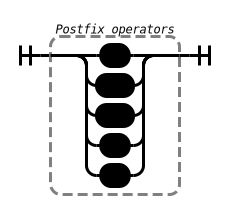
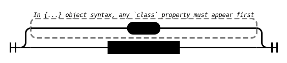

# Syntax Reference

This document helps understand how Temper code is parsed.  Readers
can use `temper repl` to get feedback on how the language interprets
a piece of code.  Especially useful is the *describe* REPL command
which lets you view a snapshot of the compilation state at various
processing stages.

Temper's syntax should be familiar to users of &ldquo;C-like&rdquo;
languages: languages that use `{...}` around blocks and semicolons
(`;`) separate computational steps.  It is most similar to TypeScript;
types follow names (`name: Type`) with a colon in between.
But its syntax is distinct from JS/TS in details.

Some diffences include:

- Temper uses `let` for named function declarations so that there is no
  confusion about when a named function's name is visible in the
  surrounding scope.  Temper is a macro language so this is important
  when macros can operate on declarations.
- Temper allows for interpolation into any string, so `"chars${expr}"`.
  For backwards compatibility, JavaScript could only allow interpolation
  into back-tick strings (<code>\`chars${expr}\`</code>).
- Temper has substantially different syntax for function expressions
  (`fn (x: Int): Int { x + 1 }` instead of `(x: Int): Int => x + 1`)
  and function types (`fn <T> (T): T` instead of `<T>(T) => T`).
- Temper's `import` and `export` syntax, which allows connecting modules
  together is different.

<!-- TODO(mvs): what are we missing from this list?  Regex syntax -->

The grammar below explains the main syntactic categories.
It's meant to be advisory, to help learners discover features by following
grammatical threads.

It is not an exact grammar.  Temper has a three-stage parse: lexical
analysis, operator precedence grouping, tree building.  This grammar
is derived from the tree builder which operates on a stream of tokens
*after* an operator precedence parser has inserted synthetic
parentheses into the token stream and *after* some other token level
rewriting operations.

<!-- TODO(mvs): when I've got internet connectivity, link terms like lexical analysis and friends -->

Since Temper is a macro language, some language features that would
have separate syntactic paths in a non-macro language are instead
implemented as macros; they parse as regular function calls, but those
functions are macros that apply at a leter compilation-stage.  For example,
`if` is a macro so there is no dedicated syntax for `if` statements below.


## Structure of a file

<!-- TODO(mvs): explain high-level that parsing of a file happens in the context of an embedding language like Markdown, and that `;;;` is a token -->

<!-- snippet: syntax/Root -->

<a name="syntax&#45;Root" class="snippet-anchor-name"></a>

### Syntax for *Root*


The root of a Temper module is a sequence of top-levels followed by an end of file marker.

<!-- /snippet: syntax/Root -->

<!-- snippet: syntax/TopLevels -->

<a name="syntax&#45;TopLevels" class="snippet-anchor-name"></a>

### Syntax for *TopLevels*


Top-levels are separated by semicolons in a module body or block.

<!-- /snippet: syntax/TopLevels -->

<!-- snippet: syntax/TopLevel -->

<a name="syntax&#45;TopLevel" class="snippet-anchor-name"></a>

### Syntax for *TopLevel*


A top-level is roughly a whole declaration, or expression.
Temper is an expression language, so most statement-like constructs can
also nest.

<!-- /snippet: syntax/TopLevel -->

<!-- snippet: syntax/Garbage -->

<a name="syntax&#45;Garbage" class="snippet-anchor-name"></a>

### Syntax for *Garbage*


<!-- /snippet: syntax/Garbage -->

<!-- snippet: syntax/TopLevelNoGarbage -->

<a name="syntax&#45;TopLevelNoGarbage" class="snippet-anchor-name"></a>

### Syntax for *TopLevelNoGarbage*


<!-- /snippet: syntax/TopLevelNoGarbage -->

<!-- snippet: syntax/TrailingSemi -->

<a name="syntax&#45;TrailingSemi" class="snippet-anchor-name"></a>

### Syntax for *TrailingSemi*


Semicolons (`;`) are allowed at the end of a block or module body.
An expression followed by a semicolon is not implicitly the result of
the containing block or module.

Trailing semicolons are never [inserted](#semicolon-insertion).

<!-- /snippet: syntax/TrailingSemi -->

## Statements

<!-- snippet: syntax/Stmt -->

<a name="syntax&#45;Stmt" class="snippet-anchor-name"></a>

### Syntax for *Stmt*


Statements are not a large syntactic category, but include labeled
statements (like `someName: /* loop or block */`), jumps (`break`,
`continue`, `return`, etc.) which go to the end or beginning of
a containing statement and which may refer to a label.

Besides those, any expression may appear in statement position.

<!-- /snippet: syntax/Stmt -->

<!-- snippet: syntax/Nop -->

<a name="syntax&#45;Nop" class="snippet-anchor-name"></a>

### Syntax for *Nop*


A semicolon used to separate statements.
Since our parser is built around an operator precedence parser, and semicolon is a low
precedence operator, this grammar consumes them, but does not require them.

Not all semicolons need to appear explicitly in program text.

<!-- snippet: semicolon-insertion -->

<a name="semicolon&#45;insertion" class="snippet-anchor-name"></a>

#### Automatic Semicolon Insertion

Semicolons are inserted in the following places:

- After  `}` that end a line except before a close bracket or an operator token that is not prefix.
- Before `{` that starts a line except after an open bracket or an operator token that is not postfix.

This is more conservative than semicolon insertion in JavaScript,
but still simplifies several things.

##### All adjacent statements are separated by semicolons

There's no need to have a set of special statements like `if (...) stmt0 else stmt1` that do not
need to be followed by a semicolon.
Productions for a series of statements and declarations can simply assume that semicolons appear
before them.

##### No limited set of statement continuers

We don't need a special set of statement continuers like `else` so that we know that
the token sequence `} else {` is part of one statement.
This lets us use common cues to allow new continuers like

<!-- snippet: temper-code/build-user-docs/build/snippet/semicolon-insertion/snippet.md/0 -->

```temper
foo(x) {
  // Ruby-style block
} bar(y) {
  // ruby-style block
}
// ⏸️
```

<!-- /snippet: temper-code/build-user-docs/build/snippet/semicolon-insertion/snippet.md/0 -->

which de-sugars to a single statement

<!-- snippet: temper-code/build-user-docs/build/snippet/semicolon-insertion/snippet.md/1 -->

```temper
foo(x, fn { ... }, bar = fn (f) { f(y, fn { ... }) });
// ⏸️
```

<!-- /snippet: temper-code/build-user-docs/build/snippet/semicolon-insertion/snippet.md/1 -->

vs something without a continuer

<!-- snippet: temper-code/build-user-docs/build/snippet/semicolon-insertion/snippet.md/2 -->

```temper
foo(x) {
  // Ruby-style block
}                         // <-- Semicolon inserted here
bar(y) {
  // Ruby-style-block
}
// ⏸️
```

<!-- /snippet: temper-code/build-user-docs/build/snippet/semicolon-insertion/snippet.md/2 -->

which de-sugars to two statements

<!-- snippet: temper-code/build-user-docs/build/snippet/semicolon-insertion/snippet.md/3 -->

```temper
foo(x, fn { ... });
bar(y, fn { ... });
// ⏸️
```

<!-- /snippet: temper-code/build-user-docs/build/snippet/semicolon-insertion/snippet.md/3 -->

##### Motivation
Developers of C-like languages are used to not following `}`s that end a statement with a
semicolon.

The exception is `class` definitions in C++ which, unlike Java and more recent C-like languages
do need to be followed by semicolons.

That that trips me up everytime I go back to C++ seems evidence that requiring semicolons after
statements that end with something block-like would be a burden to developers.

<!-- /snippet: semicolon-insertion -->

<!-- /snippet: syntax/Nop -->

<!-- snippet: syntax/LabeledStmt -->

<a name="syntax&#45;LabeledStmt" class="snippet-anchor-name"></a>

### Syntax for *LabeledStmt*


Declares a label and associates it as markers for the beginning and
end of a statement, so that `break`s and `continue`s within that
statement may refer to it explicitly.

Unlike TypeScript, we do not allow labeling any statement.
This allows conveying property declarations like the `p: T` in

<!-- snippet: temper-code/build-user-docs/build/snippet/syntax/LabeledStmt/snippet.md/0 -->

```temper
interface I {
  p: T;
}
// ⏸️
```

<!-- /snippet: temper-code/build-user-docs/build/snippet/syntax/LabeledStmt/snippet.md/0 -->

to the disAmbiguate stage with that property declaration
treated as a (Call (Name ":") (Name "p") (Name "T"))

Otherwise, we would have to treat `class` bodies as a special syntactic
category to avoid ambiguity with

<!-- snippet: temper-code/build-user-docs/build/snippet/syntax/LabeledStmt/snippet.md/1 -->

```temper
do {
  p: T;
}
// ⏸️
```

<!-- /snippet: temper-code/build-user-docs/build/snippet/syntax/LabeledStmt/snippet.md/1 -->

or the disambiguation would need to convert `T`'s from statement
context to expression context.

<!-- /snippet: syntax/LabeledStmt -->

<!-- snippet: syntax/LeftLabel -->

<a name="syntax&#45;LeftLabel" class="snippet-anchor-name"></a>

### Syntax for *LeftLabel*


A label that that can be jumped to as by `break` and `continue`.
This is *left* in the left-hand-side sense: it is a declaration, not a use.

<!-- /snippet: syntax/LeftLabel -->

<!-- snippet: syntax/Jump -->

<a name="syntax&#45;Jump" class="snippet-anchor-name"></a>

### Syntax for *Jump*


A jump to a location within the same function body that does not skip over
any necessary variable initializations.

<!-- /snippet: syntax/Jump -->

<!-- snippet: syntax/LabelOrHole -->

<a name="syntax&#45;LabelOrHole" class="snippet-anchor-name"></a>

### Syntax for *LabelOrHole*


<!-- /snippet: syntax/LabelOrHole -->

<!-- snippet: syntax/Label -->

<a name="syntax&#45;Label" class="snippet-anchor-name"></a>

### Syntax for *Label*


A label that can be jumped to as by `break` and `continue`.

<!-- /snippet: syntax/Label -->

<!-- snippet: syntax/AwaitReturnThrowYield -->

<a name="syntax&#45;AwaitReturnThrowYield" class="snippet-anchor-name"></a>

### Syntax for *AwaitReturnThrowYield*


`await`, `return`, `throw`, and `yield` are operators which affect
control flow and operate on expressions.

`return(42);` for example, looks like a function call but the parentheses
are not required:

- `return;` is an application of an operator even though there
  are no parentheses.
- `return 42;` is an application of the operator to the arguments
  `(42)` even though there are no explicit parentheses.

<!-- /snippet: syntax/AwaitReturnThrowYield -->

<!-- snippet: syntax/StmtBlock -->

<a name="syntax&#45;StmtBlock" class="snippet-anchor-name"></a>

### Syntax for *StmtBlock*


A `{` ... `}` delimited block of statements.

<!-- /snippet: syntax/StmtBlock -->

## Expressions

<!-- snippet: syntax/Expr -->

<a name="syntax&#45;Expr" class="snippet-anchor-name"></a>

### Syntax for *Expr*

![Expr &#58;&#61; QuasiTree &#124; QuasiAst &#124; QuasiHole &#124; Jump &#124; AwaitReturnThrowYield &#124; Id &#124; TypeArgumentName &#124; SymbolLiteral &#124; List &#124; New &#124; Prefix &#124; SpecialDot &#124; RegularDot &#124; Call &#124; StringLiteral &#124; &#34;&#40;&#34; &#40;&#40;Disallowed&#58; &#40;&#41;&#41; TopLevelNoGarbageNoComment &#124; Garbage&#41; &#34;&#41;&#34; &#124; OfExpr &#124; Throws &#124; Infix &#124; Postfix &#124; Member &#124; Specialize &#124; Literal &#124; RegExp &#124; Obj &#124; RawBlock &#124; &#34;&#40;&#34; Garbage](../snippet/syntax/Expr/snippet.svg)

An expression is evaluated to produce a result and/or a side effect.

<!-- /snippet: syntax/Expr -->

<!-- snippet: syntax/BooleanLiteral -->

<a name="syntax&#45;BooleanLiteral" class="snippet-anchor-name"></a>

### Syntax for *BooleanLiteral*


<!-- /snippet: syntax/BooleanLiteral -->

<!-- snippet: syntax/Float64Literal -->

<a name="syntax&#45;Float64Literal" class="snippet-anchor-name"></a>

### Syntax for *Float64Literal*

![Float64Literal &#58;&#61; &#40;&#40;whole number&#58; &#91;0&#45;9&#93;&#43;&#42;&#40;&#34;&#95;&#34;&#41;&#41; &#34;&#46;&#34; &#40;fraction&#58; &#91;0&#45;9&#93;&#43;&#43;&#40;&#34;&#95;&#34;&#41;&#41; &#40;exponent&#58; &#40;&#34;E&#34; &#124; &#34;e&#34;&#41; &#40;&#40;&#41; &#124; &#34;&#43;&#34; &#124; &#34;&#45;&#34;&#41; &#91;0&#45;9&#93;&#43;&#43;&#40;&#34;&#95;&#34;&#41;&#41;&#63; &#124; &#40;whole number&#58; &#91;0&#45;9&#93;&#43;&#42;&#40;&#34;&#95;&#34;&#41;&#41; &#40;exponent&#58; &#40;&#34;E&#34; &#124; &#34;e&#34;&#41; &#40;&#40;&#41; &#124; &#34;&#43;&#34; &#124; &#34;&#45;&#34;&#41; &#91;0&#45;9&#93;&#43;&#43;&#40;&#34;&#95;&#34;&#41;&#41;&#41; &#40;suffix&#58; &#40;&#34;D&#34; &#124; &#34;d&#34;&#41;&#43;&#41;&#63; &#124; &#40;whole number&#58; &#91;0&#45;9&#93;&#43;&#42;&#40;&#34;&#95;&#34;&#41;&#41; &#40;suffix&#58; &#40;&#34;D&#34; &#124; &#34;d&#34;&#41;&#43;&#41;](../snippet/syntax/Float64Literal/snippet.svg)

<!-- /snippet: syntax/Float64Literal -->

<!-- snippet: syntax/Call -->

<a name="syntax&#45;Call" class="snippet-anchor-name"></a>

### Syntax for *Call*


The call expression includes simple function calls (`f(args)`) as well as calls with
Ruby-style block functions (`f { ... }`) and flow-control like
`if (condition) { t } else { e }` because [`if` is a macro][builtin/if].

<!-- /snippet: syntax/Call -->

<!-- snippet: syntax/New -->

<a name="syntax&#45;New" class="snippet-anchor-name"></a>

### Syntax for *New*


<!-- /snippet: syntax/New -->

<!-- snippet: syntax/StringLiteral -->

<a name="syntax&#45;StringLiteral" class="snippet-anchor-name"></a>

### Syntax for *StringLiteral*

![StringLiteral &#58;&#61; &#34;&#92;u0022&#34; &#40;SourceCharacter &#45; &#40;&#92;&#92;n&#92;&#44; &#92;&#92;r&#92;&#44; &#92;&#92;&#92;&#44; &#92;&#34;&#92;&#41; &#124; EscapeSequence &#124; &#40;UTF&#45;16 Code Unit&#58; &#34;&#92;&#92;u&#34; Hex Hex Hex Hex&#41; &#124; &#40;Unicode Scalar Values&#58; &#34;&#92;&#92;u&#123;&#34; HexDigits&#43;&#40;&#34;&#44;&#34;&#41; &#34;&#125;&#34;&#41; &#124; &#40;Interpolation&#58; &#34;&#92;u0024&#123;&#34; Expr &#34;&#125;&#34;&#41;&#41;&#42; &#34;&#92;u0022&#34; &#124; &#34;&#92;u0022&#92;u0022&#92;u0022&#34; &#40;Content line starting with &#96;&#34;&#96;&#58; &#34;LineBreak&#34; indentation &#40;Ignored margin quote&#58; &#34;&#92;u0022&#34;&#41; &#40;&#40;SourceCharacter &#45; &#40;&#92;&#92;&#92;&#41; &#124; EscapeSequence &#124; &#40;UTF&#45;16 Code Unit&#58; &#34;&#92;&#92;u&#34; Hex Hex Hex Hex&#41; &#124; &#40;Unicode Scalar Values&#58; &#34;&#92;&#92;u&#123;&#34; HexDigits&#43;&#40;&#34;&#44;&#34;&#41; &#34;&#125;&#34;&#41; &#124; &#40;Interpolation&#58; &#34;&#92;u0024&#123;&#34; Expr &#34;&#125;&#34;&#41;&#41;&#42; &#124; &#34;&#123;&#58;&#34; StatementFragment &#34;&#58;&#125;&#34;&#41;&#41;&#42; &#34;LineBreak&#34;](../snippet/syntax/StringLiteral/snippet.svg)

<!-- /snippet: syntax/StringLiteral -->

## Block Lambdas

<!-- snippet: syntax/BlockLambda -->

<a name="syntax&#45;BlockLambda" class="snippet-anchor-name"></a>

### Syntax for *BlockLambda*


A block lambda is a `{...}` block that specifies a function value and which
cna appear as part of a function call as below:

    someFunction { ... }

Optionally, a signature is needed to specify argument names, and may specify
the function type wholly or partially.

It may be followed by an `extends` clause that specifies marker interfaces
that are super-types for the produced function value.

The signature is followed by the double-semicolon token (`;;`) which is
distinct from two, space separated semicolons (`; ;`).

<!-- snippet: temper-code/build-user-docs/build/snippet/syntax/BlockLambda/snippet.md/0 -->

```temper
someFunction /* <- callee */ {
  (x): ReturnType               // <- Optional signature
  extends SomeInterfaceType     // <- super types
  ;;                            // <- double semicolon separator

  body
}
// ⏸️
```

<!-- /snippet: temper-code/build-user-docs/build/snippet/syntax/BlockLambda/snippet.md/0 -->

<!-- /snippet: syntax/BlockLambda -->

<!-- snippet: syntax/BlockLambdaSignatureAndSupers -->

<a name="syntax&#45;BlockLambdaSignatureAndSupers" class="snippet-anchor-name"></a>

### Syntax for *BlockLambdaSignatureAndSupers*


The signature of a block lambda explains the names of arguments
visible within the body, optionally their types and return type.

The signature also includes other interfaces that the lambda must
implement.  For example, a function that might pause execution
could use a signature line as below:

    (x: Int): Int extends GeneratorFn =>

That describes a function that takes an integer `x` and which
also is a sub-type of [*GeneratorFn*](types.md#type-GeneratorFn).

The `extends` clause may be left off entirely if no super-types
are desired, or multiple super-types may be specified:
`extends First & Second`.

Unlike in a function type, when a name is specified for a
block lambda argument, it is the name of the argument,
not its type.

<!-- snippet: temper-code/build-user-docs/build/snippet/syntax/BlockLambdaSignatureAndSupers/snippet.md/0 -->

```temper
let f: fn (Int): Void;
//         ⇧⇧⇧ word is a type

let g(myLambda: fn (Int): Void): Void { myLambda(1); }

g { (x): Void =>
  // ⇧ word is an argument name.
  // In this case, the type is inferred from g's signature.
  doSomethingWith(x + 1);
}
// ⏸️
```

<!-- /snippet: temper-code/build-user-docs/build/snippet/syntax/BlockLambdaSignatureAndSupers/snippet.md/0 -->

<!-- /snippet: syntax/BlockLambdaSignatureAndSupers -->

<!-- snippet: syntax/BlockLambdaSignature -->

<a name="syntax&#45;BlockLambdaSignature" class="snippet-anchor-name"></a>

### Syntax for *BlockLambdaSignature*


A block lambda signature line like `(x: Int): ReturnType` or just
`(x)` to take advantage of the more aggressive type inference for block
lambdas than for declared functions.

This is often followed by `;;` as it is part of
[BlockLambdaSignatureAndSupers Syntax](#syntax-BlockLambdaSignatureAndSupers).

These syntactic constructs are interpreted as if preceded by
[`fn`](builtins.md#builtin-fn) but the meaning is subtly different.

- `(x: Int)` is equivalent to `fn (x: Int)` where the return type must
  later be inferrable from the calling context and the body.
- `(x)` is equivalent to `fn (x)` where the argument and return type
  must later be inferrable.
- (x): ReturnType` is equivalent to `fn (x): RT` where only argument types
  must later be inferrable.

<!-- /snippet: syntax/BlockLambdaSignature -->

<!-- snippet: syntax/BlockLambdaSupers -->

<a name="syntax&#45;BlockLambdaSupers" class="snippet-anchor-name"></a>

### Syntax for *BlockLambdaSupers*


<!-- /snippet: syntax/BlockLambdaSupers -->

<!-- snippet: syntax/BlockLambdaBody -->

<a name="syntax&#45;BlockLambdaBody" class="snippet-anchor-name"></a>

### Syntax for *BlockLambdaBody*


<!-- /snippet: syntax/BlockLambdaBody -->

### Uncategorized

<!-- snippet: syntax/Arg -->

<a name="syntax&#45;Arg" class="snippet-anchor-name"></a>

#### Syntax for *Arg*


<!-- /snippet: syntax/Arg -->

<!-- snippet: syntax/ArgNoInit -->

<a name="syntax&#45;ArgNoInit" class="snippet-anchor-name"></a>

#### Syntax for *ArgNoInit*


<!-- /snippet: syntax/ArgNoInit -->

<!-- snippet: syntax/Args -->

<a name="syntax&#45;Args" class="snippet-anchor-name"></a>

#### Syntax for *Args*


<!-- /snippet: syntax/Args -->

<!-- snippet: syntax/CallArgs -->

<a name="syntax&#45;CallArgs" class="snippet-anchor-name"></a>

#### Syntax for *CallArgs*


Arguments to a function call.

A function call's arguments may be one of:

- a parenthesized, comma separated list of arguments like `(a, b, c)`.  See Args
- a parenthesized, semicolon separated list of 2 or three arguments
  with a specific purpose.  As in `(let x = 1; x < 2; ++x)` which is what the
  `for` loop macro expects.
- a string group as in a tagged string template like `callee"foo ${ bar }"`.

<!-- /snippet: syntax/CallArgs -->

<!-- snippet: syntax/CallHead -->

<a name="syntax&#45;CallHead" class="snippet-anchor-name"></a>

#### Syntax for *CallHead*


The function called, its arguments, and any block lambda

<!-- /snippet: syntax/CallHead -->

<!-- snippet: syntax/CallJoiningWords -->

<a name="syntax&#45;CallJoiningWords" class="snippet-anchor-name"></a>

#### Syntax for *CallJoiningWords*


When the call continues with something like `} else if (c) {...}` we need to include
`\else_if = fn {...}` as a final named parameter to the call that receives the block
just closed, so that the called function can delegate its result to later segments.
This joins words like `else if` into the `\else_if` symbol which follows the call join
symbol.  A late parse stage pass finds those and groups everything following the joining
words into a trailing block function so that the contents of the parentheses and brackets
can match their own signature elements based on the joining words.

<!-- /snippet: syntax/CallJoiningWords -->

<!-- snippet: syntax/CallTail -->

<a name="syntax&#45;CallTail" class="snippet-anchor-name"></a>

#### Syntax for *CallTail*


<!-- /snippet: syntax/CallTail -->

<!-- snippet: syntax/Callee -->

<a name="syntax&#45;Callee" class="snippet-anchor-name"></a>

#### Syntax for *Callee*


The callee in a function application is a tad complicated.

Our OPP grammar covers many constructs that are bespoke constructs
in many languages, so `class C extends A, B { ... }` is parsed as an
application of a block lambda (later turned into a member block) like
`class(\word, C, \super, A, \super B, fn { .... })`.

This production desugars various parts into a combination of the
callee `class`, and symbol/argument pairs.

The `\word` argument is also used in constructs like function declaration
`let f<T>(arg: Type) { ... }` where the `let` macro is what is invoked to
build a named function declaration.

This production allows a callee to have:

- an expression specifying the called macro or function,
- an accompanying word,
- type parameters like `<T, U>` (whether the type parameters are actual
  parameters or formal parameters is determined by the Disambiguate stage),

<!-- /snippet: syntax/Callee -->

<!-- snippet: syntax/CalleeAndArgs -->

<a name="syntax&#45;CalleeAndArgs" class="snippet-anchor-name"></a>

#### Syntax for *CalleeAndArgs*


Captures low precedence operators that may follow a parenthesized argument list.

- `: ReturnType` desugars to `\outType`, `ReturnType`.
- `extends SuperType` and `implements SuperType* desugars to `\super`, `SuperType`.

<!-- /snippet: syntax/CalleeAndArgs -->

<!-- snippet: syntax/CalleeAndRequiredArgs -->

<a name="syntax&#45;CalleeAndRequiredArgs" class="snippet-anchor-name"></a>

#### Syntax for *CalleeAndRequiredArgs*


This is like CalleeAndArgs but is used in contexts where we're not sure yet
whether this is a call.  A call requires at least one of

- Parenthesized arguments as in  `callee()`
- Semi-ed arguments       as in  `loopMacro (initialization; condition; increment)`
- A template string       as in  `callee"foo ${bar}"`
- A trailing block        as in  `callee {}`

This production succeeds is entered where we may not have a trailing block
so must have one of the others.

<!-- /snippet: syntax/CalleeAndRequiredArgs -->

<!-- snippet: syntax/CommaEl -->

<a name="syntax&#45;CommaEl" class="snippet-anchor-name"></a>

#### Syntax for *CommaEl*


<!-- /snippet: syntax/CommaEl -->

<!-- snippet: syntax/CommaExpr -->

<a name="syntax&#45;CommaExpr" class="snippet-anchor-name"></a>

#### Syntax for *CommaExpr*


<!-- /snippet: syntax/CommaExpr -->

<!-- snippet: syntax/CommaOp -->

<a name="syntax&#45;CommaOp" class="snippet-anchor-name"></a>

#### Syntax for *CommaOp*


<!-- /snippet: syntax/CommaOp -->

<!-- snippet: syntax/DeclDefault -->

<a name="syntax&#45;DeclDefault" class="snippet-anchor-name"></a>

#### Syntax for *DeclDefault*


<!-- /snippet: syntax/DeclDefault -->

<!-- snippet: syntax/DeclInit -->

<a name="syntax&#45;DeclInit" class="snippet-anchor-name"></a>

#### Syntax for *DeclInit*


<!-- /snippet: syntax/DeclInit -->

<!-- snippet: syntax/DeclMulti -->

<a name="syntax&#45;DeclMulti" class="snippet-anchor-name"></a>

#### Syntax for *DeclMulti*


<!-- /snippet: syntax/DeclMulti -->

<!-- snippet: syntax/DeclMultiNamed -->

<a name="syntax&#45;DeclMultiNamed" class="snippet-anchor-name"></a>

#### Syntax for *DeclMultiNamed*


<!-- /snippet: syntax/DeclMultiNamed -->

<!-- snippet: syntax/DeclMultiNested -->

<a name="syntax&#45;DeclMultiNested" class="snippet-anchor-name"></a>

#### Syntax for *DeclMultiNested*


<!-- /snippet: syntax/DeclMultiNested -->

<!-- snippet: syntax/DeclName -->

<a name="syntax&#45;DeclName" class="snippet-anchor-name"></a>

#### Syntax for *DeclName*


<!-- /snippet: syntax/DeclName -->

<!-- snippet: syntax/DeclType -->

<a name="syntax&#45;DeclType" class="snippet-anchor-name"></a>

#### Syntax for *DeclType*


<!-- /snippet: syntax/DeclType -->

<!-- snippet: syntax/DeclTypeNested -->

<a name="syntax&#45;DeclTypeNested" class="snippet-anchor-name"></a>

#### Syntax for *DeclTypeNested*


<!-- /snippet: syntax/DeclTypeNested -->

<!-- snippet: syntax/DecoratedLet -->

<a name="syntax&#45;DecoratedLet" class="snippet-anchor-name"></a>

#### Syntax for *DecoratedLet*


<!-- /snippet: syntax/DecoratedLet -->

<!-- snippet: syntax/DecoratedLetBody -->

<a name="syntax&#45;DecoratedLetBody" class="snippet-anchor-name"></a>

#### Syntax for *DecoratedLetBody*


<!-- /snippet: syntax/DecoratedLetBody -->

<!-- snippet: syntax/DecoratedTopLevel -->

<a name="syntax&#45;DecoratedTopLevel" class="snippet-anchor-name"></a>

#### Syntax for *DecoratedTopLevel*


Decorations transform declarations and function and type definitions at compile time.

`@SomeName` followed by an optional argument list

When a `let` declaration declares multiple names, any decoration before the `let`
applies to all the names, but declarations immediately before a declared name affect
only that name.

<!-- /snippet: syntax/DecoratedTopLevel -->

<!-- snippet: syntax/EmbeddedComment -->

<a name="syntax&#45;EmbeddedComment" class="snippet-anchor-name"></a>

#### Syntax for *EmbeddedComment*


Comments are not semantically significant but nor are they filtered
out entirely.

Temper tries to preserve them when translating documentation, and
they are available to backends; for example, the Python backend turns
autodoc comments before declarations into Python doc strings.

<!-- /snippet: syntax/EmbeddedComment -->

<!-- snippet: syntax/EscapeSequence -->

<a name="syntax&#45;EscapeSequence" class="snippet-anchor-name"></a>

#### Syntax for *EscapeSequence*

![EscapeSequence &#58;&#61; &#34;&#92;&#92;0&#34; &#124; &#34;&#92;&#92;&#92;&#92;&#34; &#124; &#34;&#92;&#92;&#47;&#34; &#124; &#34;&#92;&#92;&#92;u0022&#34; &#124; &#34;&#92;&#92;&#92;&#34; &#124; &#34;&#92;&#92;&#96;&#34; &#124; &#34;&#92;&#92;&#123;&#34; &#124; &#34;&#92;&#92;&#125;&#34; &#124; &#34;&#92;&#92;&#92;u0024&#34; &#124; &#34;&#92;&#92;b&#34; &#124; &#34;&#92;&#92;t&#34; &#124; &#34;&#92;&#92;n&#34; &#124; &#34;&#92;&#92;f&#34; &#124; &#34;&#92;&#92;r&#34; &#124; &#34;&#92;&#92;&#34;](../snippet/syntax/EscapeSequence/snippet.svg)

<!-- /snippet: syntax/EscapeSequence -->

<!-- snippet: syntax/ForArgs -->

<a name="syntax&#45;ForArgs" class="snippet-anchor-name"></a>

#### Syntax for *ForArgs*


<!-- /snippet: syntax/ForArgs -->

<!-- snippet: syntax/ForCond -->

<a name="syntax&#45;ForCond" class="snippet-anchor-name"></a>

#### Syntax for *ForCond*


<!-- /snippet: syntax/ForCond -->

<!-- snippet: syntax/ForIncr -->

<a name="syntax&#45;ForIncr" class="snippet-anchor-name"></a>

#### Syntax for *ForIncr*


<!-- /snippet: syntax/ForIncr -->

<!-- snippet: syntax/ForInit -->

<a name="syntax&#45;ForInit" class="snippet-anchor-name"></a>

#### Syntax for *ForInit*


<!-- /snippet: syntax/ForInit -->

<!-- snippet: syntax/Formal -->

<a name="syntax&#45;Formal" class="snippet-anchor-name"></a>

#### Syntax for *Formal*


<!-- /snippet: syntax/Formal -->

<!-- snippet: syntax/FormalNoInit -->

<a name="syntax&#45;FormalNoInit" class="snippet-anchor-name"></a>

#### Syntax for *FormalNoInit*


<!-- /snippet: syntax/FormalNoInit -->

<!-- snippet: syntax/Formals -->

<a name="syntax&#45;Formals" class="snippet-anchor-name"></a>

#### Syntax for *Formals*


<!-- /snippet: syntax/Formals -->

<!-- snippet: syntax/Id -->

<a name="syntax&#45;Id" class="snippet-anchor-name"></a>

#### Syntax for *Id*


<!-- /snippet: syntax/Id -->

<!-- snippet: syntax/Infix -->

<a name="syntax&#45;Infix" class="snippet-anchor-name"></a>

#### Syntax for *Infix*


<!-- /snippet: syntax/Infix -->

<!-- snippet: syntax/InfixOp -->

<a name="syntax&#45;InfixOp" class="snippet-anchor-name"></a>

#### Syntax for *InfixOp*


<!-- /snippet: syntax/InfixOp -->

<!-- snippet: syntax/Json -->

<a name="syntax&#45;Json" class="snippet-anchor-name"></a>

#### Syntax for *Json*


<!-- /snippet: syntax/Json -->

<!-- snippet: syntax/JsonArray -->

<a name="syntax&#45;JsonArray" class="snippet-anchor-name"></a>

#### Syntax for *JsonArray*


<!-- /snippet: syntax/JsonArray -->

<!-- snippet: syntax/JsonBoolean -->

<a name="syntax&#45;JsonBoolean" class="snippet-anchor-name"></a>

#### Syntax for *JsonBoolean*


Truth values are represented using the keywords `false` and `true`.

<!-- /snippet: syntax/JsonBoolean -->

<!-- snippet: syntax/JsonNull -->

<a name="syntax&#45;JsonNull" class="snippet-anchor-name"></a>

#### Syntax for *JsonNull*


<!-- /snippet: syntax/JsonNull -->

<!-- snippet: syntax/JsonNumber -->

<a name="syntax&#45;JsonNumber" class="snippet-anchor-name"></a>

#### Syntax for *JsonNumber*


<!-- /snippet: syntax/JsonNumber -->

<!-- snippet: syntax/JsonObject -->

<a name="syntax&#45;JsonObject" class="snippet-anchor-name"></a>

#### Syntax for *JsonObject*


<!-- /snippet: syntax/JsonObject -->

<!-- snippet: syntax/JsonProperty -->

<a name="syntax&#45;JsonProperty" class="snippet-anchor-name"></a>

#### Syntax for *JsonProperty*


<!-- /snippet: syntax/JsonProperty -->

<!-- snippet: syntax/JsonString -->

<a name="syntax&#45;JsonString" class="snippet-anchor-name"></a>

#### Syntax for *JsonString*


<!-- /snippet: syntax/JsonString -->

<!-- snippet: syntax/JsonValue -->

<a name="syntax&#45;JsonValue" class="snippet-anchor-name"></a>

#### Syntax for *JsonValue*


<!-- /snippet: syntax/JsonValue -->

<!-- snippet: syntax/Let -->

<a name="syntax&#45;Let" class="snippet-anchor-name"></a>

#### Syntax for *Let*


<!-- /snippet: syntax/Let -->

<!-- snippet: syntax/LetArg -->

<a name="syntax&#45;LetArg" class="snippet-anchor-name"></a>

#### Syntax for *LetArg*


<!-- /snippet: syntax/LetArg -->

<!-- snippet: syntax/LetBody -->

<a name="syntax&#45;LetBody" class="snippet-anchor-name"></a>

#### Syntax for *LetBody*


<!-- /snippet: syntax/LetBody -->

<!-- snippet: syntax/LetNested -->

<a name="syntax&#45;LetNested" class="snippet-anchor-name"></a>

#### Syntax for *LetNested*


<!-- /snippet: syntax/LetNested -->

<!-- snippet: syntax/LetRest -->

<a name="syntax&#45;LetRest" class="snippet-anchor-name"></a>

#### Syntax for *LetRest*


<!-- /snippet: syntax/LetRest -->

<!-- snippet: syntax/List -->

<a name="syntax&#45;List" class="snippet-anchor-name"></a>

#### Syntax for *List*


<!-- /snippet: syntax/List -->

<!-- snippet: syntax/ListContent -->

<a name="syntax&#45;ListContent" class="snippet-anchor-name"></a>

#### Syntax for *ListContent*


<!-- /snippet: syntax/ListContent -->

<!-- snippet: syntax/ListElement -->

<a name="syntax&#45;ListElement" class="snippet-anchor-name"></a>

#### Syntax for *ListElement*


<!-- /snippet: syntax/ListElement -->

<!-- snippet: syntax/ListElements -->

<a name="syntax&#45;ListElements" class="snippet-anchor-name"></a>

#### Syntax for *ListElements*


<!-- /snippet: syntax/ListElements -->

<!-- snippet: syntax/ListHole -->

<a name="syntax&#45;ListHole" class="snippet-anchor-name"></a>

#### Syntax for *ListHole*


<!-- /snippet: syntax/ListHole -->

<!-- snippet: syntax/Literal -->

<a name="syntax&#45;Literal" class="snippet-anchor-name"></a>

#### Syntax for *Literal*


<!-- /snippet: syntax/Literal -->

<!-- snippet: syntax/MatchBranch -->

<a name="syntax&#45;MatchBranch" class="snippet-anchor-name"></a>

#### Syntax for *MatchBranch*


Relates a match case, e.g. a pattern, to a consequence of matching that pattern.

<!-- /snippet: syntax/MatchBranch -->

<!-- snippet: syntax/MatchCase -->

<a name="syntax&#45;MatchCase" class="snippet-anchor-name"></a>

#### Syntax for *MatchCase*


There are two kinds of match cases: run-time type checks that use keyword `is`, and a value to match.

<!-- /snippet: syntax/MatchCase -->

<!-- snippet: syntax/Member -->

<a name="syntax&#45;Member" class="snippet-anchor-name"></a>

#### Syntax for *Member*


<!-- /snippet: syntax/Member -->

<!-- snippet: syntax/NoPropClass -->

<a name="syntax&#45;NoPropClass" class="snippet-anchor-name"></a>

#### Syntax for *NoPropClass*


<!-- /snippet: syntax/NoPropClass -->

<!-- snippet: syntax/Obj -->

<a name="syntax&#45;Obj" class="snippet-anchor-name"></a>

#### Syntax for *Obj*


<!-- /snippet: syntax/Obj -->

<!-- snippet: syntax/Pattern -->

<a name="syntax&#45;Pattern" class="snippet-anchor-name"></a>

#### Syntax for *Pattern*


<!-- /snippet: syntax/Pattern -->

<!-- snippet: syntax/Postfix -->

<a name="syntax&#45;Postfix" class="snippet-anchor-name"></a>

#### Syntax for *Postfix*


<!-- /snippet: syntax/Postfix -->

<!-- snippet: syntax/PostfixOp -->

<a name="syntax&#45;PostfixOp" class="snippet-anchor-name"></a>

#### Syntax for *PostfixOp*



<!-- /snippet: syntax/PostfixOp -->

<!-- snippet: syntax/Prefix -->

<a name="syntax&#45;Prefix" class="snippet-anchor-name"></a>

#### Syntax for *Prefix*


<!-- /snippet: syntax/Prefix -->

<!-- snippet: syntax/PrefixOp -->

<a name="syntax&#45;PrefixOp" class="snippet-anchor-name"></a>

#### Syntax for *PrefixOp*


<!-- /snippet: syntax/PrefixOp -->

<!-- snippet: syntax/Prop -->

<a name="syntax&#45;Prop" class="snippet-anchor-name"></a>

#### Syntax for *Prop*


<!-- /snippet: syntax/Prop -->

<!-- snippet: syntax/PropClass -->

<a name="syntax&#45;PropClass" class="snippet-anchor-name"></a>

#### Syntax for *PropClass*


<!-- /snippet: syntax/PropClass -->

<!-- snippet: syntax/PropName -->

<a name="syntax&#45;PropName" class="snippet-anchor-name"></a>

#### Syntax for *PropName*



<!-- /snippet: syntax/PropName -->

<!-- snippet: syntax/Props -->

<a name="syntax&#45;Props" class="snippet-anchor-name"></a>

#### Syntax for *Props*


<!-- /snippet: syntax/Props -->

<!-- snippet: syntax/QuasiAst -->

<a name="syntax&#45;QuasiAst" class="snippet-anchor-name"></a>

#### Syntax for *QuasiAst*


<!-- /snippet: syntax/QuasiAst -->

<!-- snippet: syntax/QuasiHole -->

<a name="syntax&#45;QuasiHole" class="snippet-anchor-name"></a>

#### Syntax for *QuasiHole*


<!-- /snippet: syntax/QuasiHole -->

<!-- snippet: syntax/QuasiInner -->

<a name="syntax&#45;QuasiInner" class="snippet-anchor-name"></a>

#### Syntax for *QuasiInner*


<!-- /snippet: syntax/QuasiInner -->

<!-- snippet: syntax/QuasiLeaf -->

<a name="syntax&#45;QuasiLeaf" class="snippet-anchor-name"></a>

#### Syntax for *QuasiLeaf*


<!-- /snippet: syntax/QuasiLeaf -->

<!-- snippet: syntax/QuasiTree -->

<a name="syntax&#45;QuasiTree" class="snippet-anchor-name"></a>

#### Syntax for *QuasiTree*


<!-- /snippet: syntax/QuasiTree -->

<!-- snippet: syntax/Quasis -->

<a name="syntax&#45;Quasis" class="snippet-anchor-name"></a>

#### Syntax for *Quasis*


<!-- /snippet: syntax/Quasis -->

<!-- snippet: syntax/RawBlock -->

<a name="syntax&#45;RawBlock" class="snippet-anchor-name"></a>

#### Syntax for *RawBlock*


<!-- /snippet: syntax/RawBlock -->

<!-- snippet: syntax/RawCommaOp -->

<a name="syntax&#45;RawCommaOp" class="snippet-anchor-name"></a>

#### Syntax for *RawCommaOp*


<!-- /snippet: syntax/RawCommaOp -->

<!-- snippet: syntax/RegExp -->

<a name="syntax&#45;RegExp" class="snippet-anchor-name"></a>

#### Syntax for *RegExp*


<!-- /snippet: syntax/RegExp -->

<!-- snippet: syntax/RegularDot -->

<a name="syntax&#45;RegularDot" class="snippet-anchor-name"></a>

#### Syntax for *RegularDot*


<!-- /snippet: syntax/RegularDot -->

<!-- snippet: syntax/ReservedWord -->

<a name="syntax&#45;ReservedWord" class="snippet-anchor-name"></a>

#### Syntax for *ReservedWord*


<!-- /snippet: syntax/ReservedWord -->

<!-- snippet: syntax/SpecialDot -->

<a name="syntax&#45;SpecialDot" class="snippet-anchor-name"></a>

#### Syntax for *SpecialDot*


<!-- /snippet: syntax/SpecialDot -->

<!-- snippet: syntax/Specialize -->

<a name="syntax&#45;Specialize" class="snippet-anchor-name"></a>

#### Syntax for *Specialize*


<!-- /snippet: syntax/Specialize -->

<!-- snippet: syntax/Spread -->

<a name="syntax&#45;Spread" class="snippet-anchor-name"></a>

#### Syntax for *Spread*


<!-- /snippet: syntax/Spread -->

<!-- snippet: syntax/StringGroup -->

<a name="syntax&#45;StringGroup" class="snippet-anchor-name"></a>

#### Syntax for *StringGroup*


<!-- /snippet: syntax/StringGroup -->

<!-- snippet: syntax/StringGroupTagged -->

<a name="syntax&#45;StringGroupTagged" class="snippet-anchor-name"></a>

#### Syntax for *StringGroupTagged*


<!-- /snippet: syntax/StringGroupTagged -->

<!-- snippet: syntax/StringHole -->

<a name="syntax&#45;StringHole" class="snippet-anchor-name"></a>

#### Syntax for *StringHole*


<!-- /snippet: syntax/StringHole -->

<!-- snippet: syntax/StringPart -->

<a name="syntax&#45;StringPart" class="snippet-anchor-name"></a>

##### Syntax for *StringPart*


<!-- snippet: syntax/string/interpolation -->
#### String interpolation

Strings may contain embedded expressions.  When a
string contains a `${` followed by an expression,
followed by a `}`, the resulting string value
is the concatenation of the content before,
content from the expression, and the content after.

<!-- snippet: temper-code/build-user-docs/build/snippet/syntax/StringPart/snippet.md/0 -->

```temper
"foo ${"bar"} baz"
== "foo bar baz"
// ✅
```

<!-- /snippet: temper-code/build-user-docs/build/snippet/syntax/StringPart/snippet.md/0 -->

Interpolated values that aren't *String* instances
have `.toString()` called on them automatically,
which is convenient for types that define *toString*,
such as *Int*.

<!-- snippet: temper-code/build-user-docs/build/snippet/syntax/StringPart/snippet.md/1 -->

```temper
let two = 2;
"one ${two} three"
== "one 2 three"
// ✅
```

<!-- /snippet: temper-code/build-user-docs/build/snippet/syntax/StringPart/snippet.md/1 -->

An empty interpolation contributes no characters,
which means it may be used to embed meta-characters.

<!-- snippet: temper-code/build-user-docs/build/snippet/syntax/StringPart/snippet.md/2 -->

```temper
"$${}{}" == "\$\{\}"
// ✅
```

<!-- /snippet: temper-code/build-user-docs/build/snippet/syntax/StringPart/snippet.md/2 -->

(This mostly comes in handy with tagged strings to
give fine-grained control over what the tag receives.)

Empty interpolations can also be used to wrap a long
string across multiple lines.

<!-- snippet: temper-code/build-user-docs/build/snippet/syntax/StringPart/snippet.md/3 -->

```temper
"A very long string ${
  // Breaking this string across multiple lines.
}that runs on and on"
== "A very long string that runs on and on"
// ✅
```

<!-- /snippet: temper-code/build-user-docs/build/snippet/syntax/StringPart/snippet.md/3 -->

Empty interpolations also let you include spaces at
the end of a line in a multi-quoted string.

<!-- snippet: temper-code/build-user-docs/build/snippet/syntax/StringPart/snippet.md/4 -->

```temper
"""
"Line 1
"Line 2 ${}
== "Line 1\nLine 2 "
// ✅
```

<!-- /snippet: temper-code/build-user-docs/build/snippet/syntax/StringPart/snippet.md/4 -->

<!-- /snippet: syntax/StringPart -->

<!-- snippet: syntax/StringPartRaw -->

<a name="syntax&#45;StringPartRaw" class="snippet-anchor-name"></a>

#### Syntax for *StringPartRaw*


Parallels [ProductionNames.StringPart] but emits a [ValuePart] instead
of routing a string token to [lang.temper.lexer.unpackQuotedString] so
that the tag expression gets string content without escape sequences
decoded.

<!-- /snippet: syntax/StringPartRaw -->

<!-- snippet: syntax/SymbolLiteral -->

<a name="syntax&#45;SymbolLiteral" class="snippet-anchor-name"></a>

#### Syntax for *SymbolLiteral*


<!-- /snippet: syntax/SymbolLiteral -->

<!-- snippet: syntax/SymbolValue -->

<a name="syntax&#45;SymbolValue" class="snippet-anchor-name"></a>

#### Syntax for *SymbolValue*


<!-- /snippet: syntax/SymbolValue -->

<!-- snippet: syntax/TopLevelNoGarbageNoComment -->

<a name="syntax&#45;TopLevelNoGarbageNoComment" class="snippet-anchor-name"></a>

#### Syntax for *TopLevelNoGarbageNoComment*


<!-- /snippet: syntax/TopLevelNoGarbageNoComment -->

<!-- snippet: syntax/TopLevelsInSemi -->

<a name="syntax&#45;TopLevelsInSemi" class="snippet-anchor-name"></a>

#### Syntax for *TopLevelsInSemi*


Top levels in the context of a larger semicolon separated run.

<!-- /snippet: syntax/TopLevelsInSemi -->

<!-- snippet: syntax/Type -->

<a name="syntax&#45;Type" class="snippet-anchor-name"></a>

#### Syntax for *Type*


<!-- /snippet: syntax/Type -->

<!-- snippet: syntax/TypeArgument -->

<a name="syntax&#45;TypeArgument" class="snippet-anchor-name"></a>

#### Syntax for *TypeArgument*


<!-- /snippet: syntax/TypeArgument -->

<!-- snippet: syntax/TypeArgumentName -->

<a name="syntax&#45;TypeArgumentName" class="snippet-anchor-name"></a>

#### Syntax for *TypeArgumentName*


<!-- /snippet: syntax/TypeArgumentName -->

<!-- snippet: syntax/TypeArguments -->

<a name="syntax&#45;TypeArguments" class="snippet-anchor-name"></a>

#### Syntax for *TypeArguments*


<!-- /snippet: syntax/TypeArguments -->
