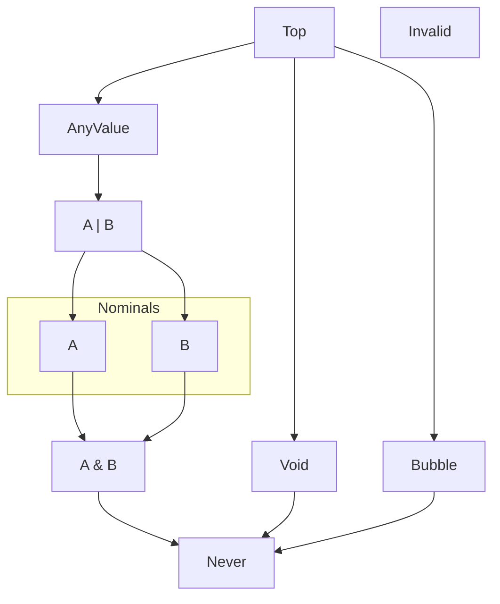

# Types and Values

Simple values look similar to values from JavaScript, Java, C#.

Type names consistently start with a capital letter though:

* `Boolean`&check; ; not `boolean`&cross;
* `Int`&check; ; not `int`&cross;
* `String`&check; ; not `string`&cross;

Value names, like lower-variable names,
start with a lower-case letter: `false`&check; ; not `False`&cross;.

<!-- snippet: type/Boolean -->

<a name="type&#45;Boolean" class="snippet-anchor-name"></a>

## *class Boolean*

<!-- snippet: type/Boolean/commentary -->

<a name="type&#45;Boolean&#45;commentary" class="snippet-anchor-name"></a>

A *Boolean* is a truth value that may be used in `if` and loop conditions.

<!-- snippet: syntax/BooleanLiteral -->

<a name="syntax&#45;BooleanLiteral" class="snippet-anchor-name"></a>


<!-- /snippet: syntax/BooleanLiteral -->

<!-- /snippet: type/Boolean/commentary -->

<!-- snippet: type/Boolean/sig -->

<a name="type&#45;Boolean&#45;sig" class="snippet-anchor-name"></a>

*Boolean* `extends` [*AnyValue*](#type-AnyValue), [*Equatable*](#type-Equatable)

<!-- /snippet: type/Boolean/sig -->

<blockquote markdown="1" class="indent-only">

<!-- snippet: type/Boolean/members -->

<a name="type&#45;Boolean&#45;members" class="snippet-anchor-name"></a>

<!-- snippet: type/Boolean/typeFormals -->

<a name="type&#45;Boolean&#45;typeFormals" class="snippet-anchor-name"></a>

<!-- /snippet: type/Boolean/typeFormals -->

<!-- snippet: type/Boolean/properties -->

<a name="type&#45;Boolean&#45;properties" class="snippet-anchor-name"></a>

<!-- /snippet: type/Boolean/properties -->

<!-- snippet: type/Boolean/methods -->

<a name="type&#45;Boolean&#45;methods" class="snippet-anchor-name"></a>

### methods

<!-- snippet: type/Boolean/method/constructor -->

<a name="type&#45;Boolean&#45;method&#45;constructor" class="snippet-anchor-name"></a>

#### `Boolean.constructor`

<!-- snippet: type/Boolean/method/constructor/sig -->

<a name="type&#45;Boolean&#45;method&#45;constructor&#45;sig" class="snippet-anchor-name"></a>

`:` `fn(`[*Boolean*](#type-Boolean)`):` [*Void*](#type-Void)

<!-- /snippet: type/Boolean/method/constructor/sig -->

<!-- snippet: type/Boolean/method/constructor/commentary -->

<a name="type&#45;Boolean&#45;method&#45;constructor&#45;commentary" class="snippet-anchor-name"></a>

<!-- /snippet: type/Boolean/method/constructor/commentary -->

<!-- /snippet: type/Boolean/method/constructor -->

<!-- snippet: type/Boolean/method/toString -->

<a name="type&#45;Boolean&#45;method&#45;toString" class="snippet-anchor-name"></a>

#### `Boolean.toString`

<!-- snippet: type/Boolean/method/toString/sig -->

<a name="type&#45;Boolean&#45;method&#45;toString&#45;sig" class="snippet-anchor-name"></a>

`:` `fn(`[*Boolean*](#type-Boolean)`):` [*String*](#type-String)

<!-- /snippet: type/Boolean/method/toString/sig -->

<!-- snippet: type/Boolean/method/toString/commentary -->

<a name="type&#45;Boolean&#45;method&#45;toString&#45;commentary" class="snippet-anchor-name"></a>

For [*false*](builtins.md#builtin-false), the string `"false"`.
For [*true*](builtins.md#builtin-true), the string `"true"`.

<!-- /snippet: type/Boolean/method/toString/commentary -->

<!-- /snippet: type/Boolean/method/toString -->

<!-- /snippet: type/Boolean/methods -->

<!-- snippet: type/Boolean/statics -->

<a name="type&#45;Boolean&#45;statics" class="snippet-anchor-name"></a>

<!-- /snippet: type/Boolean/statics -->

<!-- /snippet: type/Boolean/members -->

</blockquote>

<!-- /snippet: type/Boolean -->

<!-- snippet: type/Int32 -->

<a name="type&#45;Int32" class="snippet-anchor-name"></a>

## *class Int32*

<!-- snippet: type/Int32/commentary -->

<a name="type&#45;Int32&#45;commentary" class="snippet-anchor-name"></a>

*Int32* is the default, general-use signed integer value type in Temper.
Because it is so frequently used, the alias *Int* is encouraged in source
code.

<!-- snippet: syntax/int/examples -->

<a name="syntax&#45;int&#45;examples" class="snippet-anchor-name"></a>

### Int Syntax Examples
Integers can be runs of decimal digits.

<!-- snippet: temper-code/build-user-docs/build/snippet/syntax/int/examples/snippet.md/0 -->

```temper
123
// ✅ 123
```

<!-- /snippet: temper-code/build-user-docs/build/snippet/syntax/int/examples/snippet.md/0 -->

Zero is a valid number, but C-style octal literals (with zero padding) would be a source
of confusion.

<!-- snippet: temper-code/build-user-docs/build/snippet/syntax/int/examples/snippet.md/1 -->

```temper
0
// ✅ 0
```

<!-- /snippet: temper-code/build-user-docs/build/snippet/syntax/int/examples/snippet.md/1 -->

<!-- snippet: temper-code/build-user-docs/build/snippet/syntax/int/examples/snippet.md/2 -->

```temper
let hundred = 100;
let ten     = 010; // <!-- No
let one     = 001; // <!-- Still no
// ❌ Interpreter encountered error()!
```

<!-- /snippet: temper-code/build-user-docs/build/snippet/syntax/int/examples/snippet.md/2 -->

You can't use commas in a number literal to make large numbers readable,
but you can use an underscore to separate digit groups.

<!-- snippet: temper-code/build-user-docs/build/snippet/syntax/int/examples/snippet.md/3 -->

```temper
[123,456,789] == [123 , 456 , 789] &&  // Commas separate elements
[123_456_789] == [123456789]
// ✅
```

<!-- /snippet: temper-code/build-user-docs/build/snippet/syntax/int/examples/snippet.md/3 -->

Exponential notation is fine for floating point values, but not for integers.

<!-- snippet: temper-code/build-user-docs/build/snippet/syntax/int/examples/snippet.md/4 -->

```temper
1e2 == 100.0
// ✅
```

<!-- /snippet: temper-code/build-user-docs/build/snippet/syntax/int/examples/snippet.md/4 -->

And feel free to use a base like hexadecimal or binary when that fits what you're
modelling.

<!-- snippet: temper-code/build-user-docs/build/snippet/syntax/int/examples/snippet.md/5 -->

```temper
0x10 == 16 && // Hex
0b10 ==  2 && // Binary
0o10 ==  8
// ✅
```

<!-- /snippet: temper-code/build-user-docs/build/snippet/syntax/int/examples/snippet.md/5 -->

<!-- /snippet: syntax/int/examples -->

<!-- /snippet: type/Int32/commentary -->

<!-- snippet: type/Int32/sig -->

<a name="type&#45;Int32&#45;sig" class="snippet-anchor-name"></a>

*Int32* `extends` [*AnyValue*](#type-AnyValue), [*MapKey*](#type-MapKey)

<!-- /snippet: type/Int32/sig -->

<blockquote markdown="1" class="indent-only">

<!-- snippet: type/Int32/members -->

<a name="type&#45;Int32&#45;members" class="snippet-anchor-name"></a>

<!-- snippet: type/Int32/typeFormals -->

<a name="type&#45;Int32&#45;typeFormals" class="snippet-anchor-name"></a>

<!-- /snippet: type/Int32/typeFormals -->

<!-- snippet: type/Int32/properties -->

<a name="type&#45;Int32&#45;properties" class="snippet-anchor-name"></a>

<!-- /snippet: type/Int32/properties -->

<!-- snippet: type/Int32/methods -->

<a name="type&#45;Int32&#45;methods" class="snippet-anchor-name"></a>

### methods

<!-- snippet: type/Int32/method/constructor -->

<a name="type&#45;Int32&#45;method&#45;constructor" class="snippet-anchor-name"></a>

#### `Int32.constructor`

<!-- snippet: type/Int32/method/constructor/sig -->

<a name="type&#45;Int32&#45;method&#45;constructor&#45;sig" class="snippet-anchor-name"></a>

`:` `fn(`[*Int32*](#type-Int32)`):` [*Void*](#type-Void)

<!-- /snippet: type/Int32/method/constructor/sig -->

<!-- snippet: type/Int32/method/constructor/commentary -->

<a name="type&#45;Int32&#45;method&#45;constructor&#45;commentary" class="snippet-anchor-name"></a>

<!-- /snippet: type/Int32/method/constructor/commentary -->

<!-- /snippet: type/Int32/method/constructor -->

<!-- snippet: type/Int32/method/toFloat64 -->

<a name="type&#45;Int32&#45;method&#45;toFloat64" class="snippet-anchor-name"></a>

#### `Int32.toFloat64`

<!-- snippet: type/Int32/method/toFloat64/sig -->

<a name="type&#45;Int32&#45;method&#45;toFloat64&#45;sig" class="snippet-anchor-name"></a>

`:` `fn(`[*Int32*](#type-Int32)`):` [*Float64*](#type-Float64)

<!-- /snippet: type/Int32/method/toFloat64/sig -->

<!-- snippet: type/Int32/method/toFloat64/commentary -->

<a name="type&#45;Int32&#45;method&#45;toFloat64&#45;commentary" class="snippet-anchor-name"></a>

<!-- /snippet: type/Int32/method/toFloat64/commentary -->

<!-- /snippet: type/Int32/method/toFloat64 -->

<!-- snippet: type/Int32/method/toInt64 -->

<a name="type&#45;Int32&#45;method&#45;toInt64" class="snippet-anchor-name"></a>

#### `Int32.toInt64`

<!-- snippet: type/Int32/method/toInt64/sig -->

<a name="type&#45;Int32&#45;method&#45;toInt64&#45;sig" class="snippet-anchor-name"></a>

`:` `fn(`[*Int32*](#type-Int32)`):` [*Int64*](#type-Int64)

<!-- /snippet: type/Int32/method/toInt64/sig -->

<!-- snippet: type/Int32/method/toInt64/commentary -->

<a name="type&#45;Int32&#45;method&#45;toInt64&#45;commentary" class="snippet-anchor-name"></a>

<!-- /snippet: type/Int32/method/toInt64/commentary -->

<!-- /snippet: type/Int32/method/toInt64 -->

<!-- snippet: type/Int32/method/toString -->

<a name="type&#45;Int32&#45;method&#45;toString" class="snippet-anchor-name"></a>

#### `Int32.toString`

<!-- snippet: type/Int32/method/toString/sig -->

<a name="type&#45;Int32&#45;method&#45;toString&#45;sig" class="snippet-anchor-name"></a>

`:` `fn(`[*Int32*](#type-Int32), [*Int32*](#type-Int32)&#63; \= \.\.\.`):` [*String*](#type-String)

<!-- /snippet: type/Int32/method/toString/sig -->

<!-- snippet: type/Int32/method/toString/commentary -->

<a name="type&#45;Int32&#45;method&#45;toString&#45;commentary" class="snippet-anchor-name"></a>

Supports radix 2 through 36. Doesn't prefix `+` for positive.

<!-- /snippet: type/Int32/method/toString/commentary -->

<!-- /snippet: type/Int32/method/toString -->

<!-- snippet: type/Int32/method/min -->

<a name="type&#45;Int32&#45;method&#45;min" class="snippet-anchor-name"></a>

#### `Int32.min`

<!-- snippet: type/Int32/method/min/sig -->

<a name="type&#45;Int32&#45;method&#45;min&#45;sig" class="snippet-anchor-name"></a>

`:` `fn(`[*Int32*](#type-Int32), [*Int32*](#type-Int32)`):` [*Int32*](#type-Int32)

<!-- /snippet: type/Int32/method/min/sig -->

<!-- snippet: type/Int32/method/min/commentary -->

<a name="type&#45;Int32&#45;method&#45;min&#45;commentary" class="snippet-anchor-name"></a>

<!-- /snippet: type/Int32/method/min/commentary -->

<!-- /snippet: type/Int32/method/min -->

<!-- snippet: type/Int32/method/max -->

<a name="type&#45;Int32&#45;method&#45;max" class="snippet-anchor-name"></a>

#### `Int32.max`

<!-- snippet: type/Int32/method/max/sig -->

<a name="type&#45;Int32&#45;method&#45;max&#45;sig" class="snippet-anchor-name"></a>

`:` `fn(`[*Int32*](#type-Int32), [*Int32*](#type-Int32)`):` [*Int32*](#type-Int32)

<!-- /snippet: type/Int32/method/max/sig -->

<!-- snippet: type/Int32/method/max/commentary -->

<a name="type&#45;Int32&#45;method&#45;max&#45;commentary" class="snippet-anchor-name"></a>

<!-- /snippet: type/Int32/method/max/commentary -->

<!-- /snippet: type/Int32/method/max -->

<!-- /snippet: type/Int32/methods -->

<!-- snippet: type/Int32/statics -->

<a name="type&#45;Int32&#45;statics" class="snippet-anchor-name"></a>

<!-- /snippet: type/Int32/statics -->

<!-- /snippet: type/Int32/members -->

</blockquote>

<!-- /snippet: type/Int32 -->

<!-- snippet: type/Int64 -->

<a name="type&#45;Int64" class="snippet-anchor-name"></a>

## *class Int64*

<!-- snippet: type/Int64/commentary -->

<a name="type&#45;Int64&#45;commentary" class="snippet-anchor-name"></a>

<!-- /snippet: type/Int64/commentary -->

<!-- snippet: type/Int64/sig -->

<a name="type&#45;Int64&#45;sig" class="snippet-anchor-name"></a>

*Int64* `extends` [*AnyValue*](#type-AnyValue)

<!-- /snippet: type/Int64/sig -->

<blockquote markdown="1" class="indent-only">

<!-- snippet: type/Int64/members -->

<a name="type&#45;Int64&#45;members" class="snippet-anchor-name"></a>

<!-- snippet: type/Int64/typeFormals -->

<a name="type&#45;Int64&#45;typeFormals" class="snippet-anchor-name"></a>

<!-- /snippet: type/Int64/typeFormals -->

<!-- snippet: type/Int64/properties -->

<a name="type&#45;Int64&#45;properties" class="snippet-anchor-name"></a>

<!-- /snippet: type/Int64/properties -->

<!-- snippet: type/Int64/methods -->

<a name="type&#45;Int64&#45;methods" class="snippet-anchor-name"></a>

### methods

<!-- snippet: type/Int64/method/constructor -->

<a name="type&#45;Int64&#45;method&#45;constructor" class="snippet-anchor-name"></a>

#### `Int64.constructor`

<!-- snippet: type/Int64/method/constructor/sig -->

<a name="type&#45;Int64&#45;method&#45;constructor&#45;sig" class="snippet-anchor-name"></a>

`:` `fn(`[*Int64*](#type-Int64)`):` [*Void*](#type-Void)

<!-- /snippet: type/Int64/method/constructor/sig -->

<!-- snippet: type/Int64/method/constructor/commentary -->

<a name="type&#45;Int64&#45;method&#45;constructor&#45;commentary" class="snippet-anchor-name"></a>

<!-- /snippet: type/Int64/method/constructor/commentary -->

<!-- /snippet: type/Int64/method/constructor -->

<!-- snippet: type/Int64/method/toFloat64 -->

<a name="type&#45;Int64&#45;method&#45;toFloat64" class="snippet-anchor-name"></a>

#### `Int64.toFloat64`

<!-- snippet: type/Int64/method/toFloat64/sig -->

<a name="type&#45;Int64&#45;method&#45;toFloat64&#45;sig" class="snippet-anchor-name"></a>

`:` `fn(`[*Int64*](#type-Int64)`):` [*Float64*](#type-Float64) `throws` [*Bubble*](#type-Bubble)

<!-- /snippet: type/Int64/method/toFloat64/sig -->

<!-- snippet: type/Int64/method/toFloat64/commentary -->

<a name="type&#45;Int64&#45;method&#45;toFloat64&#45;commentary" class="snippet-anchor-name"></a>

Bubbles if the result isn't within the exponent error of the original.

<!-- /snippet: type/Int64/method/toFloat64/commentary -->

<!-- /snippet: type/Int64/method/toFloat64 -->

<!-- snippet: type/Int64/method/toFloat64Unsafe -->

<a name="type&#45;Int64&#45;method&#45;toFloat64Unsafe" class="snippet-anchor-name"></a>

#### `Int64.toFloat64Unsafe`

<!-- snippet: type/Int64/method/toFloat64Unsafe/sig -->

<a name="type&#45;Int64&#45;method&#45;toFloat64Unsafe&#45;sig" class="snippet-anchor-name"></a>

`:` `fn(`[*Int64*](#type-Int64)`):` [*Float64*](#type-Float64)

<!-- /snippet: type/Int64/method/toFloat64Unsafe/sig -->

<!-- snippet: type/Int64/method/toFloat64Unsafe/commentary -->

<a name="type&#45;Int64&#45;method&#45;toFloat64Unsafe&#45;commentary" class="snippet-anchor-name"></a>

If outside bounds, returns a backend-dependent value. Use fuzz testing.

<!-- /snippet: type/Int64/method/toFloat64Unsafe/commentary -->

<!-- /snippet: type/Int64/method/toFloat64Unsafe -->

<!-- snippet: type/Int64/method/toInt32 -->

<a name="type&#45;Int64&#45;method&#45;toInt32" class="snippet-anchor-name"></a>

#### `Int64.toInt32`

<!-- snippet: type/Int64/method/toInt32/sig -->

<a name="type&#45;Int64&#45;method&#45;toInt32&#45;sig" class="snippet-anchor-name"></a>

`:` `fn(`[*Int64*](#type-Int64)`):` [*Int32*](#type-Int32) `throws` [*Bubble*](#type-Bubble)

<!-- /snippet: type/Int64/method/toInt32/sig -->

<!-- snippet: type/Int64/method/toInt32/commentary -->

<a name="type&#45;Int64&#45;method&#45;toInt32&#45;commentary" class="snippet-anchor-name"></a>

Bubbles if the result isn't within bounds.
TODO Should this panic instead since this is an easy check?
TODO But many others cost more to check the panic on fail.

<!-- /snippet: type/Int64/method/toInt32/commentary -->

<!-- /snippet: type/Int64/method/toInt32 -->

<!-- snippet: type/Int64/method/toInt32Unsafe -->

<a name="type&#45;Int64&#45;method&#45;toInt32Unsafe" class="snippet-anchor-name"></a>

#### `Int64.toInt32Unsafe`

<!-- snippet: type/Int64/method/toInt32Unsafe/sig -->

<a name="type&#45;Int64&#45;method&#45;toInt32Unsafe&#45;sig" class="snippet-anchor-name"></a>

`:` `fn(`[*Int64*](#type-Int64)`):` [*Int32*](#type-Int32)

<!-- /snippet: type/Int64/method/toInt32Unsafe/sig -->

<!-- snippet: type/Int64/method/toInt32Unsafe/commentary -->

<a name="type&#45;Int64&#45;method&#45;toInt32Unsafe&#45;commentary" class="snippet-anchor-name"></a>

If outside bounds, returns a backend-dependent value. Use fuzz testing.
TODO Ensure wrapping here since we do that elsewhere?
TODO For symmetry, define consistent semantics for all lossy conversions?

<!-- /snippet: type/Int64/method/toInt32Unsafe/commentary -->

<!-- /snippet: type/Int64/method/toInt32Unsafe -->

<!-- snippet: type/Int64/method/toString -->

<a name="type&#45;Int64&#45;method&#45;toString" class="snippet-anchor-name"></a>

#### `Int64.toString`

<!-- snippet: type/Int64/method/toString/sig -->

<a name="type&#45;Int64&#45;method&#45;toString&#45;sig" class="snippet-anchor-name"></a>

`:` `fn(`[*Int64*](#type-Int64), [*Int32*](#type-Int32)&#63; \= \.\.\.`):` [*String*](#type-String)

<!-- /snippet: type/Int64/method/toString/sig -->

<!-- snippet: type/Int64/method/toString/commentary -->

<a name="type&#45;Int64&#45;method&#45;toString&#45;commentary" class="snippet-anchor-name"></a>

Supports radix 2 through 36. Doesn't prefix `+` for positive.

<!-- /snippet: type/Int64/method/toString/commentary -->

<!-- /snippet: type/Int64/method/toString -->

<!-- snippet: type/Int64/method/min -->

<a name="type&#45;Int64&#45;method&#45;min" class="snippet-anchor-name"></a>

#### `Int64.min`

<!-- snippet: type/Int64/method/min/sig -->

<a name="type&#45;Int64&#45;method&#45;min&#45;sig" class="snippet-anchor-name"></a>

`:` `fn(`[*Int64*](#type-Int64), [*Int64*](#type-Int64)`):` [*Int64*](#type-Int64)

<!-- /snippet: type/Int64/method/min/sig -->

<!-- snippet: type/Int64/method/min/commentary -->

<a name="type&#45;Int64&#45;method&#45;min&#45;commentary" class="snippet-anchor-name"></a>

<!-- /snippet: type/Int64/method/min/commentary -->

<!-- /snippet: type/Int64/method/min -->

<!-- snippet: type/Int64/method/max -->

<a name="type&#45;Int64&#45;method&#45;max" class="snippet-anchor-name"></a>

#### `Int64.max`

<!-- snippet: type/Int64/method/max/sig -->

<a name="type&#45;Int64&#45;method&#45;max&#45;sig" class="snippet-anchor-name"></a>

`:` `fn(`[*Int64*](#type-Int64), [*Int64*](#type-Int64)`):` [*Int64*](#type-Int64)

<!-- /snippet: type/Int64/method/max/sig -->

<!-- snippet: type/Int64/method/max/commentary -->

<a name="type&#45;Int64&#45;method&#45;max&#45;commentary" class="snippet-anchor-name"></a>

<!-- /snippet: type/Int64/method/max/commentary -->

<!-- /snippet: type/Int64/method/max -->

<!-- /snippet: type/Int64/methods -->

<!-- snippet: type/Int64/statics -->

<a name="type&#45;Int64&#45;statics" class="snippet-anchor-name"></a>

<!-- /snippet: type/Int64/statics -->

<!-- /snippet: type/Int64/members -->

</blockquote>

<!-- /snippet: type/Int64 -->

<!-- snippet: type/Float64 -->

<a name="type&#45;Float64" class="snippet-anchor-name"></a>

## *class Float64*

<!-- snippet: type/Float64/commentary -->

<a name="type&#45;Float64&#45;commentary" class="snippet-anchor-name"></a>

A *Float64* is an [IEEE-754 64-bit (aka double-precision) floating point
number][FP64].

<!-- snippet: syntax/Float64Literal -->

<a name="syntax&#45;Float64Literal" class="snippet-anchor-name"></a>

#### Syntax for *Float64Literal*

![Float64Literal &#58;&#61; &#40;&#40;whole number&#58; &#91;0&#45;9&#93;&#43;&#42;&#40;&#34;&#95;&#34;&#41;&#41; &#34;&#46;&#34; &#40;fraction&#58; &#91;0&#45;9&#93;&#43;&#43;&#40;&#34;&#95;&#34;&#41;&#41; &#40;exponent&#58; &#40;&#34;E&#34; &#124; &#34;e&#34;&#41; &#40;&#40;&#41; &#124; &#34;&#43;&#34; &#124; &#34;&#45;&#34;&#41; &#91;0&#45;9&#93;&#43;&#43;&#40;&#34;&#95;&#34;&#41;&#41;&#63; &#124; &#40;whole number&#58; &#91;0&#45;9&#93;&#43;&#42;&#40;&#34;&#95;&#34;&#41;&#41; &#40;exponent&#58; &#40;&#34;E&#34; &#124; &#34;e&#34;&#41; &#40;&#40;&#41; &#124; &#34;&#43;&#34; &#124; &#34;&#45;&#34;&#41; &#91;0&#45;9&#93;&#43;&#43;&#40;&#34;&#95;&#34;&#41;&#41;&#41; &#40;suffix&#58; &#40;&#34;D&#34; &#124; &#34;d&#34;&#41;&#43;&#41;&#63; &#124; &#40;whole number&#58; &#91;0&#45;9&#93;&#43;&#42;&#40;&#34;&#95;&#34;&#41;&#41; &#40;suffix&#58; &#40;&#34;D&#34; &#124; &#34;d&#34;&#41;&#43;&#41;](../snippet/syntax/Float64Literal/snippet.svg)

<!-- /snippet: syntax/Float64Literal -->

<!-- snippet: syntax/float64/examples -->

<a name="syntax&#45;float64&#45;examples" class="snippet-anchor-name"></a>

### Float64 Syntax Examples

A number with a decimal point is a Float64.

<!-- snippet: temper-code/build-user-docs/build/snippet/syntax/float64/examples/snippet.md/0 -->

```temper
123.456
// ✅ 123.456
```

<!-- /snippet: temper-code/build-user-docs/build/snippet/syntax/float64/examples/snippet.md/0 -->

You can make big numbers more readable by separating digits with underscore(`_`).

<!-- snippet: temper-code/build-user-docs/build/snippet/syntax/float64/examples/snippet.md/1 -->

```temper
123_456.789 == 123.456_789e3
// ✅
```

<!-- /snippet: temper-code/build-user-docs/build/snippet/syntax/float64/examples/snippet.md/1 -->

A number with an exponent is a Float64 even if it does not have a decimal point.
The exponent follows letter 'e', either upper or lower-case.

<!-- snippet: temper-code/build-user-docs/build/snippet/syntax/float64/examples/snippet.md/2 -->

```temper
123e2 == 12_300.0 &&
123e2 == 123E2
// ✅
```

<!-- /snippet: temper-code/build-user-docs/build/snippet/syntax/float64/examples/snippet.md/2 -->

Exponents may have a sign.

<!-- snippet: temper-code/build-user-docs/build/snippet/syntax/float64/examples/snippet.md/3 -->

```temper
125e+2     == 12_500.0 &&
1.25e+2    == 125.0 &&
125e-2     == 1.25 &&
125e-0_002 == 1.25  // Exponents are rarely big, but you may break them up.
// ✅
```

<!-- /snippet: temper-code/build-user-docs/build/snippet/syntax/float64/examples/snippet.md/3 -->

An integer-like number with a decimal suffix is a Float64.

<!-- snippet: temper-code/build-user-docs/build/snippet/syntax/float64/examples/snippet.md/4 -->

```temper
1F64 == 1.0 &&
1f64 == 1.0
// ✅
```

<!-- /snippet: temper-code/build-user-docs/build/snippet/syntax/float64/examples/snippet.md/4 -->

Unlike in C, digits are required after a decimal point.

<!-- snippet: temper-code/build-user-docs/build/snippet/syntax/float64/examples/snippet.md/5 -->

```temper
1.
// ❌ Operator Dot expects at least 2 operands but got 1!
```

<!-- /snippet: temper-code/build-user-docs/build/snippet/syntax/float64/examples/snippet.md/5 -->

Which allows Temper to more flexibly combine numbers with class-use syntax.

<!-- snippet: temper-code/build-user-docs/build/snippet/syntax/float64/examples/snippet.md/6 -->

```temper
64.toString(16 /* hex radix */) == "40"
// That '.' is not a decimal point, so that's an integer.
// ✅
```

<!-- /snippet: temper-code/build-user-docs/build/snippet/syntax/float64/examples/snippet.md/6 -->

Temper also does not recognize all C's number suffixes.

<!-- snippet: temper-code/build-user-docs/build/snippet/syntax/float64/examples/snippet.md/7 -->

```temper
1F
// ❌ Expected subtype of Top, but got Invalid!
```

<!-- /snippet: temper-code/build-user-docs/build/snippet/syntax/float64/examples/snippet.md/7 -->

<!-- /snippet: syntax/float64/examples -->

[FP64]: https://en.wikipedia.org/wiki/Double-precision_floating-point_format

<!-- /snippet: type/Float64/commentary -->

<!-- snippet: type/Float64/sig -->

<a name="type&#45;Float64&#45;sig" class="snippet-anchor-name"></a>

*Float64* `extends` [*AnyValue*](#type-AnyValue), [*Equatable*](#type-Equatable)

<!-- /snippet: type/Float64/sig -->

<blockquote markdown="1" class="indent-only">

<!-- snippet: type/Float64/members -->

<a name="type&#45;Float64&#45;members" class="snippet-anchor-name"></a>

<!-- snippet: type/Float64/typeFormals -->

<a name="type&#45;Float64&#45;typeFormals" class="snippet-anchor-name"></a>

<!-- /snippet: type/Float64/typeFormals -->

<!-- snippet: type/Float64/properties -->

<a name="type&#45;Float64&#45;properties" class="snippet-anchor-name"></a>

<!-- /snippet: type/Float64/properties -->

<!-- snippet: type/Float64/methods -->

<a name="type&#45;Float64&#45;methods" class="snippet-anchor-name"></a>

### methods

<!-- snippet: type/Float64/method/constructor -->

<a name="type&#45;Float64&#45;method&#45;constructor" class="snippet-anchor-name"></a>

#### `Float64.constructor`

<!-- snippet: type/Float64/method/constructor/sig -->

<a name="type&#45;Float64&#45;method&#45;constructor&#45;sig" class="snippet-anchor-name"></a>

`:` `fn(`[*Float64*](#type-Float64)`):` [*Void*](#type-Void)

<!-- /snippet: type/Float64/method/constructor/sig -->

<!-- snippet: type/Float64/method/constructor/commentary -->

<a name="type&#45;Float64&#45;method&#45;constructor&#45;commentary" class="snippet-anchor-name"></a>

<!-- /snippet: type/Float64/method/constructor/commentary -->

<!-- /snippet: type/Float64/method/constructor -->

<!-- snippet: type/Float64/method/toInt32 -->

<a name="type&#45;Float64&#45;method&#45;toInt32" class="snippet-anchor-name"></a>

#### `Float64.toInt32`

<!-- snippet: type/Float64/method/toInt32/sig -->

<a name="type&#45;Float64&#45;method&#45;toInt32&#45;sig" class="snippet-anchor-name"></a>

`:` `fn(`[*Float64*](#type-Float64)`):` [*Int32*](#type-Int32) `throws` [*Bubble*](#type-Bubble)

<!-- /snippet: type/Float64/method/toInt32/sig -->

<!-- snippet: type/Float64/method/toInt32/commentary -->

<a name="type&#45;Float64&#45;method&#45;toInt32&#45;commentary" class="snippet-anchor-name"></a>

Truncates toward zero. Bubbles if the value isn't within 1 of Int32 limits.

<!-- /snippet: type/Float64/method/toInt32/commentary -->

<!-- /snippet: type/Float64/method/toInt32 -->

<!-- snippet: type/Float64/method/toInt32Unsafe -->

<a name="type&#45;Float64&#45;method&#45;toInt32Unsafe" class="snippet-anchor-name"></a>

#### `Float64.toInt32Unsafe`

<!-- snippet: type/Float64/method/toInt32Unsafe/sig -->

<a name="type&#45;Float64&#45;method&#45;toInt32Unsafe&#45;sig" class="snippet-anchor-name"></a>

`:` `fn(`[*Float64*](#type-Float64)`):` [*Int32*](#type-Int32)

<!-- /snippet: type/Float64/method/toInt32Unsafe/sig -->

<!-- snippet: type/Float64/method/toInt32Unsafe/commentary -->

<a name="type&#45;Float64&#45;method&#45;toInt32Unsafe&#45;commentary" class="snippet-anchor-name"></a>

If outside bounds, returns a backend-dependent value. Use fuzz testing.

<!-- /snippet: type/Float64/method/toInt32Unsafe/commentary -->

<!-- /snippet: type/Float64/method/toInt32Unsafe -->

<!-- snippet: type/Float64/method/toInt64 -->

<a name="type&#45;Float64&#45;method&#45;toInt64" class="snippet-anchor-name"></a>

#### `Float64.toInt64`

<!-- snippet: type/Float64/method/toInt64/sig -->

<a name="type&#45;Float64&#45;method&#45;toInt64&#45;sig" class="snippet-anchor-name"></a>

`:` `fn(`[*Float64*](#type-Float64)`):` [*Int64*](#type-Int64) `throws` [*Bubble*](#type-Bubble)

<!-- /snippet: type/Float64/method/toInt64/sig -->

<!-- snippet: type/Float64/method/toInt64/commentary -->

<a name="type&#45;Float64&#45;method&#45;toInt64&#45;commentary" class="snippet-anchor-name"></a>

Truncates toward zero. Bubbles if the value isn't within plus or minus
0x1f_ffff_ffff_ffff, inclusive.

<!-- /snippet: type/Float64/method/toInt64/commentary -->

<!-- /snippet: type/Float64/method/toInt64 -->

<!-- snippet: type/Float64/method/toInt64Unsafe -->

<a name="type&#45;Float64&#45;method&#45;toInt64Unsafe" class="snippet-anchor-name"></a>

#### `Float64.toInt64Unsafe`

<!-- snippet: type/Float64/method/toInt64Unsafe/sig -->

<a name="type&#45;Float64&#45;method&#45;toInt64Unsafe&#45;sig" class="snippet-anchor-name"></a>

`:` `fn(`[*Float64*](#type-Float64)`):` [*Int64*](#type-Int64)

<!-- /snippet: type/Float64/method/toInt64Unsafe/sig -->

<!-- snippet: type/Float64/method/toInt64Unsafe/commentary -->

<a name="type&#45;Float64&#45;method&#45;toInt64Unsafe&#45;commentary" class="snippet-anchor-name"></a>

If outside bounds, returns a backend-dependent value. Use fuzz testing.

<!-- /snippet: type/Float64/method/toInt64Unsafe/commentary -->

<!-- /snippet: type/Float64/method/toInt64Unsafe -->

<!-- snippet: type/Float64/method/toString -->

<a name="type&#45;Float64&#45;method&#45;toString" class="snippet-anchor-name"></a>

#### `Float64.toString`

<!-- snippet: type/Float64/method/toString/sig -->

<a name="type&#45;Float64&#45;method&#45;toString&#45;sig" class="snippet-anchor-name"></a>

`:` `fn(`[*Float64*](#type-Float64)`):` [*String*](#type-String)

<!-- /snippet: type/Float64/method/toString/sig -->

<!-- snippet: type/Float64/method/toString/commentary -->

<a name="type&#45;Float64&#45;method&#45;toString&#45;commentary" class="snippet-anchor-name"></a>

<!-- /snippet: type/Float64/method/toString/commentary -->

<!-- /snippet: type/Float64/method/toString -->

<!-- snippet: type/Float64/method/abs -->

<a name="type&#45;Float64&#45;method&#45;abs" class="snippet-anchor-name"></a>

#### `Float64.abs`

<!-- snippet: type/Float64/method/abs/sig -->

<a name="type&#45;Float64&#45;method&#45;abs&#45;sig" class="snippet-anchor-name"></a>

`:` `fn(`[*Float64*](#type-Float64)`):` [*Float64*](#type-Float64)

<!-- /snippet: type/Float64/method/abs/sig -->

<!-- snippet: type/Float64/method/abs/commentary -->

<a name="type&#45;Float64&#45;method&#45;abs&#45;commentary" class="snippet-anchor-name"></a>

<!-- /snippet: type/Float64/method/abs/commentary -->

<!-- /snippet: type/Float64/method/abs -->

<!-- snippet: type/Float64/method/acos -->

<a name="type&#45;Float64&#45;method&#45;acos" class="snippet-anchor-name"></a>

#### `Float64.acos`

<!-- snippet: type/Float64/method/acos/sig -->

<a name="type&#45;Float64&#45;method&#45;acos&#45;sig" class="snippet-anchor-name"></a>

`:` `fn(`[*Float64*](#type-Float64)`):` [*Float64*](#type-Float64)

<!-- /snippet: type/Float64/method/acos/sig -->

<!-- snippet: type/Float64/method/acos/commentary -->

<a name="type&#45;Float64&#45;method&#45;acos&#45;commentary" class="snippet-anchor-name"></a>

<!-- /snippet: type/Float64/method/acos/commentary -->

<!-- /snippet: type/Float64/method/acos -->

<!-- snippet: type/Float64/method/asin -->

<a name="type&#45;Float64&#45;method&#45;asin" class="snippet-anchor-name"></a>

#### `Float64.asin`

<!-- snippet: type/Float64/method/asin/sig -->

<a name="type&#45;Float64&#45;method&#45;asin&#45;sig" class="snippet-anchor-name"></a>

`:` `fn(`[*Float64*](#type-Float64)`):` [*Float64*](#type-Float64)

<!-- /snippet: type/Float64/method/asin/sig -->

<!-- snippet: type/Float64/method/asin/commentary -->

<a name="type&#45;Float64&#45;method&#45;asin&#45;commentary" class="snippet-anchor-name"></a>

<!-- /snippet: type/Float64/method/asin/commentary -->

<!-- /snippet: type/Float64/method/asin -->

<!-- snippet: type/Float64/method/atan -->

<a name="type&#45;Float64&#45;method&#45;atan" class="snippet-anchor-name"></a>

#### `Float64.atan`

<!-- snippet: type/Float64/method/atan/sig -->

<a name="type&#45;Float64&#45;method&#45;atan&#45;sig" class="snippet-anchor-name"></a>

`:` `fn(`[*Float64*](#type-Float64)`):` [*Float64*](#type-Float64)

<!-- /snippet: type/Float64/method/atan/sig -->

<!-- snippet: type/Float64/method/atan/commentary -->

<a name="type&#45;Float64&#45;method&#45;atan&#45;commentary" class="snippet-anchor-name"></a>

<!-- /snippet: type/Float64/method/atan/commentary -->

<!-- /snippet: type/Float64/method/atan -->

<!-- snippet: type/Float64/method/atan2 -->

<a name="type&#45;Float64&#45;method&#45;atan2" class="snippet-anchor-name"></a>

#### `Float64.atan2`

<!-- snippet: type/Float64/method/atan2/sig -->

<a name="type&#45;Float64&#45;method&#45;atan2&#45;sig" class="snippet-anchor-name"></a>

`:` `fn(`[*Float64*](#type-Float64), [*Float64*](#type-Float64)`):` [*Float64*](#type-Float64)

<!-- /snippet: type/Float64/method/atan2/sig -->

<!-- snippet: type/Float64/method/atan2/commentary -->

<a name="type&#45;Float64&#45;method&#45;atan2&#45;commentary" class="snippet-anchor-name"></a>

The y coordinate is this object.

<!-- /snippet: type/Float64/method/atan2/commentary -->

<!-- /snippet: type/Float64/method/atan2 -->

<!-- snippet: type/Float64/method/ceil -->

<a name="type&#45;Float64&#45;method&#45;ceil" class="snippet-anchor-name"></a>

#### `Float64.ceil`

<!-- snippet: type/Float64/method/ceil/sig -->

<a name="type&#45;Float64&#45;method&#45;ceil&#45;sig" class="snippet-anchor-name"></a>

`:` `fn(`[*Float64*](#type-Float64)`):` [*Float64*](#type-Float64)

<!-- /snippet: type/Float64/method/ceil/sig -->

<!-- snippet: type/Float64/method/ceil/commentary -->

<a name="type&#45;Float64&#45;method&#45;ceil&#45;commentary" class="snippet-anchor-name"></a>

<!-- /snippet: type/Float64/method/ceil/commentary -->

<!-- /snippet: type/Float64/method/ceil -->

<!-- snippet: type/Float64/method/cos -->

<a name="type&#45;Float64&#45;method&#45;cos" class="snippet-anchor-name"></a>

#### `Float64.cos`

<!-- snippet: type/Float64/method/cos/sig -->

<a name="type&#45;Float64&#45;method&#45;cos&#45;sig" class="snippet-anchor-name"></a>

`:` `fn(`[*Float64*](#type-Float64)`):` [*Float64*](#type-Float64)

<!-- /snippet: type/Float64/method/cos/sig -->

<!-- snippet: type/Float64/method/cos/commentary -->

<a name="type&#45;Float64&#45;method&#45;cos&#45;commentary" class="snippet-anchor-name"></a>

<!-- /snippet: type/Float64/method/cos/commentary -->

<!-- /snippet: type/Float64/method/cos -->

<!-- snippet: type/Float64/method/cosh -->

<a name="type&#45;Float64&#45;method&#45;cosh" class="snippet-anchor-name"></a>

#### `Float64.cosh`

<!-- snippet: type/Float64/method/cosh/sig -->

<a name="type&#45;Float64&#45;method&#45;cosh&#45;sig" class="snippet-anchor-name"></a>

`:` `fn(`[*Float64*](#type-Float64)`):` [*Float64*](#type-Float64)

<!-- /snippet: type/Float64/method/cosh/sig -->

<!-- snippet: type/Float64/method/cosh/commentary -->

<a name="type&#45;Float64&#45;method&#45;cosh&#45;commentary" class="snippet-anchor-name"></a>

<!-- /snippet: type/Float64/method/cosh/commentary -->

<!-- /snippet: type/Float64/method/cosh -->

<!-- snippet: type/Float64/method/exp -->

<a name="type&#45;Float64&#45;method&#45;exp" class="snippet-anchor-name"></a>

#### `Float64.exp`

<!-- snippet: type/Float64/method/exp/sig -->

<a name="type&#45;Float64&#45;method&#45;exp&#45;sig" class="snippet-anchor-name"></a>

`:` `fn(`[*Float64*](#type-Float64)`):` [*Float64*](#type-Float64)

<!-- /snippet: type/Float64/method/exp/sig -->

<!-- snippet: type/Float64/method/exp/commentary -->

<a name="type&#45;Float64&#45;method&#45;exp&#45;commentary" class="snippet-anchor-name"></a>

<!-- /snippet: type/Float64/method/exp/commentary -->

<!-- /snippet: type/Float64/method/exp -->

<!-- snippet: type/Float64/method/expm1 -->

<a name="type&#45;Float64&#45;method&#45;expm1" class="snippet-anchor-name"></a>

#### `Float64.expm1`

<!-- snippet: type/Float64/method/expm1/sig -->

<a name="type&#45;Float64&#45;method&#45;expm1&#45;sig" class="snippet-anchor-name"></a>

`:` `fn(`[*Float64*](#type-Float64)`):` [*Float64*](#type-Float64)

<!-- /snippet: type/Float64/method/expm1/sig -->

<!-- snippet: type/Float64/method/expm1/commentary -->

<a name="type&#45;Float64&#45;method&#45;expm1&#45;commentary" class="snippet-anchor-name"></a>

<!-- /snippet: type/Float64/method/expm1/commentary -->

<!-- /snippet: type/Float64/method/expm1 -->

<!-- snippet: type/Float64/method/floor -->

<a name="type&#45;Float64&#45;method&#45;floor" class="snippet-anchor-name"></a>

#### `Float64.floor`

<!-- snippet: type/Float64/method/floor/sig -->

<a name="type&#45;Float64&#45;method&#45;floor&#45;sig" class="snippet-anchor-name"></a>

`:` `fn(`[*Float64*](#type-Float64)`):` [*Float64*](#type-Float64)

<!-- /snippet: type/Float64/method/floor/sig -->

<!-- snippet: type/Float64/method/floor/commentary -->

<a name="type&#45;Float64&#45;method&#45;floor&#45;commentary" class="snippet-anchor-name"></a>

<!-- /snippet: type/Float64/method/floor/commentary -->

<!-- /snippet: type/Float64/method/floor -->

<!-- snippet: type/Float64/method/log -->

<a name="type&#45;Float64&#45;method&#45;log" class="snippet-anchor-name"></a>

#### `Float64.log`

<!-- snippet: type/Float64/method/log/sig -->

<a name="type&#45;Float64&#45;method&#45;log&#45;sig" class="snippet-anchor-name"></a>

`:` `fn(`[*Float64*](#type-Float64)`):` [*Float64*](#type-Float64)

<!-- /snippet: type/Float64/method/log/sig -->

<!-- snippet: type/Float64/method/log/commentary -->

<a name="type&#45;Float64&#45;method&#45;log&#45;commentary" class="snippet-anchor-name"></a>

<!-- /snippet: type/Float64/method/log/commentary -->

<!-- /snippet: type/Float64/method/log -->

<!-- snippet: type/Float64/method/log10 -->

<a name="type&#45;Float64&#45;method&#45;log10" class="snippet-anchor-name"></a>

#### `Float64.log10`

<!-- snippet: type/Float64/method/log10/sig -->

<a name="type&#45;Float64&#45;method&#45;log10&#45;sig" class="snippet-anchor-name"></a>

`:` `fn(`[*Float64*](#type-Float64)`):` [*Float64*](#type-Float64)

<!-- /snippet: type/Float64/method/log10/sig -->

<!-- snippet: type/Float64/method/log10/commentary -->

<a name="type&#45;Float64&#45;method&#45;log10&#45;commentary" class="snippet-anchor-name"></a>

<!-- /snippet: type/Float64/method/log10/commentary -->

<!-- /snippet: type/Float64/method/log10 -->

<!-- snippet: type/Float64/method/log1p -->

<a name="type&#45;Float64&#45;method&#45;log1p" class="snippet-anchor-name"></a>

#### `Float64.log1p`

<!-- snippet: type/Float64/method/log1p/sig -->

<a name="type&#45;Float64&#45;method&#45;log1p&#45;sig" class="snippet-anchor-name"></a>

`:` `fn(`[*Float64*](#type-Float64)`):` [*Float64*](#type-Float64)

<!-- /snippet: type/Float64/method/log1p/sig -->

<!-- snippet: type/Float64/method/log1p/commentary -->

<a name="type&#45;Float64&#45;method&#45;log1p&#45;commentary" class="snippet-anchor-name"></a>

<!-- /snippet: type/Float64/method/log1p/commentary -->

<!-- /snippet: type/Float64/method/log1p -->

<!-- snippet: type/Float64/method/max -->

<a name="type&#45;Float64&#45;method&#45;max" class="snippet-anchor-name"></a>

#### `Float64.max`

<!-- snippet: type/Float64/method/max/sig -->

<a name="type&#45;Float64&#45;method&#45;max&#45;sig" class="snippet-anchor-name"></a>

`:` `fn(`[*Float64*](#type-Float64), [*Float64*](#type-Float64)`):` [*Float64*](#type-Float64)

<!-- /snippet: type/Float64/method/max/sig -->

<!-- snippet: type/Float64/method/max/commentary -->

<a name="type&#45;Float64&#45;method&#45;max&#45;commentary" class="snippet-anchor-name"></a>

Result is NaN if either is NaN.

<!-- /snippet: type/Float64/method/max/commentary -->

<!-- /snippet: type/Float64/method/max -->

<!-- snippet: type/Float64/method/min -->

<a name="type&#45;Float64&#45;method&#45;min" class="snippet-anchor-name"></a>

#### `Float64.min`

<!-- snippet: type/Float64/method/min/sig -->

<a name="type&#45;Float64&#45;method&#45;min&#45;sig" class="snippet-anchor-name"></a>

`:` `fn(`[*Float64*](#type-Float64), [*Float64*](#type-Float64)`):` [*Float64*](#type-Float64)

<!-- /snippet: type/Float64/method/min/sig -->

<!-- snippet: type/Float64/method/min/commentary -->

<a name="type&#45;Float64&#45;method&#45;min&#45;commentary" class="snippet-anchor-name"></a>

Result is NaN if either is NaN.

<!-- /snippet: type/Float64/method/min/commentary -->

<!-- /snippet: type/Float64/method/min -->

<!-- snippet: type/Float64/method/near -->

<a name="type&#45;Float64&#45;method&#45;near" class="snippet-anchor-name"></a>

#### `Float64.near`

<!-- snippet: type/Float64/method/near/sig -->

<a name="type&#45;Float64&#45;method&#45;near&#45;sig" class="snippet-anchor-name"></a>

`:` `fn(`[*Float64*](#type-Float64), [*Float64*](#type-Float64), [*Float64*](#type-Float64)&#63; \= \.\.\., [*Float64*](#type-Float64)&#63; \= \.\.\.`):` [*Boolean*](#type-Boolean)

<!-- /snippet: type/Float64/method/near/sig -->

<!-- snippet: type/Float64/method/near/commentary -->

<a name="type&#45;Float64&#45;method&#45;near&#45;commentary" class="snippet-anchor-name"></a>

Matches semantics of Python's *math.isclose*.

<!-- /snippet: type/Float64/method/near/commentary -->

<!-- /snippet: type/Float64/method/near -->

<!-- snippet: type/Float64/method/round -->

<a name="type&#45;Float64&#45;method&#45;round" class="snippet-anchor-name"></a>

#### `Float64.round`

<!-- snippet: type/Float64/method/round/sig -->

<a name="type&#45;Float64&#45;method&#45;round&#45;sig" class="snippet-anchor-name"></a>

`:` `fn(`[*Float64*](#type-Float64)`):` [*Float64*](#type-Float64)

<!-- /snippet: type/Float64/method/round/sig -->

<!-- snippet: type/Float64/method/round/commentary -->

<a name="type&#45;Float64&#45;method&#45;round&#45;commentary" class="snippet-anchor-name"></a>

<!-- /snippet: type/Float64/method/round/commentary -->

<!-- /snippet: type/Float64/method/round -->

<!-- snippet: type/Float64/method/sign -->

<a name="type&#45;Float64&#45;method&#45;sign" class="snippet-anchor-name"></a>

#### `Float64.sign`

<!-- snippet: type/Float64/method/sign/sig -->

<a name="type&#45;Float64&#45;method&#45;sign&#45;sig" class="snippet-anchor-name"></a>

`:` `fn(`[*Float64*](#type-Float64)`):` [*Float64*](#type-Float64)

<!-- /snippet: type/Float64/method/sign/sig -->

<!-- snippet: type/Float64/method/sign/commentary -->

<a name="type&#45;Float64&#45;method&#45;sign&#45;commentary" class="snippet-anchor-name"></a>

<!-- /snippet: type/Float64/method/sign/commentary -->

<!-- /snippet: type/Float64/method/sign -->

<!-- snippet: type/Float64/method/sin -->

<a name="type&#45;Float64&#45;method&#45;sin" class="snippet-anchor-name"></a>

#### `Float64.sin`

<!-- snippet: type/Float64/method/sin/sig -->

<a name="type&#45;Float64&#45;method&#45;sin&#45;sig" class="snippet-anchor-name"></a>

`:` `fn(`[*Float64*](#type-Float64)`):` [*Float64*](#type-Float64)

<!-- /snippet: type/Float64/method/sin/sig -->

<!-- snippet: type/Float64/method/sin/commentary -->

<a name="type&#45;Float64&#45;method&#45;sin&#45;commentary" class="snippet-anchor-name"></a>

<!-- /snippet: type/Float64/method/sin/commentary -->

<!-- /snippet: type/Float64/method/sin -->

<!-- snippet: type/Float64/method/sinh -->

<a name="type&#45;Float64&#45;method&#45;sinh" class="snippet-anchor-name"></a>

#### `Float64.sinh`

<!-- snippet: type/Float64/method/sinh/sig -->

<a name="type&#45;Float64&#45;method&#45;sinh&#45;sig" class="snippet-anchor-name"></a>

`:` `fn(`[*Float64*](#type-Float64)`):` [*Float64*](#type-Float64)

<!-- /snippet: type/Float64/method/sinh/sig -->

<!-- snippet: type/Float64/method/sinh/commentary -->

<a name="type&#45;Float64&#45;method&#45;sinh&#45;commentary" class="snippet-anchor-name"></a>

<!-- /snippet: type/Float64/method/sinh/commentary -->

<!-- /snippet: type/Float64/method/sinh -->

<!-- snippet: type/Float64/method/sqrt -->

<a name="type&#45;Float64&#45;method&#45;sqrt" class="snippet-anchor-name"></a>

#### `Float64.sqrt`

<!-- snippet: type/Float64/method/sqrt/sig -->

<a name="type&#45;Float64&#45;method&#45;sqrt&#45;sig" class="snippet-anchor-name"></a>

`:` `fn(`[*Float64*](#type-Float64)`):` [*Float64*](#type-Float64)

<!-- /snippet: type/Float64/method/sqrt/sig -->

<!-- snippet: type/Float64/method/sqrt/commentary -->

<a name="type&#45;Float64&#45;method&#45;sqrt&#45;commentary" class="snippet-anchor-name"></a>

<!-- /snippet: type/Float64/method/sqrt/commentary -->

<!-- /snippet: type/Float64/method/sqrt -->

<!-- snippet: type/Float64/method/tan -->

<a name="type&#45;Float64&#45;method&#45;tan" class="snippet-anchor-name"></a>

#### `Float64.tan`

<!-- snippet: type/Float64/method/tan/sig -->

<a name="type&#45;Float64&#45;method&#45;tan&#45;sig" class="snippet-anchor-name"></a>

`:` `fn(`[*Float64*](#type-Float64)`):` [*Float64*](#type-Float64)

<!-- /snippet: type/Float64/method/tan/sig -->

<!-- snippet: type/Float64/method/tan/commentary -->

<a name="type&#45;Float64&#45;method&#45;tan&#45;commentary" class="snippet-anchor-name"></a>

<!-- /snippet: type/Float64/method/tan/commentary -->

<!-- /snippet: type/Float64/method/tan -->

<!-- snippet: type/Float64/method/tanh -->

<a name="type&#45;Float64&#45;method&#45;tanh" class="snippet-anchor-name"></a>

#### `Float64.tanh`

<!-- snippet: type/Float64/method/tanh/sig -->

<a name="type&#45;Float64&#45;method&#45;tanh&#45;sig" class="snippet-anchor-name"></a>

`:` `fn(`[*Float64*](#type-Float64)`):` [*Float64*](#type-Float64)

<!-- /snippet: type/Float64/method/tanh/sig -->

<!-- snippet: type/Float64/method/tanh/commentary -->

<a name="type&#45;Float64&#45;method&#45;tanh&#45;commentary" class="snippet-anchor-name"></a>

<!-- /snippet: type/Float64/method/tanh/commentary -->

<!-- /snippet: type/Float64/method/tanh -->

<!-- /snippet: type/Float64/methods -->

<!-- snippet: type/Float64/statics -->

<a name="type&#45;Float64&#45;statics" class="snippet-anchor-name"></a>

### statics

<!-- snippet: type/Float64/static/e -->

<a name="type&#45;Float64&#45;static&#45;e" class="snippet-anchor-name"></a>

#### `Float64.e`

<!-- snippet: type/Float64/static/e/sig -->

<a name="type&#45;Float64&#45;static&#45;e&#45;sig" class="snippet-anchor-name"></a>

`static` `:` [*Float64*](#type-Float64)

<!-- /snippet: type/Float64/static/e/sig -->

<!-- snippet: type/Float64/static/e/commentary -->

<a name="type&#45;Float64&#45;static&#45;e&#45;commentary" class="snippet-anchor-name"></a>

<!-- /snippet: type/Float64/static/e/commentary -->

<!-- /snippet: type/Float64/static/e -->

<!-- snippet: type/Float64/static/pi -->

<a name="type&#45;Float64&#45;static&#45;pi" class="snippet-anchor-name"></a>

#### `Float64.pi`

<!-- snippet: type/Float64/static/pi/sig -->

<a name="type&#45;Float64&#45;static&#45;pi&#45;sig" class="snippet-anchor-name"></a>

`static` `:` [*Float64*](#type-Float64)

<!-- /snippet: type/Float64/static/pi/sig -->

<!-- snippet: type/Float64/static/pi/commentary -->

<a name="type&#45;Float64&#45;static&#45;pi&#45;commentary" class="snippet-anchor-name"></a>

<!-- /snippet: type/Float64/static/pi/commentary -->

<!-- /snippet: type/Float64/static/pi -->

<!-- /snippet: type/Float64/statics -->

<!-- /snippet: type/Float64/members -->

</blockquote>

<!-- /snippet: type/Float64 -->

<!-- snippet: type/String -->

<a name="type&#45;String" class="snippet-anchor-name"></a>

## *class String*

<!-- snippet: type/String/commentary -->

<a name="type&#45;String&#45;commentary" class="snippet-anchor-name"></a>

A *String* is a chunk of textual content.

<!-- snippet: syntax/StringLiteral -->

<a name="syntax&#45;StringLiteral" class="snippet-anchor-name"></a>

![StringLiteral &#58;&#61; &#34;&#92;u0022&#34; &#40;SourceCharacter &#45; &#40;&#92;&#92;n&#92;&#44; &#92;&#92;r&#92;&#44; &#92;&#92;&#92;&#44; &#92;&#34;&#92;&#41; &#124; EscapeSequence &#124; &#40;UTF&#45;16 Code Unit&#58; &#34;&#92;&#92;u&#34; Hex Hex Hex Hex&#41; &#124; &#40;Unicode Scalar Values&#58; &#34;&#92;&#92;u&#123;&#34; HexDigits&#43;&#40;&#34;&#44;&#34;&#41; &#34;&#125;&#34;&#41; &#124; &#40;Interpolation&#58; &#34;&#92;u0024&#123;&#34; Expr &#34;&#125;&#34;&#41;&#41;&#42; &#34;&#92;u0022&#34; &#124; &#34;&#92;u0022&#92;u0022&#92;u0022&#34; &#40;Content line starting with &#96;&#34;&#96;&#58; &#34;LineBreak&#34; indentation &#40;Ignored margin quote&#58; &#34;&#92;u0022&#34;&#41; &#40;&#40;SourceCharacter &#45; &#40;&#92;&#92;&#92;&#41; &#124; EscapeSequence &#124; &#40;UTF&#45;16 Code Unit&#58; &#34;&#92;&#92;u&#34; Hex Hex Hex Hex&#41; &#124; &#40;Unicode Scalar Values&#58; &#34;&#92;&#92;u&#123;&#34; HexDigits&#43;&#40;&#34;&#44;&#34;&#41; &#34;&#125;&#34;&#41; &#124; &#40;Interpolation&#58; &#34;&#92;u0024&#123;&#34; Expr &#34;&#125;&#34;&#41;&#41;&#42; &#124; &#34;&#123;&#58;&#34; StatementFragment &#34;&#58;&#125;&#34;&#41;&#41;&#42; &#34;LineBreak&#34;](../snippet/syntax/StringLiteral/snippet.svg)

<!-- /snippet: syntax/StringLiteral -->

To encourage code with repeatable behavior, strings do not have lengths; the length of a string
depends on the kind of characters, which differ across programming languages.
See the documentation for [string indices](#type-StringIndex) to see how to compare
character counts and understand more about semantic consistency of string operations.

String values have a syntax similar to JavaScript, but instead of using backticks `` ` `` for
multi-line strings with interpolation, use triple-quotes: `"""` for multi-line strings.

<!-- snippet: syntax/multi-quoted-strings -->

<a name="syntax&#45;multi&#45;quoted&#45;strings" class="snippet-anchor-name"></a>

Multi-quoted strings start with 3 `"`'s.
Each content line must start with a `"`, called a *margin-quote*,
which is not part of the content.

<!-- snippet: temper-code/build-user-docs/build/snippet/syntax/multi-quoted-strings/snippet.md/0 -->

```temper
"3 quotes" ==
  """
  "3 quotes
// ✅
```

<!-- /snippet: temper-code/build-user-docs/build/snippet/syntax/multi-quoted-strings/snippet.md/0 -->

When a non-blank line doesn't start with a margin-quote, the
multi-quoted string ends.

Quotes can be embedded inside a multi-quoted strings.

<!-- snippet: temper-code/build-user-docs/build/snippet/syntax/multi-quoted-strings/snippet.md/1 -->

```temper
(
  "Alice said\n\"Hello, World!\"" ==
    """
    "Alice said
    ""Hello, World!"
)
// ✅
```

<!-- /snippet: temper-code/build-user-docs/build/snippet/syntax/multi-quoted-strings/snippet.md/1 -->

Multi-quoted strings may contain interpolations.

<!-- snippet: temper-code/build-user-docs/build/snippet/syntax/multi-quoted-strings/snippet.md/2 -->

```temper
let whom = """
    "World
;
"Hello, World!" == """
  "Hello, ${whom}!
// ✅
```

<!-- /snippet: temper-code/build-user-docs/build/snippet/syntax/multi-quoted-strings/snippet.md/2 -->

<!-- /snippet: syntax/multi-quoted-strings -->

<!-- snippet: syntax/EscapeSequences -->

<a name="syntax&#45;EscapeSequences" class="snippet-anchor-name"></a>

### Escape Sequences
Escape sequences in Temper are roughly like those in C, Java, JavaScript, JSON, etc.


The following escape sequences are recognized in strings:

| Escape                      | Meaning                                             |
| --------------------------- | --------------------------------------------------- |
| `\0`                        | Codepoint 0, NUL                                    |
| `\\`                        | A single backslash                                  |
| `\/`                        | A forward-slash                                     |
| `\"`                        | A double-quote                                      |
| `\'`                        | A single-quote                                      |
| `` \` ``                    | A back-quote                                        |
| `\{`                        | A left curly-bracket                                |
| `\}`                        | A right curly-bracket                               |
| `\$`                        | A dollar sign                                       |
| `\b`                        | A backspace                                         |
| `\t`                        | A tab                                               |
| `\n`                        | A line-feed a.k.a. new-line                         |
| `\v`                        | A vertical tab                                      |
| `\f`                        | A form-feed                                         |
| `\r`                        | A carriage-return                                   |
| `\u` *xxxx*                 | A four-digit hex escape sequence                    |
| `\u{` *xxxxx* `,` *xxx* `}` | One or more comma-separated hex code-points         |
| `\`                         | Broken escape                                       |

<!-- /snippet: syntax/EscapeSequences -->

<!-- snippet: syntax/string/incidental-space-removal -->

<a name="syntax&#45;string&#45;incidental&#45;space&#45;removal" class="snippet-anchor-name"></a>

### Incidental spaces in multi-line strings

When a string spans multiple lines, some space is *significant*;
it contributes to the content of the resulting string value.
Spaces that do not contribute to the content are called *incidental spaces*.
Incidental spaces include:

- those used for code indentation, and
- those that appear at the end of a line so are invisible to readers, and
  often automatically stripped by editors, and
- carriage returns which may be inserted or removed depending on
  whether a file is edited on Windows or UNIX.

Normalizing incidental space steps include:

1. Removing leading space on each line that match the indentation of the close quote.
2. Removing the newline after the open quote, and before the close quote.
3. Removing space at the end of each line.
4. Normalizing line break sequences CRLF, CR, and LF to LF.

For the purposes of identifying incidental space, we imagine that any
interpolation `${...}`, scriptlet `{:...:}`, or hole `${}` contributes
1 or more non-space, non-line-break characters.

Indentation matching the close quote is incidental, hence removed.

<!-- snippet: temper-code/build-user-docs/build/snippet/syntax/string/incidental-space-removal/snippet.md/0 -->

```temper
"""
    "Line 1
    "Line 2
== "Line 1\nLine 2"
// ✅
```

<!-- /snippet: temper-code/build-user-docs/build/snippet/syntax/string/incidental-space-removal/snippet.md/0 -->

Each content line is stripped up to and including the margin character.
It's good style to line up the margin characters, but not necessary.

<!-- snippet: temper-code/build-user-docs/build/snippet/syntax/string/incidental-space-removal/snippet.md/1 -->

```temper
"""
    " Line 1
   "  Line 2
    "   Line 3
== " Line 1\n  Line 2\n   Line 3"
// ✅
```

<!-- /snippet: temper-code/build-user-docs/build/snippet/syntax/string/incidental-space-removal/snippet.md/1 -->

It's an error if a line is not un-indented from the close quote.

<!-- snippet: temper-code/build-user-docs/build/snippet/syntax/string/incidental-space-removal/snippet.md/2 -->

```temper
"""
    "Line 1
     Line 2 missing margin character
    "Line 3
// ❌ Missing close quote!, Expected a TopLevel here!
```

<!-- /snippet: temper-code/build-user-docs/build/snippet/syntax/string/incidental-space-removal/snippet.md/2 -->

Spaces are removed from the end of a line, but not if there is an
interpolation or hole:

<!-- snippet: temper-code/build-user-docs/build/snippet/syntax/string/incidental-space-removal/snippet.md/3 -->

```temper
"""
    "Line 1  ${"interpolation"}
    "Line 2  ${/*hole*/}
    "Line 3
    == "Line 1  interpolation\nLine 2  \nLine 3"
// ✅
```

<!-- /snippet: temper-code/build-user-docs/build/snippet/syntax/string/incidental-space-removal/snippet.md/3 -->

For the purpose of this, space includes:

- Space character: U+20 ' '
- Tab character: U+9 '\t'

A line consists of any maximal sequence of characters other than
CR (U+A '\n') and LF (U+D '\r').

A line break is any of the following sequences:

- LF
- CR
- CR LF

<!-- /snippet: syntax/string/incidental-space-removal -->

<!-- snippet: syntax/string/interpolation -->

<a name="syntax&#45;string&#45;interpolation" class="snippet-anchor-name"></a>

Strings may contain embedded expressions.  When a
string contains a `${` followed by an expression,
followed by a `}`, the resulting string value
is the concatenation of the content before,
content from the expression, and the content after.

<!-- snippet: temper-code/build-user-docs/build/snippet/syntax/string/interpolation/snippet.md/0 -->

```temper
"foo ${"bar"} baz"
== "foo bar baz"
// ✅
```

<!-- /snippet: temper-code/build-user-docs/build/snippet/syntax/string/interpolation/snippet.md/0 -->

Interpolated values that aren't *String* instances
have `.toString()` called on them automatically,
which is convenient for types that define *toString*,
such as *Int*.

<!-- snippet: temper-code/build-user-docs/build/snippet/syntax/string/interpolation/snippet.md/1 -->

```temper
let two = 2;
"one ${two} three"
== "one 2 three"
// ✅
```

<!-- /snippet: temper-code/build-user-docs/build/snippet/syntax/string/interpolation/snippet.md/1 -->

An empty interpolation contributes no characters,
which means it may be used to embed meta-characters.

<!-- snippet: temper-code/build-user-docs/build/snippet/syntax/string/interpolation/snippet.md/2 -->

```temper
"$${}{}" == "\$\{\}"
// ✅
```

<!-- /snippet: temper-code/build-user-docs/build/snippet/syntax/string/interpolation/snippet.md/2 -->

(This mostly comes in handy with tagged strings to
give fine-grained control over what the tag receives.)

Empty interpolations can also be used to wrap a long
string across multiple lines.

<!-- snippet: temper-code/build-user-docs/build/snippet/syntax/string/interpolation/snippet.md/3 -->

```temper
"A very long string ${
  // Breaking this string across multiple lines.
}that runs on and on"
== "A very long string that runs on and on"
// ✅
```

<!-- /snippet: temper-code/build-user-docs/build/snippet/syntax/string/interpolation/snippet.md/3 -->

Empty interpolations also let you include spaces at
the end of a line in a multi-quoted string.

<!-- snippet: temper-code/build-user-docs/build/snippet/syntax/string/interpolation/snippet.md/4 -->

```temper
"""
"Line 1
"Line 2 ${}
== "Line 1\nLine 2 "
// ✅
```

<!-- /snippet: temper-code/build-user-docs/build/snippet/syntax/string/interpolation/snippet.md/4 -->

<!-- /snippet: syntax/string/interpolation -->

<!-- /snippet: type/String/commentary -->

<!-- snippet: type/String/sig -->

<a name="type&#45;String&#45;sig" class="snippet-anchor-name"></a>

*String* `extends` [*AnyValue*](#type-AnyValue), [*MapKey*](#type-MapKey)

<!-- /snippet: type/String/sig -->

<blockquote markdown="1" class="indent-only">

<!-- snippet: type/String/members -->

<a name="type&#45;String&#45;members" class="snippet-anchor-name"></a>

<!-- snippet: type/String/typeFormals -->

<a name="type&#45;String&#45;typeFormals" class="snippet-anchor-name"></a>

<!-- /snippet: type/String/typeFormals -->

<!-- snippet: type/String/properties -->

<a name="type&#45;String&#45;properties" class="snippet-anchor-name"></a>

### properties

<!-- snippet: type/String/property/isEmpty -->

<a name="type&#45;String&#45;property&#45;isEmpty" class="snippet-anchor-name"></a>

#### `String.isEmpty`

<!-- snippet: type/String/property/isEmpty/sig -->

<a name="type&#45;String&#45;property&#45;isEmpty&#45;sig" class="snippet-anchor-name"></a>

`:` [*Boolean*](#type-Boolean)

<!-- /snippet: type/String/property/isEmpty/sig -->

<!-- snippet: type/String/property/isEmpty/commentary -->

<a name="type&#45;String&#45;property&#45;isEmpty&#45;commentary" class="snippet-anchor-name"></a>

True iff this string has no code-points.

<!-- /snippet: type/String/property/isEmpty/commentary -->

<!-- /snippet: type/String/property/isEmpty -->

<!-- snippet: type/String/property/end -->

<a name="type&#45;String&#45;property&#45;end" class="snippet-anchor-name"></a>

#### `String.end`

<!-- snippet: type/String/property/end/sig -->

<a name="type&#45;String&#45;property&#45;end&#45;sig" class="snippet-anchor-name"></a>

`:` [*StringIndex*](#type-StringIndex)

<!-- /snippet: type/String/property/end/sig -->

<!-- snippet: type/String/property/end/commentary -->

<a name="type&#45;String&#45;property&#45;end&#45;commentary" class="snippet-anchor-name"></a>

The index at the end of this string, just past the last character if any.

<!-- snippet: temper-code/build-user-docs/build/snippet/type/String/property/end/commentary/snippet.md/0 -->

```temper
// An empty string's end is the same as its start.
   "".end.compareTo(String.begin) == 0 &&

// Any other string's end is after its start.
"foo".end.compareTo(String.begin) >  0
// ✅
```

<!-- /snippet: temper-code/build-user-docs/build/snippet/type/String/property/end/commentary/snippet.md/0 -->

<!-- /snippet: type/String/property/end/commentary -->

<!-- /snippet: type/String/property/end -->

<!-- /snippet: type/String/properties -->

<!-- snippet: type/String/methods -->

<a name="type&#45;String&#45;methods" class="snippet-anchor-name"></a>

### methods

<!-- snippet: type/String/method/constructor -->

<a name="type&#45;String&#45;method&#45;constructor" class="snippet-anchor-name"></a>

#### `String.constructor`

<!-- snippet: type/String/method/constructor/sig -->

<a name="type&#45;String&#45;method&#45;constructor&#45;sig" class="snippet-anchor-name"></a>

`:` `fn(`[*String*](#type-String)`):` [*Void*](#type-Void)

<!-- /snippet: type/String/method/constructor/sig -->

<!-- snippet: type/String/method/constructor/commentary -->

<a name="type&#45;String&#45;method&#45;constructor&#45;commentary" class="snippet-anchor-name"></a>

<!-- /snippet: type/String/method/constructor/commentary -->

<!-- /snippet: type/String/method/constructor -->

<!-- snippet: type/String/method/get -->

<a name="type&#45;String&#45;method&#45;get" class="snippet-anchor-name"></a>

#### `String.get`

<!-- snippet: type/String/method/get/sig -->

<a name="type&#45;String&#45;method&#45;get&#45;sig" class="snippet-anchor-name"></a>

`:` `fn(`[*String*](#type-String), [*StringIndex*](#type-StringIndex)`):` [*Int32*](#type-Int32)

<!-- /snippet: type/String/method/get/sig -->

<!-- snippet: type/String/method/get/commentary -->

<a name="type&#45;String&#45;method&#45;get&#45;commentary" class="snippet-anchor-name"></a>

The integer value of the codepoint at the given index or panics if there is no such value.

This may produce an unexpected result if index was derived from operations involving
a different string.  For example, within a language that uses UTF-16 surrogates to
represent supplementary code points, using a string index from another string might
point into the middle of a code-point in this string causing this method to return
the integer value of the trailing surrogate instead of the whole code point.

<!-- snippet: temper-code/build-user-docs/build/snippet/type/String/method/get/commentary/snippet.md/0 -->

```temper
"foo"[String.begin] == char'f'
// ✅
```

<!-- /snippet: temper-code/build-user-docs/build/snippet/type/String/method/get/commentary/snippet.md/0 -->

<!-- /snippet: type/String/method/get/commentary -->

<!-- /snippet: type/String/method/get -->

<!-- snippet: type/String/method/hasIndex -->

<a name="type&#45;String&#45;method&#45;hasIndex" class="snippet-anchor-name"></a>

#### `String.hasIndex`

<!-- snippet: type/String/method/hasIndex/sig -->

<a name="type&#45;String&#45;method&#45;hasIndex&#45;sig" class="snippet-anchor-name"></a>

`:` `fn(`[*String*](#type-String), [*StringIndex*](#type-StringIndex)`):` [*Boolean*](#type-Boolean)

<!-- /snippet: type/String/method/hasIndex/sig -->

<!-- snippet: type/String/method/hasIndex/commentary -->

<a name="type&#45;String&#45;method&#45;hasIndex&#45;commentary" class="snippet-anchor-name"></a>

True when index points to a character in this string.  False if it is out of bounds.

<!-- snippet: temper-code/build-user-docs/build/snippet/type/String/method/hasIndex/commentary/snippet.md/0 -->

```temper
!"".hasIndex(String.begin) && "foo".hasIndex(String.begin)
// ✅
```

<!-- /snippet: temper-code/build-user-docs/build/snippet/type/String/method/hasIndex/commentary/snippet.md/0 -->

<!-- /snippet: type/String/method/hasIndex/commentary -->

<!-- /snippet: type/String/method/hasIndex -->

<!-- snippet: type/String/method/indexOf -->

<a name="type&#45;String&#45;method&#45;indexOf" class="snippet-anchor-name"></a>

#### `String.indexOf`

<!-- snippet: type/String/method/indexOf/sig -->

<a name="type&#45;String&#45;method&#45;indexOf&#45;sig" class="snippet-anchor-name"></a>

`:` `fn(`[*String*](#type-String), [*String*](#type-String), [*StringIndex*](#type-StringIndex)&#63; \= \.\.\.`):` [*StringIndexOption*](#type-StringIndexOption)

<!-- /snippet: type/String/method/indexOf/sig -->

<!-- snippet: type/String/method/indexOf/commentary -->

<a name="type&#45;String&#45;method&#45;indexOf&#45;commentary" class="snippet-anchor-name"></a>

The first index of *target* if found, starting from *start*.

<!-- /snippet: type/String/method/indexOf/commentary -->

<!-- /snippet: type/String/method/indexOf -->

<!-- snippet: type/String/method/next -->

<a name="type&#45;String&#45;method&#45;next" class="snippet-anchor-name"></a>

#### `String.next`

<!-- snippet: type/String/method/next/sig -->

<a name="type&#45;String&#45;method&#45;next&#45;sig" class="snippet-anchor-name"></a>

`:` `fn(`[*String*](#type-String), [*StringIndex*](#type-StringIndex)`):` [*StringIndex*](#type-StringIndex)

<!-- /snippet: type/String/method/next/sig -->

<!-- snippet: type/String/method/next/commentary -->

<a name="type&#45;String&#45;method&#45;next&#45;commentary" class="snippet-anchor-name"></a>

An index for the next code-point after the one pointed to by index in this string.
Returns *end* if there is no such code-point.

<!-- snippet: temper-code/build-user-docs/build/snippet/type/String/method/next/commentary/snippet.md/0 -->

```temper
let s = "abc";
let i = s.next(String.begin);

s[i] == char'b'
// ✅
```

<!-- /snippet: temper-code/build-user-docs/build/snippet/type/String/method/next/commentary/snippet.md/0 -->

<!-- /snippet: type/String/method/next/commentary -->

<!-- /snippet: type/String/method/next -->

<!-- snippet: type/String/method/prev -->

<a name="type&#45;String&#45;method&#45;prev" class="snippet-anchor-name"></a>

#### `String.prev`

<!-- snippet: type/String/method/prev/sig -->

<a name="type&#45;String&#45;method&#45;prev&#45;sig" class="snippet-anchor-name"></a>

`:` `fn(`[*String*](#type-String), [*StringIndex*](#type-StringIndex)`):` [*StringIndex*](#type-StringIndex)

<!-- /snippet: type/String/method/prev/sig -->

<!-- snippet: type/String/method/prev/commentary -->

<a name="type&#45;String&#45;method&#45;prev&#45;commentary" class="snippet-anchor-name"></a>

An index for the code-point that preceded the one pointed to by index in this string.
Returns *begin* if there is no such code-point.

<!-- snippet: temper-code/build-user-docs/build/snippet/type/String/method/prev/commentary/snippet.md/0 -->

```temper
let s = "abc";
let i = s.prev(s.end);

s[i] == char'c'
// ✅
```

<!-- /snippet: temper-code/build-user-docs/build/snippet/type/String/method/prev/commentary/snippet.md/0 -->

<!-- /snippet: type/String/method/prev/commentary -->

<!-- /snippet: type/String/method/prev -->

<!-- snippet: type/String/method/step -->

<a name="type&#45;String&#45;method&#45;step" class="snippet-anchor-name"></a>

#### `String.step`

<!-- snippet: type/String/method/step/sig -->

<a name="type&#45;String&#45;method&#45;step&#45;sig" class="snippet-anchor-name"></a>

`:` `fn(`[*String*](#type-String), [*StringIndex*](#type-StringIndex), [*Int32*](#type-Int32)`):` [*StringIndex*](#type-StringIndex)

<!-- /snippet: type/String/method/step/sig -->

<!-- snippet: type/String/method/step/commentary -->

<a name="type&#45;String&#45;method&#45;step&#45;commentary" class="snippet-anchor-name"></a>

An index for *by* steps away from the given *index*, either positive/forward or
negative/backward. If forward but there's no such code-point, returns *end*, or
else *begin* for no such code-point when stepping backward.

<!-- /snippet: type/String/method/step/commentary -->

<!-- /snippet: type/String/method/step -->

<!-- snippet: type/String/method/hasAtLeast -->

<a name="type&#45;String&#45;method&#45;hasAtLeast" class="snippet-anchor-name"></a>

#### `String.hasAtLeast`

<!-- snippet: type/String/method/hasAtLeast/sig -->

<a name="type&#45;String&#45;method&#45;hasAtLeast&#45;sig" class="snippet-anchor-name"></a>

`:` `fn(`[*String*](#type-String), [*StringIndex*](#type-StringIndex), [*StringIndex*](#type-StringIndex), [*Int32*](#type-Int32)`):` [*Boolean*](#type-Boolean)

<!-- /snippet: type/String/method/hasAtLeast/sig -->

<!-- snippet: type/String/method/hasAtLeast/commentary -->

<a name="type&#45;String&#45;method&#45;hasAtLeast&#45;commentary" class="snippet-anchor-name"></a>

True if there are at least minCount code-points between begin and end (exclusive).
Zero if begin is at or past end.

`s.hasAtLeast(begin, end, n)` is at least as efficient as
`s.countBetween(begin, end) >= n` and better in many situations.

When the native string representation is UTF-8, and the number of
octets between begin and end is minCount×4 or greater, *hasAtLeast*
requires no counting.

When the native string representation is UTF-16, and the number of
code units between begin and end is minCount×2 or greater, *hasAtLeast*
requires no counting.

At no point is it worse than O(min(n, minCount)) where n is the actual
count between begin and end.

<!-- snippet: temper-code/build-user-docs/build/snippet/type/String/method/hasAtLeast/commentary/snippet.md/0 -->

```temper
let s = "abcdefghijklmnopqrstuvwxyz";
let i = s.next(String.begin); // Points at 'b'
let j = s.prev(s.end);        // Points at 'y'

// Between i and j in s are 26-2, 24 letters.

 s.hasAtLeast(i, j, 4)  && // Fast path for all native string encodings
 s.hasAtLeast(i, j, 24) && // Might require counting
!s.hasAtLeast(i, j, 25) && // Might require counting
!s.hasAtLeast(i, j, 100)   // Fast path too
// ✅
```

<!-- /snippet: temper-code/build-user-docs/build/snippet/type/String/method/hasAtLeast/commentary/snippet.md/0 -->

<!-- /snippet: type/String/method/hasAtLeast/commentary -->

<!-- /snippet: type/String/method/hasAtLeast -->

<!-- snippet: type/String/method/countBetween -->

<a name="type&#45;String&#45;method&#45;countBetween" class="snippet-anchor-name"></a>

#### `String.countBetween`

<!-- snippet: type/String/method/countBetween/sig -->

<a name="type&#45;String&#45;method&#45;countBetween&#45;sig" class="snippet-anchor-name"></a>

`:` `fn(`[*String*](#type-String), [*StringIndex*](#type-StringIndex), [*StringIndex*](#type-StringIndex)`):` [*Int32*](#type-Int32)

<!-- /snippet: type/String/method/countBetween/sig -->

<!-- snippet: type/String/method/countBetween/commentary -->

<a name="type&#45;String&#45;method&#45;countBetween&#45;commentary" class="snippet-anchor-name"></a>

The count of codepoints between *begin* and *end*.
On most backends, this is O(n) on the output size.
Use [`String.hasAtLeast`](#type-String-method-hasAtLeast) instead when trying to test that
there are at least a number of codepoints as it can more efficient for many
strings.

<!-- snippet: temper-code/build-user-docs/build/snippet/type/String/method/countBetween/commentary/snippet.md/0 -->

```temper
let s = "abcdefghijklmnopqrstuvwxyz";
let i = s.next(String.begin); // Points at 'b'
let j = s.prev(s.end);        // Points at 'y'

s.countBetween(i, j) == (26 - 2)
// ✅
```

<!-- /snippet: temper-code/build-user-docs/build/snippet/type/String/method/countBetween/commentary/snippet.md/0 -->

<!-- /snippet: type/String/method/countBetween/commentary -->

<!-- /snippet: type/String/method/countBetween -->

<!-- snippet: type/String/method/slice -->

<a name="type&#45;String&#45;method&#45;slice" class="snippet-anchor-name"></a>

#### `String.slice`

<!-- snippet: type/String/method/slice/sig -->

<a name="type&#45;String&#45;method&#45;slice&#45;sig" class="snippet-anchor-name"></a>

`:` `fn(`[*String*](#type-String), [*StringIndex*](#type-StringIndex), [*StringIndex*](#type-StringIndex)`):` [*String*](#type-String)

<!-- /snippet: type/String/method/slice/sig -->

<!-- snippet: type/String/method/slice/commentary -->

<a name="type&#45;String&#45;method&#45;slice&#45;commentary" class="snippet-anchor-name"></a>

The string containing all and only the code points between the given
indices in this string in order.
If begin > end, returns the empty string.

<!-- snippet: temper-code/build-user-docs/build/snippet/type/String/method/slice/commentary/snippet.md/0 -->

```temper
let s = "tsubo";
let i = s.next(String.begin);
let j = s.prev(s.end);

"sub" == s.slice(i, j)
// ✅
```

<!-- /snippet: temper-code/build-user-docs/build/snippet/type/String/method/slice/commentary/snippet.md/0 -->

<!-- /snippet: type/String/method/slice/commentary -->

<!-- /snippet: type/String/method/slice -->

<!-- snippet: type/String/method/split -->

<a name="type&#45;String&#45;method&#45;split" class="snippet-anchor-name"></a>

#### `String.split`

<!-- snippet: type/String/method/split/sig -->

<a name="type&#45;String&#45;method&#45;split&#45;sig" class="snippet-anchor-name"></a>

`:` `fn(`[*String*](#type-String), [*String*](#type-String)`):` [*List*](#type-List)&lt;[*String*](#type-String)&gt;

<!-- /snippet: type/String/method/split/sig -->

<!-- snippet: type/String/method/split/commentary -->

<a name="type&#45;String&#45;method&#45;split&#45;commentary" class="snippet-anchor-name"></a>

Where splitting by "" returns each code point as a separate string.

<!-- /snippet: type/String/method/split/commentary -->

<!-- /snippet: type/String/method/split -->

<!-- snippet: type/String/method/forEach -->

<a name="type&#45;String&#45;method&#45;forEach" class="snippet-anchor-name"></a>

#### `String.forEach`

<!-- snippet: type/String/method/forEach/sig -->

<a name="type&#45;String&#45;method&#45;forEach&#45;sig" class="snippet-anchor-name"></a>

`:` `fn(`[*String*](#type-String), `fn(`[*Int32*](#type-Int32)`):` [*Void*](#type-Void)`):` [*Void*](#type-Void)

<!-- /snippet: type/String/method/forEach/sig -->

<!-- snippet: type/String/method/forEach/commentary -->

<a name="type&#45;String&#45;method&#45;forEach&#45;commentary" class="snippet-anchor-name"></a>

Invokes body with each code point value in order.

<!-- snippet: temper-code/build-user-docs/build/snippet/type/String/method/forEach/commentary/snippet.md/0 -->

```temper
for (let codePoint: Int of "foo-bar") {
  console.log("U+${codePoint.toString(16)}");
}
//!outputs "U+66"
//!outputs "U+6f"
//!outputs "U+6f"
//!outputs "U+2d"
//!outputs "U+62"
//!outputs "U+61"
//!outputs "U+72"
// ✅
```

<!-- /snippet: temper-code/build-user-docs/build/snippet/type/String/method/forEach/commentary/snippet.md/0 -->

<!-- /snippet: type/String/method/forEach/commentary -->

<!-- /snippet: type/String/method/forEach -->

<!-- snippet: type/String/method/toFloat64 -->

<a name="type&#45;String&#45;method&#45;toFloat64" class="snippet-anchor-name"></a>

#### `String.toFloat64`

<!-- snippet: type/String/method/toFloat64/sig -->

<a name="type&#45;String&#45;method&#45;toFloat64&#45;sig" class="snippet-anchor-name"></a>

`:` `fn(`[*String*](#type-String)`):` [*Float64*](#type-Float64) `throws` [*Bubble*](#type-Bubble)

<!-- /snippet: type/String/method/toFloat64/sig -->

<!-- snippet: type/String/method/toFloat64/commentary -->

<a name="type&#45;String&#45;method&#45;toFloat64&#45;commentary" class="snippet-anchor-name"></a>

Supports numeric JSON format plus Infinity and NaN.

<!-- /snippet: type/String/method/toFloat64/commentary -->

<!-- /snippet: type/String/method/toFloat64 -->

<!-- snippet: type/String/method/toInt32 -->

<a name="type&#45;String&#45;method&#45;toInt32" class="snippet-anchor-name"></a>

#### `String.toInt32`

<!-- snippet: type/String/method/toInt32/sig -->

<a name="type&#45;String&#45;method&#45;toInt32&#45;sig" class="snippet-anchor-name"></a>

`:` `fn(`[*String*](#type-String), [*Int32*](#type-Int32)&#63; \= \.\.\.`):` [*Int32*](#type-Int32) `throws` [*Bubble*](#type-Bubble)

<!-- /snippet: type/String/method/toInt32/sig -->

<!-- snippet: type/String/method/toInt32/commentary -->

<a name="type&#45;String&#45;method&#45;toInt32&#45;commentary" class="snippet-anchor-name"></a>

Supports integer JSON format, plus any radix 2 through 36.

<!-- /snippet: type/String/method/toInt32/commentary -->

<!-- /snippet: type/String/method/toInt32 -->

<!-- snippet: type/String/method/toInt64 -->

<a name="type&#45;String&#45;method&#45;toInt64" class="snippet-anchor-name"></a>

#### `String.toInt64`

<!-- snippet: type/String/method/toInt64/sig -->

<a name="type&#45;String&#45;method&#45;toInt64&#45;sig" class="snippet-anchor-name"></a>

`:` `fn(`[*String*](#type-String), [*Int32*](#type-Int32)&#63; \= \.\.\.`):` [*Int64*](#type-Int64) `throws` [*Bubble*](#type-Bubble)

<!-- /snippet: type/String/method/toInt64/sig -->

<!-- snippet: type/String/method/toInt64/commentary -->

<a name="type&#45;String&#45;method&#45;toInt64&#45;commentary" class="snippet-anchor-name"></a>

Supports integer JSON format, plus any radix 2 through 36.

<!-- /snippet: type/String/method/toInt64/commentary -->

<!-- /snippet: type/String/method/toInt64 -->

<!-- snippet: type/String/method/toString -->

<a name="type&#45;String&#45;method&#45;toString" class="snippet-anchor-name"></a>

#### `String.toString`

<!-- snippet: type/String/method/toString/sig -->

<a name="type&#45;String&#45;method&#45;toString&#45;sig" class="snippet-anchor-name"></a>

`:` `fn(`[*String*](#type-String)`):` [*String*](#type-String)

<!-- /snippet: type/String/method/toString/sig -->

<!-- snippet: type/String/method/toString/commentary -->

<a name="type&#45;String&#45;method&#45;toString&#45;commentary" class="snippet-anchor-name"></a>

<!-- /snippet: type/String/method/toString/commentary -->

<!-- /snippet: type/String/method/toString -->

<!-- /snippet: type/String/methods -->

<!-- snippet: type/String/statics -->

<a name="type&#45;String&#45;statics" class="snippet-anchor-name"></a>

### statics

<!-- snippet: type/String/static/fromCodePoint -->

<a name="type&#45;String&#45;static&#45;fromCodePoint" class="snippet-anchor-name"></a>

#### `String.fromCodePoint`

<!-- snippet: type/String/static/fromCodePoint/sig -->

<a name="type&#45;String&#45;static&#45;fromCodePoint&#45;sig" class="snippet-anchor-name"></a>

`static` `:` `fn(`[*Int32*](#type-Int32)`):` [*String*](#type-String) `throws` [*Bubble*](#type-Bubble)

<!-- /snippet: type/String/static/fromCodePoint/sig -->

<!-- snippet: type/String/static/fromCodePoint/commentary -->

<a name="type&#45;String&#45;static&#45;fromCodePoint&#45;commentary" class="snippet-anchor-name"></a>

Convert the single code point to a string if it's valid. Specifically, it
must be a Unicode scalar value, which is between 0 and 0x10FFFF, inclusive,
except for the surrogate range 0xD800 through 0xDFFF.

<!-- /snippet: type/String/static/fromCodePoint/commentary -->

<!-- /snippet: type/String/static/fromCodePoint -->

<!-- snippet: type/String/static/fromCodePoints -->

<a name="type&#45;String&#45;static&#45;fromCodePoints" class="snippet-anchor-name"></a>

#### `String.fromCodePoints`

<!-- snippet: type/String/static/fromCodePoints/sig -->

<a name="type&#45;String&#45;static&#45;fromCodePoints&#45;sig" class="snippet-anchor-name"></a>

`static` `:` `fn(`[*Listed*](#type-Listed)&lt;[*Int32*](#type-Int32)&gt;`):` [*String*](#type-String) `throws` [*Bubble*](#type-Bubble)

<!-- /snippet: type/String/static/fromCodePoints/sig -->

<!-- snippet: type/String/static/fromCodePoints/commentary -->

<a name="type&#45;String&#45;static&#45;fromCodePoints&#45;commentary" class="snippet-anchor-name"></a>

Convert the list of code points to a string if they're valid.

<!-- /snippet: type/String/static/fromCodePoints/commentary -->

<!-- /snippet: type/String/static/fromCodePoints -->

<!-- snippet: type/String/static/begin -->

<a name="type&#45;String&#45;static&#45;begin" class="snippet-anchor-name"></a>

#### `String.begin`

<!-- snippet: type/String/static/begin/sig -->

<a name="type&#45;String&#45;static&#45;begin&#45;sig" class="snippet-anchor-name"></a>

`static` `:` [*StringIndex*](#type-StringIndex)

<!-- /snippet: type/String/static/begin/sig -->

<!-- snippet: type/String/static/begin/commentary -->

<a name="type&#45;String&#45;static&#45;begin&#45;commentary" class="snippet-anchor-name"></a>

A string index that works for the start of any string.

<!-- /snippet: type/String/static/begin/commentary -->

<!-- /snippet: type/String/static/begin -->

<!-- /snippet: type/String/statics -->

<!-- /snippet: type/String/members -->

</blockquote>

<!-- /snippet: type/String -->

<!-- snippet: type/StringBuilder -->

<a name="type&#45;StringBuilder" class="snippet-anchor-name"></a>

## *class StringBuilder*

<!-- snippet: type/StringBuilder/commentary -->

<a name="type&#45;StringBuilder&#45;commentary" class="snippet-anchor-name"></a>

A *StringBuilder* allows composing a string by appending substrings at the
end.

<!-- /snippet: type/StringBuilder/commentary -->

<!-- snippet: type/StringBuilder/sig -->

<a name="type&#45;StringBuilder&#45;sig" class="snippet-anchor-name"></a>

*StringBuilder* `extends` [*AnyValue*](#type-AnyValue)

<!-- /snippet: type/StringBuilder/sig -->

<blockquote markdown="1" class="indent-only">

<!-- snippet: type/StringBuilder/members -->

<a name="type&#45;StringBuilder&#45;members" class="snippet-anchor-name"></a>

<!-- snippet: type/StringBuilder/typeFormals -->

<a name="type&#45;StringBuilder&#45;typeFormals" class="snippet-anchor-name"></a>

<!-- /snippet: type/StringBuilder/typeFormals -->

<!-- snippet: type/StringBuilder/properties -->

<a name="type&#45;StringBuilder&#45;properties" class="snippet-anchor-name"></a>

<!-- /snippet: type/StringBuilder/properties -->

<!-- snippet: type/StringBuilder/methods -->

<a name="type&#45;StringBuilder&#45;methods" class="snippet-anchor-name"></a>

### methods

<!-- snippet: type/StringBuilder/method/constructor -->

<a name="type&#45;StringBuilder&#45;method&#45;constructor" class="snippet-anchor-name"></a>

#### `StringBuilder.constructor`

<!-- snippet: type/StringBuilder/method/constructor/sig -->

<a name="type&#45;StringBuilder&#45;method&#45;constructor&#45;sig" class="snippet-anchor-name"></a>

`:` `fn(`[*StringBuilder*](#type-StringBuilder)`):` [*Void*](#type-Void)

<!-- /snippet: type/StringBuilder/method/constructor/sig -->

<!-- snippet: type/StringBuilder/method/constructor/commentary -->

<a name="type&#45;StringBuilder&#45;method&#45;constructor&#45;commentary" class="snippet-anchor-name"></a>

<!-- /snippet: type/StringBuilder/method/constructor/commentary -->

<!-- /snippet: type/StringBuilder/method/constructor -->

<!-- snippet: type/StringBuilder/method/append -->

<a name="type&#45;StringBuilder&#45;method&#45;append" class="snippet-anchor-name"></a>

#### `StringBuilder.append`

<!-- snippet: type/StringBuilder/method/append/sig -->

<a name="type&#45;StringBuilder&#45;method&#45;append&#45;sig" class="snippet-anchor-name"></a>

`:` `fn(`[*StringBuilder*](#type-StringBuilder), [*String*](#type-String)`):` [*Void*](#type-Void)

<!-- /snippet: type/StringBuilder/method/append/sig -->

<!-- snippet: type/StringBuilder/method/append/commentary -->

<a name="type&#45;StringBuilder&#45;method&#45;append&#45;commentary" class="snippet-anchor-name"></a>

You can append a string at the end.

<!-- /snippet: type/StringBuilder/method/append/commentary -->

<!-- /snippet: type/StringBuilder/method/append -->

<!-- snippet: type/StringBuilder/method/appendCodePoint -->

<a name="type&#45;StringBuilder&#45;method&#45;appendCodePoint" class="snippet-anchor-name"></a>

#### `StringBuilder.appendCodePoint`

<!-- snippet: type/StringBuilder/method/appendCodePoint/sig -->

<a name="type&#45;StringBuilder&#45;method&#45;appendCodePoint&#45;sig" class="snippet-anchor-name"></a>

`:` `fn(`[*StringBuilder*](#type-StringBuilder), [*Int32*](#type-Int32)`):` [*Void*](#type-Void) `throws` [*Bubble*](#type-Bubble)

<!-- /snippet: type/StringBuilder/method/appendCodePoint/sig -->

<!-- snippet: type/StringBuilder/method/appendCodePoint/commentary -->

<a name="type&#45;StringBuilder&#45;method&#45;appendCodePoint&#45;commentary" class="snippet-anchor-name"></a>

A single code point can be appended.  If it's not a valid
[Unicode scalar value](https://www.unicode.org/glossary/#unicode_scalar_value),
the call bubbles.  This operation can be more efficient on some backends
than making a temporary string from a code point just for appending.

<!-- /snippet: type/StringBuilder/method/appendCodePoint/commentary -->

<!-- /snippet: type/StringBuilder/method/appendCodePoint -->

<!-- snippet: type/StringBuilder/method/appendBetween -->

<a name="type&#45;StringBuilder&#45;method&#45;appendBetween" class="snippet-anchor-name"></a>

#### `StringBuilder.appendBetween`

<!-- snippet: type/StringBuilder/method/appendBetween/sig -->

<a name="type&#45;StringBuilder&#45;method&#45;appendBetween&#45;sig" class="snippet-anchor-name"></a>

`:` `fn(`[*StringBuilder*](#type-StringBuilder), [*String*](#type-String), [*StringIndex*](#type-StringIndex), [*StringIndex*](#type-StringIndex)`):` [*Void*](#type-Void)

<!-- /snippet: type/StringBuilder/method/appendBetween/sig -->

<!-- snippet: type/StringBuilder/method/appendBetween/commentary -->

<a name="type&#45;StringBuilder&#45;method&#45;appendBetween&#45;commentary" class="snippet-anchor-name"></a>

*appendBetween* can be connected to a function that appends a substring
without creating a new backing array for the substring.

<!-- /snippet: type/StringBuilder/method/appendBetween/commentary -->

<!-- /snippet: type/StringBuilder/method/appendBetween -->

<!-- snippet: type/StringBuilder/method/toString -->

<a name="type&#45;StringBuilder&#45;method&#45;toString" class="snippet-anchor-name"></a>

#### `StringBuilder.toString`

<!-- snippet: type/StringBuilder/method/toString/sig -->

<a name="type&#45;StringBuilder&#45;method&#45;toString&#45;sig" class="snippet-anchor-name"></a>

`:` `fn(`[*StringBuilder*](#type-StringBuilder)`):` [*String*](#type-String)

<!-- /snippet: type/StringBuilder/method/toString/sig -->

<!-- snippet: type/StringBuilder/method/toString/commentary -->

<a name="type&#45;StringBuilder&#45;method&#45;toString&#45;commentary" class="snippet-anchor-name"></a>

<!-- /snippet: type/StringBuilder/method/toString/commentary -->

<!-- /snippet: type/StringBuilder/method/toString -->

<!-- /snippet: type/StringBuilder/methods -->

<!-- snippet: type/StringBuilder/statics -->

<a name="type&#45;StringBuilder&#45;statics" class="snippet-anchor-name"></a>

<!-- /snippet: type/StringBuilder/statics -->

<!-- /snippet: type/StringBuilder/members -->

</blockquote>

<!-- /snippet: type/StringBuilder -->

<!-- snippet: type/StringIndexOption -->

<a name="type&#45;StringIndexOption" class="snippet-anchor-name"></a>

## *interface StringIndexOption*

<!-- snippet: type/StringIndexOption/commentary -->

<a name="type&#45;StringIndexOption&#45;commentary" class="snippet-anchor-name"></a>

A [string index](#type-StringIndex), or a similar value
that idiomatically represents [no string index](#type-StringIndex-static-none).

String helpers like *indexOf* in many languages can return an integer
like value which is either a position within the string or an integer
value that represents failure to find a match like -1.

*StringIndexOption* combines those two options in a type-safe way
that typically translates to an idiomatic integer.

<!-- /snippet: type/StringIndexOption/commentary -->

<!-- snippet: type/StringIndexOption/sig -->

<a name="type&#45;StringIndexOption&#45;sig" class="snippet-anchor-name"></a>

*StringIndexOption* `extends` [*AnyValue*](#type-AnyValue), [*Equatable*](#type-Equatable)

<!-- /snippet: type/StringIndexOption/sig -->

<blockquote markdown="1" class="indent-only">

<!-- snippet: type/StringIndexOption/members -->

<a name="type&#45;StringIndexOption&#45;members" class="snippet-anchor-name"></a>

<!-- snippet: type/StringIndexOption/typeFormals -->

<a name="type&#45;StringIndexOption&#45;typeFormals" class="snippet-anchor-name"></a>

<!-- /snippet: type/StringIndexOption/typeFormals -->

<!-- snippet: type/StringIndexOption/properties -->

<a name="type&#45;StringIndexOption&#45;properties" class="snippet-anchor-name"></a>

<!-- /snippet: type/StringIndexOption/properties -->

<!-- snippet: type/StringIndexOption/methods -->

<a name="type&#45;StringIndexOption&#45;methods" class="snippet-anchor-name"></a>

### methods

<!-- snippet: type/StringIndexOption/method/compareTo -->

<a name="type&#45;StringIndexOption&#45;method&#45;compareTo" class="snippet-anchor-name"></a>

#### `StringIndexOption.compareTo`

<!-- snippet: type/StringIndexOption/method/compareTo/sig -->

<a name="type&#45;StringIndexOption&#45;method&#45;compareTo&#45;sig" class="snippet-anchor-name"></a>

`:` `fn(`[*StringIndexOption*](#type-StringIndexOption), [*StringIndexOption*](#type-StringIndexOption)`):` [*Int32*](#type-Int32)

<!-- /snippet: type/StringIndexOption/method/compareTo/sig -->

<!-- snippet: type/StringIndexOption/method/compareTo/commentary -->

<a name="type&#45;StringIndexOption&#45;method&#45;compareTo&#45;commentary" class="snippet-anchor-name"></a>

Sorts [`StringIndex.none`](#type-StringIndex-static-none) before every valid string index.

Comparing string indices derived from different strings produces a behaviour
that is stable within the language but which may differ across translation targets
with different internal string representations.

<!-- /snippet: type/StringIndexOption/method/compareTo/commentary -->

<!-- /snippet: type/StringIndexOption/method/compareTo -->

<!-- /snippet: type/StringIndexOption/methods -->

<!-- snippet: type/StringIndexOption/statics -->

<a name="type&#45;StringIndexOption&#45;statics" class="snippet-anchor-name"></a>

<!-- /snippet: type/StringIndexOption/statics -->

<!-- /snippet: type/StringIndexOption/members -->

</blockquote>

<!-- /snippet: type/StringIndexOption -->

<!-- snippet: type/StringIndex -->

<a name="type&#45;StringIndex" class="snippet-anchor-name"></a>

## *class StringIndex*

<!-- snippet: type/StringIndex/commentary -->

<a name="type&#45;StringIndex&#45;commentary" class="snippet-anchor-name"></a>

A string index represents a position within a string, at a character or at its end.

String indices translate to integral types (usually `int` or `size_t`) but the exact integer
value for any notional index may differ from language to language.

Strings are similar to arrays of "characters" in many languages, but the kind of character
differs from language to language.

For example a string like "κόσμε𐆊" can be represented in multiple ways.

<table border=1><tr><th>↓Encoding/<div style="float:right">Glyph→</div></th><th colspan="2">κ<th colspan="2">ό</th><th colspan="3">σ</th><th colspan="2">μ</th><th colspan="2">ε</th><th colspan="4">𐆊</th></tr>
<tr><th>UTF-8</td><td>ce</td><td>ba</td><td>e1</td><td>bd</td><td>b9</td><td>cf</td><td>83</td><td>ce</td><td>bc</td><td>ce</td><td>b5</td><td>f0</td><td>90</td><td>86</td><td>8a</td></tr>
<tr><th>UTF-16</th><td colspan="2">3ba</td><td colspan="3">1f79</td><td colspan="2">3c3</td><td colspan="2">3bc</td><td colspan="2">3b5</td><td colspan="2">d800</td><td colspan="2">dd8a</td></tr>
<tr><th>UTF-32</th><td colspan="2">3ba</td><td colspan="3">1f79</td><td colspan="2">3c3</td><td colspan="2">3bc</td><td colspan="2">3b5</td><td colspan="4">1018a</td></tr>
</table>

Go, and Rust and many C and C++ codebases use UTF-8 which can have between one to four bytes
for a code-point.  The start of the n-th code-point could be anywhere between the n-th byte
and the 4*n-th byte.  Figuring out exactly where involves examining n bytes, an O(n) operation.

C# and Java use UTF-16 which represent most code-points using one 2-byte code unit, but
may use a pair of "surrogates."

Python3 presents strings as code-points but uses tricks internally to use fewer than
3-bytes per code-point of storage for most strings.

As can be seen above, O(1) random access won't work across languages.  The *StringIndex* type
allows an efficient representation of a position within a string.  Each *StringIndex*
is either the start of a string or is derived from an operation that takes into account the
string content.  This lets Temper provide consistent, efficient string operations regardless
of the native character size.

<!-- /snippet: type/StringIndex/commentary -->

<!-- snippet: type/StringIndex/sig -->

<a name="type&#45;StringIndex&#45;sig" class="snippet-anchor-name"></a>

*StringIndex* `extends` [*AnyValue*](#type-AnyValue), [*StringIndexOption*](#type-StringIndexOption)

<!-- /snippet: type/StringIndex/sig -->

<blockquote markdown="1" class="indent-only">

<!-- snippet: type/StringIndex/members -->

<a name="type&#45;StringIndex&#45;members" class="snippet-anchor-name"></a>

<!-- snippet: type/StringIndex/typeFormals -->

<a name="type&#45;StringIndex&#45;typeFormals" class="snippet-anchor-name"></a>

<!-- /snippet: type/StringIndex/typeFormals -->

<!-- snippet: type/StringIndex/properties -->

<a name="type&#45;StringIndex&#45;properties" class="snippet-anchor-name"></a>

<!-- /snippet: type/StringIndex/properties -->

<!-- snippet: type/StringIndex/methods -->

<a name="type&#45;StringIndex&#45;methods" class="snippet-anchor-name"></a>

<!-- /snippet: type/StringIndex/methods -->

<!-- snippet: type/StringIndex/statics -->

<a name="type&#45;StringIndex&#45;statics" class="snippet-anchor-name"></a>

### statics

<!-- snippet: type/StringIndex/static/none -->

<a name="type&#45;StringIndex&#45;static&#45;none" class="snippet-anchor-name"></a>

#### `StringIndex.none`

<!-- snippet: type/StringIndex/static/none/sig -->

<a name="type&#45;StringIndex&#45;static&#45;none&#45;sig" class="snippet-anchor-name"></a>

`static` `:` [*NoStringIndex*](#type-NoStringIndex)

<!-- /snippet: type/StringIndex/static/none/sig -->

<!-- snippet: type/StringIndex/static/none/commentary -->

<a name="type&#45;StringIndex&#45;static&#45;none&#45;commentary" class="snippet-anchor-name"></a>

The singleton [*NoStringIndex*](#type-NoStringIndex) value

<!-- /snippet: type/StringIndex/static/none/commentary -->

<!-- /snippet: type/StringIndex/static/none -->

<!-- /snippet: type/StringIndex/statics -->

<!-- /snippet: type/StringIndex/members -->

</blockquote>

<!-- /snippet: type/StringIndex -->

<!-- snippet: type/NoStringIndex -->

<a name="type&#45;NoStringIndex" class="snippet-anchor-name"></a>

## *class NoStringIndex*

<!-- snippet: type/NoStringIndex/commentary -->

<a name="type&#45;NoStringIndex&#45;commentary" class="snippet-anchor-name"></a>

The absence to find a string index.

As noted in [*StringIndexOption*](#type-StringIndexOption), this is an integer-like type
that represents the failure to find a valid string index.

<!-- /snippet: type/NoStringIndex/commentary -->

<!-- snippet: type/NoStringIndex/sig -->

<a name="type&#45;NoStringIndex&#45;sig" class="snippet-anchor-name"></a>

*NoStringIndex* `extends` [*AnyValue*](#type-AnyValue), [*StringIndexOption*](#type-StringIndexOption)

<!-- /snippet: type/NoStringIndex/sig -->

<blockquote markdown="1" class="indent-only">

<!-- snippet: type/NoStringIndex/members -->

<a name="type&#45;NoStringIndex&#45;members" class="snippet-anchor-name"></a>

<!-- snippet: type/NoStringIndex/typeFormals -->

<a name="type&#45;NoStringIndex&#45;typeFormals" class="snippet-anchor-name"></a>

<!-- /snippet: type/NoStringIndex/typeFormals -->

<!-- snippet: type/NoStringIndex/properties -->

<a name="type&#45;NoStringIndex&#45;properties" class="snippet-anchor-name"></a>

<!-- /snippet: type/NoStringIndex/properties -->

<!-- snippet: type/NoStringIndex/methods -->

<a name="type&#45;NoStringIndex&#45;methods" class="snippet-anchor-name"></a>

<!-- /snippet: type/NoStringIndex/methods -->

<!-- snippet: type/NoStringIndex/statics -->

<a name="type&#45;NoStringIndex&#45;statics" class="snippet-anchor-name"></a>

<!-- /snippet: type/NoStringIndex/statics -->

<!-- /snippet: type/NoStringIndex/members -->

</blockquote>

<!-- /snippet: type/NoStringIndex -->

<!-- snippet: type/Console -->

<a name="type&#45;Console" class="snippet-anchor-name"></a>

## *interface Console*

<!-- snippet: type/Console/commentary -->

<a name="type&#45;Console&#45;commentary" class="snippet-anchor-name"></a>

A *Console* provides logging and diagnostic capabilities. It might be
configured differently depending on the backend and environment. Don't rely
on it being attached to any standard stream.

Use the builtin instance `console` for default logging needs.

<!-- /snippet: type/Console/commentary -->

<!-- snippet: type/Console/sig -->

<a name="type&#45;Console&#45;sig" class="snippet-anchor-name"></a>

*Console* `extends` [*AnyValue*](#type-AnyValue)

<!-- /snippet: type/Console/sig -->

<blockquote markdown="1" class="indent-only">

<!-- snippet: type/Console/members -->

<a name="type&#45;Console&#45;members" class="snippet-anchor-name"></a>

<!-- snippet: type/Console/typeFormals -->

<a name="type&#45;Console&#45;typeFormals" class="snippet-anchor-name"></a>

<!-- /snippet: type/Console/typeFormals -->

<!-- snippet: type/Console/properties -->

<a name="type&#45;Console&#45;properties" class="snippet-anchor-name"></a>

<!-- /snippet: type/Console/properties -->

<!-- snippet: type/Console/methods -->

<a name="type&#45;Console&#45;methods" class="snippet-anchor-name"></a>

### methods

<!-- snippet: type/Console/method/log -->

<a name="type&#45;Console&#45;method&#45;log" class="snippet-anchor-name"></a>

#### `Console.log`

<!-- snippet: type/Console/method/log/sig -->

<a name="type&#45;Console&#45;method&#45;log&#45;sig" class="snippet-anchor-name"></a>

`:` `fn(`[*Console*](#type-Console), [*String*](#type-String)`):` [*Void*](#type-Void)

<!-- /snippet: type/Console/method/log/sig -->

<!-- snippet: type/Console/method/log/commentary -->

<a name="type&#45;Console&#45;method&#45;log&#45;commentary" class="snippet-anchor-name"></a>

Log a message at default informational level to this console.

<!-- /snippet: type/Console/method/log/commentary -->

<!-- /snippet: type/Console/method/log -->

<!-- /snippet: type/Console/methods -->

<!-- snippet: type/Console/statics -->

<a name="type&#45;Console&#45;statics" class="snippet-anchor-name"></a>

<!-- /snippet: type/Console/statics -->

<!-- /snippet: type/Console/members -->

</blockquote>

<!-- /snippet: type/Console -->

<!-- snippet: type/List -->

<a name="type&#45;List" class="snippet-anchor-name"></a>

## *class List*

<!-- snippet: type/List/commentary -->

<a name="type&#45;List&#45;commentary" class="snippet-anchor-name"></a>

The *List* type is a random-access, immutable sequence of values. List
literals using `[...]` syntax represent immutable `List` instances. For
mutable random-access sequences, see `ListBuilder`.

See also `Listed` for recommendations on `List` vs `Listed` use.

<!-- /snippet: type/List/commentary -->

<!-- snippet: type/List/sig -->

<a name="type&#45;List&#45;sig" class="snippet-anchor-name"></a>

*List* `<`[*T*](#type-List-typeFormal-T)`>` `extends` [*AnyValue*](#type-AnyValue), [*Listed*](#type-Listed)&lt;[*T*](#type-List-typeFormal-T)&gt;

<!-- /snippet: type/List/sig -->

<blockquote markdown="1" class="indent-only">

<!-- snippet: type/List/members -->

<a name="type&#45;List&#45;members" class="snippet-anchor-name"></a>

<!-- snippet: type/List/typeFormals -->

<a name="type&#45;List&#45;typeFormals" class="snippet-anchor-name"></a>

### typeFormals

<!-- snippet: type/List/typeFormal/T -->

<a name="type&#45;List&#45;typeFormal&#45;T" class="snippet-anchor-name"></a>

#### `List.<T>`

<!-- snippet: type/List/typeFormal/T/sig -->

<a name="type&#45;List&#45;typeFormal&#45;T&#45;sig" class="snippet-anchor-name"></a>

`out` `extends` [*AnyValue*](#type-AnyValue)

<!-- /snippet: type/List/typeFormal/T/sig -->

<!-- /snippet: type/List/typeFormal/T -->

<!-- /snippet: type/List/typeFormals -->

<!-- snippet: type/List/properties -->

<a name="type&#45;List&#45;properties" class="snippet-anchor-name"></a>

### properties

<!-- snippet: type/List/property/length -->

<a name="type&#45;List&#45;property&#45;length" class="snippet-anchor-name"></a>

#### `List.length`

<!-- snippet: type/List/property/length/sig -->

<a name="type&#45;List&#45;property&#45;length&#45;sig" class="snippet-anchor-name"></a>

`:` [*Int32*](#type-Int32)

<!-- /snippet: type/List/property/length/sig -->

<!-- snippet: type/List/property/length/commentary -->

<a name="type&#45;List&#45;property&#45;length&#45;commentary" class="snippet-anchor-name"></a>

<!-- /snippet: type/List/property/length/commentary -->

<!-- /snippet: type/List/property/length -->

<!-- /snippet: type/List/properties -->

<!-- snippet: type/List/methods -->

<a name="type&#45;List&#45;methods" class="snippet-anchor-name"></a>

### methods

<!-- snippet: type/List/method/constructor -->

<a name="type&#45;List&#45;method&#45;constructor" class="snippet-anchor-name"></a>

#### `List.constructor`

<!-- snippet: type/List/method/constructor/sig -->

<a name="type&#45;List&#45;method&#45;constructor&#45;sig" class="snippet-anchor-name"></a>

`:` `fn(`[*List*](#type-List)&lt;[*T*](#type-List-typeFormal-T)&gt;`):` [*Void*](#type-Void)

<!-- /snippet: type/List/method/constructor/sig -->

<!-- snippet: type/List/method/constructor/commentary -->

<a name="type&#45;List&#45;method&#45;constructor&#45;commentary" class="snippet-anchor-name"></a>

<!-- /snippet: type/List/method/constructor/commentary -->

<!-- /snippet: type/List/method/constructor -->

<!-- snippet: type/List/method/get -->

<a name="type&#45;List&#45;method&#45;get" class="snippet-anchor-name"></a>

#### `List.get`

<!-- snippet: type/List/method/get/sig -->

<a name="type&#45;List&#45;method&#45;get&#45;sig" class="snippet-anchor-name"></a>

`:` `fn(`[*List*](#type-List)&lt;[*T*](#type-List-typeFormal-T)&gt;, [*Int32*](#type-Int32)`):` [*T*](#type-List-typeFormal-T)

<!-- /snippet: type/List/method/get/sig -->

<!-- snippet: type/List/method/get/commentary -->

<a name="type&#45;List&#45;method&#45;get&#45;commentary" class="snippet-anchor-name"></a>

Panic on index out of bounds.

<!-- /snippet: type/List/method/get/commentary -->

<!-- /snippet: type/List/method/get -->

<!-- snippet: type/List/method/toList -->

<a name="type&#45;List&#45;method&#45;toList" class="snippet-anchor-name"></a>

#### `List.toList`

<!-- snippet: type/List/method/toList/sig -->

<a name="type&#45;List&#45;method&#45;toList&#45;sig" class="snippet-anchor-name"></a>

`:` `fn(`[*List*](#type-List)&lt;[*T*](#type-List-typeFormal-T)&gt;`):` [*List*](#type-List)&lt;[*T*](#type-List-typeFormal-T)&gt;

<!-- /snippet: type/List/method/toList/sig -->

<!-- snippet: type/List/method/toList/commentary -->

<a name="type&#45;List&#45;method&#45;toList&#45;commentary" class="snippet-anchor-name"></a>

<!-- /snippet: type/List/method/toList/commentary -->

<!-- /snippet: type/List/method/toList -->

<!-- snippet: type/List/method/toListBuilder -->

<a name="type&#45;List&#45;method&#45;toListBuilder" class="snippet-anchor-name"></a>

#### `List.toListBuilder`

<!-- snippet: type/List/method/toListBuilder/sig -->

<a name="type&#45;List&#45;method&#45;toListBuilder&#45;sig" class="snippet-anchor-name"></a>

`:` `fn(`[*List*](#type-List)&lt;[*T*](#type-List-typeFormal-T)&gt;`):` [*ListBuilder*](#type-ListBuilder)&lt;[*T*](#type-List-typeFormal-T)&gt;

<!-- /snippet: type/List/method/toListBuilder/sig -->

<!-- snippet: type/List/method/toListBuilder/commentary -->

<a name="type&#45;List&#45;method&#45;toListBuilder&#45;commentary" class="snippet-anchor-name"></a>

<!-- /snippet: type/List/method/toListBuilder/commentary -->

<!-- /snippet: type/List/method/toListBuilder -->

<!-- snippet: type/List/method/forEach -->

<a name="type&#45;List&#45;method&#45;forEach" class="snippet-anchor-name"></a>

#### `List.forEach`

<!-- snippet: type/List/method/forEach/sig -->

<a name="type&#45;List&#45;method&#45;forEach&#45;sig" class="snippet-anchor-name"></a>

`:` `fn(`[*List*](#type-List)&lt;[*T*](#type-List-typeFormal-T)&gt;, `fn(`[*T*](#type-List-typeFormal-T)`):` [*Void*](#type-Void)`):` [*Void*](#type-Void)

<!-- /snippet: type/List/method/forEach/sig -->

<!-- snippet: type/List/method/forEach/commentary -->

<a name="type&#45;List&#45;method&#45;forEach&#45;commentary" class="snippet-anchor-name"></a>

<!-- /snippet: type/List/method/forEach/commentary -->

<!-- /snippet: type/List/method/forEach -->

<!-- /snippet: type/List/methods -->

<!-- snippet: type/List/statics -->

<a name="type&#45;List&#45;statics" class="snippet-anchor-name"></a>

### statics

<!-- snippet: type/List/static/of -->

<a name="type&#45;List&#45;static&#45;of" class="snippet-anchor-name"></a>

#### `List.of`

<!-- snippet: type/List/static/of/sig -->

<a name="type&#45;List&#45;static&#45;of&#45;sig" class="snippet-anchor-name"></a>

`static` `:` `fn<`*T*`>(`\.\.\.*T*`):` [*List*](#type-List)&lt;*T*&gt;

<!-- /snippet: type/List/static/of/sig -->

<!-- snippet: type/List/static/of/commentary -->

<a name="type&#45;List&#45;static&#45;of&#45;commentary" class="snippet-anchor-name"></a>

Same as `[...]` syntax but provides an explicit type argument.

<!-- /snippet: type/List/static/of/commentary -->

<!-- /snippet: type/List/static/of -->

<!-- /snippet: type/List/statics -->

<!-- /snippet: type/List/members -->

</blockquote>

<!-- /snippet: type/List -->

<!-- snippet: type/ListBuilder -->

<a name="type&#45;ListBuilder" class="snippet-anchor-name"></a>

## *class ListBuilder*

<!-- snippet: type/ListBuilder/commentary -->

<a name="type&#45;ListBuilder&#45;commentary" class="snippet-anchor-name"></a>

The *ListBuilder* type is a random-access, mutable, growable sequence of
values.

<!-- /snippet: type/ListBuilder/commentary -->

<!-- snippet: type/ListBuilder/sig -->

<a name="type&#45;ListBuilder&#45;sig" class="snippet-anchor-name"></a>

*ListBuilder* `<`[*T*](#type-ListBuilder-typeFormal-T)`>` `extends` [*AnyValue*](#type-AnyValue), [*Listed*](#type-Listed)&lt;[*T*](#type-ListBuilder-typeFormal-T)&gt;

<!-- /snippet: type/ListBuilder/sig -->

<blockquote markdown="1" class="indent-only">

<!-- snippet: type/ListBuilder/members -->

<a name="type&#45;ListBuilder&#45;members" class="snippet-anchor-name"></a>

<!-- snippet: type/ListBuilder/typeFormals -->

<a name="type&#45;ListBuilder&#45;typeFormals" class="snippet-anchor-name"></a>

### typeFormals

<!-- snippet: type/ListBuilder/typeFormal/T -->

<a name="type&#45;ListBuilder&#45;typeFormal&#45;T" class="snippet-anchor-name"></a>

#### `ListBuilder.<T>`

<!-- snippet: type/ListBuilder/typeFormal/T/sig -->

<a name="type&#45;ListBuilder&#45;typeFormal&#45;T&#45;sig" class="snippet-anchor-name"></a>

`extends` [*AnyValue*](#type-AnyValue)

<!-- /snippet: type/ListBuilder/typeFormal/T/sig -->

<!-- /snippet: type/ListBuilder/typeFormal/T -->

<!-- /snippet: type/ListBuilder/typeFormals -->

<!-- snippet: type/ListBuilder/properties -->

<a name="type&#45;ListBuilder&#45;properties" class="snippet-anchor-name"></a>

### properties

<!-- snippet: type/ListBuilder/property/length -->

<a name="type&#45;ListBuilder&#45;property&#45;length" class="snippet-anchor-name"></a>

#### `ListBuilder.length`

<!-- snippet: type/ListBuilder/property/length/sig -->

<a name="type&#45;ListBuilder&#45;property&#45;length&#45;sig" class="snippet-anchor-name"></a>

`:` [*Int32*](#type-Int32)

<!-- /snippet: type/ListBuilder/property/length/sig -->

<!-- snippet: type/ListBuilder/property/length/commentary -->

<a name="type&#45;ListBuilder&#45;property&#45;length&#45;commentary" class="snippet-anchor-name"></a>

<!-- /snippet: type/ListBuilder/property/length/commentary -->

<!-- /snippet: type/ListBuilder/property/length -->

<!-- /snippet: type/ListBuilder/properties -->

<!-- snippet: type/ListBuilder/methods -->

<a name="type&#45;ListBuilder&#45;methods" class="snippet-anchor-name"></a>

### methods

<!-- snippet: type/ListBuilder/method/constructor -->

<a name="type&#45;ListBuilder&#45;method&#45;constructor" class="snippet-anchor-name"></a>

#### `ListBuilder.constructor`

<!-- snippet: type/ListBuilder/method/constructor/sig -->

<a name="type&#45;ListBuilder&#45;method&#45;constructor&#45;sig" class="snippet-anchor-name"></a>

`:` `fn(`[*ListBuilder*](#type-ListBuilder)&lt;[*T*](#type-ListBuilder-typeFormal-T)&gt;`):` [*Void*](#type-Void)

<!-- /snippet: type/ListBuilder/method/constructor/sig -->

<!-- snippet: type/ListBuilder/method/constructor/commentary -->

<a name="type&#45;ListBuilder&#45;method&#45;constructor&#45;commentary" class="snippet-anchor-name"></a>

<!-- /snippet: type/ListBuilder/method/constructor/commentary -->

<!-- /snippet: type/ListBuilder/method/constructor -->

<!-- snippet: type/ListBuilder/method/add -->

<a name="type&#45;ListBuilder&#45;method&#45;add" class="snippet-anchor-name"></a>

#### `ListBuilder.add`

<!-- snippet: type/ListBuilder/method/add/sig -->

<a name="type&#45;ListBuilder&#45;method&#45;add&#45;sig" class="snippet-anchor-name"></a>

`:` `fn(`[*ListBuilder*](#type-ListBuilder)&lt;[*T*](#type-ListBuilder-typeFormal-T)&gt;, [*T*](#type-ListBuilder-typeFormal-T), [*Int32*](#type-Int32)&#63; \= \.\.\.`):` [*Void*](#type-Void)

<!-- /snippet: type/ListBuilder/method/add/sig -->

<!-- snippet: type/ListBuilder/method/add/commentary -->

<a name="type&#45;ListBuilder&#45;method&#45;add&#45;commentary" class="snippet-anchor-name"></a>

Panics for `at` less than 0 or greater than `length`.

<!-- /snippet: type/ListBuilder/method/add/commentary -->

<!-- /snippet: type/ListBuilder/method/add -->

<!-- snippet: type/ListBuilder/method/addAll -->

<a name="type&#45;ListBuilder&#45;method&#45;addAll" class="snippet-anchor-name"></a>

#### `ListBuilder.addAll`

<!-- snippet: type/ListBuilder/method/addAll/sig -->

<a name="type&#45;ListBuilder&#45;method&#45;addAll&#45;sig" class="snippet-anchor-name"></a>

`:` `fn(`[*ListBuilder*](#type-ListBuilder)&lt;[*T*](#type-ListBuilder-typeFormal-T)&gt;, [*Listed*](#type-Listed)&lt;[*T*](#type-ListBuilder-typeFormal-T)&gt;, [*Int32*](#type-Int32)&#63; \= \.\.\.`):` [*Void*](#type-Void)

<!-- /snippet: type/ListBuilder/method/addAll/sig -->

<!-- snippet: type/ListBuilder/method/addAll/commentary -->

<a name="type&#45;ListBuilder&#45;method&#45;addAll&#45;commentary" class="snippet-anchor-name"></a>

Panics for `at` less than 0 or greater than `length`.

<!-- /snippet: type/ListBuilder/method/addAll/commentary -->

<!-- /snippet: type/ListBuilder/method/addAll -->

<!-- snippet: type/ListBuilder/method/clear -->

<a name="type&#45;ListBuilder&#45;method&#45;clear" class="snippet-anchor-name"></a>

#### `ListBuilder.clear`

<!-- snippet: type/ListBuilder/method/clear/sig -->

<a name="type&#45;ListBuilder&#45;method&#45;clear&#45;sig" class="snippet-anchor-name"></a>

`:` `fn(`[*ListBuilder*](#type-ListBuilder)&lt;[*T*](#type-ListBuilder-typeFormal-T)&gt;`):` [*Void*](#type-Void)

<!-- /snippet: type/ListBuilder/method/clear/sig -->

<!-- snippet: type/ListBuilder/method/clear/commentary -->

<a name="type&#45;ListBuilder&#45;method&#45;clear&#45;commentary" class="snippet-anchor-name"></a>

Removes all values, retaining internal capacity where possible.

<!-- /snippet: type/ListBuilder/method/clear/commentary -->

<!-- /snippet: type/ListBuilder/method/clear -->

<!-- snippet: type/ListBuilder/method/removeLast -->

<a name="type&#45;ListBuilder&#45;method&#45;removeLast" class="snippet-anchor-name"></a>

#### `ListBuilder.removeLast`

<!-- snippet: type/ListBuilder/method/removeLast/sig -->

<a name="type&#45;ListBuilder&#45;method&#45;removeLast&#45;sig" class="snippet-anchor-name"></a>

`:` `fn(`[*ListBuilder*](#type-ListBuilder)&lt;[*T*](#type-ListBuilder-typeFormal-T)&gt;`):` [*T*](#type-ListBuilder-typeFormal-T)

<!-- /snippet: type/ListBuilder/method/removeLast/sig -->

<!-- snippet: type/ListBuilder/method/removeLast/commentary -->

<a name="type&#45;ListBuilder&#45;method&#45;removeLast&#45;commentary" class="snippet-anchor-name"></a>

Removes the last value if any, and returns it. Expected to be constant
time. Panics if empty.

<!-- /snippet: type/ListBuilder/method/removeLast/commentary -->

<!-- /snippet: type/ListBuilder/method/removeLast -->

<!-- snippet: type/ListBuilder/method/reverse -->

<a name="type&#45;ListBuilder&#45;method&#45;reverse" class="snippet-anchor-name"></a>

#### `ListBuilder.reverse`

<!-- snippet: type/ListBuilder/method/reverse/sig -->

<a name="type&#45;ListBuilder&#45;method&#45;reverse&#45;sig" class="snippet-anchor-name"></a>

`:` `fn(`[*ListBuilder*](#type-ListBuilder)&lt;[*T*](#type-ListBuilder-typeFormal-T)&gt;`):` [*Void*](#type-Void)

<!-- /snippet: type/ListBuilder/method/reverse/sig -->

<!-- snippet: type/ListBuilder/method/reverse/commentary -->

<a name="type&#45;ListBuilder&#45;method&#45;reverse&#45;commentary" class="snippet-anchor-name"></a>

Reverses this list builder in place.

<!-- /snippet: type/ListBuilder/method/reverse/commentary -->

<!-- /snippet: type/ListBuilder/method/reverse -->

<!-- snippet: type/ListBuilder/method/set -->

<a name="type&#45;ListBuilder&#45;method&#45;set" class="snippet-anchor-name"></a>

#### `ListBuilder.set`

<!-- snippet: type/ListBuilder/method/set/sig -->

<a name="type&#45;ListBuilder&#45;method&#45;set&#45;sig" class="snippet-anchor-name"></a>

`:` `fn(`[*ListBuilder*](#type-ListBuilder)&lt;[*T*](#type-ListBuilder-typeFormal-T)&gt;, [*Int32*](#type-Int32), [*T*](#type-ListBuilder-typeFormal-T)`):` [*Void*](#type-Void)

<!-- /snippet: type/ListBuilder/method/set/sig -->

<!-- snippet: type/ListBuilder/method/set/commentary -->

<a name="type&#45;ListBuilder&#45;method&#45;set&#45;commentary" class="snippet-anchor-name"></a>

Panics on index out of bounds.

<!-- /snippet: type/ListBuilder/method/set/commentary -->

<!-- /snippet: type/ListBuilder/method/set -->

<!-- snippet: type/ListBuilder/method/sort -->

<a name="type&#45;ListBuilder&#45;method&#45;sort" class="snippet-anchor-name"></a>

#### `ListBuilder.sort`

<!-- snippet: type/ListBuilder/method/sort/sig -->

<a name="type&#45;ListBuilder&#45;method&#45;sort&#45;sig" class="snippet-anchor-name"></a>

`:` `fn(`[*ListBuilder*](#type-ListBuilder)&lt;[*T*](#type-ListBuilder-typeFormal-T)&gt;, `fn(`[*T*](#type-ListBuilder-typeFormal-T), [*T*](#type-ListBuilder-typeFormal-T)`):` [*Int32*](#type-Int32)`):` [*Void*](#type-Void)

<!-- /snippet: type/ListBuilder/method/sort/sig -->

<!-- snippet: type/ListBuilder/method/sort/commentary -->

<a name="type&#45;ListBuilder&#45;method&#45;sort&#45;commentary" class="snippet-anchor-name"></a>

Sorts in place. Uses stable sorting.

<!-- /snippet: type/ListBuilder/method/sort/commentary -->

<!-- /snippet: type/ListBuilder/method/sort -->

<!-- snippet: type/ListBuilder/method/splice -->

<a name="type&#45;ListBuilder&#45;method&#45;splice" class="snippet-anchor-name"></a>

#### `ListBuilder.splice`

<!-- snippet: type/ListBuilder/method/splice/sig -->

<a name="type&#45;ListBuilder&#45;method&#45;splice&#45;sig" class="snippet-anchor-name"></a>

`:` `fn(`[*ListBuilder*](#type-ListBuilder)&lt;[*T*](#type-ListBuilder-typeFormal-T)&gt;, [*Int32*](#type-Int32)&#63; \= \.\.\., [*Int32*](#type-Int32)&#63; \= \.\.\., [*Listed*](#type-Listed)&lt;[*T*](#type-ListBuilder-typeFormal-T)&gt;&#63; \= \.\.\.`):` [*List*](#type-List)&lt;[*T*](#type-ListBuilder-typeFormal-T)&gt;

<!-- /snippet: type/ListBuilder/method/splice/sig -->

<!-- snippet: type/ListBuilder/method/splice/commentary -->

<a name="type&#45;ListBuilder&#45;method&#45;splice&#45;commentary" class="snippet-anchor-name"></a>

Removes `removeCount` items starting at `index`, or until the end of the
current items. Returns the removed items, and `newValues` are put in their
place. The `index` is clamped to current bounds.

<!-- /snippet: type/ListBuilder/method/splice/commentary -->

<!-- /snippet: type/ListBuilder/method/splice -->

<!-- snippet: type/ListBuilder/method/toList -->

<a name="type&#45;ListBuilder&#45;method&#45;toList" class="snippet-anchor-name"></a>

#### `ListBuilder.toList`

<!-- snippet: type/ListBuilder/method/toList/sig -->

<a name="type&#45;ListBuilder&#45;method&#45;toList&#45;sig" class="snippet-anchor-name"></a>

`:` `fn(`[*ListBuilder*](#type-ListBuilder)&lt;[*T*](#type-ListBuilder-typeFormal-T)&gt;`):` [*List*](#type-List)&lt;[*T*](#type-ListBuilder-typeFormal-T)&gt;

<!-- /snippet: type/ListBuilder/method/toList/sig -->

<!-- snippet: type/ListBuilder/method/toList/commentary -->

<a name="type&#45;ListBuilder&#45;method&#45;toList&#45;commentary" class="snippet-anchor-name"></a>

<!-- /snippet: type/ListBuilder/method/toList/commentary -->

<!-- /snippet: type/ListBuilder/method/toList -->

<!-- snippet: type/ListBuilder/method/toListBuilder -->

<a name="type&#45;ListBuilder&#45;method&#45;toListBuilder" class="snippet-anchor-name"></a>

#### `ListBuilder.toListBuilder`

<!-- snippet: type/ListBuilder/method/toListBuilder/sig -->

<a name="type&#45;ListBuilder&#45;method&#45;toListBuilder&#45;sig" class="snippet-anchor-name"></a>

`:` `fn(`[*ListBuilder*](#type-ListBuilder)&lt;[*T*](#type-ListBuilder-typeFormal-T)&gt;`):` [*ListBuilder*](#type-ListBuilder)&lt;[*T*](#type-ListBuilder-typeFormal-T)&gt;

<!-- /snippet: type/ListBuilder/method/toListBuilder/sig -->

<!-- snippet: type/ListBuilder/method/toListBuilder/commentary -->

<a name="type&#45;ListBuilder&#45;method&#45;toListBuilder&#45;commentary" class="snippet-anchor-name"></a>

<!-- /snippet: type/ListBuilder/method/toListBuilder/commentary -->

<!-- /snippet: type/ListBuilder/method/toListBuilder -->

<!-- /snippet: type/ListBuilder/methods -->

<!-- snippet: type/ListBuilder/statics -->

<a name="type&#45;ListBuilder&#45;statics" class="snippet-anchor-name"></a>

<!-- /snippet: type/ListBuilder/statics -->

<!-- /snippet: type/ListBuilder/members -->

</blockquote>

<!-- /snippet: type/ListBuilder -->

<!-- snippet: type/Listed -->

<a name="type&#45;Listed" class="snippet-anchor-name"></a>

## *interface Listed*

<!-- snippet: type/Listed/commentary -->

<a name="type&#45;Listed&#45;commentary" class="snippet-anchor-name"></a>

The *Listed* type is an immutable view of a random-access sequence of values.
A `Listed<String>` may contain strings, a `Listed<Boolean>` may contain
booleans, etc.

The backing object might or might not be mutable. During a function call, an
argument of type `Listed` shouldn't be modified concurrently, although it
might be modified after the end of the call, so receivers *shouldn't* keep
any references to a `Listed` parameter for later use, unless accounting for
possible changes or according to specific contracts defined for particular
use cases.

If you want to keep a reference to a `Listed` argument, it's often best to
call `toList` on it and retain that value instead.

Usually, don't return type `Listed`. It's usually best to return type `List`.

<!-- /snippet: type/Listed/commentary -->

<!-- snippet: type/Listed/sig -->

<a name="type&#45;Listed&#45;sig" class="snippet-anchor-name"></a>

*Listed* `<`[*T*](#type-Listed-typeFormal-T)`>` `extends` [*AnyValue*](#type-AnyValue)

<!-- /snippet: type/Listed/sig -->

<blockquote markdown="1" class="indent-only">

<!-- snippet: type/Listed/members -->

<a name="type&#45;Listed&#45;members" class="snippet-anchor-name"></a>

<!-- snippet: type/Listed/typeFormals -->

<a name="type&#45;Listed&#45;typeFormals" class="snippet-anchor-name"></a>

### typeFormals

<!-- snippet: type/Listed/typeFormal/T -->

<a name="type&#45;Listed&#45;typeFormal&#45;T" class="snippet-anchor-name"></a>

#### `Listed.<T>`

<!-- snippet: type/Listed/typeFormal/T/sig -->

<a name="type&#45;Listed&#45;typeFormal&#45;T&#45;sig" class="snippet-anchor-name"></a>

`extends` [*AnyValue*](#type-AnyValue)

<!-- /snippet: type/Listed/typeFormal/T/sig -->

<!-- /snippet: type/Listed/typeFormal/T -->

<!-- /snippet: type/Listed/typeFormals -->

<!-- snippet: type/Listed/properties -->

<a name="type&#45;Listed&#45;properties" class="snippet-anchor-name"></a>

### properties

<!-- snippet: type/Listed/property/length -->

<a name="type&#45;Listed&#45;property&#45;length" class="snippet-anchor-name"></a>

#### `Listed.length`

<!-- snippet: type/Listed/property/length/sig -->

<a name="type&#45;Listed&#45;property&#45;length&#45;sig" class="snippet-anchor-name"></a>

`:` [*Int32*](#type-Int32)

<!-- /snippet: type/Listed/property/length/sig -->

<!-- snippet: type/Listed/property/length/commentary -->

<a name="type&#45;Listed&#45;property&#45;length&#45;commentary" class="snippet-anchor-name"></a>

The *length* of a listed is the number of items it contains.

<!-- snippet: temper-code/build-user-docs/build/snippet/type/Listed/property/length/commentary/snippet.md/0 -->

```temper
let myList: List<String> = ["foo", "bar"];
myList.length == 2
// ✅
```

<!-- /snippet: temper-code/build-user-docs/build/snippet/type/Listed/property/length/commentary/snippet.md/0 -->

<!-- /snippet: type/Listed/property/length/commentary -->

<!-- /snippet: type/Listed/property/length -->

<!-- snippet: type/Listed/property/isEmpty -->

<a name="type&#45;Listed&#45;property&#45;isEmpty" class="snippet-anchor-name"></a>

#### `Listed.isEmpty`

<!-- snippet: type/Listed/property/isEmpty/sig -->

<a name="type&#45;Listed&#45;property&#45;isEmpty&#45;sig" class="snippet-anchor-name"></a>

`:` [*Boolean*](#type-Boolean)

<!-- /snippet: type/Listed/property/isEmpty/sig -->

<!-- snippet: type/Listed/property/isEmpty/commentary -->

<a name="type&#45;Listed&#45;property&#45;isEmpty&#45;commentary" class="snippet-anchor-name"></a>

True if this contains no elements.

<!-- /snippet: type/Listed/property/isEmpty/commentary -->

<!-- /snippet: type/Listed/property/isEmpty -->

<!-- /snippet: type/Listed/properties -->

<!-- snippet: type/Listed/methods -->

<a name="type&#45;Listed&#45;methods" class="snippet-anchor-name"></a>

### methods

<!-- snippet: type/Listed/method/get -->

<a name="type&#45;Listed&#45;method&#45;get" class="snippet-anchor-name"></a>

#### `Listed.get`

<!-- snippet: type/Listed/method/get/sig -->

<a name="type&#45;Listed&#45;method&#45;get&#45;sig" class="snippet-anchor-name"></a>

`:` `fn(`[*Listed*](#type-Listed)&lt;[*T*](#type-Listed-typeFormal-T)&gt;, [*Int32*](#type-Int32)`):` [*T*](#type-Listed-typeFormal-T)

<!-- /snippet: type/Listed/method/get/sig -->

<!-- snippet: type/Listed/method/get/commentary -->

<a name="type&#45;Listed&#45;method&#45;get&#45;commentary" class="snippet-anchor-name"></a>

The i<sup>th</sup> element, or [*Bubble*](builtins.md#builtin-Bubble) if *i* is outside the range \[0, [length]\).

<!-- snippet: temper-code/build-user-docs/build/snippet/type/Listed/method/get/commentary/snippet.md/0 -->

```temper
let ls = ["a", "b", "c"]; // List of length 3

// The list is zero-indexed.
console.log(ls[0]); //!outputs "a"
console.log(ls[1]); //!outputs "b"
// ✅
```

<!-- /snippet: temper-code/build-user-docs/build/snippet/type/Listed/method/get/commentary/snippet.md/0 -->

Out of bounds results in panic. Check in advance when handling indices of
uncertain origin. Panics can't be handled by code in Temper, although some
backend languages can handle their particular implementations of panic.

<!-- snippet: temper-code/build-user-docs/build/snippet/type/Listed/method/get/commentary/snippet.md/1 -->

```temper
// console.log(ls[-1]);
// console.log(ls[ 3]);
// ⏸️
```

<!-- /snippet: temper-code/build-user-docs/build/snippet/type/Listed/method/get/commentary/snippet.md/1 -->

<!-- /snippet: type/Listed/method/get/commentary -->

<!-- /snippet: type/Listed/method/get -->

<!-- snippet: type/Listed/method/getOr -->

<a name="type&#45;Listed&#45;method&#45;getOr" class="snippet-anchor-name"></a>

#### `Listed.getOr`

<!-- snippet: type/Listed/method/getOr/sig -->

<a name="type&#45;Listed&#45;method&#45;getOr&#45;sig" class="snippet-anchor-name"></a>

`:` `fn(`[*Listed*](#type-Listed)&lt;[*T*](#type-Listed-typeFormal-T)&gt;, [*Int32*](#type-Int32), [*T*](#type-Listed-typeFormal-T)`):` [*T*](#type-Listed-typeFormal-T)

<!-- /snippet: type/Listed/method/getOr/sig -->

<!-- snippet: type/Listed/method/getOr/commentary -->

<a name="type&#45;Listed&#45;method&#45;getOr&#45;commentary" class="snippet-anchor-name"></a>

<!-- /snippet: type/Listed/method/getOr/commentary -->

<!-- /snippet: type/Listed/method/getOr -->

<!-- snippet: type/Listed/method/slice -->

<a name="type&#45;Listed&#45;method&#45;slice" class="snippet-anchor-name"></a>

#### `Listed.slice`

<!-- snippet: type/Listed/method/slice/sig -->

<a name="type&#45;Listed&#45;method&#45;slice&#45;sig" class="snippet-anchor-name"></a>

`:` `fn(`[*Listed*](#type-Listed)&lt;[*T*](#type-Listed-typeFormal-T)&gt;, [*Int32*](#type-Int32), [*Int32*](#type-Int32)`):` [*List*](#type-List)&lt;[*T*](#type-Listed-typeFormal-T)&gt;

<!-- /snippet: type/Listed/method/slice/sig -->

<!-- snippet: type/Listed/method/slice/commentary -->

<a name="type&#45;Listed&#45;method&#45;slice&#45;commentary" class="snippet-anchor-name"></a>

A new list containing all and only elements from [begin] inclusive
to just before [end] exclusive.

<!-- /snippet: type/Listed/method/slice/commentary -->

<!-- /snippet: type/Listed/method/slice -->

<!-- snippet: type/Listed/method/toList -->

<a name="type&#45;Listed&#45;method&#45;toList" class="snippet-anchor-name"></a>

#### `Listed.toList`

<!-- snippet: type/Listed/method/toList/sig -->

<a name="type&#45;Listed&#45;method&#45;toList&#45;sig" class="snippet-anchor-name"></a>

`:` `fn(`[*Listed*](#type-Listed)&lt;[*T*](#type-Listed-typeFormal-T)&gt;`):` [*List*](#type-List)&lt;[*T*](#type-Listed-typeFormal-T)&gt;

<!-- /snippet: type/Listed/method/toList/sig -->

<!-- snippet: type/Listed/method/toList/commentary -->

<a name="type&#45;Listed&#45;method&#45;toList&#45;commentary" class="snippet-anchor-name"></a>

Provides an immutable `List` with the values of this `Listed`. If this is
already a `List`, typically just returns `this` without any copying.

<!-- /snippet: type/Listed/method/toList/commentary -->

<!-- /snippet: type/Listed/method/toList -->

<!-- snippet: type/Listed/method/toListBuilder -->

<a name="type&#45;Listed&#45;method&#45;toListBuilder" class="snippet-anchor-name"></a>

#### `Listed.toListBuilder`

<!-- snippet: type/Listed/method/toListBuilder/sig -->

<a name="type&#45;Listed&#45;method&#45;toListBuilder&#45;sig" class="snippet-anchor-name"></a>

`:` `fn(`[*Listed*](#type-Listed)&lt;[*T*](#type-Listed-typeFormal-T)&gt;`):` [*ListBuilder*](#type-ListBuilder)&lt;[*T*](#type-Listed-typeFormal-T)&gt;

<!-- /snippet: type/Listed/method/toListBuilder/sig -->

<!-- snippet: type/Listed/method/toListBuilder/commentary -->

<a name="type&#45;Listed&#45;method&#45;toListBuilder&#45;commentary" class="snippet-anchor-name"></a>

Always creates a new object and backing buffer even if this is already a
`ListBuilder`.

<!-- /snippet: type/Listed/method/toListBuilder/commentary -->

<!-- /snippet: type/Listed/method/toListBuilder -->

<!-- snippet: type/Listed/method/mapDropping -->

<a name="type&#45;Listed&#45;method&#45;mapDropping" class="snippet-anchor-name"></a>

#### `Listed.mapDropping`

<!-- snippet: type/Listed/method/mapDropping/sig -->

<a name="type&#45;Listed&#45;method&#45;mapDropping&#45;sig" class="snippet-anchor-name"></a>

`:` `fn<`*O*`>(`[*Listed*](#type-Listed)&lt;[*T*](#type-Listed-typeFormal-T)&gt;, `fn(`[*T*](#type-Listed-typeFormal-T)`):` *O* `throws` [*Bubble*](#type-Bubble)`):` [*List*](#type-List)&lt;*O*&gt;

<!-- /snippet: type/Listed/method/mapDropping/sig -->

<!-- snippet: type/Listed/method/mapDropping/commentary -->

<a name="type&#45;Listed&#45;method&#45;mapDropping&#45;commentary" class="snippet-anchor-name"></a>

Maps elements using [transform] and filtering out elements for which
[transform] fails.

<!-- /snippet: type/Listed/method/mapDropping/commentary -->

<!-- /snippet: type/Listed/method/mapDropping -->

<!-- snippet: type/Listed/method/map -->

<a name="type&#45;Listed&#45;method&#45;map" class="snippet-anchor-name"></a>

#### `Listed.map`

<!-- snippet: type/Listed/method/map/sig -->

<a name="type&#45;Listed&#45;method&#45;map&#45;sig" class="snippet-anchor-name"></a>

`:` `fn<`*O*`>(`[*Listed*](#type-Listed)&lt;[*T*](#type-Listed-typeFormal-T)&gt;, `fn(`[*T*](#type-Listed-typeFormal-T)`):` *O*`):` [*List*](#type-List)&lt;*O*&gt;

<!-- /snippet: type/Listed/method/map/sig -->

<!-- snippet: type/Listed/method/map/commentary -->

<a name="type&#45;Listed&#45;method&#45;map&#45;commentary" class="snippet-anchor-name"></a>

Maps elements using [transform].

<!-- /snippet: type/Listed/method/map/commentary -->

<!-- /snippet: type/Listed/method/map -->

<!-- snippet: type/Listed/method/filter -->

<a name="type&#45;Listed&#45;method&#45;filter" class="snippet-anchor-name"></a>

#### `Listed.filter`

<!-- snippet: type/Listed/method/filter/sig -->

<a name="type&#45;Listed&#45;method&#45;filter&#45;sig" class="snippet-anchor-name"></a>

`:` `fn(`[*Listed*](#type-Listed)&lt;[*T*](#type-Listed-typeFormal-T)&gt;, `fn(`[*T*](#type-Listed-typeFormal-T)`):` [*Boolean*](#type-Boolean)`):` [*List*](#type-List)&lt;[*T*](#type-Listed-typeFormal-T)&gt;

<!-- /snippet: type/Listed/method/filter/sig -->

<!-- snippet: type/Listed/method/filter/commentary -->

<a name="type&#45;Listed&#45;method&#45;filter&#45;commentary" class="snippet-anchor-name"></a>

<!-- /snippet: type/Listed/method/filter/commentary -->

<!-- /snippet: type/Listed/method/filter -->

<!-- snippet: type/Listed/method/reduce -->

<a name="type&#45;Listed&#45;method&#45;reduce" class="snippet-anchor-name"></a>

#### `Listed.reduce`

<!-- snippet: type/Listed/method/reduce/sig -->

<a name="type&#45;Listed&#45;method&#45;reduce&#45;sig" class="snippet-anchor-name"></a>

`:` `fn(`[*Listed*](#type-Listed)&lt;[*T*](#type-Listed-typeFormal-T)&gt;, `fn(`[*T*](#type-Listed-typeFormal-T), [*T*](#type-Listed-typeFormal-T)`):` [*T*](#type-Listed-typeFormal-T)`):` [*T*](#type-Listed-typeFormal-T)

<!-- /snippet: type/Listed/method/reduce/sig -->

<!-- snippet: type/Listed/method/reduce/commentary -->

<a name="type&#45;Listed&#45;method&#45;reduce&#45;commentary" class="snippet-anchor-name"></a>

Reduce to a single value, starting from the first item in this list.
Panic if empty.

<!-- /snippet: type/Listed/method/reduce/commentary -->

<!-- /snippet: type/Listed/method/reduce -->

<!-- snippet: type/Listed/method/reduceFrom -->

<a name="type&#45;Listed&#45;method&#45;reduceFrom" class="snippet-anchor-name"></a>

#### `Listed.reduceFrom`

<!-- snippet: type/Listed/method/reduceFrom/sig -->

<a name="type&#45;Listed&#45;method&#45;reduceFrom&#45;sig" class="snippet-anchor-name"></a>

`:` `fn<`*O*`>(`[*Listed*](#type-Listed)&lt;[*T*](#type-Listed-typeFormal-T)&gt;, *O*, `fn(`*O*, [*T*](#type-Listed-typeFormal-T)`):` *O*`):` *O*

<!-- /snippet: type/Listed/method/reduceFrom/sig -->

<!-- snippet: type/Listed/method/reduceFrom/commentary -->

<a name="type&#45;Listed&#45;method&#45;reduceFrom&#45;commentary" class="snippet-anchor-name"></a>

Reduce to a single value, starting from the given initial value.

<!-- /snippet: type/Listed/method/reduceFrom/commentary -->

<!-- /snippet: type/Listed/method/reduceFrom -->

<!-- snippet: type/Listed/method/reduceFromIndex -->

<a name="type&#45;Listed&#45;method&#45;reduceFromIndex" class="snippet-anchor-name"></a>

#### `Listed.reduceFromIndex`

<!-- snippet: type/Listed/method/reduceFromIndex/sig -->

<a name="type&#45;Listed&#45;method&#45;reduceFromIndex&#45;sig" class="snippet-anchor-name"></a>

`:` `fn<`*O*`>(`[*Listed*](#type-Listed)&lt;[*T*](#type-Listed-typeFormal-T)&gt;, *O*, [*Int32*](#type-Int32), `fn(`*O*, [*T*](#type-Listed-typeFormal-T)`):` *O*`):` *O*

<!-- /snippet: type/Listed/method/reduceFromIndex/sig -->

<!-- snippet: type/Listed/method/reduceFromIndex/commentary -->

<a name="type&#45;Listed&#45;method&#45;reduceFromIndex&#45;commentary" class="snippet-anchor-name"></a>

<!-- /snippet: type/Listed/method/reduceFromIndex/commentary -->

<!-- /snippet: type/Listed/method/reduceFromIndex -->

<!-- snippet: type/Listed/method/join -->

<a name="type&#45;Listed&#45;method&#45;join" class="snippet-anchor-name"></a>

#### `Listed.join`

<!-- snippet: type/Listed/method/join/sig -->

<a name="type&#45;Listed&#45;method&#45;join&#45;sig" class="snippet-anchor-name"></a>

`:` `fn(`[*Listed*](#type-Listed)&lt;[*T*](#type-Listed-typeFormal-T)&gt;, [*String*](#type-String), `fn(`[*T*](#type-Listed-typeFormal-T)`):` [*String*](#type-String)`):` [*String*](#type-String)

<!-- /snippet: type/Listed/method/join/sig -->

<!-- snippet: type/Listed/method/join/commentary -->

<a name="type&#45;Listed&#45;method&#45;join&#45;commentary" class="snippet-anchor-name"></a>

<!-- /snippet: type/Listed/method/join/commentary -->

<!-- /snippet: type/Listed/method/join -->

<!-- snippet: type/Listed/method/sorted -->

<a name="type&#45;Listed&#45;method&#45;sorted" class="snippet-anchor-name"></a>

#### `Listed.sorted`

<!-- snippet: type/Listed/method/sorted/sig -->

<a name="type&#45;Listed&#45;method&#45;sorted&#45;sig" class="snippet-anchor-name"></a>

`:` `fn(`[*Listed*](#type-Listed)&lt;[*T*](#type-Listed-typeFormal-T)&gt;, `fn(`[*T*](#type-Listed-typeFormal-T), [*T*](#type-Listed-typeFormal-T)`):` [*Int32*](#type-Int32)`):` [*List*](#type-List)&lt;[*T*](#type-Listed-typeFormal-T)&gt;

<!-- /snippet: type/Listed/method/sorted/sig -->

<!-- snippet: type/Listed/method/sorted/commentary -->

<a name="type&#45;Listed&#45;method&#45;sorted&#45;commentary" class="snippet-anchor-name"></a>

Returns a sorted version of this listed. Uses stable sorting.

<!-- /snippet: type/Listed/method/sorted/commentary -->

<!-- /snippet: type/Listed/method/sorted -->

<!-- /snippet: type/Listed/methods -->

<!-- snippet: type/Listed/statics -->

<a name="type&#45;Listed&#45;statics" class="snippet-anchor-name"></a>

<!-- /snippet: type/Listed/statics -->

<!-- /snippet: type/Listed/members -->

</blockquote>

<!-- /snippet: type/Listed -->

<!-- snippet: type/Map -->

<a name="type&#45;Map" class="snippet-anchor-name"></a>

## *class Map*

<!-- snippet: type/Map/commentary -->

<a name="type&#45;Map&#45;commentary" class="snippet-anchor-name"></a>

A *Map* is a read-only key-value collection.

<!-- /snippet: type/Map/commentary -->

<!-- snippet: type/Map/sig -->

<a name="type&#45;Map&#45;sig" class="snippet-anchor-name"></a>

*Map* `<`[*K*](#type-Map-typeFormal-K), [*V*](#type-Map-typeFormal-V)`>` `extends` [*AnyValue*](#type-AnyValue), [*Mapped*](#type-Mapped)&lt;[*K*](#type-Map-typeFormal-K), [*V*](#type-Map-typeFormal-V)&gt;

<!-- /snippet: type/Map/sig -->

<blockquote markdown="1" class="indent-only">

<!-- snippet: type/Map/members -->

<a name="type&#45;Map&#45;members" class="snippet-anchor-name"></a>

<!-- snippet: type/Map/typeFormals -->

<a name="type&#45;Map&#45;typeFormals" class="snippet-anchor-name"></a>

### typeFormals

<!-- snippet: type/Map/typeFormal/K -->

<a name="type&#45;Map&#45;typeFormal&#45;K" class="snippet-anchor-name"></a>

#### `Map.<K>`

<!-- snippet: type/Map/typeFormal/K/sig -->

<a name="type&#45;Map&#45;typeFormal&#45;K&#45;sig" class="snippet-anchor-name"></a>

`in` `extends` [*AnyValue*](#type-AnyValue) \& [*MapKey*](#type-MapKey)

<!-- /snippet: type/Map/typeFormal/K/sig -->

<!-- /snippet: type/Map/typeFormal/K -->

<!-- snippet: type/Map/typeFormal/V -->

<a name="type&#45;Map&#45;typeFormal&#45;V" class="snippet-anchor-name"></a>

#### `Map.<V>`

<!-- snippet: type/Map/typeFormal/V/sig -->

<a name="type&#45;Map&#45;typeFormal&#45;V&#45;sig" class="snippet-anchor-name"></a>

`out` `extends` [*AnyValue*](#type-AnyValue)

<!-- /snippet: type/Map/typeFormal/V/sig -->

<!-- /snippet: type/Map/typeFormal/V -->

<!-- /snippet: type/Map/typeFormals -->

<!-- snippet: type/Map/properties -->

<a name="type&#45;Map&#45;properties" class="snippet-anchor-name"></a>

<!-- /snippet: type/Map/properties -->

<!-- snippet: type/Map/methods -->

<a name="type&#45;Map&#45;methods" class="snippet-anchor-name"></a>

### methods

<!-- snippet: type/Map/method/constructor -->

<a name="type&#45;Map&#45;method&#45;constructor" class="snippet-anchor-name"></a>

#### `Map.constructor`

<!-- snippet: type/Map/method/constructor/sig -->

<a name="type&#45;Map&#45;method&#45;constructor&#45;sig" class="snippet-anchor-name"></a>

`:` `fn(`[*Map*](#type-Map)&lt;[*K*](#type-Map-typeFormal-K), [*V*](#type-Map-typeFormal-V)&gt;, [*List*](#type-List)&lt;[*Pair*](#type-Pair)&lt;[*K*](#type-Map-typeFormal-K), [*V*](#type-Map-typeFormal-V)&gt;&gt;`):` [*Void*](#type-Void)

<!-- /snippet: type/Map/method/constructor/sig -->

<!-- snippet: type/Map/method/constructor/commentary -->

<a name="type&#45;Map&#45;method&#45;constructor&#45;commentary" class="snippet-anchor-name"></a>

Preserves entry order when accessed from Temper code.

<!-- /snippet: type/Map/method/constructor/commentary -->

<!-- /snippet: type/Map/method/constructor -->

<!-- /snippet: type/Map/methods -->

<!-- snippet: type/Map/statics -->

<a name="type&#45;Map&#45;statics" class="snippet-anchor-name"></a>

<!-- /snippet: type/Map/statics -->

<!-- /snippet: type/Map/members -->

</blockquote>

<!-- /snippet: type/Map -->

<!-- snippet: type/MapBuilder -->

<a name="type&#45;MapBuilder" class="snippet-anchor-name"></a>

## *class MapBuilder*

<!-- snippet: type/MapBuilder/commentary -->

<a name="type&#45;MapBuilder&#45;commentary" class="snippet-anchor-name"></a>

A *MapBuilder* is a read-write key-value collection for building `Map`
objects. Preserves insertion order when accessed from Temper code.

<!-- /snippet: type/MapBuilder/commentary -->

<!-- snippet: type/MapBuilder/sig -->

<a name="type&#45;MapBuilder&#45;sig" class="snippet-anchor-name"></a>

*MapBuilder* `<`[*K*](#type-MapBuilder-typeFormal-K), [*V*](#type-MapBuilder-typeFormal-V)`>` `extends` [*AnyValue*](#type-AnyValue), [*Mapped*](#type-Mapped)&lt;[*K*](#type-MapBuilder-typeFormal-K), [*V*](#type-MapBuilder-typeFormal-V)&gt;

<!-- /snippet: type/MapBuilder/sig -->

<blockquote markdown="1" class="indent-only">

<!-- snippet: type/MapBuilder/members -->

<a name="type&#45;MapBuilder&#45;members" class="snippet-anchor-name"></a>

<!-- snippet: type/MapBuilder/typeFormals -->

<a name="type&#45;MapBuilder&#45;typeFormals" class="snippet-anchor-name"></a>

### typeFormals

<!-- snippet: type/MapBuilder/typeFormal/K -->

<a name="type&#45;MapBuilder&#45;typeFormal&#45;K" class="snippet-anchor-name"></a>

#### `MapBuilder.<K>`

<!-- snippet: type/MapBuilder/typeFormal/K/sig -->

<a name="type&#45;MapBuilder&#45;typeFormal&#45;K&#45;sig" class="snippet-anchor-name"></a>

`extends` [*AnyValue*](#type-AnyValue) \& [*MapKey*](#type-MapKey)

<!-- /snippet: type/MapBuilder/typeFormal/K/sig -->

<!-- /snippet: type/MapBuilder/typeFormal/K -->

<!-- snippet: type/MapBuilder/typeFormal/V -->

<a name="type&#45;MapBuilder&#45;typeFormal&#45;V" class="snippet-anchor-name"></a>

#### `MapBuilder.<V>`

<!-- snippet: type/MapBuilder/typeFormal/V/sig -->

<a name="type&#45;MapBuilder&#45;typeFormal&#45;V&#45;sig" class="snippet-anchor-name"></a>

`extends` [*AnyValue*](#type-AnyValue)

<!-- /snippet: type/MapBuilder/typeFormal/V/sig -->

<!-- /snippet: type/MapBuilder/typeFormal/V -->

<!-- /snippet: type/MapBuilder/typeFormals -->

<!-- snippet: type/MapBuilder/properties -->

<a name="type&#45;MapBuilder&#45;properties" class="snippet-anchor-name"></a>

<!-- /snippet: type/MapBuilder/properties -->

<!-- snippet: type/MapBuilder/methods -->

<a name="type&#45;MapBuilder&#45;methods" class="snippet-anchor-name"></a>

### methods

<!-- snippet: type/MapBuilder/method/constructor -->

<a name="type&#45;MapBuilder&#45;method&#45;constructor" class="snippet-anchor-name"></a>

#### `MapBuilder.constructor`

<!-- snippet: type/MapBuilder/method/constructor/sig -->

<a name="type&#45;MapBuilder&#45;method&#45;constructor&#45;sig" class="snippet-anchor-name"></a>

`:` `fn(`[*MapBuilder*](#type-MapBuilder)&lt;[*K*](#type-MapBuilder-typeFormal-K), [*V*](#type-MapBuilder-typeFormal-V)&gt;`):` [*Void*](#type-Void)

<!-- /snippet: type/MapBuilder/method/constructor/sig -->

<!-- snippet: type/MapBuilder/method/constructor/commentary -->

<a name="type&#45;MapBuilder&#45;method&#45;constructor&#45;commentary" class="snippet-anchor-name"></a>

<!-- /snippet: type/MapBuilder/method/constructor/commentary -->

<!-- /snippet: type/MapBuilder/method/constructor -->

<!-- snippet: type/MapBuilder/method/clear -->

<a name="type&#45;MapBuilder&#45;method&#45;clear" class="snippet-anchor-name"></a>

#### `MapBuilder.clear`

<!-- snippet: type/MapBuilder/method/clear/sig -->

<a name="type&#45;MapBuilder&#45;method&#45;clear&#45;sig" class="snippet-anchor-name"></a>

`:` `fn(`[*MapBuilder*](#type-MapBuilder)&lt;[*K*](#type-MapBuilder-typeFormal-K), [*V*](#type-MapBuilder-typeFormal-V)&gt;`):` [*Void*](#type-Void)

<!-- /snippet: type/MapBuilder/method/clear/sig -->

<!-- snippet: type/MapBuilder/method/clear/commentary -->

<a name="type&#45;MapBuilder&#45;method&#45;clear&#45;commentary" class="snippet-anchor-name"></a>

Removes all entries, retaining internal capacity where possible.

<!-- /snippet: type/MapBuilder/method/clear/commentary -->

<!-- /snippet: type/MapBuilder/method/clear -->

<!-- snippet: type/MapBuilder/method/remove -->

<a name="type&#45;MapBuilder&#45;method&#45;remove" class="snippet-anchor-name"></a>

#### `MapBuilder.remove`

<!-- snippet: type/MapBuilder/method/remove/sig -->

<a name="type&#45;MapBuilder&#45;method&#45;remove&#45;sig" class="snippet-anchor-name"></a>

`:` `fn(`[*MapBuilder*](#type-MapBuilder)&lt;[*K*](#type-MapBuilder-typeFormal-K), [*V*](#type-MapBuilder-typeFormal-V)&gt;, [*K*](#type-MapBuilder-typeFormal-K)`):` [*V*](#type-MapBuilder-typeFormal-V) `throws` [*Bubble*](#type-Bubble)

<!-- /snippet: type/MapBuilder/method/remove/sig -->

<!-- snippet: type/MapBuilder/method/remove/commentary -->

<a name="type&#45;MapBuilder&#45;method&#45;remove&#45;commentary" class="snippet-anchor-name"></a>

Removes the given entry if found, and returns its value.

<!-- /snippet: type/MapBuilder/method/remove/commentary -->

<!-- /snippet: type/MapBuilder/method/remove -->

<!-- snippet: type/MapBuilder/method/set -->

<a name="type&#45;MapBuilder&#45;method&#45;set" class="snippet-anchor-name"></a>

#### `MapBuilder.set`

<!-- snippet: type/MapBuilder/method/set/sig -->

<a name="type&#45;MapBuilder&#45;method&#45;set&#45;sig" class="snippet-anchor-name"></a>

`:` `fn(`[*MapBuilder*](#type-MapBuilder)&lt;[*K*](#type-MapBuilder-typeFormal-K), [*V*](#type-MapBuilder-typeFormal-V)&gt;, [*K*](#type-MapBuilder-typeFormal-K), [*V*](#type-MapBuilder-typeFormal-V)`):` [*Void*](#type-Void)

<!-- /snippet: type/MapBuilder/method/set/sig -->

<!-- snippet: type/MapBuilder/method/set/commentary -->

<a name="type&#45;MapBuilder&#45;method&#45;set&#45;commentary" class="snippet-anchor-name"></a>

<!-- /snippet: type/MapBuilder/method/set/commentary -->

<!-- /snippet: type/MapBuilder/method/set -->

<!-- /snippet: type/MapBuilder/methods -->

<!-- snippet: type/MapBuilder/statics -->

<a name="type&#45;MapBuilder&#45;statics" class="snippet-anchor-name"></a>

<!-- /snippet: type/MapBuilder/statics -->

<!-- /snippet: type/MapBuilder/members -->

</blockquote>

<!-- /snippet: type/MapBuilder -->

<!-- snippet: type/Mapped -->

<a name="type&#45;Mapped" class="snippet-anchor-name"></a>

## *interface Mapped*

<!-- snippet: type/Mapped/commentary -->

<a name="type&#45;Mapped&#45;commentary" class="snippet-anchor-name"></a>

A *Mapped* is a read-only view to key-value mapped data, such as a `Map` or
`MapBuilder`.

<!-- /snippet: type/Mapped/commentary -->

<!-- snippet: type/Mapped/sig -->

<a name="type&#45;Mapped&#45;sig" class="snippet-anchor-name"></a>

*Mapped* `<`[*K*](#type-Mapped-typeFormal-K), [*V*](#type-Mapped-typeFormal-V)`>` `extends` [*AnyValue*](#type-AnyValue)

<!-- /snippet: type/Mapped/sig -->

<blockquote markdown="1" class="indent-only">

<!-- snippet: type/Mapped/members -->

<a name="type&#45;Mapped&#45;members" class="snippet-anchor-name"></a>

<!-- snippet: type/Mapped/typeFormals -->

<a name="type&#45;Mapped&#45;typeFormals" class="snippet-anchor-name"></a>

### typeFormals

<!-- snippet: type/Mapped/typeFormal/K -->

<a name="type&#45;Mapped&#45;typeFormal&#45;K" class="snippet-anchor-name"></a>

#### `Mapped.<K>`

<!-- snippet: type/Mapped/typeFormal/K/sig -->

<a name="type&#45;Mapped&#45;typeFormal&#45;K&#45;sig" class="snippet-anchor-name"></a>

`in` `extends` [*AnyValue*](#type-AnyValue) \& [*MapKey*](#type-MapKey)

<!-- /snippet: type/Mapped/typeFormal/K/sig -->

<!-- /snippet: type/Mapped/typeFormal/K -->

<!-- snippet: type/Mapped/typeFormal/V -->

<a name="type&#45;Mapped&#45;typeFormal&#45;V" class="snippet-anchor-name"></a>

#### `Mapped.<V>`

<!-- snippet: type/Mapped/typeFormal/V/sig -->

<a name="type&#45;Mapped&#45;typeFormal&#45;V&#45;sig" class="snippet-anchor-name"></a>

`extends` [*AnyValue*](#type-AnyValue)

<!-- /snippet: type/Mapped/typeFormal/V/sig -->

<!-- /snippet: type/Mapped/typeFormal/V -->

<!-- /snippet: type/Mapped/typeFormals -->

<!-- snippet: type/Mapped/properties -->

<a name="type&#45;Mapped&#45;properties" class="snippet-anchor-name"></a>

### properties

<!-- snippet: type/Mapped/property/length -->

<a name="type&#45;Mapped&#45;property&#45;length" class="snippet-anchor-name"></a>

#### `Mapped.length`

<!-- snippet: type/Mapped/property/length/sig -->

<a name="type&#45;Mapped&#45;property&#45;length&#45;sig" class="snippet-anchor-name"></a>

`:` [*Int32*](#type-Int32)

<!-- /snippet: type/Mapped/property/length/sig -->

<!-- snippet: type/Mapped/property/length/commentary -->

<a name="type&#45;Mapped&#45;property&#45;length&#45;commentary" class="snippet-anchor-name"></a>

The number of key value pairs in the [*Mapped*](#type-Mapped).

<!-- /snippet: type/Mapped/property/length/commentary -->

<!-- /snippet: type/Mapped/property/length -->

<!-- /snippet: type/Mapped/properties -->

<!-- snippet: type/Mapped/methods -->

<a name="type&#45;Mapped&#45;methods" class="snippet-anchor-name"></a>

### methods

<!-- snippet: type/Mapped/method/get -->

<a name="type&#45;Mapped&#45;method&#45;get" class="snippet-anchor-name"></a>

#### `Mapped.get`

<!-- snippet: type/Mapped/method/get/sig -->

<a name="type&#45;Mapped&#45;method&#45;get&#45;sig" class="snippet-anchor-name"></a>

`:` `fn(`[*Mapped*](#type-Mapped)&lt;[*K*](#type-Mapped-typeFormal-K), [*V*](#type-Mapped-typeFormal-V)&gt;, [*K*](#type-Mapped-typeFormal-K)`):` [*V*](#type-Mapped-typeFormal-V) `throws` [*Bubble*](#type-Bubble)

<!-- /snippet: type/Mapped/method/get/sig -->

<!-- snippet: type/Mapped/method/get/commentary -->

<a name="type&#45;Mapped&#45;method&#45;get&#45;commentary" class="snippet-anchor-name"></a>

Get the value associated with [key], or [`bubble()`](builtins.md#builtin-bubble)s if no key is found.

<!-- /snippet: type/Mapped/method/get/commentary -->

<!-- /snippet: type/Mapped/method/get -->

<!-- snippet: type/Mapped/method/getOr -->

<a name="type&#45;Mapped&#45;method&#45;getOr" class="snippet-anchor-name"></a>

#### `Mapped.getOr`

<!-- snippet: type/Mapped/method/getOr/sig -->

<a name="type&#45;Mapped&#45;method&#45;getOr&#45;sig" class="snippet-anchor-name"></a>

`:` `fn(`[*Mapped*](#type-Mapped)&lt;[*K*](#type-Mapped-typeFormal-K), [*V*](#type-Mapped-typeFormal-V)&gt;, [*K*](#type-Mapped-typeFormal-K), [*V*](#type-Mapped-typeFormal-V)`):` [*V*](#type-Mapped-typeFormal-V)

<!-- /snippet: type/Mapped/method/getOr/sig -->

<!-- snippet: type/Mapped/method/getOr/commentary -->

<a name="type&#45;Mapped&#45;method&#45;getOr&#45;commentary" class="snippet-anchor-name"></a>

Get the value associated with [key], falling back to [fallback] when no such key exists.

<!-- /snippet: type/Mapped/method/getOr/commentary -->

<!-- /snippet: type/Mapped/method/getOr -->

<!-- snippet: type/Mapped/method/has -->

<a name="type&#45;Mapped&#45;method&#45;has" class="snippet-anchor-name"></a>

#### `Mapped.has`

<!-- snippet: type/Mapped/method/has/sig -->

<a name="type&#45;Mapped&#45;method&#45;has&#45;sig" class="snippet-anchor-name"></a>

`:` `fn(`[*Mapped*](#type-Mapped)&lt;[*K*](#type-Mapped-typeFormal-K), [*V*](#type-Mapped-typeFormal-V)&gt;, [*K*](#type-Mapped-typeFormal-K)`):` [*Boolean*](#type-Boolean)

<!-- /snippet: type/Mapped/method/has/sig -->

<!-- snippet: type/Mapped/method/has/commentary -->

<a name="type&#45;Mapped&#45;method&#45;has&#45;commentary" class="snippet-anchor-name"></a>

Checks whether [key] is present in the [*Mapped*](#type-Mapped).

<!-- /snippet: type/Mapped/method/has/commentary -->

<!-- /snippet: type/Mapped/method/has -->

<!-- snippet: type/Mapped/method/keys -->

<a name="type&#45;Mapped&#45;method&#45;keys" class="snippet-anchor-name"></a>

#### `Mapped.keys`

<!-- snippet: type/Mapped/method/keys/sig -->

<a name="type&#45;Mapped&#45;method&#45;keys&#45;sig" class="snippet-anchor-name"></a>

`:` `fn(`[*Mapped*](#type-Mapped)&lt;[*K*](#type-Mapped-typeFormal-K), [*V*](#type-Mapped-typeFormal-V)&gt;`):` [*Listed*](#type-Listed)&lt;[*K*](#type-Mapped-typeFormal-K)&gt;

<!-- /snippet: type/Mapped/method/keys/sig -->

<!-- snippet: type/Mapped/method/keys/commentary -->

<a name="type&#45;Mapped&#45;method&#45;keys&#45;commentary" class="snippet-anchor-name"></a>

Gets a [*Listed*](#type-Listed) of all of the keys.

<!-- /snippet: type/Mapped/method/keys/commentary -->

<!-- /snippet: type/Mapped/method/keys -->

<!-- snippet: type/Mapped/method/values -->

<a name="type&#45;Mapped&#45;method&#45;values" class="snippet-anchor-name"></a>

#### `Mapped.values`

<!-- snippet: type/Mapped/method/values/sig -->

<a name="type&#45;Mapped&#45;method&#45;values&#45;sig" class="snippet-anchor-name"></a>

`:` `fn(`[*Mapped*](#type-Mapped)&lt;[*K*](#type-Mapped-typeFormal-K), [*V*](#type-Mapped-typeFormal-V)&gt;`):` [*Listed*](#type-Listed)&lt;[*V*](#type-Mapped-typeFormal-V)&gt;

<!-- /snippet: type/Mapped/method/values/sig -->

<!-- snippet: type/Mapped/method/values/commentary -->

<a name="type&#45;Mapped&#45;method&#45;values&#45;commentary" class="snippet-anchor-name"></a>

Gets a [*Listed*](#type-Listed) of all of the values.

<!-- /snippet: type/Mapped/method/values/commentary -->

<!-- /snippet: type/Mapped/method/values -->

<!-- snippet: type/Mapped/method/toMap -->

<a name="type&#45;Mapped&#45;method&#45;toMap" class="snippet-anchor-name"></a>

#### `Mapped.toMap`

<!-- snippet: type/Mapped/method/toMap/sig -->

<a name="type&#45;Mapped&#45;method&#45;toMap&#45;sig" class="snippet-anchor-name"></a>

`:` `fn(`[*Mapped*](#type-Mapped)&lt;[*K*](#type-Mapped-typeFormal-K), [*V*](#type-Mapped-typeFormal-V)&gt;`):` [*Map*](#type-Map)&lt;[*K*](#type-Mapped-typeFormal-K), [*V*](#type-Mapped-typeFormal-V)&gt;

<!-- /snippet: type/Mapped/method/toMap/sig -->

<!-- snippet: type/Mapped/method/toMap/commentary -->

<a name="type&#45;Mapped&#45;method&#45;toMap&#45;commentary" class="snippet-anchor-name"></a>

Converts the [*Mapped*](#type-Mapped) to a [*Map*](#type-Map).

It does not need to make a copy if the [*Mapped*](#type-Mapped) is already a [*Map*](#type-Map)
because neither can be mutated.

<!-- /snippet: type/Mapped/method/toMap/commentary -->

<!-- /snippet: type/Mapped/method/toMap -->

<!-- snippet: type/Mapped/method/toMapBuilder -->

<a name="type&#45;Mapped&#45;method&#45;toMapBuilder" class="snippet-anchor-name"></a>

#### `Mapped.toMapBuilder`

<!-- snippet: type/Mapped/method/toMapBuilder/sig -->

<a name="type&#45;Mapped&#45;method&#45;toMapBuilder&#45;sig" class="snippet-anchor-name"></a>

`:` `fn(`[*Mapped*](#type-Mapped)&lt;[*K*](#type-Mapped-typeFormal-K), [*V*](#type-Mapped-typeFormal-V)&gt;`):` [*MapBuilder*](#type-MapBuilder)&lt;[*K*](#type-Mapped-typeFormal-K), [*V*](#type-Mapped-typeFormal-V)&gt;

<!-- /snippet: type/Mapped/method/toMapBuilder/sig -->

<!-- snippet: type/Mapped/method/toMapBuilder/commentary -->

<a name="type&#45;Mapped&#45;method&#45;toMapBuilder&#45;commentary" class="snippet-anchor-name"></a>

Converts the [*Mapped*](#type-Mapped) to a [*MapBuilder*](#type-MapBuilder).

It must make a copy, even when the [*Mapped*](#type-Mapped) is already a [*MapBuilder*](#type-MapBuilder)
so that both can be mutated independently.

<!-- /snippet: type/Mapped/method/toMapBuilder/commentary -->

<!-- /snippet: type/Mapped/method/toMapBuilder -->

<!-- snippet: type/Mapped/method/toList -->

<a name="type&#45;Mapped&#45;method&#45;toList" class="snippet-anchor-name"></a>

#### `Mapped.toList`

<!-- snippet: type/Mapped/method/toList/sig -->

<a name="type&#45;Mapped&#45;method&#45;toList&#45;sig" class="snippet-anchor-name"></a>

`:` `fn(`[*Mapped*](#type-Mapped)&lt;[*K*](#type-Mapped-typeFormal-K), [*V*](#type-Mapped-typeFormal-V)&gt;`):` [*List*](#type-List)&lt;[*Pair*](#type-Pair)&lt;[*K*](#type-Mapped-typeFormal-K), [*V*](#type-Mapped-typeFormal-V)&gt;&gt;

<!-- /snippet: type/Mapped/method/toList/sig -->

<!-- snippet: type/Mapped/method/toList/commentary -->

<a name="type&#45;Mapped&#45;method&#45;toList&#45;commentary" class="snippet-anchor-name"></a>

Identical to [`Mapped.toListBuilder`](#type-Mapped-method-toListBuilder) except for the return value being a [*List*](#type-List).

Constructs a [Pair](#type-Pair)<[`Mapped.<K>`](#type-Mapped-typeFormal-K), [`Mapped.<V>`](#type-Mapped-typeFormal-V)>
for each key and value in the [*Mapped*](#type-Mapped).

<!-- /snippet: type/Mapped/method/toList/commentary -->

<!-- /snippet: type/Mapped/method/toList -->

<!-- snippet: type/Mapped/method/toListBuilder -->

<a name="type&#45;Mapped&#45;method&#45;toListBuilder" class="snippet-anchor-name"></a>

#### `Mapped.toListBuilder`

<!-- snippet: type/Mapped/method/toListBuilder/sig -->

<a name="type&#45;Mapped&#45;method&#45;toListBuilder&#45;sig" class="snippet-anchor-name"></a>

`:` `fn(`[*Mapped*](#type-Mapped)&lt;[*K*](#type-Mapped-typeFormal-K), [*V*](#type-Mapped-typeFormal-V)&gt;`):` [*ListBuilder*](#type-ListBuilder)&lt;[*Pair*](#type-Pair)&lt;[*K*](#type-Mapped-typeFormal-K), [*V*](#type-Mapped-typeFormal-V)&gt;&gt;

<!-- /snippet: type/Mapped/method/toListBuilder/sig -->

<!-- snippet: type/Mapped/method/toListBuilder/commentary -->

<a name="type&#45;Mapped&#45;method&#45;toListBuilder&#45;commentary" class="snippet-anchor-name"></a>

Constructs a [Pair](#type-Pair)<[`Mapped.<K>`](#type-Mapped-typeFormal-K), [`Mapped.<V>`](#type-Mapped-typeFormal-V)>
for each key and value in the [*Mapped*](#type-Mapped).

<!-- /snippet: type/Mapped/method/toListBuilder/commentary -->

<!-- /snippet: type/Mapped/method/toListBuilder -->

<!-- snippet: type/Mapped/method/toListWith -->

<a name="type&#45;Mapped&#45;method&#45;toListWith" class="snippet-anchor-name"></a>

#### `Mapped.toListWith`

<!-- snippet: type/Mapped/method/toListWith/sig -->

<a name="type&#45;Mapped&#45;method&#45;toListWith&#45;sig" class="snippet-anchor-name"></a>

`:` `fn<`*T*`>(`[*Mapped*](#type-Mapped)&lt;[*K*](#type-Mapped-typeFormal-K), [*V*](#type-Mapped-typeFormal-V)&gt;, `fn(`[*K*](#type-Mapped-typeFormal-K), [*V*](#type-Mapped-typeFormal-V)`):` *T*`):` [*List*](#type-List)&lt;*T*&gt;

<!-- /snippet: type/Mapped/method/toListWith/sig -->

<!-- snippet: type/Mapped/method/toListWith/commentary -->

<a name="type&#45;Mapped&#45;method&#45;toListWith&#45;commentary" class="snippet-anchor-name"></a>

Similar to [`Mapped.toListBuilderWith`](#type-Mapped-method-toListBuilderWith).

Calls [func] on each key and value in the [*Mapped*](#type-Mapped).

<!-- /snippet: type/Mapped/method/toListWith/commentary -->

<!-- /snippet: type/Mapped/method/toListWith -->

<!-- snippet: type/Mapped/method/toListBuilderWith -->

<a name="type&#45;Mapped&#45;method&#45;toListBuilderWith" class="snippet-anchor-name"></a>

#### `Mapped.toListBuilderWith`

<!-- snippet: type/Mapped/method/toListBuilderWith/sig -->

<a name="type&#45;Mapped&#45;method&#45;toListBuilderWith&#45;sig" class="snippet-anchor-name"></a>

`:` `fn<`*T*`>(`[*Mapped*](#type-Mapped)&lt;[*K*](#type-Mapped-typeFormal-K), [*V*](#type-Mapped-typeFormal-V)&gt;, `fn(`[*K*](#type-Mapped-typeFormal-K), [*V*](#type-Mapped-typeFormal-V)`):` *T*`):` [*ListBuilder*](#type-ListBuilder)&lt;*T*&gt;

<!-- /snippet: type/Mapped/method/toListBuilderWith/sig -->

<!-- snippet: type/Mapped/method/toListBuilderWith/commentary -->

<a name="type&#45;Mapped&#45;method&#45;toListBuilderWith&#45;commentary" class="snippet-anchor-name"></a>

Returns a [*ListBuilder*](#type-ListBuilder)<*T*>.

Calls [func] on each key and value in the [*Mapped*](#type-Mapped).

<!-- /snippet: type/Mapped/method/toListBuilderWith/commentary -->

<!-- /snippet: type/Mapped/method/toListBuilderWith -->

<!-- snippet: type/Mapped/method/forEach -->

<a name="type&#45;Mapped&#45;method&#45;forEach" class="snippet-anchor-name"></a>

#### `Mapped.forEach`

<!-- snippet: type/Mapped/method/forEach/sig -->

<a name="type&#45;Mapped&#45;method&#45;forEach&#45;sig" class="snippet-anchor-name"></a>

`:` `fn(`[*Mapped*](#type-Mapped)&lt;[*K*](#type-Mapped-typeFormal-K), [*V*](#type-Mapped-typeFormal-V)&gt;, `fn(`[*K*](#type-Mapped-typeFormal-K), [*V*](#type-Mapped-typeFormal-V)`):` [*Void*](#type-Void)`):` [*Void*](#type-Void)

<!-- /snippet: type/Mapped/method/forEach/sig -->

<!-- snippet: type/Mapped/method/forEach/commentary -->

<a name="type&#45;Mapped&#45;method&#45;forEach&#45;commentary" class="snippet-anchor-name"></a>

Calls the provided binary function func on each key and value for the side effect

This method is more likely to change or be removed before Temper 1.0 than most

<!-- /snippet: type/Mapped/method/forEach/commentary -->

<!-- /snippet: type/Mapped/method/forEach -->

<!-- /snippet: type/Mapped/methods -->

<!-- snippet: type/Mapped/statics -->

<a name="type&#45;Mapped&#45;statics" class="snippet-anchor-name"></a>

<!-- /snippet: type/Mapped/statics -->

<!-- /snippet: type/Mapped/members -->

</blockquote>

<!-- /snippet: type/Mapped -->

<!-- snippet: type/Pair -->

<a name="type&#45;Pair" class="snippet-anchor-name"></a>

## *class Pair*

<!-- snippet: type/Pair/commentary -->

<a name="type&#45;Pair&#45;commentary" class="snippet-anchor-name"></a>

<!-- /snippet: type/Pair/commentary -->

<!-- snippet: type/Pair/sig -->

<a name="type&#45;Pair&#45;sig" class="snippet-anchor-name"></a>

*Pair* `<`[*K*](#type-Pair-typeFormal-K), [*V*](#type-Pair-typeFormal-V)`>` `extends` [*AnyValue*](#type-AnyValue)

<!-- /snippet: type/Pair/sig -->

<blockquote markdown="1" class="indent-only">

<!-- snippet: type/Pair/members -->

<a name="type&#45;Pair&#45;members" class="snippet-anchor-name"></a>

<!-- snippet: type/Pair/typeFormals -->

<a name="type&#45;Pair&#45;typeFormals" class="snippet-anchor-name"></a>

### typeFormals

<!-- snippet: type/Pair/typeFormal/K -->

<a name="type&#45;Pair&#45;typeFormal&#45;K" class="snippet-anchor-name"></a>

#### `Pair.<K>`

<!-- snippet: type/Pair/typeFormal/K/sig -->

<a name="type&#45;Pair&#45;typeFormal&#45;K&#45;sig" class="snippet-anchor-name"></a>

`out` `extends` [*AnyValue*](#type-AnyValue)

<!-- /snippet: type/Pair/typeFormal/K/sig -->

<!-- /snippet: type/Pair/typeFormal/K -->

<!-- snippet: type/Pair/typeFormal/V -->

<a name="type&#45;Pair&#45;typeFormal&#45;V" class="snippet-anchor-name"></a>

#### `Pair.<V>`

<!-- snippet: type/Pair/typeFormal/V/sig -->

<a name="type&#45;Pair&#45;typeFormal&#45;V&#45;sig" class="snippet-anchor-name"></a>

`out` `extends` [*AnyValue*](#type-AnyValue)

<!-- /snippet: type/Pair/typeFormal/V/sig -->

<!-- /snippet: type/Pair/typeFormal/V -->

<!-- /snippet: type/Pair/typeFormals -->

<!-- snippet: type/Pair/properties -->

<a name="type&#45;Pair&#45;properties" class="snippet-anchor-name"></a>

### properties

<!-- snippet: type/Pair/property/key -->

<a name="type&#45;Pair&#45;property&#45;key" class="snippet-anchor-name"></a>

#### `Pair.key`

<!-- snippet: type/Pair/property/key/sig -->

<a name="type&#45;Pair&#45;property&#45;key&#45;sig" class="snippet-anchor-name"></a>

`:` [*K*](#type-Pair-typeFormal-K)

<!-- /snippet: type/Pair/property/key/sig -->

<!-- snippet: type/Pair/property/key/commentary -->

<a name="type&#45;Pair&#45;property&#45;key&#45;commentary" class="snippet-anchor-name"></a>

<!-- /snippet: type/Pair/property/key/commentary -->

<!-- /snippet: type/Pair/property/key -->

<!-- snippet: type/Pair/property/value -->

<a name="type&#45;Pair&#45;property&#45;value" class="snippet-anchor-name"></a>

#### `Pair.value`

<!-- snippet: type/Pair/property/value/sig -->

<a name="type&#45;Pair&#45;property&#45;value&#45;sig" class="snippet-anchor-name"></a>

`:` [*V*](#type-Pair-typeFormal-V)

<!-- /snippet: type/Pair/property/value/sig -->

<!-- snippet: type/Pair/property/value/commentary -->

<a name="type&#45;Pair&#45;property&#45;value&#45;commentary" class="snippet-anchor-name"></a>

<!-- /snippet: type/Pair/property/value/commentary -->

<!-- /snippet: type/Pair/property/value -->

<!-- /snippet: type/Pair/properties -->

<!-- snippet: type/Pair/methods -->

<a name="type&#45;Pair&#45;methods" class="snippet-anchor-name"></a>

### methods

<!-- snippet: type/Pair/method/constructor -->

<a name="type&#45;Pair&#45;method&#45;constructor" class="snippet-anchor-name"></a>

#### `Pair.constructor`

<!-- snippet: type/Pair/method/constructor/sig -->

<a name="type&#45;Pair&#45;method&#45;constructor&#45;sig" class="snippet-anchor-name"></a>

`:` `fn(`[*Pair*](#type-Pair)&lt;[*K*](#type-Pair-typeFormal-K), [*V*](#type-Pair-typeFormal-V)&gt;, [*K*](#type-Pair-typeFormal-K), [*V*](#type-Pair-typeFormal-V)`):` [*Void*](#type-Void)

<!-- /snippet: type/Pair/method/constructor/sig -->

<!-- snippet: type/Pair/method/constructor/commentary -->

<a name="type&#45;Pair&#45;method&#45;constructor&#45;commentary" class="snippet-anchor-name"></a>

<!-- /snippet: type/Pair/method/constructor/commentary -->

<!-- /snippet: type/Pair/method/constructor -->

<!-- /snippet: type/Pair/methods -->

<!-- snippet: type/Pair/statics -->

<a name="type&#45;Pair&#45;statics" class="snippet-anchor-name"></a>

<!-- /snippet: type/Pair/statics -->

<!-- /snippet: type/Pair/members -->

</blockquote>

<!-- /snippet: type/Pair -->

<!-- snippet: type/MapKey -->

<a name="type&#45;MapKey" class="snippet-anchor-name"></a>

## *interface MapKey*

<!-- snippet: type/MapKey/commentary -->

<a name="type&#45;MapKey&#45;commentary" class="snippet-anchor-name"></a>

Limited at present to String and Int keys but expected to be
user-implementable in the future.

<!-- /snippet: type/MapKey/commentary -->

<!-- snippet: type/MapKey/sig -->

<a name="type&#45;MapKey&#45;sig" class="snippet-anchor-name"></a>

*MapKey* `extends` [*AnyValue*](#type-AnyValue), [*Equatable*](#type-Equatable)

<!-- /snippet: type/MapKey/sig -->

<blockquote markdown="1" class="indent-only">

<!-- snippet: type/MapKey/members -->

<a name="type&#45;MapKey&#45;members" class="snippet-anchor-name"></a>

<!-- snippet: type/MapKey/typeFormals -->

<a name="type&#45;MapKey&#45;typeFormals" class="snippet-anchor-name"></a>

<!-- /snippet: type/MapKey/typeFormals -->

<!-- snippet: type/MapKey/properties -->

<a name="type&#45;MapKey&#45;properties" class="snippet-anchor-name"></a>

<!-- /snippet: type/MapKey/properties -->

<!-- snippet: type/MapKey/methods -->

<a name="type&#45;MapKey&#45;methods" class="snippet-anchor-name"></a>

<!-- /snippet: type/MapKey/methods -->

<!-- snippet: type/MapKey/statics -->

<a name="type&#45;MapKey&#45;statics" class="snippet-anchor-name"></a>

<!-- /snippet: type/MapKey/statics -->

<!-- /snippet: type/MapKey/members -->

</blockquote>

<!-- /snippet: type/MapKey -->

<!-- snippet: type/Deque -->

<a name="type&#45;Deque" class="snippet-anchor-name"></a>

## *class Deque*

<!-- snippet: type/Deque/commentary -->

<a name="type&#45;Deque&#45;commentary" class="snippet-anchor-name"></a>

A *Deque* or double-ended queue allows for breadth-first processing via
efficient adds at the end and efficient removal from the front.

<!-- snippet: temper-code/build-user-docs/build/snippet/type/Deque/commentary/snippet.md/0 -->

```temper
let deque = new Deque<String>();
deque.add("a");
deque.add("b");

console.log(deque.removeFirst()); //!outputs "a"

deque.add("c");
deque.add("d");

while (!deque.isEmpty) {
  console.log(deque.removeFirst()); //!outputs ["b", "c", "d"]
}
// ✅
```

<!-- /snippet: temper-code/build-user-docs/build/snippet/type/Deque/commentary/snippet.md/0 -->

<!-- /snippet: type/Deque/commentary -->

<!-- snippet: type/Deque/sig -->

<a name="type&#45;Deque&#45;sig" class="snippet-anchor-name"></a>

*Deque* `<`[*T*](#type-Deque-typeFormal-T)`>` `extends` [*AnyValue*](#type-AnyValue)

<!-- /snippet: type/Deque/sig -->

<blockquote markdown="1" class="indent-only">

<!-- snippet: type/Deque/members -->

<a name="type&#45;Deque&#45;members" class="snippet-anchor-name"></a>

<!-- snippet: type/Deque/typeFormals -->

<a name="type&#45;Deque&#45;typeFormals" class="snippet-anchor-name"></a>

### typeFormals

<!-- snippet: type/Deque/typeFormal/T -->

<a name="type&#45;Deque&#45;typeFormal&#45;T" class="snippet-anchor-name"></a>

#### `Deque.<T>`

<!-- snippet: type/Deque/typeFormal/T/sig -->

<a name="type&#45;Deque&#45;typeFormal&#45;T&#45;sig" class="snippet-anchor-name"></a>

`extends` [*AnyValue*](#type-AnyValue)

<!-- /snippet: type/Deque/typeFormal/T/sig -->

<!-- /snippet: type/Deque/typeFormal/T -->

<!-- /snippet: type/Deque/typeFormals -->

<!-- snippet: type/Deque/properties -->

<a name="type&#45;Deque&#45;properties" class="snippet-anchor-name"></a>

### properties

<!-- snippet: type/Deque/property/isEmpty -->

<a name="type&#45;Deque&#45;property&#45;isEmpty" class="snippet-anchor-name"></a>

#### `Deque.isEmpty`

<!-- snippet: type/Deque/property/isEmpty/sig -->

<a name="type&#45;Deque&#45;property&#45;isEmpty&#45;sig" class="snippet-anchor-name"></a>

`:` [*Boolean*](#type-Boolean)

<!-- /snippet: type/Deque/property/isEmpty/sig -->

<!-- snippet: type/Deque/property/isEmpty/commentary -->

<a name="type&#45;Deque&#45;property&#45;isEmpty&#45;commentary" class="snippet-anchor-name"></a>

True if this contains no elements.

<!-- /snippet: type/Deque/property/isEmpty/commentary -->

<!-- /snippet: type/Deque/property/isEmpty -->

<!-- /snippet: type/Deque/properties -->

<!-- snippet: type/Deque/methods -->

<a name="type&#45;Deque&#45;methods" class="snippet-anchor-name"></a>

### methods

<!-- snippet: type/Deque/method/constructor -->

<a name="type&#45;Deque&#45;method&#45;constructor" class="snippet-anchor-name"></a>

#### `Deque.constructor`

<!-- snippet: type/Deque/method/constructor/sig -->

<a name="type&#45;Deque&#45;method&#45;constructor&#45;sig" class="snippet-anchor-name"></a>

`:` `fn(`[*Deque*](#type-Deque)&lt;[*T*](#type-Deque-typeFormal-T)&gt;`):` [*Void*](#type-Void)

<!-- /snippet: type/Deque/method/constructor/sig -->

<!-- snippet: type/Deque/method/constructor/commentary -->

<a name="type&#45;Deque&#45;method&#45;constructor&#45;commentary" class="snippet-anchor-name"></a>

<!-- /snippet: type/Deque/method/constructor/commentary -->

<!-- /snippet: type/Deque/method/constructor -->

<!-- snippet: type/Deque/method/add -->

<a name="type&#45;Deque&#45;method&#45;add" class="snippet-anchor-name"></a>

#### `Deque.add`

<!-- snippet: type/Deque/method/add/sig -->

<a name="type&#45;Deque&#45;method&#45;add&#45;sig" class="snippet-anchor-name"></a>

`:` `fn(`[*Deque*](#type-Deque)&lt;[*T*](#type-Deque-typeFormal-T)&gt;, [*T*](#type-Deque-typeFormal-T)`):` [*Void*](#type-Void)

<!-- /snippet: type/Deque/method/add/sig -->

<!-- snippet: type/Deque/method/add/commentary -->

<a name="type&#45;Deque&#45;method&#45;add&#45;commentary" class="snippet-anchor-name"></a>

Add an element at the end.

<!-- /snippet: type/Deque/method/add/commentary -->

<!-- /snippet: type/Deque/method/add -->

<!-- snippet: type/Deque/method/removeFirst -->

<a name="type&#45;Deque&#45;method&#45;removeFirst" class="snippet-anchor-name"></a>

#### `Deque.removeFirst`

<!-- snippet: type/Deque/method/removeFirst/sig -->

<a name="type&#45;Deque&#45;method&#45;removeFirst&#45;sig" class="snippet-anchor-name"></a>

`:` `fn(`[*Deque*](#type-Deque)&lt;[*T*](#type-Deque-typeFormal-T)&gt;`):` [*T*](#type-Deque-typeFormal-T)

<!-- /snippet: type/Deque/method/removeFirst/sig -->

<!-- snippet: type/Deque/method/removeFirst/commentary -->

<a name="type&#45;Deque&#45;method&#45;removeFirst&#45;commentary" class="snippet-anchor-name"></a>

Removes and returns the first element. Panics if empty.

<!-- /snippet: type/Deque/method/removeFirst/commentary -->

<!-- /snippet: type/Deque/method/removeFirst -->

<!-- /snippet: type/Deque/methods -->

<!-- snippet: type/Deque/statics -->

<a name="type&#45;Deque&#45;statics" class="snippet-anchor-name"></a>

<!-- /snippet: type/Deque/statics -->

<!-- /snippet: type/Deque/members -->

</blockquote>

<!-- /snippet: type/Deque -->

<!-- snippet: type/DenseBitVector -->

<a name="type&#45;DenseBitVector" class="snippet-anchor-name"></a>

## *class DenseBitVector*

<!-- snippet: type/DenseBitVector/commentary -->

<a name="type&#45;DenseBitVector&#45;commentary" class="snippet-anchor-name"></a>

A bit vector where the probability of any bit with index in \[0, capacity\]
is high.  This does not assume that the probability of a bit being set
depends on the probability of an adjacent bit being set.

<!-- /snippet: type/DenseBitVector/commentary -->

<!-- snippet: type/DenseBitVector/sig -->

<a name="type&#45;DenseBitVector&#45;sig" class="snippet-anchor-name"></a>

*DenseBitVector* `extends` [*AnyValue*](#type-AnyValue)

<!-- /snippet: type/DenseBitVector/sig -->

<blockquote markdown="1" class="indent-only">

<!-- snippet: type/DenseBitVector/members -->

<a name="type&#45;DenseBitVector&#45;members" class="snippet-anchor-name"></a>

<!-- snippet: type/DenseBitVector/typeFormals -->

<a name="type&#45;DenseBitVector&#45;typeFormals" class="snippet-anchor-name"></a>

<!-- /snippet: type/DenseBitVector/typeFormals -->

<!-- snippet: type/DenseBitVector/properties -->

<a name="type&#45;DenseBitVector&#45;properties" class="snippet-anchor-name"></a>

<!-- /snippet: type/DenseBitVector/properties -->

<!-- snippet: type/DenseBitVector/methods -->

<a name="type&#45;DenseBitVector&#45;methods" class="snippet-anchor-name"></a>

### methods

<!-- snippet: type/DenseBitVector/method/constructor -->

<a name="type&#45;DenseBitVector&#45;method&#45;constructor" class="snippet-anchor-name"></a>

#### `DenseBitVector.constructor`

<!-- snippet: type/DenseBitVector/method/constructor/sig -->

<a name="type&#45;DenseBitVector&#45;method&#45;constructor&#45;sig" class="snippet-anchor-name"></a>

`:` `fn(`[*DenseBitVector*](#type-DenseBitVector), [*Int32*](#type-Int32)`):` [*Void*](#type-Void)

<!-- /snippet: type/DenseBitVector/method/constructor/sig -->

<!-- snippet: type/DenseBitVector/method/constructor/commentary -->

<a name="type&#45;DenseBitVector&#45;method&#45;constructor&#45;commentary" class="snippet-anchor-name"></a>

<!-- /snippet: type/DenseBitVector/method/constructor/commentary -->

<!-- /snippet: type/DenseBitVector/method/constructor -->

<!-- snippet: type/DenseBitVector/method/get -->

<a name="type&#45;DenseBitVector&#45;method&#45;get" class="snippet-anchor-name"></a>

#### `DenseBitVector.get`

<!-- snippet: type/DenseBitVector/method/get/sig -->

<a name="type&#45;DenseBitVector&#45;method&#45;get&#45;sig" class="snippet-anchor-name"></a>

`:` `fn(`[*DenseBitVector*](#type-DenseBitVector), [*Int32*](#type-Int32)`):` [*Boolean*](#type-Boolean)

<!-- /snippet: type/DenseBitVector/method/get/sig -->

<!-- snippet: type/DenseBitVector/method/get/commentary -->

<a name="type&#45;DenseBitVector&#45;method&#45;get&#45;commentary" class="snippet-anchor-name"></a>

The bit at the given [index].  If a bit has not previously been set then
it is assumed to be [*false*](builtins.md#builtin-false).

<!-- /snippet: type/DenseBitVector/method/get/commentary -->

<!-- /snippet: type/DenseBitVector/method/get -->

<!-- snippet: type/DenseBitVector/method/set -->

<a name="type&#45;DenseBitVector&#45;method&#45;set" class="snippet-anchor-name"></a>

#### `DenseBitVector.set`

<!-- snippet: type/DenseBitVector/method/set/sig -->

<a name="type&#45;DenseBitVector&#45;method&#45;set&#45;sig" class="snippet-anchor-name"></a>

`:` `fn(`[*DenseBitVector*](#type-DenseBitVector), [*Int32*](#type-Int32), [*Boolean*](#type-Boolean)`):` [*Void*](#type-Void)

<!-- /snippet: type/DenseBitVector/method/set/sig -->

<!-- snippet: type/DenseBitVector/method/set/commentary -->

<a name="type&#45;DenseBitVector&#45;method&#45;set&#45;commentary" class="snippet-anchor-name"></a>

Sets the bit at [index] to [newValue].
After this, [get],  given [index], will return [newValue].

<!-- snippet: temper-code/build-user-docs/build/snippet/type/DenseBitVector/method/set/commentary/snippet.md/0 -->

```temper
let bitVector = new DenseBitVector(16);
console.log(bitVector.get(3).toString()); //!outputs "false"
bitVector.set(3, true);
console.log(bitVector.get(3).toString()); //!outputs "true"
bitVector.set(3, false);
console.log(bitVector.get(3).toString()); //!outputs "false"
// ✅
```

<!-- /snippet: temper-code/build-user-docs/build/snippet/type/DenseBitVector/method/set/commentary/snippet.md/0 -->

<!-- /snippet: type/DenseBitVector/method/set/commentary -->

<!-- /snippet: type/DenseBitVector/method/set -->

<!-- /snippet: type/DenseBitVector/methods -->

<!-- snippet: type/DenseBitVector/statics -->

<a name="type&#45;DenseBitVector&#45;statics" class="snippet-anchor-name"></a>

<!-- /snippet: type/DenseBitVector/statics -->

<!-- /snippet: type/DenseBitVector/members -->

</blockquote>

<!-- /snippet: type/DenseBitVector -->

<!-- snippet: type/FunctionTypes : Function Types -->

<a name="type&#45;FunctionTypes" class="snippet-anchor-name"></a>

## Function Types

The keyword `fn` is used to denote function values and types.

| Example | Means |
| ------- | ----- |
| `:::js fn (): Void` | Type for a function that takes no arguments and returns the `void` value |
| `:::js fn (Int): Int` | Type for a function that takes one integer and returns an integer |
| `:::js fn<T> (T): List<T>` | Type for a generic function with a type parameter `<T>` |
| `:::js fn (...Int): Boolean` | Type for a function that takes any number of integers |

Source: [*Types.kt*](https://github.com/temperlang/temper/blob/main/fundamentals/src/commonMain/kotlin/lang/temper/type/Types.kt)

<!-- /snippet: type/FunctionTypes -->

<!-- snippet: type/Function -->

<a name="type&#45;Function" class="snippet-anchor-name"></a>

## *interface Function*

<!-- snippet: type/Function/commentary -->

<a name="type&#45;Function&#45;commentary" class="snippet-anchor-name"></a>

<!-- /snippet: type/Function/commentary -->

<!-- snippet: type/Function/sig -->

<a name="type&#45;Function&#45;sig" class="snippet-anchor-name"></a>

*Function* `extends` [*AnyValue*](#type-AnyValue)

<!-- /snippet: type/Function/sig -->

<blockquote markdown="1" class="indent-only">

<!-- snippet: type/Function/members -->

<a name="type&#45;Function&#45;members" class="snippet-anchor-name"></a>

<!-- snippet: type/Function/typeFormals -->

<a name="type&#45;Function&#45;typeFormals" class="snippet-anchor-name"></a>

<!-- /snippet: type/Function/typeFormals -->

<!-- snippet: type/Function/properties -->

<a name="type&#45;Function&#45;properties" class="snippet-anchor-name"></a>

<!-- /snippet: type/Function/properties -->

<!-- snippet: type/Function/methods -->

<a name="type&#45;Function&#45;methods" class="snippet-anchor-name"></a>

<!-- /snippet: type/Function/methods -->

<!-- snippet: type/Function/statics -->

<a name="type&#45;Function&#45;statics" class="snippet-anchor-name"></a>

<!-- /snippet: type/Function/statics -->

<!-- /snippet: type/Function/members -->

</blockquote>

<!-- /snippet: type/Function -->

<!-- snippet: type/AnyValue -->

<a name="type&#45;AnyValue" class="snippet-anchor-name"></a>

## *interface AnyValue*

<!-- snippet: type/AnyValue/commentary -->

<a name="type&#45;AnyValue&#45;commentary" class="snippet-anchor-name"></a>

The type for any successful value.

All `class` and `interface` types, including builtin types like [*Int32*](#type-Int32),
are sub-types of this type.

The special type [*Bubble*](#type-Bubble) is not.

<!-- /snippet: type/AnyValue/commentary -->

<!-- snippet: type/AnyValue/sig -->

<a name="type&#45;AnyValue&#45;sig" class="snippet-anchor-name"></a>

*AnyValue*

<!-- /snippet: type/AnyValue/sig -->

<blockquote markdown="1" class="indent-only">

<!-- snippet: type/AnyValue/members -->

<a name="type&#45;AnyValue&#45;members" class="snippet-anchor-name"></a>

<!-- snippet: type/AnyValue/typeFormals -->

<a name="type&#45;AnyValue&#45;typeFormals" class="snippet-anchor-name"></a>

<!-- /snippet: type/AnyValue/typeFormals -->

<!-- snippet: type/AnyValue/properties -->

<a name="type&#45;AnyValue&#45;properties" class="snippet-anchor-name"></a>

<!-- /snippet: type/AnyValue/properties -->

<!-- snippet: type/AnyValue/methods -->

<a name="type&#45;AnyValue&#45;methods" class="snippet-anchor-name"></a>

<!-- /snippet: type/AnyValue/methods -->

<!-- snippet: type/AnyValue/statics -->

<a name="type&#45;AnyValue&#45;statics" class="snippet-anchor-name"></a>

<!-- /snippet: type/AnyValue/statics -->

<!-- /snippet: type/AnyValue/members -->

</blockquote>

<!-- /snippet: type/AnyValue -->

<!-- snippet: type/Equatable -->

<a name="type&#45;Equatable" class="snippet-anchor-name"></a>

## *interface Equatable*

<!-- snippet: type/Equatable/commentary -->

<a name="type&#45;Equatable&#45;commentary" class="snippet-anchor-name"></a>

Indicates that values can be tested for equality using `==` and `!=`.
User-defined types can't currently extend Equatable, but we expect to support
this in the future.

<!-- /snippet: type/Equatable/commentary -->

<!-- snippet: type/Equatable/sig -->

<a name="type&#45;Equatable&#45;sig" class="snippet-anchor-name"></a>

*Equatable* `extends` [*AnyValue*](#type-AnyValue)

<!-- /snippet: type/Equatable/sig -->

<blockquote markdown="1" class="indent-only">

<!-- snippet: type/Equatable/members -->

<a name="type&#45;Equatable&#45;members" class="snippet-anchor-name"></a>

<!-- snippet: type/Equatable/typeFormals -->

<a name="type&#45;Equatable&#45;typeFormals" class="snippet-anchor-name"></a>

<!-- /snippet: type/Equatable/typeFormals -->

<!-- snippet: type/Equatable/properties -->

<a name="type&#45;Equatable&#45;properties" class="snippet-anchor-name"></a>

<!-- /snippet: type/Equatable/properties -->

<!-- snippet: type/Equatable/methods -->

<a name="type&#45;Equatable&#45;methods" class="snippet-anchor-name"></a>

<!-- /snippet: type/Equatable/methods -->

<!-- snippet: type/Equatable/statics -->

<a name="type&#45;Equatable&#45;statics" class="snippet-anchor-name"></a>

<!-- /snippet: type/Equatable/statics -->

<!-- /snippet: type/Equatable/members -->

</blockquote>

<!-- /snippet: type/Equatable -->

<!-- snippet: type/Null -->

<a name="type&#45;Null" class="snippet-anchor-name"></a>

## *class Null*

<!-- snippet: type/Null/commentary -->

<a name="type&#45;Null&#45;commentary" class="snippet-anchor-name"></a>

The singleton [*null*](builtins.md#builtin-null) value represents
the absence of a value of another type.

In Temper, *null* is a valid value of any nullable type,
any regular type followed by `?`.

*String?* is a valid type for a local variable or function
input that might refer to either *null* or a string value.

<!-- /snippet: type/Null/commentary -->

<!-- snippet: type/Null/sig -->

<a name="type&#45;Null&#45;sig" class="snippet-anchor-name"></a>

*Null* `extends` [*AnyValue*](#type-AnyValue), [*Equatable*](#type-Equatable)

<!-- /snippet: type/Null/sig -->

<blockquote markdown="1" class="indent-only">

<!-- snippet: type/Null/members -->

<a name="type&#45;Null&#45;members" class="snippet-anchor-name"></a>

<!-- snippet: type/Null/typeFormals -->

<a name="type&#45;Null&#45;typeFormals" class="snippet-anchor-name"></a>

<!-- /snippet: type/Null/typeFormals -->

<!-- snippet: type/Null/properties -->

<a name="type&#45;Null&#45;properties" class="snippet-anchor-name"></a>

<!-- /snippet: type/Null/properties -->

<!-- snippet: type/Null/methods -->

<a name="type&#45;Null&#45;methods" class="snippet-anchor-name"></a>

<!-- /snippet: type/Null/methods -->

<!-- snippet: type/Null/statics -->

<a name="type&#45;Null&#45;statics" class="snippet-anchor-name"></a>

<!-- /snippet: type/Null/statics -->

<!-- /snippet: type/Null/members -->

</blockquote>

<!-- /snippet: type/Null -->

<!-- snippet: type/Empty -->

<a name="type&#45;Empty" class="snippet-anchor-name"></a>

## *class Empty*

<!-- snippet: type/Empty/commentary -->

<a name="type&#45;Empty&#45;commentary" class="snippet-anchor-name"></a>

*Empty* is the type for a stateless singleton value which may be used
judiciously to work around some problems in generic programming.

When not solving generic programming problems, prefer [*Void*](#type-Void).
*Void* translates to the idiomatic no-usable-result concept which for many
typed functional languages is the same as *Empty* but for many dynamic
languages is the same as [*Null*](#type-Null).

*Empty* differs from [*Void*](#type-Void) in that it can be used as the type
of a function input and of a local variable.

Empty is like the "unit" type which is present in functional programming
languages; a function may be effectively *Void* but can instead return
*Empty* allowing its return type to bind to agree with a type parameter.

As seen below, the empty value may be retrieved by calling the `empty()`
function, and is distinct from [*Null*](#type-Null).

<!-- snippet: temper-code/build-user-docs/build/snippet/type/Empty/commentary/snippet.md/0 -->

```temper
let e: Empty? = empty();
console.log("Empty is not null: ${e != null}");
//!outputs  "Empty is not null: true"
// ✅
```

<!-- /snippet: temper-code/build-user-docs/build/snippet/type/Empty/commentary/snippet.md/0 -->

<!-- /snippet: type/Empty/commentary -->

<!-- snippet: type/Empty/sig -->

<a name="type&#45;Empty&#45;sig" class="snippet-anchor-name"></a>

*Empty* `extends` [*AnyValue*](#type-AnyValue), [*Equatable*](#type-Equatable)

<!-- /snippet: type/Empty/sig -->

<blockquote markdown="1" class="indent-only">

<!-- snippet: type/Empty/members -->

<a name="type&#45;Empty&#45;members" class="snippet-anchor-name"></a>

<!-- snippet: type/Empty/typeFormals -->

<a name="type&#45;Empty&#45;typeFormals" class="snippet-anchor-name"></a>

<!-- /snippet: type/Empty/typeFormals -->

<!-- snippet: type/Empty/properties -->

<a name="type&#45;Empty&#45;properties" class="snippet-anchor-name"></a>

<!-- /snippet: type/Empty/properties -->

<!-- snippet: type/Empty/methods -->

<a name="type&#45;Empty&#45;methods" class="snippet-anchor-name"></a>

<!-- /snippet: type/Empty/methods -->

<!-- snippet: type/Empty/statics -->

<a name="type&#45;Empty&#45;statics" class="snippet-anchor-name"></a>

<!-- /snippet: type/Empty/statics -->

<!-- /snippet: type/Empty/members -->

</blockquote>

<!-- /snippet: type/Empty -->

<!-- snippet: type/Void -->

<a name="type&#45;Void" class="snippet-anchor-name"></a>

## *class Void*

<!-- snippet: type/Void/commentary -->

<a name="type&#45;Void&#45;commentary" class="snippet-anchor-name"></a>

<!-- /snippet: type/Void/commentary -->

<!-- snippet: type/Void/sig -->

<a name="type&#45;Void&#45;sig" class="snippet-anchor-name"></a>

*Void*

<!-- /snippet: type/Void/sig -->

<blockquote markdown="1" class="indent-only">

<!-- snippet: type/Void/members -->

<a name="type&#45;Void&#45;members" class="snippet-anchor-name"></a>

<!-- snippet: type/Void/typeFormals -->

<a name="type&#45;Void&#45;typeFormals" class="snippet-anchor-name"></a>

<!-- /snippet: type/Void/typeFormals -->

<!-- snippet: type/Void/properties -->

<a name="type&#45;Void&#45;properties" class="snippet-anchor-name"></a>

<!-- /snippet: type/Void/properties -->

<!-- snippet: type/Void/methods -->

<a name="type&#45;Void&#45;methods" class="snippet-anchor-name"></a>

<!-- /snippet: type/Void/methods -->

<!-- snippet: type/Void/statics -->

<a name="type&#45;Void&#45;statics" class="snippet-anchor-name"></a>

<!-- /snippet: type/Void/statics -->

<!-- /snippet: type/Void/members -->

</blockquote>

<!-- /snippet: type/Void -->

<!-- snippet: functional-interface -->

<a name="functional&#45;interface" class="snippet-anchor-name"></a>

## Functional interface

Functional interfaces are like [SAM types](https://docs.oracle.com/javase/specs/jls/se8/html/jls-9.html#jls-9.8)
in Java; they let named types correspond to function types.

??? warning

    In-progress. The example below does not yet work.
    TODO: implement functional interface support and remove SAM-type guessing in be-java.
    Then remove the inert marker.

<!-- snippet: temper-code/build-user-docs/build/snippet/functional-interface/snippet.md/0 -->

```temper
@fun interface Predicate<T>(x: T): Boolean;
// Applying a predicate to a value of its type parameter, returns a boolean.

let applyAndNegate<T>(x: T, predicate: Predicate<T>): Boolean {
  !predicate(x)    // predicate is applied as a function
}

let s = "abcd";
//!outputs: "Is 'abcd' empty? The answer is NOT: true."
console.log("Is '${s}' empty? The answer is NOT: ${
    applyAndNegate(s) { x => x.empty }
    //                ^^^^^^^^^^^^^^^^ That block is-a Predicate<String>
}.");
// ⏸️
```

<!-- /snippet: temper-code/build-user-docs/build/snippet/functional-interface/snippet.md/0 -->

The [builtin/@fun] marks the interface above as functional, and allows the
abbreviated method-like syntax.

The parts of an abbreviated functional interface declaration are shown below.

<!-- snippet: temper-code/build-user-docs/build/snippet/functional-interface/snippet.md/1 -->

```temper
// other decorators
@fun
interface InterfaceName<
  // optional type arguments for interface
>(
  // optional arguments for public .apply method
): ReturnType;
// ⏸️
```

<!-- /snippet: temper-code/build-user-docs/build/snippet/functional-interface/snippet.md/1 -->

Functional interfaces, aka `@fun` interfaces, have the following restrictions:

- Their only allowed supertype is [type/AnyValue].
- They may declare only one method, named *apply*.
- The interface may declare type parameters but the method may not.
- They may not declare properties, getters, setters, or statics.
  This includes members implicitly added by macros like `@json`.
- A functional interface may not be used with runtime type operators:
  [builtin/is] or [builtin/as].

!!! note

    These restrictions allow translating functional interface types to
    [nominal types](https://en.wikipedia.org/wiki/Nominal_type_system)
    for target languages that only provide those.

    Meanwhile, the lack of a type hierarchy and the restrictions on runtime type
    operations allow translating them to
    [structural function types](https://en.wikipedia.org/wiki/Structural_type_system),
    e.g. arrow types, for target languages that benefit from those.

<!-- /snippet: functional-interface -->

## Coroutine Types

<section markdown="1">

<!-- snippet: type/GeneratorFn -->

<a name="type&#45;GeneratorFn" class="snippet-anchor-name"></a>

### *interface GeneratorFn*

<!-- snippet: type/GeneratorFn/commentary -->

<a name="type&#45;GeneratorFn&#45;commentary" class="snippet-anchor-name"></a>

A marker interface for functions that may yield control to their caller even
if they do not lexically mention the [# `yield()` builtin](builtins.md#builtin-yield)
pseudo-control-flow instruction.

<!-- /snippet: type/GeneratorFn/commentary -->

<!-- snippet: type/GeneratorFn/sig -->

<a name="type&#45;GeneratorFn&#45;sig" class="snippet-anchor-name"></a>

*GeneratorFn* `extends` [*AnyValue*](#type-AnyValue), [*Function*](#type-Function)

<!-- /snippet: type/GeneratorFn/sig -->

<blockquote markdown="1" class="indent-only">

<!-- snippet: type/GeneratorFn/members -->

<a name="type&#45;GeneratorFn&#45;members" class="snippet-anchor-name"></a>

<!-- snippet: type/GeneratorFn/typeFormals -->

<a name="type&#45;GeneratorFn&#45;typeFormals" class="snippet-anchor-name"></a>

<!-- /snippet: type/GeneratorFn/typeFormals -->

<!-- snippet: type/GeneratorFn/properties -->

<a name="type&#45;GeneratorFn&#45;properties" class="snippet-anchor-name"></a>

<!-- /snippet: type/GeneratorFn/properties -->

<!-- snippet: type/GeneratorFn/methods -->

<a name="type&#45;GeneratorFn&#45;methods" class="snippet-anchor-name"></a>

<!-- /snippet: type/GeneratorFn/methods -->

<!-- snippet: type/GeneratorFn/statics -->

<a name="type&#45;GeneratorFn&#45;statics" class="snippet-anchor-name"></a>

<!-- /snippet: type/GeneratorFn/statics -->

<!-- /snippet: type/GeneratorFn/members -->

</blockquote>

<!-- /snippet: type/GeneratorFn -->

<!-- snippet: type/Generator -->

<a name="type&#45;Generator" class="snippet-anchor-name"></a>

### *interface Generator*

<!-- snippet: type/Generator/commentary -->

<a name="type&#45;Generator&#45;commentary" class="snippet-anchor-name"></a>

A multi-step computation that may be scheduled for a step by calling the
[`Generator.next`](#type-Generator-method-next) method.

Block lambdas that extend [*GeneratorFn*](#type-GeneratorFn) specify factories
for *Generator*s, or if they don't [*Bubble*](#type-Bubble), for
[*Generator*](#type-Generator)s.

Terminology note:
Coroutines may be represented as *Generator*s where
[`Generator.next`](#type-Generator-method-next)
starts or resumes computation and the coroutine pauses itself
when done with the step.
We avoid the term "coroutine" because many programmers associate it
narrowly with a kind of parallelism.

<!-- /snippet: type/Generator/commentary -->

<!-- snippet: type/Generator/sig -->

<a name="type&#45;Generator&#45;sig" class="snippet-anchor-name"></a>

*Generator* `<`[*YIELD*](#type-Generator-typeFormal-YIELD)`>` `extends` [*AnyValue*](#type-AnyValue)

<!-- /snippet: type/Generator/sig -->

<blockquote markdown="1" class="indent-only">

<!-- snippet: type/Generator/members -->

<a name="type&#45;Generator&#45;members" class="snippet-anchor-name"></a>

<!-- snippet: type/Generator/typeFormals -->

<a name="type&#45;Generator&#45;typeFormals" class="snippet-anchor-name"></a>

#### typeFormals

<!-- snippet: type/Generator/typeFormal/YIELD -->

<a name="type&#45;Generator&#45;typeFormal&#45;YIELD" class="snippet-anchor-name"></a>

##### `Generator.<YIELD>`

<!-- snippet: type/Generator/typeFormal/YIELD/sig -->

<a name="type&#45;Generator&#45;typeFormal&#45;YIELD&#45;sig" class="snippet-anchor-name"></a>

`out` `extends` [*AnyValue*](#type-AnyValue)

<!-- /snippet: type/Generator/typeFormal/YIELD/sig -->

<!-- /snippet: type/Generator/typeFormal/YIELD -->

<!-- /snippet: type/Generator/typeFormals -->

<!-- snippet: type/Generator/properties -->

<a name="type&#45;Generator&#45;properties" class="snippet-anchor-name"></a>

#### properties

<!-- snippet: type/Generator/property/done -->

<a name="type&#45;Generator&#45;property&#45;done" class="snippet-anchor-name"></a>

##### `Generator.done`

<!-- snippet: type/Generator/property/done/sig -->

<a name="type&#45;Generator&#45;property&#45;done&#45;sig" class="snippet-anchor-name"></a>

`:` [*Boolean*](#type-Boolean)

<!-- /snippet: type/Generator/property/done/sig -->

<!-- snippet: type/Generator/property/done/commentary -->

<a name="type&#45;Generator&#45;property&#45;done&#45;commentary" class="snippet-anchor-name"></a>

True if subsequent calls to [`Generator.next`](#type-Generator-method-next)
would do no work and return a [*DoneResult*](#type-DoneResult).

That "if" is not an "if and only if" because in the case where a
[*GeneratorFn*](#type-GeneratorFn) body yielded just before its return,
*done* may be [*false*](builtins.md#builtin-false) but a subsequent call to
*next* would return a *DoneResult* and reading *done* after that
would get [*true*](builtins.md#builtin-true).

<!-- /snippet: type/Generator/property/done/commentary -->

<!-- /snippet: type/Generator/property/done -->

<!-- /snippet: type/Generator/properties -->

<!-- snippet: type/Generator/methods -->

<a name="type&#45;Generator&#45;methods" class="snippet-anchor-name"></a>

#### methods

<!-- snippet: type/Generator/method/next -->

<a name="type&#45;Generator&#45;method&#45;next" class="snippet-anchor-name"></a>

##### `Generator.next`

<!-- snippet: type/Generator/method/next/sig -->

<a name="type&#45;Generator&#45;method&#45;next&#45;sig" class="snippet-anchor-name"></a>

`:` `fn(`[*Generator*](#type-Generator)&lt;[*YIELD*](#type-Generator-typeFormal-YIELD)&gt;`):` [*GeneratorResult*](#type-GeneratorResult)&lt;[*YIELD*](#type-Generator-typeFormal-YIELD)&gt; `throws` [*Bubble*](#type-Bubble)

<!-- /snippet: type/Generator/method/next/sig -->

<!-- snippet: type/Generator/method/next/commentary -->

<a name="type&#45;Generator&#45;method&#45;next&#45;commentary" class="snippet-anchor-name"></a>

Starts/resumes the computation and runs until it pauses or completes.

If the computation was [`Generator.done`](#type-Generator-property-done) prior
to the start of the call or it is done at the end, returns [*DoneResult*](#type-DoneResult).
This is the case for a [*GeneratorFn*](#type-GeneratorFn) that
[returns](builtins.md#builtin-return).

If the computation pauses, returns the value associated with the
decision to pause.
For a [*GeneratorFn*](#type-GeneratorFn), this is the value passed to
[# `yield()` builtin](builtins.md#builtin-yield).  If a *GeneratorFn* bubbles, the call to
next propagates it.

<!-- /snippet: type/Generator/method/next/commentary -->

<!-- /snippet: type/Generator/method/next -->

<!-- snippet: type/Generator/method/close -->

<a name="type&#45;Generator&#45;method&#45;close" class="snippet-anchor-name"></a>

##### `Generator.close`

<!-- snippet: type/Generator/method/close/sig -->

<a name="type&#45;Generator&#45;method&#45;close&#45;sig" class="snippet-anchor-name"></a>

`:` `fn(`[*Generator*](#type-Generator)&lt;[*YIELD*](#type-Generator-typeFormal-YIELD)&gt;`):` [*Void*](#type-Void)

<!-- /snippet: type/Generator/method/close/sig -->

<!-- snippet: type/Generator/method/close/commentary -->

<a name="type&#45;Generator&#45;method&#45;close&#45;commentary" class="snippet-anchor-name"></a>

Should be called once it is realized that
[`Generator.next`](#type-Generator-method-next) is not going to be called
again to release resources needed by *next*.

After *close* exits, [`Generator.done`](#type-Generator-property-done)
will be [*true*](builtins.md#builtin-true).

<!-- /snippet: type/Generator/method/close/commentary -->

<!-- /snippet: type/Generator/method/close -->

<!-- /snippet: type/Generator/methods -->

<!-- snippet: type/Generator/statics -->

<a name="type&#45;Generator&#45;statics" class="snippet-anchor-name"></a>

<!-- /snippet: type/Generator/statics -->

<!-- /snippet: type/Generator/members -->

</blockquote>

<!-- /snippet: type/Generator -->

<!-- snippet: type/SafeGenerator -->

<a name="type&#45;SafeGenerator" class="snippet-anchor-name"></a>

### *interface SafeGenerator*

<!-- snippet: type/SafeGenerator/commentary -->

<a name="type&#45;SafeGenerator&#45;commentary" class="snippet-anchor-name"></a>

A variant of [*Generator*](#type-Generator) that does not bubble
when computing the next result.

<!-- /snippet: type/SafeGenerator/commentary -->

<!-- snippet: type/SafeGenerator/sig -->

<a name="type&#45;SafeGenerator&#45;sig" class="snippet-anchor-name"></a>

*SafeGenerator* `<`[*YIELD*](#type-SafeGenerator-typeFormal-YIELD)`>` `extends` [*AnyValue*](#type-AnyValue), [*Generator*](#type-Generator)&lt;[*YIELD*](#type-SafeGenerator-typeFormal-YIELD)&gt;

<!-- /snippet: type/SafeGenerator/sig -->

<blockquote markdown="1" class="indent-only">

<!-- snippet: type/SafeGenerator/members -->

<a name="type&#45;SafeGenerator&#45;members" class="snippet-anchor-name"></a>

<!-- snippet: type/SafeGenerator/typeFormals -->

<a name="type&#45;SafeGenerator&#45;typeFormals" class="snippet-anchor-name"></a>

#### typeFormals

<!-- snippet: type/SafeGenerator/typeFormal/YIELD -->

<a name="type&#45;SafeGenerator&#45;typeFormal&#45;YIELD" class="snippet-anchor-name"></a>

##### `SafeGenerator.<YIELD>`

<!-- snippet: type/SafeGenerator/typeFormal/YIELD/sig -->

<a name="type&#45;SafeGenerator&#45;typeFormal&#45;YIELD&#45;sig" class="snippet-anchor-name"></a>

`out` `extends` [*AnyValue*](#type-AnyValue)

<!-- /snippet: type/SafeGenerator/typeFormal/YIELD/sig -->

<!-- /snippet: type/SafeGenerator/typeFormal/YIELD -->

<!-- /snippet: type/SafeGenerator/typeFormals -->

<!-- snippet: type/SafeGenerator/properties -->

<a name="type&#45;SafeGenerator&#45;properties" class="snippet-anchor-name"></a>

<!-- /snippet: type/SafeGenerator/properties -->

<!-- snippet: type/SafeGenerator/methods -->

<a name="type&#45;SafeGenerator&#45;methods" class="snippet-anchor-name"></a>

#### methods

<!-- snippet: type/SafeGenerator/method/next -->

<a name="type&#45;SafeGenerator&#45;method&#45;next" class="snippet-anchor-name"></a>

##### `SafeGenerator.next`

<!-- snippet: type/SafeGenerator/method/next/sig -->

<a name="type&#45;SafeGenerator&#45;method&#45;next&#45;sig" class="snippet-anchor-name"></a>

`:` `fn(`[*SafeGenerator*](#type-SafeGenerator)&lt;[*YIELD*](#type-SafeGenerator-typeFormal-YIELD)&gt;`):` [*GeneratorResult*](#type-GeneratorResult)&lt;[*YIELD*](#type-SafeGenerator-typeFormal-YIELD)&gt;

<!-- /snippet: type/SafeGenerator/method/next/sig -->

<!-- snippet: type/SafeGenerator/method/next/commentary -->

<a name="type&#45;SafeGenerator&#45;method&#45;next&#45;commentary" class="snippet-anchor-name"></a>

Starts/resumes the computation and runs until it pauses or completes.

If the computation was [`Generator.done`](#type-Generator-property-done) prior
to the start of the call or it is done at the end, returns [*DoneResult*](#type-DoneResult).
This is the case for a [*GeneratorFn*](#type-GeneratorFn) that
[returns](builtins.md#builtin-return).

If the computation pauses, returns the value associated with the
decision to pause.
For a [*GeneratorFn*](#type-GeneratorFn), this is the value passed to
[# `yield()` builtin](builtins.md#builtin-yield).

<!-- /snippet: type/SafeGenerator/method/next/commentary -->

<!-- /snippet: type/SafeGenerator/method/next -->

<!-- /snippet: type/SafeGenerator/methods -->

<!-- snippet: type/SafeGenerator/statics -->

<a name="type&#45;SafeGenerator&#45;statics" class="snippet-anchor-name"></a>

<!-- /snippet: type/SafeGenerator/statics -->

<!-- /snippet: type/SafeGenerator/members -->

</blockquote>

<!-- /snippet: type/SafeGenerator -->

<!-- snippet: type/GeneratorResult -->

<a name="type&#45;GeneratorResult" class="snippet-anchor-name"></a>

### *interface GeneratorResult*

<!-- snippet: type/GeneratorResult/commentary -->

<a name="type&#45;GeneratorResult&#45;commentary" class="snippet-anchor-name"></a>

One of a sequence of results from a [*Generator*](#type-Generator).

<!-- /snippet: type/GeneratorResult/commentary -->

<!-- snippet: type/GeneratorResult/sig -->

<a name="type&#45;GeneratorResult&#45;sig" class="snippet-anchor-name"></a>

*GeneratorResult* `<`[*YIELD*](#type-GeneratorResult-typeFormal-YIELD)`>` `extends` [*AnyValue*](#type-AnyValue)

<!-- /snippet: type/GeneratorResult/sig -->

<blockquote markdown="1" class="indent-only">

<!-- snippet: type/GeneratorResult/members -->

<a name="type&#45;GeneratorResult&#45;members" class="snippet-anchor-name"></a>

<!-- snippet: type/GeneratorResult/typeFormals -->

<a name="type&#45;GeneratorResult&#45;typeFormals" class="snippet-anchor-name"></a>

#### typeFormals

<!-- snippet: type/GeneratorResult/typeFormal/YIELD -->

<a name="type&#45;GeneratorResult&#45;typeFormal&#45;YIELD" class="snippet-anchor-name"></a>

##### `GeneratorResult.<YIELD>`

<!-- snippet: type/GeneratorResult/typeFormal/YIELD/sig -->

<a name="type&#45;GeneratorResult&#45;typeFormal&#45;YIELD&#45;sig" class="snippet-anchor-name"></a>

`out` `extends` [*AnyValue*](#type-AnyValue)

<!-- /snippet: type/GeneratorResult/typeFormal/YIELD/sig -->

<!-- /snippet: type/GeneratorResult/typeFormal/YIELD -->

<!-- /snippet: type/GeneratorResult/typeFormals -->

<!-- snippet: type/GeneratorResult/properties -->

<a name="type&#45;GeneratorResult&#45;properties" class="snippet-anchor-name"></a>

<!-- /snippet: type/GeneratorResult/properties -->

<!-- snippet: type/GeneratorResult/methods -->

<a name="type&#45;GeneratorResult&#45;methods" class="snippet-anchor-name"></a>

<!-- /snippet: type/GeneratorResult/methods -->

<!-- snippet: type/GeneratorResult/statics -->

<a name="type&#45;GeneratorResult&#45;statics" class="snippet-anchor-name"></a>

<!-- /snippet: type/GeneratorResult/statics -->

<!-- /snippet: type/GeneratorResult/members -->

</blockquote>

<!-- /snippet: type/GeneratorResult -->

<!-- snippet: type/ValueResult -->

<a name="type&#45;ValueResult" class="snippet-anchor-name"></a>

### *class ValueResult*

<!-- snippet: type/ValueResult/commentary -->

<a name="type&#45;ValueResult&#45;commentary" class="snippet-anchor-name"></a>

A result produced from [`Generator.next`](#type-Generator-method-next) when there is a value to produce and
[`Generator.done`](#type-Generator-property-done) is [*false*](builtins.md#builtin-false).

<!-- /snippet: type/ValueResult/commentary -->

<!-- snippet: type/ValueResult/sig -->

<a name="type&#45;ValueResult&#45;sig" class="snippet-anchor-name"></a>

*ValueResult* `<`[*YIELD*](#type-ValueResult-typeFormal-YIELD)`>` `extends` [*AnyValue*](#type-AnyValue), [*GeneratorResult*](#type-GeneratorResult)&lt;[*YIELD*](#type-ValueResult-typeFormal-YIELD)&gt;

<!-- /snippet: type/ValueResult/sig -->

<blockquote markdown="1" class="indent-only">

<!-- snippet: type/ValueResult/members -->

<a name="type&#45;ValueResult&#45;members" class="snippet-anchor-name"></a>

<!-- snippet: type/ValueResult/typeFormals -->

<a name="type&#45;ValueResult&#45;typeFormals" class="snippet-anchor-name"></a>

#### typeFormals

<!-- snippet: type/ValueResult/typeFormal/YIELD -->

<a name="type&#45;ValueResult&#45;typeFormal&#45;YIELD" class="snippet-anchor-name"></a>

##### `ValueResult.<YIELD>`

<!-- snippet: type/ValueResult/typeFormal/YIELD/sig -->

<a name="type&#45;ValueResult&#45;typeFormal&#45;YIELD&#45;sig" class="snippet-anchor-name"></a>

`out` `extends` [*AnyValue*](#type-AnyValue)

<!-- /snippet: type/ValueResult/typeFormal/YIELD/sig -->

<!-- /snippet: type/ValueResult/typeFormal/YIELD -->

<!-- /snippet: type/ValueResult/typeFormals -->

<!-- snippet: type/ValueResult/properties -->

<a name="type&#45;ValueResult&#45;properties" class="snippet-anchor-name"></a>

#### properties

<!-- snippet: type/ValueResult/property/value -->

<a name="type&#45;ValueResult&#45;property&#45;value" class="snippet-anchor-name"></a>

##### `ValueResult.value`

<!-- snippet: type/ValueResult/property/value/sig -->

<a name="type&#45;ValueResult&#45;property&#45;value&#45;sig" class="snippet-anchor-name"></a>

`:` [*YIELD*](#type-ValueResult-typeFormal-YIELD)

<!-- /snippet: type/ValueResult/property/value/sig -->

<!-- snippet: type/ValueResult/property/value/commentary -->

<a name="type&#45;ValueResult&#45;property&#45;value&#45;commentary" class="snippet-anchor-name"></a>

<!-- /snippet: type/ValueResult/property/value/commentary -->

<!-- /snippet: type/ValueResult/property/value -->

<!-- /snippet: type/ValueResult/properties -->

<!-- snippet: type/ValueResult/methods -->

<a name="type&#45;ValueResult&#45;methods" class="snippet-anchor-name"></a>

#### methods

<!-- snippet: type/ValueResult/method/constructor -->

<a name="type&#45;ValueResult&#45;method&#45;constructor" class="snippet-anchor-name"></a>

##### `ValueResult.constructor`

<!-- snippet: type/ValueResult/method/constructor/sig -->

<a name="type&#45;ValueResult&#45;method&#45;constructor&#45;sig" class="snippet-anchor-name"></a>

`:` `fn(`[*ValueResult*](#type-ValueResult)&lt;[*YIELD*](#type-ValueResult-typeFormal-YIELD)&gt;, [*YIELD*](#type-ValueResult-typeFormal-YIELD)`):` [*Void*](#type-Void)

<!-- /snippet: type/ValueResult/method/constructor/sig -->

<!-- snippet: type/ValueResult/method/constructor/commentary -->

<a name="type&#45;ValueResult&#45;method&#45;constructor&#45;commentary" class="snippet-anchor-name"></a>

<!-- /snippet: type/ValueResult/method/constructor/commentary -->

<!-- /snippet: type/ValueResult/method/constructor -->

<!-- /snippet: type/ValueResult/methods -->

<!-- snippet: type/ValueResult/statics -->

<a name="type&#45;ValueResult&#45;statics" class="snippet-anchor-name"></a>

<!-- /snippet: type/ValueResult/statics -->

<!-- /snippet: type/ValueResult/members -->

</blockquote>

<!-- /snippet: type/ValueResult -->

<!-- snippet: type/DoneResult -->

<a name="type&#45;DoneResult" class="snippet-anchor-name"></a>

### *class DoneResult*

<!-- snippet: type/DoneResult/commentary -->

<a name="type&#45;DoneResult&#45;commentary" class="snippet-anchor-name"></a>

A result produced from [`Generator.next`](#type-Generator-method-next) when there is no value to produce and
[`Generator.done`](#type-Generator-property-done) is [*true*](builtins.md#builtin-true).

<!-- /snippet: type/DoneResult/commentary -->

<!-- snippet: type/DoneResult/sig -->

<a name="type&#45;DoneResult&#45;sig" class="snippet-anchor-name"></a>

*DoneResult* `<`[*YIELD*](#type-DoneResult-typeFormal-YIELD)`>` `extends` [*AnyValue*](#type-AnyValue), [*GeneratorResult*](#type-GeneratorResult)&lt;[*YIELD*](#type-DoneResult-typeFormal-YIELD)&gt;

<!-- /snippet: type/DoneResult/sig -->

<blockquote markdown="1" class="indent-only">

<!-- snippet: type/DoneResult/members -->

<a name="type&#45;DoneResult&#45;members" class="snippet-anchor-name"></a>

<!-- snippet: type/DoneResult/typeFormals -->

<a name="type&#45;DoneResult&#45;typeFormals" class="snippet-anchor-name"></a>

#### typeFormals

<!-- snippet: type/DoneResult/typeFormal/YIELD -->

<a name="type&#45;DoneResult&#45;typeFormal&#45;YIELD" class="snippet-anchor-name"></a>

##### `DoneResult.<YIELD>`

<!-- snippet: type/DoneResult/typeFormal/YIELD/sig -->

<a name="type&#45;DoneResult&#45;typeFormal&#45;YIELD&#45;sig" class="snippet-anchor-name"></a>

`out` `extends` [*AnyValue*](#type-AnyValue)

<!-- /snippet: type/DoneResult/typeFormal/YIELD/sig -->

<!-- /snippet: type/DoneResult/typeFormal/YIELD -->

<!-- /snippet: type/DoneResult/typeFormals -->

<!-- snippet: type/DoneResult/properties -->

<a name="type&#45;DoneResult&#45;properties" class="snippet-anchor-name"></a>

<!-- /snippet: type/DoneResult/properties -->

<!-- snippet: type/DoneResult/methods -->

<a name="type&#45;DoneResult&#45;methods" class="snippet-anchor-name"></a>

#### methods

<!-- snippet: type/DoneResult/method/constructor -->

<a name="type&#45;DoneResult&#45;method&#45;constructor" class="snippet-anchor-name"></a>

##### `DoneResult.constructor`

<!-- snippet: type/DoneResult/method/constructor/sig -->

<a name="type&#45;DoneResult&#45;method&#45;constructor&#45;sig" class="snippet-anchor-name"></a>

`:` `fn(`[*DoneResult*](#type-DoneResult)&lt;[*YIELD*](#type-DoneResult-typeFormal-YIELD)&gt;`):` [*Void*](#type-Void)

<!-- /snippet: type/DoneResult/method/constructor/sig -->

<!-- snippet: type/DoneResult/method/constructor/commentary -->

<a name="type&#45;DoneResult&#45;method&#45;constructor&#45;commentary" class="snippet-anchor-name"></a>

<!-- /snippet: type/DoneResult/method/constructor/commentary -->

<!-- /snippet: type/DoneResult/method/constructor -->

<!-- /snippet: type/DoneResult/methods -->

<!-- snippet: type/DoneResult/statics -->

<a name="type&#45;DoneResult&#45;statics" class="snippet-anchor-name"></a>

<!-- /snippet: type/DoneResult/statics -->

<!-- /snippet: type/DoneResult/members -->

</blockquote>

<!-- /snippet: type/DoneResult -->

</section>

## Special Types

<section markdown="1">

<!-- snippet: type/Never -->

<a name="type&#45;Never" class="snippet-anchor-name"></a>

### *interface Never*

<!-- snippet: type/Never/commentary -->

<a name="type&#45;Never&#45;commentary" class="snippet-anchor-name"></a>

*Never* is a type for expressions that will never complete normally.

For example, a loop that never exits, perhaps because it is supposed to process jobs
until the end of the embedding program, may use type *Never*.

*Never* should not be confused with [*Empty*](#type-Empty); *Empty* admits a valid value which
has no content, but *Never* admits no value.

Unlike [⊥ types][bottom type] in some programming language, there is not a single
*Never* type in Temper.
*Never&lt;Foo&gt;* is not a sub-type of every type; it is only a sub-type of itself and its
*&lt;Foo&gt;*.

*Never&lt;String?&gt;?* is a valid type and because of the `?` nullable notation, that type
admits the special value, [*null*](builtins.md#builtin-null).

Having *Never* types in Temper allows translating control flow constructs that do not
produce "unreachable code" errors.

Temper *Never* types can translate to bottom types in languages that support that, but
*Never&lt;String&gt;*, for example, can translate to *String* in languages that do not.

[bottom type]: https://en.wikipedia.org/wiki/Bottom_type

<!-- /snippet: type/Never/commentary -->

<!-- snippet: type/Never/sig -->

<a name="type&#45;Never&#45;sig" class="snippet-anchor-name"></a>

*Never* `<`[*T*](#type-Never-typeFormal-T)`>` `extends` [*AnyValue*](#type-AnyValue)

<!-- /snippet: type/Never/sig -->

<blockquote markdown="1" class="indent-only">

<!-- snippet: type/Never/members -->

<a name="type&#45;Never&#45;members" class="snippet-anchor-name"></a>

<!-- snippet: type/Never/typeFormals -->

<a name="type&#45;Never&#45;typeFormals" class="snippet-anchor-name"></a>

#### typeFormals

<!-- snippet: type/Never/typeFormal/T -->

<a name="type&#45;Never&#45;typeFormal&#45;T" class="snippet-anchor-name"></a>

##### `Never.<T>`

<!-- snippet: type/Never/typeFormal/T/sig -->

<a name="type&#45;Never&#45;typeFormal&#45;T&#45;sig" class="snippet-anchor-name"></a>

`out` `extends` [*AnyValue*](#type-AnyValue)

<!-- /snippet: type/Never/typeFormal/T/sig -->

<!-- /snippet: type/Never/typeFormal/T -->

<!-- /snippet: type/Never/typeFormals -->

<!-- snippet: type/Never/properties -->

<a name="type&#45;Never&#45;properties" class="snippet-anchor-name"></a>

<!-- /snippet: type/Never/properties -->

<!-- snippet: type/Never/methods -->

<a name="type&#45;Never&#45;methods" class="snippet-anchor-name"></a>

<!-- /snippet: type/Never/methods -->

<!-- snippet: type/Never/statics -->

<a name="type&#45;Never&#45;statics" class="snippet-anchor-name"></a>

<!-- /snippet: type/Never/statics -->

<!-- /snippet: type/Never/members -->

</blockquote>

<!-- /snippet: type/Never -->

<!-- snippet: type/Bubble -->

<a name="type&#45;Bubble" class="snippet-anchor-name"></a>

### *class Bubble*

<!-- snippet: type/Bubble/commentary -->

<a name="type&#45;Bubble&#45;commentary" class="snippet-anchor-name"></a>

*Bubble* is a type that represents failure to compute a value.

A function declaration may declare it [*throws*](builtins.md#builtin-throws) *Bubble*
following its return type to indicate that it can fail.
When translating to backends that use exceptions, this indicates the function can throw.
On other backends, the translation function's return type might be a *Result* type or a
Go-lang [extra, error result](https://gobyexample.com/errors).

See also [`orelse`](builtins.md#builtin-orelse).

<!-- /snippet: type/Bubble/commentary -->

<!-- snippet: type/Bubble/sig -->

<a name="type&#45;Bubble&#45;sig" class="snippet-anchor-name"></a>

*Bubble* `extends` [*AnyValue*](#type-AnyValue)

<!-- /snippet: type/Bubble/sig -->

<blockquote markdown="1" class="indent-only">

<!-- snippet: type/Bubble/members -->

<a name="type&#45;Bubble&#45;members" class="snippet-anchor-name"></a>

<!-- snippet: type/Bubble/typeFormals -->

<a name="type&#45;Bubble&#45;typeFormals" class="snippet-anchor-name"></a>

<!-- /snippet: type/Bubble/typeFormals -->

<!-- snippet: type/Bubble/properties -->

<a name="type&#45;Bubble&#45;properties" class="snippet-anchor-name"></a>

<!-- /snippet: type/Bubble/properties -->

<!-- snippet: type/Bubble/methods -->

<a name="type&#45;Bubble&#45;methods" class="snippet-anchor-name"></a>

#### methods

<!-- snippet: type/Bubble/method/constructor -->

<a name="type&#45;Bubble&#45;method&#45;constructor" class="snippet-anchor-name"></a>

##### `Bubble.constructor`

<!-- snippet: type/Bubble/method/constructor/sig -->

<a name="type&#45;Bubble&#45;method&#45;constructor&#45;sig" class="snippet-anchor-name"></a>

`:` `fn(`[*Bubble*](#type-Bubble)`):` [*Void*](#type-Void)

<!-- /snippet: type/Bubble/method/constructor/sig -->

<!-- snippet: type/Bubble/method/constructor/commentary -->

<a name="type&#45;Bubble&#45;method&#45;constructor&#45;commentary" class="snippet-anchor-name"></a>

<!-- /snippet: type/Bubble/method/constructor/commentary -->

<!-- /snippet: type/Bubble/method/constructor -->

<!-- /snippet: type/Bubble/methods -->

<!-- snippet: type/Bubble/statics -->

<a name="type&#45;Bubble&#45;statics" class="snippet-anchor-name"></a>

<!-- /snippet: type/Bubble/statics -->

<!-- /snippet: type/Bubble/members -->

</blockquote>

<!-- /snippet: type/Bubble -->

<!-- snippet: type/Top -->

<a name="type&#45;Top" class="snippet-anchor-name"></a>

### *Top*
*Top* is a super-type of every type, including [*AnyValue*](#type-AnyValue) and
[*Bubble*](#type-Bubble).

<!-- /snippet: type/Top -->

<!-- snippet: type/Invalid -->

<a name="type&#45;Invalid" class="snippet-anchor-name"></a>

### *interface Invalid*

<!-- snippet: type/Invalid/commentary -->

<a name="type&#45;Invalid&#45;commentary" class="snippet-anchor-name"></a>

*Invalid* is an untranslatable type that represents a failure to properly type an
expression.  Some backends, notably dynamic language backends, might be able
to produce a partially working translation and run tests even in the presence of type
errors, allowing developers to narrow down errors, or guide complex refactorings, and
the invalid type enables that.

It may be used in meta-programming code, but is not meant for general use by user code.

<!-- /snippet: type/Invalid/commentary -->

<!-- snippet: type/Invalid/sig -->

<a name="type&#45;Invalid&#45;sig" class="snippet-anchor-name"></a>

*Invalid*

<!-- /snippet: type/Invalid/sig -->

<blockquote markdown="1" class="indent-only">

<!-- snippet: type/Invalid/members -->

<a name="type&#45;Invalid&#45;members" class="snippet-anchor-name"></a>

<!-- snippet: type/Invalid/typeFormals -->

<a name="type&#45;Invalid&#45;typeFormals" class="snippet-anchor-name"></a>

<!-- /snippet: type/Invalid/typeFormals -->

<!-- snippet: type/Invalid/properties -->

<a name="type&#45;Invalid&#45;properties" class="snippet-anchor-name"></a>

<!-- /snippet: type/Invalid/properties -->

<!-- snippet: type/Invalid/methods -->

<a name="type&#45;Invalid&#45;methods" class="snippet-anchor-name"></a>

<!-- /snippet: type/Invalid/methods -->

<!-- snippet: type/Invalid/statics -->

<a name="type&#45;Invalid&#45;statics" class="snippet-anchor-name"></a>

<!-- /snippet: type/Invalid/statics -->

<!-- /snippet: type/Invalid/members -->

</blockquote>

<!-- /snippet: type/Invalid -->

<!-- snippet: type/Problem -->

<a name="type&#45;Problem" class="snippet-anchor-name"></a>

### *class Problem*

<!-- snippet: type/Problem/commentary -->

<a name="type&#45;Problem&#45;commentary" class="snippet-anchor-name"></a>

A *Problem* is an internal abstraction that represents code that
cannot be compiled.

Representing problems in a partially-processed library allows
running some tests, giving developers more flexibility in how
they investigate what they need to do to get their code
production-ready.

<!-- /snippet: type/Problem/commentary -->

<!-- snippet: type/Problem/sig -->

<a name="type&#45;Problem&#45;sig" class="snippet-anchor-name"></a>

*Problem* `extends` [*AnyValue*](#type-AnyValue)

<!-- /snippet: type/Problem/sig -->

<blockquote markdown="1" class="indent-only">

<!-- snippet: type/Problem/members -->

<a name="type&#45;Problem&#45;members" class="snippet-anchor-name"></a>

<!-- snippet: type/Problem/typeFormals -->

<a name="type&#45;Problem&#45;typeFormals" class="snippet-anchor-name"></a>

<!-- /snippet: type/Problem/typeFormals -->

<!-- snippet: type/Problem/properties -->

<a name="type&#45;Problem&#45;properties" class="snippet-anchor-name"></a>

<!-- /snippet: type/Problem/properties -->

<!-- snippet: type/Problem/methods -->

<a name="type&#45;Problem&#45;methods" class="snippet-anchor-name"></a>

<!-- /snippet: type/Problem/methods -->

<!-- snippet: type/Problem/statics -->

<a name="type&#45;Problem&#45;statics" class="snippet-anchor-name"></a>

<!-- /snippet: type/Problem/statics -->

<!-- /snippet: type/Problem/members -->

</blockquote>

<!-- /snippet: type/Problem -->

</section>

## Type Relationships

<section markdown="1">

<!-- snippet: type/relationships -->

<a name="type&#45;relationships" class="snippet-anchor-name"></a>

!!! note

    These type relationships are deprecated.
    Especially arbitrary type unions and intersections, and unqualified never types.

<!-- TODO: rewrite after type2 transition -->

<figure markdown="1">



<figcaption markdown="1">

Arrows point from supertypes to subtypes.

</figcaption>
</figure>

There is a *Top* type at the top which is the super-type of all types.

At the bottom is *Never* which is the bottom type, a sub-type of
all types, and an appropriate type for computations that never complete like

<!-- snippet: temper-code/build-user-docs/build/snippet/type/relationships/snippet.md/0 -->

```temper
while (true) {}
// ⏸️
```

<!-- /snippet: temper-code/build-user-docs/build/snippet/type/relationships/snippet.md/0 -->

The *Invalid* type, off to the right, is a type marker for constructs
that the compiler cannot make sense of.  It is outside the type hierarchy; not
a subtype of any other nor vice versa.

*Top* branches into *AnyValue*, *Void*, and *Bubble*.  This represents the
three ways a computation can complete, either by

- producing an actual value (it produces a sub-type of *AnyValue*),
- finishing normally but without a usable value, or
- bubbling up the call stack until replaced with a value by `orelse`.

Below any value we have `A | B`, a union type.
Values of type `A | B` can be of type `A` or[^1] of type `B`.
A union type is a super-type of each of its members.

[^1]: "or" is non-exclusive.  A value could be of both types.

Below the *Nominal Type* box we have `A & B`, an
[intersection type](builtins.md#type-intersection-fn).
An intersection is a sub-type of each of its elements.

<!-- snippet: temper-code/build-user-docs/build/snippet/type/relationships/snippet.md/1 -->

```temper
class C extends A, B {}
// ⏸️
```

<!-- /snippet: temper-code/build-user-docs/build/snippet/type/relationships/snippet.md/1 -->

In that, `C` is a declared sub-type of both `A` and `B`, so it's a
sub-type of `A & B`.

(Union and intersection types are actually more general.
`A | Bubble` is an expressible type as is `(A?) & D`, so
this diagram does not imply that all union/intersection types fit
neatly in a region on one side of nominal types. `Void` has
constraints here, however. `Void | Bubble` makes sense, but
`A | Void` doesn't.)

In the middle are *NominalType*s.  These are types declared with a name
and parameters.  *NominalTypes* include all these:

<!-- snippet: temper-code/build-user-docs/build/snippet/type/relationships/snippet.md/2 -->

```temper
Boolean         // A builtin type
List<T?>        // A parameterized type
C               // A nominal type, assuming a definition like `class C` is in scope.
fn (Int): Int   // A type for functions that take an Int and return an Int
// ⏸️
```

<!-- /snippet: temper-code/build-user-docs/build/snippet/type/relationships/snippet.md/2 -->

<!-- /snippet: type/relationships -->

</section>

<!-- snippet: type-tag -->

<a name="type&#45;tag" class="snippet-anchor-name"></a>

### Type Tags
Type tags are what determine whether a narrowing cast[^1] would be safe at runtime.

Static types have more nuance than type tags.

| Static Type  | Type Tag     |
| ------------ | ------------ |
| `C`          | `C`          |
| `Boolean`    | `Boolean`    |
| `List<Int>`  | `List`       |
| `fn(): Void` | `Function`   |

As you can see, all function values have the same type tag, *Function*, and generic class's
corresponding type tag has the type parameters erased.

[^1]: A narrowing cast is from a super-type to a sub-type.  For example, from [*AnyValue*](#type-AnyValue) to `class C`.

<!-- /snippet: type-tag -->

<!-- snippet: type-compatibility -->

<a name="type&#45;compatibility" class="snippet-anchor-name"></a>

### Type Compatibility

When calling a function method, overloaded methods are filtered based on type and argument list compatibility.

For example, [`+`](builtins.md#builtin-%2B) has variants that operate on [*Int32*](#type-Int32) and
[*Float64*](#type-Float64).

During type checking, the Temper compiler filters out unusable variants.
So if two arguments whose static types are *Int32* are passed in, we can filter out the *Float64*
variants because we know that no *Float64* values will ever be passed in.

An input with a static type, *I* is compatible with a function argument with static type, *A*
when *A* is not nullable or *I* is nullable, and any of the following are true:

1. *I* is a functional interface type and *A* is a block lambda or is a reference to a named function
   whose signature matches *I*'s apply method signature after substituting *I*'s type parameters.
2. *I* is a type parameter and its bounds are compatible with *A*.
3. *A* is a type parameter and *I* is compatible* with *A*'s bound
4. *I* and *A* are defined types and *A*'s type shape is or inherits from *A*'s type shape.

<!-- /snippet: type-compatibility -->
