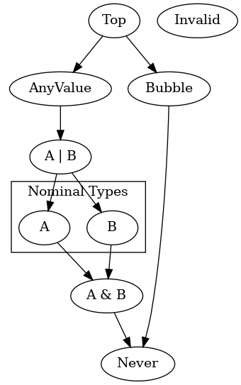

# Package lang.temper.type

<!-- The h1 name is specially interpreted by dokka -->

Definitions related to Temper's type system.
There is type inference machinery in `lang.temper.typeinf`, but
the type inferencer and checker live in `frontend:`.



There is a *Top* type at the top which is the super-type of all types.

At the bottom is *Never* which is the bottom type, a sub-type of
all types, and an appropriate type for computations that never complete like

```typescript
while (true) {}
```

The *Invalid* type, off to the right, is a type marker for constructs
that the compiler cannot make sense of.  It is outside the type hierarchy; not
a subtype of any other nor vice versa.

*Top* branches into *AnyValue* and *Bubble*.  This represents the
two ways a computation can complete, either by

- producing an actual value (it produces a sub-type of *AnyValue*) or
- failing to produce any value.

Below any value we have `A | B`, a type union, also known as an *OrType*.
Values of type `A | B` can be of type `A` or[<sup>1</sup>](#fn1) of type `B`.
A union type is a super-type of each of its members.

Below the *Nominal Type* box we have `A & B`, a type intersection, also known
as an *AndType*.  An *AndType* is a sub-type of each of its elements.

```typescript
class C extends A, B {}
```

In that, `C` is a declared sub-type of both `A` and `B`, so it's a
sub-type of `A & B`.

(Type unions and intersections are actually more general.
`A | Bubble` is an expressible type as is `(A | (B & C)) & D`, so
this diagram does not imply that all union/intersection types fit
neatly in a region on one side of nominal types.)

In the middle are *NominalType*s.  These are types declared with a name
and parameters.  *NominalTypes* include all these

```typescript
Boolean               // A builtin type
List<T | U>           // A parameterized type
C                     // A user type assuming a definition like `class C` in scope.
(Boolean) => Boolean  // A function type, aka Function1<Boolean, Boolean>
```

<span id="fn1"></span>1: "or" is non-exclusive.  A value could be of both types.</span>

## Type reasoning about failure

Function calls may complete without returning a result.
The *Bubble* type represents completion without a result.

We need to be able to represent contingent failure to distinguish between

```typescript
// Produces a result only when g() does
let fContingent (g: () => Int | Bubble): ???            { g()          }
// Recovers from failure of g() and always produces a result
let fIndependent(g: () => Int | Bubble): ???            { g() orelse 0 }
```

The compiler ought to be able to recognize that calls to `fIndependent` don't need
failure recovery paths since it handles failure internally.

We could specify the return types separately to take that into account.

```typescript
let fContingent (g: () => Int | Bubble): Int | Bubble { g()          }
let fIndependent(g: () => Int | Bubble): Int            { g() orelse 0 }
```

The compiler should be able to distinguish between these two calls:

```typescript
fContingent(() => x / y);  // May fail if y is zero.
fContingent(() => 123);    // Passed a function that does not fail so won't fail
```

If we were to type both `fContingent` and `fIndependent` as
`(() => Int | Bubble) => Int | Bubble` there would not be enough type
information to determine that the second call cannot fail.

### Splitting return types

We can use two type parameters to disentangle the failure case for `fContingent`.

```typescript
let fContingent<NO_RESULT extends Bubble>(
    g: () => Int | NO_RESULT
): Int | NO_RESULT {
    g()
}
```

There are two possible types that satisfy the type parameter *NO_RESULT*'s bounds:

- *Bubble* extends *Bubble*
- *Never* extends *Bubble* (since *Never* is a subtype of every valid type)

Let's consider the two cases:

```typescript
// Case 1
fContingent(() => x / y);
```

The return type of `() => x / y` is `Int | Bubble` so `<NO_RESULT>` unifies with `Int | Bubble`.
`<NO_RESULT>` must be a (non-strict) sub-type of `Bubble` and the greatest lower bound of
`Int | Bubble` and `Bubble` is `Bubble`.

So the type of the call result is `Int | Bubble` and the compiler *cannot* eliminate any
handler scope around the call.

```typescript
// Case 2
fContingent(() => 123);
```

The return type of `() => 123` is `Int`.
`<NO_RESULT>` unifies with `Int`.  The greatest lower bound of `Int` and `Bubble` is
`Int & Bubble` which simplifies to *Never*.

So the type of this call is `Int | Never`.
*Never* can be simplified out of unions, the way that *Top* can be simplified out of intersections,
so the type is `Int`.

The compiler can conclude that any handler scope around the call will
assign `false` to its failure variable any time its operand halts, and safely eliminate
branches where the failure variable is true.
