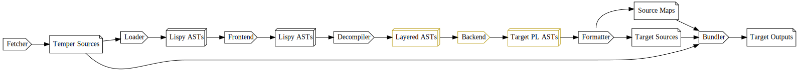

# Package lang.temper.kcodegen.outgrammar

Translator from an output grammar DSL to Kotlin classes meant to
assist Temper backends in constructing output ASTs.

## How this fits in

The Frontend delivers Temper ASTs to backends which are responsible for turning those
into files that make up a library in their target language.

For example, a Java backend gets a module set and needs to produce one or more *Jar* files
because that is how Java libraries are consumed.

Output grammars work between the Temper frontend and its backends.

Specifically, they make it easy for a backend to construct a target language AST, for
example, a tree of Java code, that can then be formatted to a stream of Java tokens
and hence to a Java source files with associated source maps.



As such, output grammars help define both:
- The *Layered AST*s that most backends consume as it is simpler to work on than *Lispy AST*s.
- The *Target language AST*s that most backends produce.

Each output grammar defines two kinds of nodes:

- *AST* nodes that form a syntax tree for the target language
- *Data* nodes that allow persisting information about a translation so that it can be
  used for later translation of dependencies.

For both kinds of nodes, there are also syntax declarations that control how nodes are
converted to sequences of *OutputToken*s.

It's possible to derive one kind of node from another.  For example,
define "type" and/or "name" node types for use as persisted
declaration metadata, and then auto-derive AST nodes to represent the
same in the translated output.

## Tips for maintainers

```bash
$ gradle kcodegen:updateGeneratedCode
```

will run code generators including the output grammar processor
which looks under *be\*/\*\*/\*.out-grammar* files and converts
them each to a Kotlin file.

## Output grammar file format by example

Output grammar files should end with `.out-grammar` so that they are automatically
found by the code generator task.

All token conventions are the same as those for the Temper language including
string and C-style comment syntax.

    // This is a comment

### Metadata pairs

Metadata pairs can be specified via `let`

    let namespaceName = "Foo";

C-style escapes like `\n` work inside quote strings.

The value for *namespaceName* is used to create a Kotlin `object` that holds the
generated node classes.  In this case, Kotlin code could import `Foo` and then
refer to node types thus: `Foo.MyNodeType`.

    let imports = """
      "lang.temper.foo.Bar
      "lang.temper.foo.Baz
    ;

similarly defines extra Kotlin `import` statements that should be part of the file.
This comes in handy when referring to names in Kotlin code blocks.

### Syntax Declarations

The `::=` operator allows defining syntax for a node type.

    Program ::= topLevels%TopLevel*"\n";

This says that the *Program* node type consists of zero or more *TopLevel* nodes,
collected in a property named *topLevels*.

- `topLevels%TopLevel` is a declaration of a property named `topLevels` whose type is `TopLevels`
- the `*` is a Kleene star, and means zero-or-more as in regular expression syntax
- the `"\n"` after the star is the *joiner string*.  When formatting a *Program*, the
  formatter will insert a newline between each pair of adjacent *TopLevel*s.

After processing this, the generated Kotlin code will have something like

    object Foo { // From namespaceName
        // Super-type for all node types
        sealed interface Tree ...
        sealed class BaseTree ...

        class Program(
            override val pos: Position,
            topLevels: Iterable<TopLevel>
        ) : BaseTree(pos) {
            override val formatString get() = "{{0*:\n}}"
            ...
        }

        ...
    }

*Program* corresponds to a `class`, not an `interface` because it has no
sub-types defined.

### Basics of Node Types

As can be seen above, each node takes file *Position* metadata as its first
argument.

Lists of children like *topLevels* are defensively, shallowly copied by the
generated constructor.

Each AST node type also gets a structural `.equals` and `.hashCode` override
so that nodes compare structurally ignoring position metadata.  Use `===` to
compare for reference equality.
Data node types get structural equality because their generated classes are
Kotlin data classes.

    Foo();   // Declares an AST node type
    data BarData();   // The `data` keyword declares it as a data node type
    data FooData from Foo;   // Derives a data node type from the Foo node type

### Auto-parenthesizing

In many C-like languages, it's important to insert parentheses when,
for example, embedding a `+` operation inside a `/` operation.

    AssignmentPattern.operatorDefinition = `JsOperatorDefinition.Eq`;

allows specifying the `operatorDefinition` for a node type.

The right-hand side is in back-ticks because it is direct Kotlin code
that should, in this case, refer to a sub-type of *OperatorDefinition*
which is used by *CodeFormatter* to decide when to parenthesize.

TODO: relate parenthesizing to `<namespaceName>FormattingHints`.

### Property definitions

Property definitions are of the form

    propertyName%PropertyType

In the definition of *MyNodeType* it means that *MyNodeType* has a property
named `propertyName` and that its type is *PropertyType*.

Inside a syntax definition (following `::=`) it also contributes a use
of that property.

- if in a condition (left of `=>`, see below) it means the property's value is
  being compared to the desired value.
- otherwise when generating the token stream, the property's values
  tokens should appear there.

### Property counts

Defining a property `propertyName%PropertyType` tells us that the containing
node type needs that property and tells us about the type, but it doesn't
give enough information to define a Kotlin type for that property.

We infer a *property count* based on context.

     Program ::= topLevels%TopLevel*"\n";

Here we know that `topLevels` contains multiple *TopLevel* nodes, so the
corresponding Kotlin type will be `MutableList<TopLevel>`.

     ReturnStatement ::= "return" & (expression%Expression || ()) & ";";

Here we have a definition of a *ReturnStatement* node type which uses `||`
to represent two possible syntaxes

     // return with an expression
     return 42;
     // return without an expression
     return;

Breaking down `(expression%Expression || ())`

- the parentheses `(...)` group since `||` is lower-precedence than `&` (concatenation)
- `expression%Expression` defines and uses a property `expression`
- Since not all paths through the `||` use `expression`, there is an implicit condition on it,
  and the left only activates when `expression` is *truthy*.
- `()` is shorthand for the empty token list.

Since there is a path through the syntax format that does not use *expression* and no
path that uses it with `*`, the Kotlin type will be nullable: `Expression?`.

Finally, sometimes a property is required for formatting and always has one node.

    LetDeclaration ::= "let" & name%Identifier & ";";

Here, every path through the syntax declaration uses `name` once, so
its corresponding Kotlin type is just *Identifier*.

### Conditions

In the *ReturnStatement* example above, the implicit condition on `expression`
could have been written using explicit condition syntax:

    ((expression => expression%Expression) || ())

There are several kinds of conditions:

Truthiness checks.  Checking that a property holds a node like `expression =>`.

Enum value checks.  Checking that a property's value is a particular enumerated value.

    // When propertyName is elsewhere declared to have a type that is an enum type
    propertyName == MemberName =>
    // When the enum type is explicit
    propertyName == EnumName.MemberName =>
    // When the property is immediately declared with an enum type
    propertyName%EnumName == MemberName =>

Explicit boolean checks.

    propertyName == true =>

If there is no other declaration for `propertyName` its type will be inferred based on
comparison to an enum value or a boolean.

### Enum declarations

An enum can be declared thus:

    enum DeclarationKind = Let | Const;

which declares an enum type *DeclarationKind* with two members: *Let* and *Const*.
This corresponds to Kotlin code like:

    enum class DeclarationKind { Let, Const; }

### Syntax Operators

The full set of syntax operators are:

| Operator | Meaning                                         | Example                                                   | Restrictions                                    |
| -------- |-------------------------------------------------|-----------------------------------------------------------|-------------------------------------------------|
| `"text"` | Literal token                                   | <code>"return" (expression &#124;&#124; ())</code>        |                                                 |
| `&`      | Concatenation of tokens                         | `"foo" & "bar"`                                           |                                                 |
| `()`     | Empty string                                    | `()`                                                      |                                                 |
| `(`...`)` | Group other operators                          | <code>(isAsync => "async") &#124;&#124; ()</code>         |                                                 |
| `*`      | Zero or more joined with text                   | `property*", "`                                           | Left must be property, right string             |
| `+`      | One or more joined with text                    | `property+", "`                                           | Ditto                                           |
| <code>&#124;&#124;</code> | Alternation.  Try the left, otherwise the right | <code>(optionalThing &#124;&#124; otherOptionalThing)</code> | Rightmost in chain must always succeed |
| `=>`     | Condition                                       | `isAsync==true => "async"`                                | Make no sense outside <code>&#124;&#124;</code> |
| <code>\`expr\`</code> | Custom token expression            | <code>\`SpecialTokens.indent\`</code>                     | Kotlin code with type *OutputToken*             |

The `&` operator concatenates token lists, not strings, so `"foo" & "bar"` corresponds to the
tokens

    foo bar

not the single token

    foobar


### Grouping node types

Some node types are umbrella terms.  Rather than having their own syntax
definitions, they serve to group other node types that may be syntactically
quite distinct, but which are used in the same way.

    Statement =
          ExpressionStatement
        | BlockStatement
        | Declaration
        | IfStatement
        | WhileStatement
        | ThrowStatement
        | ReturnStatement
        | etc
        ;

This specifies that *Statement* is a node type and a super-type for *ExpressionStatement*,
*BlockStatement*, *Declaration*, and the others mentioned.

So the generated Kotlin code will contain something like

    sealed interface Statement : Tree

    class ExpressionStatement(...) : BaseTree(pos), Statement

The super-types do not have to form an inheritance tree.
One node type can be in multiple groupings, multiple parts of speech.

    // Expressions can be evaluated to a value.
    Expression =
          Identifier
        | etc
        ;

    // Patterns can be assigned to.
    Pattern =
          Identifier
        | etc
        ;

because one way to represent `foo = bar` is by using two *Identifiers*,
one of which is read from, and one of which is written to.

The corresponding Kotlin code looks like

    sealed interface Expression : Tree
    sealed interface Pattern : Tree

    class Identifier(...) : BaseTree, Expression, Pattern { ... }

You can also declare a super-interface using `implements`, and that allows
specifying a Kotlin type as the super type.

    MyNodeType extends `SomeKotlinInterface`;

If you declare a Kotlin supertype you may need to explicitly override
properties or methods.

    override MyNodeType.someProp = `implemention in Kotlin`;

### Extra properties

Sometimes its useful to define properties outside the syntax
specification, possibly abstract properties in a grouping node
type that does not have its own syntax.

This includes properties that don't hold nodes as mentioned in
[conditions](#conditions).

    isAsync==true => "async"

but may also include properties that do hold nodes.

You can also declare properties outside a `::=` declaration thus:

    Identifier(name%`JsIdentifierName`, sourceIdentifier%`TemperName?`) {
    `
    init {
        require(name.text !in jsReservedWords) { "\$pos: \`\${name.text}\` is a JS reserved word" }
    }
    `
    };

This specifies:
- *Identifier* is a node type
- It has a property named `name` whose type is `JsIdentifierName`.  The backticks
  around the type mean that it is a reference to a type defined in Kotlin, not
  the grammar.
- It has another property named `sourceIdentifier`, also with a direct Kotlin type.
- The `{...}` means the body of the Kotlin class definition should include some extra code,
  in this case which checks the invariant that an identifier cannot be a reserved word.

If the property type does not use backticks it must correspond to a node or enum type.

If the extra code block wasn't desired, this could have been shortened by dropping
the curlies as in

    NumericLiteral(value%`Number`);

If you want to specify a type of *NodeType* that is optional or that can appear many times,
you can use `?` and `*` as in:

    Foo(
        optionalProperty%Bar?,
        repeatedProperty%Baz*"",
    );

If using a Kotlin type, just specify `Iterable<T>` or `T?` inside the back-quotes.

### Default property values

Especially for properties that hold boolean or enum values, there's often a sensible
default so that every line of code that creates a node of that type doesn't need to
specify every bell & whistle.

    Function.async.default = `false`;

means that the default expression for node type *Function*'s property named `async`
is `false`.

The default expression is direct Kotlin code, so it's in backticks.

### Custom computed properties

Sometimes it's useful to have a computed property in your node type.

In a nested `if` statement, we might not want to put curly brackets around the
`else` clause if it is also an `if` statement to produce output like

    if (a) {
        ...
    } else if (b) {
        ...
    } else {
        ...
    }

instead of

    if (a) {
        ...
    } else {
        if (b) {
            ...
        } else {
            ...
        }
    }

We can do this with conditions involving computed properties.  First, define
the syntax:

    IfStatement ::=
          "if" & "(" & test%Expression & ")"
        & "{" & "\n" & consequent%Statement & "\n" & "}"
        & (
            (isElseIf==true => "else" & alternate%Statement)
                || (hasElse==true => "else" & "{" & "\n" & alternate & "\n" & "}")
                || ());

then augment it with overrides for the properties, so that they are not
treated as things to be passed into the constructor.

    IfStatement.isElseIf = `alternate is IfStatement`;
    IfStatement.hasElse = `
    alternate != null &&
        (alternate !is BlockStatement || alternate?.childCount != 0)
    `;

The *NodeName*`.`*propertyName*`=`*KotlinCode*`;` syntax specifies an
override, where the right-hand side is an on-demand evaluated expression.

If the type of the computed property is not known, you can specify it explicitly.

    IfStatement.isElseIf%`Boolean` = `alternate is IfStatement`;

These correspond to Kotlin code like

    class IfStatement(...) : BaseTree, Statement, ... {
        ...

        val isElseIf: Boolean
            get() = alternate is IfStatement
        val hasElse: Boolean
            get() =
                alternate != null &&
                (alternate !is BlockStatement || alternate?.childCount != 0)
    }

(The property types of `Boolean` are inferred based on comparison to
`true` in comparisons in the format string)

Properties that are computing in a [grouping node type](#grouping-node-types)
may be overridden in sub-types to be constructor properties via
[extra property](#extra-properties) syntax:

     SubType(propertyName%PropertyType);

### Overriding properties

You can have a computed property in a super-type, and then override it to
be passed in as a constructor property in a sub-type.

    override SubType.propertyName;

Now, even if *SubType* inherits *propertyName*'s definition from one or
more super-types, we only consider definitions local to *SubType* when
deciding whether *propertyName* is computed or supplied.

### Formatting grammar leaves

The simplest node types often are the hardest to format since they're not formatted
by splicing together token lists from other node types.

    // Define a node type that holds a string
    StringLiteral(value%`String`);
    // Override so that rendering doesn't use a format string, and instead
    // the type `implements TokenSerializable`.
    StringLiteral.renderTo =
    `tokenSink.emit(
        OutputToken(
            stringTokenText(value),
            OutputTokenType.QuotedValue
        )
    )
    `;

### Type derivations

It can be useful to derive a data node type from an AST node type or vice versa.

    data FooData from Foo;

That specifies that there is a data node type, *FooData*, derived from the *Foo* node type.
And that *FooData* is the data node type that *corresponds* to *Foo*.

    data FooData =~ Foo;

That specifies only that *FooData* is the data node type that *corresponds* to *Foo*,
and does not imply any derivation.

When a node type *Target* is derived from a node type *Source*, we copy some information over:

All local properties are copied over.  So if *Source* has a property *p* of type *T*, and *Target* does not declare such a local property, *Target* will get a *p* whose type is the corresponding type of *T*.  For example, if *T* is a tree node type and *Target* is a data node type, then *Target.p* might have type *TData*, the data node type that corresponds to *T*.

If *Source* has a subtype list like `Source = Sub1 | Sub2 | Sub3;` then
*Target* will get corresponding sub-types as if
`Target = Sub1Data | Sub2Data | Sub3Data;` were declared.

Some of this copying requires creating *implied* corresponding types
by deriving them from existing types.  For example, for the sub-type
list above, if *Sub1Data* were not declared, it would be auto-derived
as a data node type from the *Sub1* tree node type.

Auto-derivation is never performed if there is a corresponding type as
declared using a `from` or `=~` declaration as shown above.

Auto-deriving requires using a naming convention:

- When auto-deriving a data node type from a tree node type, the tree
  node type has "Tree" removed if it is a suffixm and then "Data" is
  appended to the end.
- When auto-deriving a tree node type from a data node type, any
  "Data" suffix is removed from the end.

If *Source* has a super type, including transitively, that has a
corresponding type then *Target* will have that corresponding type as
a super type.  Node types are never auto-derived just to provide a
corresponding super-type.


### Extra Kotlin Code

Sometimes one needs to specify extra Kotlin code, for example to define a static
table that relates operator strings to definitions in an operator precedence table:

    UpdateExpression {
    `
    companion object {
        val updateOperator = mapOf(
            "++" to listOf(JsOperatorDefinition.PreIncr, JsOperatorDefinition.PostIncr),
            "--" to listOf(JsOperatorDefinition.PreDecr, JsOperatorDefinition.PostDecr)
        )
    }
    `
    };

This is similar to [extra property](#extra-properties) syntax but dropping the
parentheses since this contributes no extra properties.
