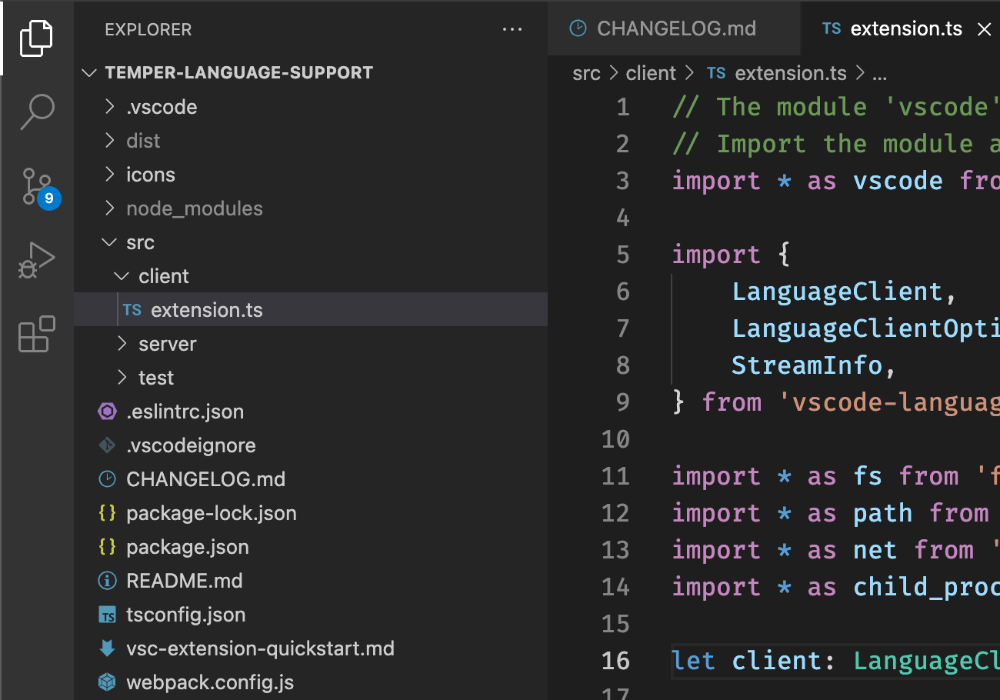
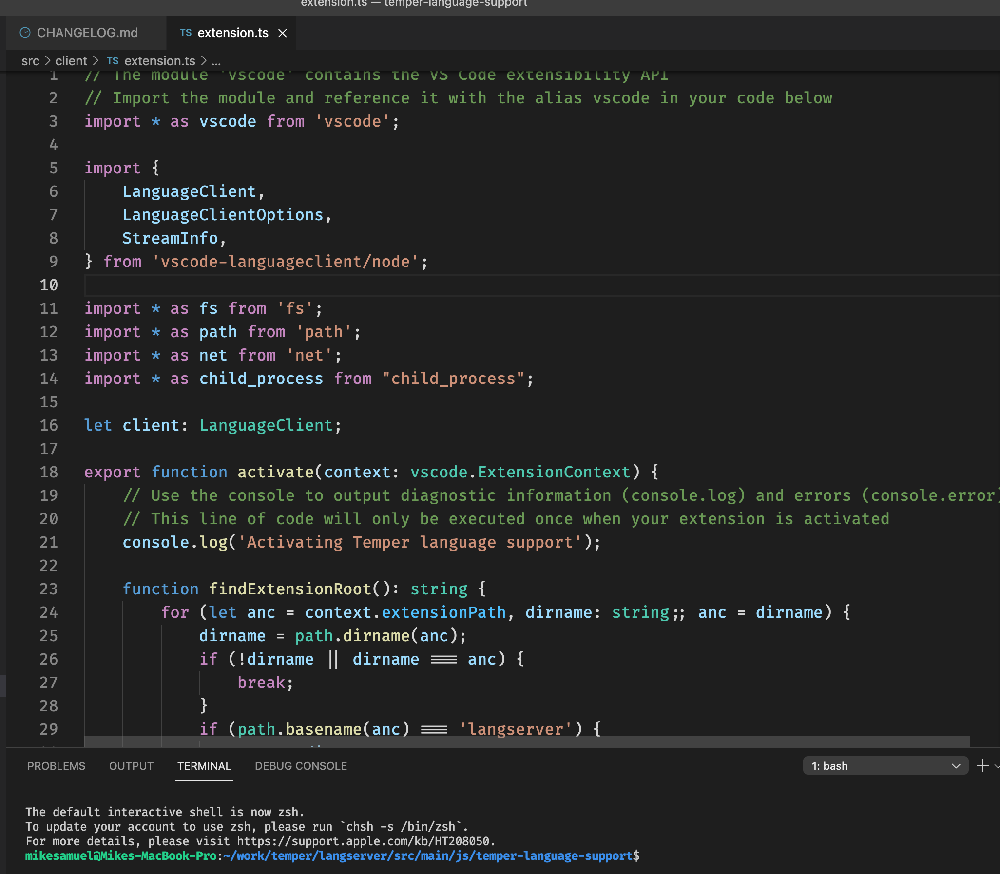
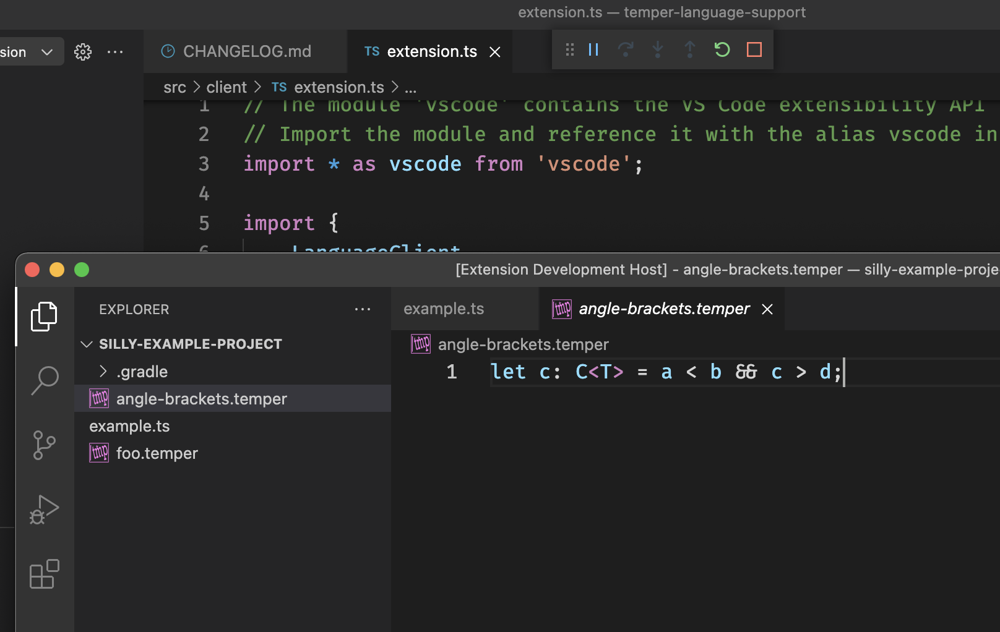

# Running the language server

It's easiest to run the language server directly from VSCode. You can either:

- Run the extension in [your standard VSCode environment](#standard).
- Run the extension in [debug mode](#debug).


## <a id="standard"></a>Standard VSCode environment

Temper support in VSCode relies on two things in the Temper source code:

- The language server that is built into Temper, `temper serve`.
- The VSCode extension itself.

The overall process:

1. Build and install the [VSCode extension](#install-extension).
2. Build the [main `temper` distribution](#deploy-temper).
3. Tell the VSCode extension [where `temper` is](#configure-extension).
4. [Final steps](#final-steps) to configure VSCode.

#### Incomplete features

Both as a to-do to clarify that these features are missing:

1. installing from the VSCode Marketplace is not available
2. you may need to reload VSCode
3. orphan Temper source files are not supported yet

### <a id="install-extension"></a>1. Build and install the VSCode extension

Run the following from the Temper source root:

```bash
$ code --version  # Verify that VSCode cli is in your path
1.66.1
8dfae7a5cd50421d10cd99cb873990460525a898
x64

$ ./gradlew installVscodeDevExtension
```

If this is an update of a previous install of the Temper VSCode extension, you
may need to restart VSCode for the update to take effect.

If `code -v` fails, [and the docs aren't helpful](https://code.visualstudio.com/docs/editor/command-line#_common-questions) you can work around this:

```bash
$ ./gradlew buildVscodeDevExtension
```

In VSCode:

1. Go to the View menu, choose Extension to open the extensions sidebar.
2. From the three dots menu select `Install from VSIX...`
3. Go to your temper root, and open:
   `langserver/src/main/js/temper-language-support/temper-dev.vsix`

Alternatively, Gradle task `packageVsix` adds a bundled `temper` binary with the
package. We currently auto publish dev releases made this way on GitHub.

#### Rebuilding the VSCode extension

If you run into issues with the extension and editing the extension source to solve these, we recommend manually uninstalling it in VSCode prior to rebuilding:

1. Go to the View menu, choose Extension to open the extensions sidebar.
2. Select the Temper extension, click _Uninstall_.
3. Click _Reload required_ to reload VSCode.

### <a id="deploy-temper"></a>2. Build the main `temper` distribution

For the language server, you can either:

- Run a deployed distribution of the cli tool `temper`
- Run it from gradle; skip the next step

#### Running a deployed distribution

To build and unpack a temper cli distribution, run the following and note the path for [step 3](#configure-extension):

```bash
$ ./gradlew deploy

> Task :cli:deploy

-----------------------------------------------------------------------------------------------
--- Temper command installed to: /your/path/here/temper/cli/build/install/temper/bin/temper ---
-----------------------------------------------------------------------------------------------
```

Alternatively, for a deployment that you can conveniently use for less stable dev work:

```bash
$ ./gradlew deployDev

> Task :cli:deployDev

--------------------------------------------------------------------------------------------
--- Temper command installed to: /your/path/here/temper/cli/build/install/dev/bin/temper ---
--------------------------------------------------------------------------------------------
```

#### Running from Gradle

*If you're hacking on temper* and want to automatically rebuild it each time the language server is restarted:

* there is a convenience script for this
* the path for the next step is `/your/path/here/temper/scripts/temper-gradle`
* at this point, you don't need to build anything

### <a id="configure-extension"></a>3. Tell the VSCode extension where `temper` is

**Note**: If using a vsix package with bundled `temper`, you can leave this
setting blank.

If not, follow these instructions:

1. Go the File / Preferences / Settings.
2. Filter settings by `temper` to find the temper executable path.
3. Enter the path determined in the prior step.

Alternatively, you can run Temper through gradle by giving the path to the
`scripts/temper-gradle` script that comes in the Temper source tree.

### <a id="final-steps"></a>4. Final steps

**Note**: The command `temper init` can also be used to initialize a Temper
project rather than manually following steps here.

You will need to mark the root of your Temper project with a `config.temper.md` for the language server to recognize your code.

1. In VSCode, select File / New File.
2. Change the language to _Temper Markdown_.
3. Create `config.temper.md` at the desired root of your temper project.
   ``````markdown
   This becomes the module name.

   ```temper
   import("./validate");
   ```
   ``````
4. Similarly, create a `validate/validate.temper` in the same directory.
   ```temper
   fn erroneous() {
   	return 5 * "fail";
   }
   ```
5. From the View menu, choose Command Palette.
6. Execute `Developer: Reload Window`.
7. The code `5 * "fail"` should be marked with a red underline, indicating the compiler has detected an error.
8. Change it to `5 * 10`. The red underline should disappear.

## <a id="debug"></a>Debug mode

First, open up the plugin in VSCode.
`langserver/src/main/js/temper-language-support/src/client/extension.ts`
is the main file for the Temper VSCode extension, but when you open a
file you first have to open a window with a directory as context.  I
use the `temper-language-support` directory since it is narrow enough,
but makes sure that VSCode has access to the TypeScript project
configuration files.



Then I open up `src/client/extension.ts`.



While the cursor is in that file's editor, *Start Debugging*
(<kbd>F5</kbd> on MacOS) from the *Run* menu.

That should automatically run the file which will call out to `gradle`
to build and run a language server and run it.  It may
take a minute but you should soon see a VSCode instance with the
Temper extension installed.



### Configuring `temper` for extension debugging

As for the standard environment, it might be best to configure a specific path
to the temper executable script that you want to run. If you don't, it still
tries to find either the built distribution `temper` if it exists or else the
`temper-gradle` script as fallbacks.

To use a different `temper` for your debug sessions from your standard
environment:

1. Deploy a "stable" distribution as above for your standard environment
2. Specify this dir in your "User" settings in vscode
3. Deploy a default distribution for your debug environment
4. Specify this dir in the "Workspace" settings for a specific debug workspace
